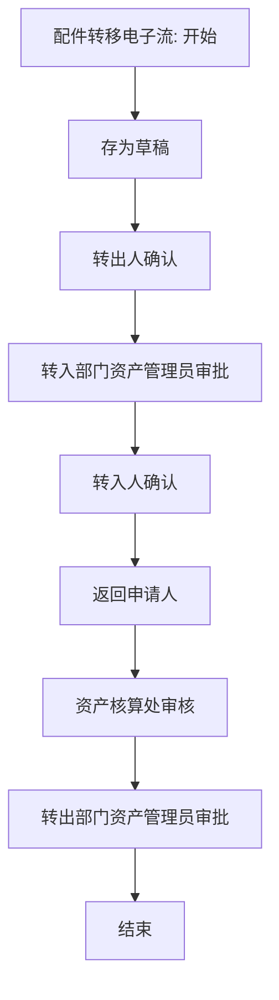

# 配件转移流程

来源：`/Users/feigao/Downloads/flow_complete_design.dxl`。

## 关注范围

配件转出/转入确认、资产管理员审批、资产核算处审核。

## 入口与表单

| 视图 | 选择公式 | 新建入口 |
| --- | --- | --- |
| 配件转移\按转出资产编号 | `SELECT form="配件转移电子流"&mark=""` | 配件转移电子流 |
| 配件转移\按当前处理人 | `SELECT form="配件转移电子流"&mark=""&NOW_STATUS!="返回申请人"` | 配件转移电子流 |
| 配件转移\按转出部门编码 | `SELECT form="配件转移电子流"&mark=""` | 配件转移电子流 |
| 配件转移\按申请人ID | `SELECT form="配件转移电子流"&mark=""` | 配件转移电子流 |
| 配件转移\按转入部门编码 | `SELECT form="配件转移电子流"&mark=""` | 配件转移电子流 |
| 配件转移\按转入资产编号 | `SELECT form="配件转移电子流"&mark=""` | 配件转移电子流 |
| 配件转移\按状态 | `SELECT form="配件转移电子流"&mark=""` | 配件转移电子流 |
| 配件转移\归档\按转出资产编号 | `SELECT form="配件转移电子流"&mark="1"` | 配件转移电子流 |
| 配件转移\归档\按转出部门编码 | `SELECT form="配件转移电子流"&mark="1"` | 配件转移电子流 |
| 设置\资产核算处id（配件转移） | `SELECT form="zichanchu1"` | - |
| 配件转移\归档\按申请人ID | `SELECT form="配件转移电子流"&mark="1"` | 配件转移电子流 |
| 配件转移\归档\按转入资产编号 | `SELECT form="配件转移电子流"&mark="1"` | 配件转移电子流 |

## 表单字段与按钮逻辑

### 配件转移电子流

- 默认 businessType：`ACCESSORY_TRANSFER`
- 表单属性：`editonopen=true; designerversion=8.5.3; publicaccess=false`
- 字段/按钮/action 数：95 / 22 / 7
- 状态字段证据：`now_status` 相关状态摘要：存为草稿 / 转出人确认 / 转入部门资产管理员审批 / 转入人确认 / 返回申请人 / 资产核算处审核 / 转出部门资产管理员审批 / 结束

#### 关键字段

| # | 字段名 | 类型 | kind | 属性摘要 | 默认/转换/校验/关键词摘要 |
| ---: | --- | --- | --- | --- | --- |
| 1 | `now_status` | `text` | `computed` | type=text; kind=computed; name=now_status | defaultvalue: @If(now_status="";"填写申请";now_status) |
| 2 | `guanlichuid` | `text` | `computed` | type=text; kind=computed; name=guanlichuid | defaultvalue: guanlichuid |
| 3 | `current_processor` | `text` | `computedfordisplay` | type=text; kind=computedfordisplay; name=current_processor | defaultvalue: @Name([CN];Author) |
| 4 | `shenqingid` | `names` | `computedwhencomposed` | type=names; kind=computedwhencomposed; name=shenqingid | defaultvalue: @UserName |
| 5 | `bianhao` | `text` | `computed` | type=text; kind=computed; name=bianhao | defaultvalue: bianhao |
| 6 | `rqi` | `datetime` | `computedwhencomposed` | type=datetime; kind=computedwhencomposed; name=rqi | defaultvalue: @Created |
| 7 | `name` | `text` | `editable` | type=text; kind=editable; name=name |  |
| 8 | `xinghao1` | `text` | `editable` | type=text; kind=editable; name=xinghao1 | defaultvalue: xinghao1 |
| 9 | `yuanyin` | `text` | `editable` | type=text; kind=editable; name=yuanyin |  |
| 10 | `zcren3` | `text` | `editable` | type=text; kind=editable; name=zcren3 |  |
| 11 | `zrren` | `text` | `editable` | type=text; kind=editable; name=zrren |  |
| 12 | `zcrID3` | `names` | `editable` | type=names; kind=editable; name=zcrID3 | exiting: Sub Exiting(Source As Field) Dim uidoc As notesuidocument Dim doc,doc1 As notesdocument Dim wks As New notesuiworkspace Dim s As New notessession Dim db As notesdatabase Set db=s.… |
| 13 | `zrlID` | `names` | `editable` | type=names; kind=editable; name=zrlID | exiting: Sub Exiting(Source As Field) Dim uidoc As notesuidocument Dim doc,doc1 As notesdocument Dim wks As New notesuiworkspace Dim s As New notessession Dim db As notesdatabase Set db=s.… |
| 14 | `bianhao1` | `text` | `computedwhencomposed` | type=text; kind=computedwhencomposed; name=bianhao1 | defaultvalue: bianhao1; entering: Sub Entering(Source As Field) Dim uidoc As notesuidocument Dim wks As New notesuiworkspace Dim doc As notesdocument Dim view As notesview Set uidoc=wks.currentdocument Set doc=uid… |
| 15 | `bianhao1_1` | `text` | `computedwhencomposed` | type=text; kind=computedwhencomposed; name=bianhao1_1 | defaultvalue: bianhao1_1; entering: Sub Entering(Source As Field) Dim uidoc As notesuidocument Dim wks As New notesuiworkspace Dim doc As notesdocument Dim view As notesview Set uidoc=wks.currentdocument Set doc=uid… |
| 16 | `mingcheng1` | `text` | `computedwhencomposed` | type=text; kind=computedwhencomposed; name=mingcheng1 | defaultvalue: mingcheng1 |
| 17 | `mingcheng1_1` | `text` | `computedwhencomposed` | type=text; kind=computedwhencomposed; name=mingcheng1_1 | defaultvalue: mingcheng1_1 |
| 18 | `wupin` | `text` | `computedwhencomposed` | type=text; kind=computedwhencomposed; name=wupin | defaultvalue: wupin |
| 19 | `wupin_1` | `text` | `computedwhencomposed` | type=text; kind=computedwhencomposed; name=wupin_1 | defaultvalue: wupin_1 |
| 20 | `zcbm` | `text` | `computedwhencomposed` | type=text; kind=computedwhencomposed; name=zcbm | defaultvalue: zcbm |
| 21 | `zcbm_1` | `text` | `computedwhencomposed` | type=text; kind=computedwhencomposed; name=zcbm_1 | defaultvalue: zcbm_1 |
| 22 | `zcbmbm` | `text` | `computedwhencomposed` | type=text; kind=computedwhencomposed; name=zcbmbm | defaultvalue: zcbmbm |
| 23 | `zcbmbm_1` | `text` | `computedwhencomposed` | type=text; kind=computedwhencomposed; name=zcbmbm_1 | defaultvalue: zcbmbm_1; terminate: Sub Terminate End Sub |
| 24 | `zcren` | `text` | `computedwhencomposed` | type=text; kind=computedwhencomposed; name=zcren | defaultvalue: zcren |
| 25 | `zcren_1` | `text` | `computedwhencomposed` | type=text; kind=computedwhencomposed; name=zcren_1 | defaultvalue: zcren_1 |
| 26 | `zcrID` | `text` | `computedwhencomposed` | type=text; kind=computedwhencomposed; name=zcrID | defaultvalue: zcrid |
| 27 | `zcrID_1` | `text` | `computedwhencomposed` | type=text; kind=computedwhencomposed; name=zcrID_1 | defaultvalue: zcrid_1 |
| 28 | `zccpbianhao` | `text` | `computed` | type=text; kind=computed; name=zccpbianhao | defaultvalue: @If(zccpbianhao="";"";zccpbianhao); entering: Sub Entering(Source As Field) Dim uidoc As notesuidocument Dim wks As New notesuiworkspace Dim doc As notesdocument Dim view As notesview Set uidoc=wks.currentdocument Set doc=uid… |
| 29 | `zccpbianhao_1` | `text` | `computed` | type=text; kind=computed; name=zccpbianhao_1 | defaultvalue: @If(zccpbianhao_1="";"";zccpbianhao_1); entering: Sub Entering(Source As Field) Dim uidoc As notesuidocument Dim wks As New notesuiworkspace Dim doc As notesdocument Dim view As notesview Set uidoc=wks.currentdocument Set doc… |
| 30 | `hetonghao` | `text` | `computedwhencomposed` | type=text; kind=computedwhencomposed; name=hetonghao | defaultvalue: hetonghao |
| ... | ... | ... | ... | ... | 共 95 个字段，完整字段见全量分析或 DXL |

#### 按钮/action 摘要

| 类型 | 文本/标题 | 摘要 |
| --- | --- | --- |
| action | Categori_ze |  |
| action | _Edit Document |  |
| action | Send Docu_ment |  |
| action | _Forward |  |
| action | _Move To Folder... |  |
| action | _Remove From Folder |  |
| action | 退出 | click: @Command([FileCloseWindow]) |
| button | (无显示文本/图标按钮) | 选择视图 资产编号; 查库 NumberView |
| button | (无显示文本/图标按钮) | 选择视图 资产编号; 查库 NumberView |
| button | (无显示文本/图标按钮) | 状态->存为草稿 |
| button | (无显示文本/图标按钮) | 状态->转出人确认 / 转入部门资产管理员审批 / 转入人确认; 校验/提示 请输入配件名称 / 请输入所缺配件 / 请输入转移原因 / 请输入转出人姓名 / 请输入转入人姓名; 含邮件/通知逻辑 |
| button | (无显示文本/图标按钮) | 校验/提示 1、填写ID时必须由系统识别后才可提交，否则影响后续填写; 2、不支持多项资产的配件转移;3、转入人姓名与转入人ID，转出人ID与转出人姓名必须对应，否则无效. |
| button | (无显示文本/图标按钮) | 选择视图 资产编号; 查库 NumberView |
| button | (无显示文本/图标按钮) | 状态->返回申请人; 校验/提示 请填写确认意见; 含邮件/通知逻辑 |
| button | (无显示文本/图标按钮) | 状态->资产核算处审核 / 转出部门资产管理员审批 / 转出人确认 / 转入部门资产管理员审批; 校验/提示 请输入确认意见 / 请输入资产管理员ID / 请输入转入配件所挂主资产编号 / 请输入转入部门资产管理员正确的ID格式; 含邮件/通知逻辑 |
| button | (无显示文本/图标按钮) | 校验/提示 1、请认真核对配件型号与实物的一致性，对有异议可与转出人咨询，不一致的，可拒绝接收，点击“返回申请人”按钮。2、所选资产必须为自己的资产，否则无效。 |
| button | (无显示文本/图标按钮) | 状态->返回申请人; 校验/提示 请填写审批意见; 含邮件/通知逻辑 |
| button | (无显示文本/图标按钮) | 状态->资产核算处审核 / 转出部门资产管理员审批 / 转出人确认; 校验/提示 请输入审批意见; 含邮件/通知逻辑 |
| button | (无显示文本/图标按钮) | 校验/提示 1、核对“转入使用人”与“转入人ID”是否为同一个人； 部门内转移的，同时核对“转出人姓名”与“转出人ID”是否同一人。不一致的须驳回申请。 |
| button | (无显示文本/图标按钮) | 选择视图 资产编号; 查库 NumberView |
| button | (无显示文本/图标按钮) | 状态->返回申请人; 校验/提示 请填写确认意见; 含邮件/通知逻辑 |
| button | (无显示文本/图标按钮) | 状态->转出部门资产管理员审批 / 资产核算处审核; 校验/提示 请输入确认意见 / 请输入资产管理员ID / 请输入转出部门资产管理员正确的ID格式; 含邮件/通知逻辑 |
| button | (无显示文本/图标按钮) | 校验/提示 所选资产必须为自己的资产，否则无效；对因数据填写错误造成的后果，转出人自己负责。 |
| button | (无显示文本/图标按钮) | 状态->返回申请人; 校验/提示 请填写审批意见; 含邮件/通知逻辑 |
| button | (无显示文本/图标按钮) | 状态->资产核算处审核; 校验/提示 请输入审批意见; 含邮件/通知逻辑 |
| button | (无显示文本/图标按钮) | 校验/提示 1、核对“转出人姓名”与“转出人ID”是否同一人。不一致的须驳回申请。 |
| button | (无显示文本/图标按钮) | 状态->结束; 校验/提示 请填写审批意见; 含邮件/通知逻辑 |
| button | (无显示文本/图标按钮) | 状态->返回申请人; 校验/提示 请填写意见; 含邮件/通知逻辑 |
| button | (无显示文本/图标按钮) | 校验/提示 1、转入人ID与转入姓名是否同一人；2、转出人ID与转出姓名是否同一人； 3、判断是否计量仪器配件转移。 |

推断主线：`存为草稿 -> 转出人确认 -> 转入部门资产管理员审批 -> 转入人确认 -> 返回申请人 -> 资产核算处审核 -> 转出部门资产管理员审批 -> 结束`。

## 流程图走向（推断）

## 字段明细

### 字段明细：配件转移电子流

| # | 字段名 | 类型 | kind | 属性摘要 | 默认/转换/校验/关键词摘要 |
| ---: | --- | --- | --- | --- | --- |
| 1 | `now_status` | `text` | `computed` | type=text; kind=computed; name=now_status | defaultvalue: @If(now_status="";"填写申请";now_status) |
| 2 | `guanlichuid` | `text` | `computed` | type=text; kind=computed; name=guanlichuid | defaultvalue: guanlichuid |
| 3 | `current_processor` | `text` | `computedfordisplay` | type=text; kind=computedfordisplay; name=current_processor | defaultvalue: @Name([CN];Author) |
| 4 | `shenqingid` | `names` | `computedwhencomposed` | type=names; kind=computedwhencomposed; name=shenqingid | defaultvalue: @UserName |
| 5 | `bianhao` | `text` | `computed` | type=text; kind=computed; name=bianhao | defaultvalue: bianhao |
| 6 | `rqi` | `datetime` | `computedwhencomposed` | type=datetime; kind=computedwhencomposed; name=rqi | defaultvalue: @Created |
| 7 | `name` | `text` | `editable` | type=text; kind=editable; name=name |  |
| 8 | `xinghao1` | `text` | `editable` | type=text; kind=editable; name=xinghao1 | defaultvalue: xinghao1 |
| 9 | `yuanyin` | `text` | `editable` | type=text; kind=editable; name=yuanyin |  |
| 10 | `zcren3` | `text` | `editable` | type=text; kind=editable; name=zcren3 |  |
| 11 | `zrren` | `text` | `editable` | type=text; kind=editable; name=zrren |  |
| 12 | `zcrID3` | `names` | `editable` | type=names; kind=editable; name=zcrID3 | exiting: Sub Exiting(Source As Field) Dim uidoc As notesuidocument Dim doc,doc1 As notesdocument Dim wks As New notesuiworkspace Dim s As New notessession Dim db As notesdatabase Set db=s.… |
| 13 | `zrlID` | `names` | `editable` | type=names; kind=editable; name=zrlID | exiting: Sub Exiting(Source As Field) Dim uidoc As notesuidocument Dim doc,doc1 As notesdocument Dim wks As New notesuiworkspace Dim s As New notessession Dim db As notesdatabase Set db=s.… |
| 14 | `bianhao1` | `text` | `computedwhencomposed` | type=text; kind=computedwhencomposed; name=bianhao1 | defaultvalue: bianhao1; entering: Sub Entering(Source As Field) Dim uidoc As notesuidocument Dim wks As New notesuiworkspace Dim doc As notesdocument Dim view As notesview Set uidoc=wks.currentdocument Set doc=uid… |
| 15 | `bianhao1_1` | `text` | `computedwhencomposed` | type=text; kind=computedwhencomposed; name=bianhao1_1 | defaultvalue: bianhao1_1; entering: Sub Entering(Source As Field) Dim uidoc As notesuidocument Dim wks As New notesuiworkspace Dim doc As notesdocument Dim view As notesview Set uidoc=wks.currentdocument Set doc=uid… |
| 16 | `mingcheng1` | `text` | `computedwhencomposed` | type=text; kind=computedwhencomposed; name=mingcheng1 | defaultvalue: mingcheng1 |
| 17 | `mingcheng1_1` | `text` | `computedwhencomposed` | type=text; kind=computedwhencomposed; name=mingcheng1_1 | defaultvalue: mingcheng1_1 |
| 18 | `wupin` | `text` | `computedwhencomposed` | type=text; kind=computedwhencomposed; name=wupin | defaultvalue: wupin |
| 19 | `wupin_1` | `text` | `computedwhencomposed` | type=text; kind=computedwhencomposed; name=wupin_1 | defaultvalue: wupin_1 |
| 20 | `zcbm` | `text` | `computedwhencomposed` | type=text; kind=computedwhencomposed; name=zcbm | defaultvalue: zcbm |
| 21 | `zcbm_1` | `text` | `computedwhencomposed` | type=text; kind=computedwhencomposed; name=zcbm_1 | defaultvalue: zcbm_1 |
| 22 | `zcbmbm` | `text` | `computedwhencomposed` | type=text; kind=computedwhencomposed; name=zcbmbm | defaultvalue: zcbmbm |
| 23 | `zcbmbm_1` | `text` | `computedwhencomposed` | type=text; kind=computedwhencomposed; name=zcbmbm_1 | defaultvalue: zcbmbm_1; terminate: Sub Terminate End Sub |
| 24 | `zcren` | `text` | `computedwhencomposed` | type=text; kind=computedwhencomposed; name=zcren | defaultvalue: zcren |
| 25 | `zcren_1` | `text` | `computedwhencomposed` | type=text; kind=computedwhencomposed; name=zcren_1 | defaultvalue: zcren_1 |
| 26 | `zcrID` | `text` | `computedwhencomposed` | type=text; kind=computedwhencomposed; name=zcrID | defaultvalue: zcrid |
| 27 | `zcrID_1` | `text` | `computedwhencomposed` | type=text; kind=computedwhencomposed; name=zcrID_1 | defaultvalue: zcrid_1 |
| 28 | `zccpbianhao` | `text` | `computed` | type=text; kind=computed; name=zccpbianhao | defaultvalue: @If(zccpbianhao="";"";zccpbianhao); entering: Sub Entering(Source As Field) Dim uidoc As notesuidocument Dim wks As New notesuiworkspace Dim doc As notesdocument Dim view As notesview Set uidoc=wks.currentdocument Set doc=uid… |
| 29 | `zccpbianhao_1` | `text` | `computed` | type=text; kind=computed; name=zccpbianhao_1 | defaultvalue: @If(zccpbianhao_1="";"";zccpbianhao_1); entering: Sub Entering(Source As Field) Dim uidoc As notesuidocument Dim wks As New notesuiworkspace Dim doc As notesdocument Dim view As notesview Set uidoc=wks.currentdocument Set doc… |
| 30 | `hetonghao` | `text` | `computedwhencomposed` | type=text; kind=computedwhencomposed; name=hetonghao | defaultvalue: hetonghao |
| 31 | `hetonghao_1` | `text` | `computedwhencomposed` | type=text; kind=computedwhencomposed; name=hetonghao_1 | defaultvalue: hetonghao_1 |
| 32 | `mangerid1` | `names` | `editable` | type=names; kind=editable; name=mangerid1 | exiting: Sub Exiting(Source As Field) End Sub |
| 33 | `mangerid` | `names` | `editable` | type=names; kind=editable; name=mangerid | exiting: Sub Exiting(Source As Field) End Sub |
| 34 | `sign1` | `names` | `computed` | type=names; kind=computed; name=sign1 | defaultvalue: sign1 |
| 35 | `signtime1` | `datetime` | `computed` | type=datetime; kind=computed; name=signtime1 | defaultvalue: signtime1 |
| 36 | `querenyijian_1` | `text` | `editable` | type=text; kind=editable; name=querenyijian_1 |  |
| 37 | `bianhao1_2` | `text` | `computed` | type=text; kind=computed; name=bianhao1_2 | defaultvalue: bianhao1_2; entering: Sub Entering(Source As Field) Dim uidoc As notesuidocument Dim wks As New notesuiworkspace Dim doc As notesdocument Dim view As notesview Set uidoc=wks.currentdocument Set doc=uid… |
| 38 | `mingcheng1_2` | `text` | `computed` | type=text; kind=computed; name=mingcheng1_2 | defaultvalue: mingcheng1_2 |
| 39 | `wupin_2` | `text` | `computed` | type=text; kind=computed; name=wupin_2 | defaultvalue: wupin_2 |
| 40 | `zcbm_2` | `text` | `computed` | type=text; kind=computed; name=zcbm_2 | defaultvalue: zcbm_2 |
| 41 | `zcbmbm_2` | `text` | `computed` | type=text; kind=computed; name=zcbmbm_2 | defaultvalue: zcbmbm_2 |
| 42 | `zcren_2` | `text` | `computed` | type=text; kind=computed; name=zcren_2 | defaultvalue: zcren_2 |
| 43 | `zcrID_2` | `text` | `computed` | type=text; kind=computed; name=zcrID_2 | defaultvalue: zcrID_2 |
| 44 | `zccpbianhao_2` | `text` | `computed` | type=text; kind=computed; name=zccpbianhao_2 | defaultvalue: @If(zccpbianhao_2="";"";zccpbianhao_2); entering: Sub Entering(Source As Field) Dim uidoc As notesuidocument Dim wks As New notesuiworkspace Dim doc As notesdocument Dim view As notesview Set uidoc=wks.currentdocument Set doc… |
| 45 | `hetonghao_2` | `text` | `computed` | type=text; kind=computed; name=hetonghao_2 | defaultvalue: hetonghao_2 |
| 46 | `mangerid_1` | `names` | `editable` | type=names; kind=editable; name=mangerid_1 | exiting: Sub Exiting(Source As Field) End Sub |
| 47 | `sign4_1` | `names` | `computed` | type=names; kind=computed; name=sign4_1 | defaultvalue: sign4_1 |
| 48 | `signtime4_1` | `datetime` | `computed` | type=datetime; kind=computed; name=signtime4_1 | defaultvalue: signtime4_1 |
| 49 | `yijian` | `text` | `editable` | type=text; kind=editable; name=yijian |  |
| 50 | `sign2` | `names` | `computed` | type=names; kind=computed; name=sign2 | defaultvalue: sign2 |
| 51 | `signtime2` | `datetime` | `computed` | type=datetime; kind=computed; name=signtime2 | defaultvalue: signtime2 |
| 52 | `querenyijian` | `text` | `editable` | type=text; kind=editable; name=querenyijian |  |
| 53 | `bianhao1_1_1` | `text` | `computed` | type=text; kind=computed; name=bianhao1_1_1 | defaultvalue: bianhao1_1_1; entering: Sub Entering(Source As Field) Dim uidoc As notesuidocument Dim wks As New notesuiworkspace Dim doc As notesdocument Dim view As notesview Set uidoc=wks.currentdocument Set doc=uid… |
| 54 | `mingcheng1_1_1` | `text` | `computed` | type=text; kind=computed; name=mingcheng1_1_1 | defaultvalue: mingcheng1_1_1 |
| 55 | `wupin_1_1` | `text` | `computed` | type=text; kind=computed; name=wupin_1_1 | defaultvalue: wupin_1_1 |
| 56 | `zcbm_1_1` | `text` | `computed` | type=text; kind=computed; name=zcbm_1_1 | defaultvalue: zcbm_1_1 |
| 57 | `zcbmbm_1_1` | `text` | `computed` | type=text; kind=computed; name=zcbmbm_1_1 | defaultvalue: zcbmbm_1_1 |
| 58 | `zcren_1_1` | `text` | `computed` | type=text; kind=computed; name=zcren_1_1 | defaultvalue: zcren_1_1 |
| 59 | `zcrID_1_1` | `text` | `computed` | type=text; kind=computed; name=zcrID_1_1 | defaultvalue: zcrID_1_1 |
| 60 | `zccpbianhao_1_1` | `text` | `computed` | type=text; kind=computed; name=zccpbianhao_1_1 | defaultvalue: @If(zccpbianhao_1_1="";"";zccpbianhao_1_1); entering: Sub Entering(Source As Field) Dim uidoc As notesuidocument Dim wks As New notesuiworkspace Dim doc As notesdocument Dim view As notesview Set uidoc=wks.currentdocument Set… |
| 61 | `hetonghao_1_1` | `text` | `computed` | type=text; kind=computed; name=hetonghao_1_1 | defaultvalue: hetonghao_1_1 |
| 62 | `mangerid1_1` | `names` | `editable` | type=names; kind=editable; name=mangerid1_1 | exiting: Sub Exiting(Source As Field) End Sub |
| 63 | `sign4` | `names` | `computed` | type=names; kind=computed; name=sign4 | defaultvalue: sign4 |
| 64 | `signtime4` | `datetime` | `computed` | type=datetime; kind=computed; name=signtime4 | defaultvalue: signtime4 |
| 65 | `shenpiyijian` | `text` | `editable` | type=text; kind=editable; name=shenpiyijian |  |
| 66 | `sign5` | `names` | `computed` | type=names; kind=computed; name=sign5 | defaultvalue: sign5 |
| 67 | `signtime5` | `datetime` | `computed` | type=datetime; kind=computed; name=signtime5 | defaultvalue: signtime5 |
| 68 | `yijian3` | `text` | `editable` | type=text; kind=editable; name=yijian3 |  |
| 69 | `aa` | `keyword` | `editable` | type=keyword; kind=editable; name=aa | defaultvalue: "否"; keywords: 否 / 是 |
| 70 | `jiliangyiqi` | `text` | `computed` | type=text; kind=computed; name=jiliangyiqi | defaultvalue: jiliangyiqi |
| 71 | `sign7` | `names` | `computed` | type=names; kind=computed; name=sign7 | defaultvalue: sign7 |
| 72 | `signtime7` | `datetime` | `computed` | type=datetime; kind=computed; name=signtime7 | defaultvalue: signtime7 |
| 73 | `author` | `authors` | `editable` | type=authors; kind=editable; name=author; allowmultivalues=true | defaultvalue: @UserName |
| 74 | `reader` | `names` | `editable` | type=names; kind=editable; name=reader; allowmultivalues=true | defaultvalue: @UserName |
| 75 | `mark` | `text` | `editable` | type=text; kind=editable; name=mark | defaultvalue: "" |
| 76 | `t1` | `text` | `editable` | type=text; kind=editable; name=t1 |  |
| 77 | `t2` | `number` | `editable` | type=number; kind=editable; name=t2 |  |
| 78 | `t3` | `keyword` | `editable` | type=keyword; kind=editable; name=t3 | keywords: 1 |
| 79 | `t4` | `keyword` | `editable` | type=keyword; kind=editable; name=t4 |  |
| 80 | `author_1` | `authors` | `editable` | type=authors; kind=editable; name=author_1; allowmultivalues=true | defaultvalue: "[管理员]" |
| 81 | `reader_1` | `names` | `editable` | type=names; kind=editable; name=reader_1; allowmultivalues=true | defaultvalue: "[管理员]":"[查询打印]":"[资产转移读]" |
| 82 | `finish` | `datetime` | `editable` | type=datetime; kind=editable; name=finish |  |
| 83 | `finisher` | `names` | `editable` | type=names; kind=editable; name=finisher |  |
| 84 | `server_name` | `text` | `computed` | type=text; kind=computed; name=server_name | defaultvalue: @If(server_name!="";server_name; @Subset(@DbColumn("":"Nocache"; "";"pzb";1);1)) |
| 85 | `data_name` | `text` | `computed` | type=text; kind=computed; name=data_name | defaultvalue: @If(data_name!="";data_name; @Subset(@DbColumn("":"Nocache"; "";"pzb";2);1)) |
| 86 | `server_name1` | `text` | `computed` | type=text; kind=computed; name=server_name1 | defaultvalue: @If(server_name1!="";server_name1; @Subset(@DbColumn("":"Nocache"; "";"bmpzb";1);1)) |
| 87 | `data_name1` | `text` | `computed` | type=text; kind=computed; name=data_name1 | defaultvalue: @If(data_name1!="";data_name1; @Subset(@DbColumn("":"Nocache"; "";"bmpzb";2);1)) |
| 88 | `m1` | `text` | `editable` | type=text; kind=editable; name=m1 |  |
| 89 | `m2` | `text` | `editable` | type=text; kind=editable; name=m2 |  |
| 90 | `m3` | `text` | `editable` | type=text; kind=editable; name=m3 |  |
| 91 | `m4` | `text` | `editable` | type=text; kind=editable; name=m4 |  |
| 92 | `m5` | `text` | `editable` | type=text; kind=editable; name=m5 |  |
| 93 | `m6` | `text` | `editable` | type=text; kind=editable; name=m6 |  |
| 94 | `m7` | `text` | `editable` | type=text; kind=editable; name=m7 |  |
| 95 | `m8` | `text` | `editable` | type=text; kind=editable; name=m8 |  |

## 证据边界

- 可直接确认：表单、字段、字段事件、按钮/action、视图选择公式、代理节点、状态字段取值。
- 需要推断：按钮状态赋值组合成的主干流程、`mark` 与归档含义、`current_processor` 与处理人展示关系。
- 不能仅凭 DXL 完全确认：Notes ACL、运行期角色、外部 NSF 查询结果、客户端打印效果、所有隐藏条件与字段的一一映射。
- 本文为从 DXL 恢复生成的分析文档；如需生产发布，还需按缺口分析补齐业务类型、角色、字段映射和条件决策表。
