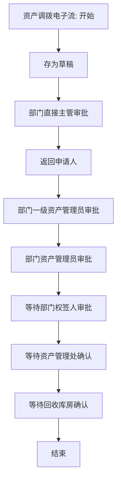

# 资产调拨流程

来源：`/Users/feigao/Downloads/flow_complete_design.dxl`。

## 关注范围

跨部门/资产调拨申请、部门审批、资产管理处确认、回收库房确认。

## 入口与表单

| 视图 | 选择公式 | 新建入口 |
| --- | --- | --- |
| 资产调拨\归档\按部门名称 | `SELECT form="资产调拨电子流"&mark="1"` | 资产调拨电子流 |
| 资产调拨\按申请人ID | `SELECT form="资产调拨电子流"&mark=""` | 资产调拨电子流 |
| 资产调拨\归档\按部门编码 | `SELECT form="资产调拨电子流"&mark="1"` | 资产调拨电子流 |
| 资产调拨\按填报日期 | `SELECT form="资产调拨电子流"&mark=""` | 资产调拨电子流 |
| 资产调拨\按状态 | `SELECT form="资产调拨电子流"&mark=""` | 资产调拨电子流 |
| 资产调拨\按资产编号 | `SELECT form="资产调拨电子流"&mark=""` | 资产调拨电子流 |
| 资产调拨\归档\按完成日期 | `SELECT form="资产调拨电子流"&mark="1"` | 资产调拨电子流 |
| 设置\资产核算处id（资产调拨） | `SELECT form="zichanchu4"` | - |
| 资产调拨\按部门编码 | `SELECT form="资产调拨电子流"&mark=""` | 资产调拨电子流 |
| 资产调拨\按当前处理人 | `SELECT form="资产调拨电子流"&mark=""` | 资产调拨电子流 |

## 表单字段与按钮逻辑

### 资产调拨电子流

- 默认 businessType：`ASSET_ALLOCATION`
- 表单属性：`nocompose=true; editonopen=true; designerversion=8.5.3; publicaccess=false`
- 字段/按钮/action 数：66 / 16 / 7
- 状态字段证据：`now_status` 相关状态摘要：存为草稿 / 部门直接主管审批 / 返回申请人 / 部门一级资产管理员审批 / 部门资产管理员审批 / 等待部门权签人审批 / 等待资产管理处确认 / 等待回收库房确认 / 结束

#### 关键字段

| # | 字段名 | 类型 | kind | 属性摘要 | 默认/转换/校验/关键词摘要 |
| ---: | --- | --- | --- | --- | --- |
| 1 | `author` | `authors` | `editable` | type=authors; kind=editable; name=author; allowmultivalues=true | defaultvalue: @UserName |
| 2 | `reader` | `names` | `editable` | type=names; kind=editable; name=reader; allowmultivalues=true | defaultvalue: @UserName |
| 3 | `mark` | `text` | `editable` | type=text; kind=editable; name=mark | defaultvalue: "" |
| 4 | `t1` | `text` | `editable` | type=text; kind=editable; name=t1 |  |
| 5 | `t2` | `number` | `editable` | type=number; kind=editable; name=t2 |  |
| 6 | `author_1` | `authors` | `editable` | type=authors; kind=editable; name=author_1; allowmultivalues=true | defaultvalue: "[管理员]" |
| 7 | `reader_1` | `names` | `editable` | type=names; kind=editable; name=reader_1; allowmultivalues=true | defaultvalue: "[管理员]":"[查询打印]":"[资产转移读]" |
| 8 | `finish` | `datetime` | `editable` | type=datetime; kind=editable; name=finish |  |
| 9 | `finisher` | `names` | `editable` | type=names; kind=editable; name=finisher |  |
| 10 | `server_name` | `text` | `computed` | type=text; kind=computed; name=server_name | defaultvalue: @If(server_name!="";server_name; @Subset(@DbColumn("":"Nocache"; "";"pzb";1);1)) |
| 11 | `data_name` | `text` | `computed` | type=text; kind=computed; name=data_name | defaultvalue: @If(data_name!="";data_name; @Subset(@DbColumn("":"Nocache"; "";"pzb";2);1)) |
| 12 | `server_name1` | `text` | `computed` | type=text; kind=computed; name=server_name1 | defaultvalue: @If(server_name1!="";server_name1; @Subset(@DbColumn("":"Nocache"; "";"bmpzb";1);1)) |
| 13 | `data_name1` | `text` | `computed` | type=text; kind=computed; name=data_name1 | defaultvalue: @If(data_name1!="";data_name1; @Subset(@DbColumn("":"Nocache"; "";"bmpzb";2);1)) |
| 14 | `m1` | `text` | `editable` | type=text; kind=editable; name=m1 |  |
| 15 | `m2` | `text` | `editable` | type=text; kind=editable; name=m2 |  |
| 16 | `m3` | `text` | `editable` | type=text; kind=editable; name=m3 |  |
| 17 | `m4` | `text` | `editable` | type=text; kind=editable; name=m4 |  |
| 18 | `m5` | `text` | `editable` | type=text; kind=editable; name=m5 |  |
| 19 | `m6` | `text` | `editable` | type=text; kind=editable; name=m6 |  |
| 20 | `m7` | `text` | `editable` | type=text; kind=editable; name=m7 |  |
| 21 | `m8` | `text` | `editable` | type=text; kind=editable; name=m8 |  |
| 22 | `now_status` | `text` | `computed` | type=text; kind=computed; name=now_status | defaultvalue: @If(now_status="";"填写申请";now_status) |
| 23 | `current_processor` | `text` | `computedwhencomposed` | type=text; kind=computedwhencomposed; name=current_processor | defaultvalue: @Name([CN];Author) |
| 24 | `shenqingid` | `names` | `computedwhencomposed` | type=names; kind=computedwhencomposed; name=shenqingid | defaultvalue: @UserName |
| 25 | `bianhao` | `text` | `computed` | type=text; kind=computed; name=bianhao | defaultvalue: bianhao |
| 26 | `rqi` | `datetime` | `computedwhencomposed` | type=datetime; kind=computedwhencomposed; name=rqi | defaultvalue: @Created |
| 27 | `leixing` | `keyword` | `editable` | type=keyword; kind=editable; name=leixing | defaultvalue: "调拨资产"; keywords: 调拨资产 / 调拨配件 |
| 28 | `bianhao1_1` | `text` | `editable` | type=text; kind=editable; name=bianhao1_1 | entering: Sub Entering(Source As Field) %REM Dim uidoc As notesuidocument Dim wks As New notesuiworkspace Dim doc As notesdocument Dim view As notesview Set uidoc=wks.currentdocument Set do… |
| 29 | `bianhao1` | `text` | `computed` | type=text; kind=computed; name=bianhao1 | defaultvalue: bianhao1; entering: Sub Entering(Source As Field) %REM Dim uidoc As notesuidocument Dim wks As New notesuiworkspace Dim doc As notesdocument Dim view As notesview Set uidoc=wks.currentdocument Set do… |
| 30 | `mingcheng1_1` | `keyword` | `editable` | type=keyword; kind=editable; name=mingcheng1_1 |  |
| ... | ... | ... | ... | ... | 共 66 个字段，完整字段见全量分析或 DXL |

#### 按钮/action 摘要

| 类型 | 文本/标题 | 摘要 |
| --- | --- | --- |
| action | Categori_ze |  |
| action | _Edit Document |  |
| action | Send Docu_ment |  |
| action | _Forward |  |
| action | _Move To Folder... |  |
| action | _Remove From Folder |  |
| action | 退出 | click: @Command([FileCloseWindow]) |
| button | (无显示文本/图标按钮) | 选择视图 资产编号; 查库 anbianhao |
| button | (无显示文本/图标按钮) | 选择视图 部门编码查询; 查库 bmbm |
| button | (无显示文本/图标按钮) | 选择视图 一级资源管理员ID |
| button | (无显示文本/图标按钮) | 状态->存为草稿 |
| button | (无显示文本/图标按钮) | 状态->部门直接主管审批; 校验/提示 请输入资产编号 / 请输入主机资产编号 / 请输入配件名称及型号 / 请输入申请人部门编码 / 请输入申请人部门名称; 含邮件/通知逻辑 |
| button | (无显示文本/图标按钮) | 状态->返回申请人; 校验/提示 请填写审批意见; 含邮件/通知逻辑 |
| button | (无显示文本/图标按钮) | 状态->部门一级资产管理员审批 / 部门资产管理员审批; 校验/提示 请输入审批意见; 含邮件/通知逻辑 |
| button | (无显示文本/图标按钮) | 状态->返回申请人; 校验/提示 请填写审批意见; 含邮件/通知逻辑 |
| button | (无显示文本/图标按钮) | 状态->等待部门权签人审批; 校验/提示 请输入审批意见 / 请输入部门权签人ID / 请输入部门权签人正确的ID格式; 含邮件/通知逻辑 |
| button | (无显示文本/图标按钮) | 状态->返回申请人; 校验/提示 请填写审批意见; 含邮件/通知逻辑 |
| button | (无显示文本/图标按钮) | 状态->等待资产管理处确认; 校验/提示 请输入审批意见; 含邮件/通知逻辑 |
| button | (无显示文本/图标按钮) | 选择视图 库房管理员ID |
| button | (无显示文本/图标按钮) | 状态->返回申请人; 校验/提示 请填写审批意见; 含邮件/通知逻辑 |
| button | (无显示文本/图标按钮) | 状态->等待回收库房确认; 校验/提示 请输入审批意见; 含邮件/通知逻辑 |
| button | (无显示文本/图标按钮) | 状态->返回申请人; 含邮件/通知逻辑 |
| button | (无显示文本/图标按钮) | 状态->结束; 校验/提示 请提供所缺配件记录; 含邮件/通知逻辑 |

推断主线：`存为草稿 -> 部门直接主管审批 -> 返回申请人 -> 部门一级资产管理员审批 -> 部门资产管理员审批 -> 等待部门权签人审批 -> 等待资产管理处确认 -> 等待回收库房确认 -> 结束`。

## 流程图走向（推断）

## 字段明细

### 字段明细：资产调拨电子流

| # | 字段名 | 类型 | kind | 属性摘要 | 默认/转换/校验/关键词摘要 |
| ---: | --- | --- | --- | --- | --- |
| 1 | `author` | `authors` | `editable` | type=authors; kind=editable; name=author; allowmultivalues=true | defaultvalue: @UserName |
| 2 | `reader` | `names` | `editable` | type=names; kind=editable; name=reader; allowmultivalues=true | defaultvalue: @UserName |
| 3 | `mark` | `text` | `editable` | type=text; kind=editable; name=mark | defaultvalue: "" |
| 4 | `t1` | `text` | `editable` | type=text; kind=editable; name=t1 |  |
| 5 | `t2` | `number` | `editable` | type=number; kind=editable; name=t2 |  |
| 6 | `author_1` | `authors` | `editable` | type=authors; kind=editable; name=author_1; allowmultivalues=true | defaultvalue: "[管理员]" |
| 7 | `reader_1` | `names` | `editable` | type=names; kind=editable; name=reader_1; allowmultivalues=true | defaultvalue: "[管理员]":"[查询打印]":"[资产转移读]" |
| 8 | `finish` | `datetime` | `editable` | type=datetime; kind=editable; name=finish |  |
| 9 | `finisher` | `names` | `editable` | type=names; kind=editable; name=finisher |  |
| 10 | `server_name` | `text` | `computed` | type=text; kind=computed; name=server_name | defaultvalue: @If(server_name!="";server_name; @Subset(@DbColumn("":"Nocache"; "";"pzb";1);1)) |
| 11 | `data_name` | `text` | `computed` | type=text; kind=computed; name=data_name | defaultvalue: @If(data_name!="";data_name; @Subset(@DbColumn("":"Nocache"; "";"pzb";2);1)) |
| 12 | `server_name1` | `text` | `computed` | type=text; kind=computed; name=server_name1 | defaultvalue: @If(server_name1!="";server_name1; @Subset(@DbColumn("":"Nocache"; "";"bmpzb";1);1)) |
| 13 | `data_name1` | `text` | `computed` | type=text; kind=computed; name=data_name1 | defaultvalue: @If(data_name1!="";data_name1; @Subset(@DbColumn("":"Nocache"; "";"bmpzb";2);1)) |
| 14 | `m1` | `text` | `editable` | type=text; kind=editable; name=m1 |  |
| 15 | `m2` | `text` | `editable` | type=text; kind=editable; name=m2 |  |
| 16 | `m3` | `text` | `editable` | type=text; kind=editable; name=m3 |  |
| 17 | `m4` | `text` | `editable` | type=text; kind=editable; name=m4 |  |
| 18 | `m5` | `text` | `editable` | type=text; kind=editable; name=m5 |  |
| 19 | `m6` | `text` | `editable` | type=text; kind=editable; name=m6 |  |
| 20 | `m7` | `text` | `editable` | type=text; kind=editable; name=m7 |  |
| 21 | `m8` | `text` | `editable` | type=text; kind=editable; name=m8 |  |
| 22 | `now_status` | `text` | `computed` | type=text; kind=computed; name=now_status | defaultvalue: @If(now_status="";"填写申请";now_status) |
| 23 | `current_processor` | `text` | `computedwhencomposed` | type=text; kind=computedwhencomposed; name=current_processor | defaultvalue: @Name([CN];Author) |
| 24 | `shenqingid` | `names` | `computedwhencomposed` | type=names; kind=computedwhencomposed; name=shenqingid | defaultvalue: @UserName |
| 25 | `bianhao` | `text` | `computed` | type=text; kind=computed; name=bianhao | defaultvalue: bianhao |
| 26 | `rqi` | `datetime` | `computedwhencomposed` | type=datetime; kind=computedwhencomposed; name=rqi | defaultvalue: @Created |
| 27 | `leixing` | `keyword` | `editable` | type=keyword; kind=editable; name=leixing | defaultvalue: "调拨资产"; keywords: 调拨资产 / 调拨配件 |
| 28 | `bianhao1_1` | `text` | `editable` | type=text; kind=editable; name=bianhao1_1 | entering: Sub Entering(Source As Field) %REM Dim uidoc As notesuidocument Dim wks As New notesuiworkspace Dim doc As notesdocument Dim view As notesview Set uidoc=wks.currentdocument Set do… |
| 29 | `bianhao1` | `text` | `computed` | type=text; kind=computed; name=bianhao1 | defaultvalue: bianhao1; entering: Sub Entering(Source As Field) %REM Dim uidoc As notesuidocument Dim wks As New notesuiworkspace Dim doc As notesdocument Dim view As notesview Set uidoc=wks.currentdocument Set do… |
| 30 | `mingcheng1_1` | `keyword` | `editable` | type=keyword; kind=editable; name=mingcheng1_1 |  |
| 31 | `mingcheng1` | `text` | `computed` | type=text; kind=computed; name=mingcheng1 | defaultvalue: mingcheng1 |
| 32 | `wupin` | `text` | `computed` | type=text; kind=computed; name=wupin | defaultvalue: wupin |
| 33 | `zcrID` | `text` | `computed` | type=text; kind=computed; name=zcrID | defaultvalue: zcrID |
| 34 | `zrlID` | `names` | `editable` | type=names; kind=editable; name=zrlID |  |
| 35 | `zcbmbm` | `text` | `computed` | type=text; kind=computed; name=zcbmbm | defaultvalue: zcbmbm |
| 36 | `zcbm` | `text` | `computed` | type=text; kind=computed; name=zcbm | defaultvalue: zcbm |
| 37 | `zcren` | `text` | `computed` | type=text; kind=computed; name=zcren | defaultvalue: zcren |
| 38 | `zcbmbm_1` | `text` | `computed` | type=text; kind=computed; name=zcbmbm_1 | defaultvalue: zcbmbm_1 |
| 39 | `zcbm_1` | `text` | `computed` | type=text; kind=computed; name=zcbm_1 | defaultvalue: zcbm_1 |
| 40 | `zcren_1` | `text` | `editable` | type=text; kind=editable; name=zcren_1 |  |
| 41 | `rmangerid` | `names` | `editable` | type=names; kind=editable; name=rmangerid |  |
| 42 | `mangerid` | `names` | `computed` | type=names; kind=computed; name=mangerid | defaultvalue: mangerid |
| 43 | `yuanyin` | `text` | `editable` | type=text; kind=editable; name=yuanyin |  |
| 44 | `sign1` | `names` | `computed` | type=names; kind=computed; name=sign1 | defaultvalue: sign1 |
| 45 | `signtime1` | `datetime` | `computed` | type=datetime; kind=computed; name=signtime1 | defaultvalue: signtime1 |
| 46 | `yijian_1` | `text` | `editable` | type=text; kind=editable; name=yijian_1 |  |
| 47 | `sign3` | `text` | `computed` | type=text; kind=computed; name=sign3 | defaultvalue: sign3 |
| 48 | `signtime3` | `datetime` | `computed` | type=datetime; kind=computed; name=signtime3 | defaultvalue: signtime3 |
| 49 | `yijian` | `text` | `editable` | type=text; kind=editable; name=yijian |  |
| 50 | `zrren` | `names` | `editable` | type=names; kind=editable; name=zrren |  |
| 51 | `sign2` | `names` | `computed` | type=names; kind=computed; name=sign2 | defaultvalue: sign2 |
| 52 | `signtime2` | `datetime` | `computed` | type=datetime; kind=computed; name=signtime2 | defaultvalue: signtime2 |
| 53 | `shenpiyijian` | `text` | `editable` | type=text; kind=editable; name=shenpiyijian |  |
| 54 | `mangerid1_1` | `text` | `computed` | type=text; kind=computed; name=mangerid1_1 | defaultvalue: mangerid1_1 |
| 55 | `sign5` | `names` | `computed` | type=names; kind=computed; name=sign5 | defaultvalue: sign5 |
| 56 | `signtime5` | `datetime` | `computed` | type=datetime; kind=computed; name=signtime5 | defaultvalue: signtime5 |
| 57 | `shenpiyijian_1` | `text` | `editable` | type=text; kind=editable; name=shenpiyijian_1 |  |
| 58 | `jiliangyiqi` | `text` | `computed` | type=text; kind=computed; name=jiliangyiqi | defaultvalue: jiliangyiqi |
| 59 | `sign5_1` | `names` | `computed` | type=names; kind=computed; name=sign5_1 | defaultvalue: sign5_1 |
| 60 | `signtime5_1` | `datetime` | `computed` | type=datetime; kind=computed; name=signtime5_1 | defaultvalue: signtime5_1 |
| 61 | `yijian2` | `text` | `editable` | type=text; kind=editable; name=yijian2 |  |
| 62 | `aa_1` | `keyword` | `editable` | type=keyword; kind=editable; name=aa_1 | defaultvalue: "否"; keywords: 否 / 是 |
| 63 | `querenyijian` | `text` | `editable` | type=text; kind=editable; name=querenyijian |  |
| 64 | `guanlichuid` | `text` | `computed` | type=text; kind=computed; name=guanlichuid | defaultvalue: guanlichuid |
| 65 | `sign6` | `names` | `computed` | type=names; kind=computed; name=sign6 | defaultvalue: sign6 |
| 66 | `signtime6` | `datetime` | `computed` | type=datetime; kind=computed; name=signtime6 | defaultvalue: signtime6 |

## 证据边界

- 可直接确认：表单、字段、字段事件、按钮/action、视图选择公式、代理节点、状态字段取值。
- 需要推断：按钮状态赋值组合成的主干流程、`mark` 与归档含义、`current_processor` 与处理人展示关系。
- 不能仅凭 DXL 完全确认：Notes ACL、运行期角色、外部 NSF 查询结果、客户端打印效果、所有隐藏条件与字段的一一映射。
- 本文为从 DXL 恢复生成的分析文档；如需生产发布，还需按缺口分析补齐业务类型、角色、字段映射和条件决策表。
