# 资产赔偿流程

来源：`/Users/feigao/Downloads/flow_complete_design.dxl`。

## 关注范围

资产损失赔偿，含主管、资产管理、信息安全、财务、责任人异议等分支。

## 入口与表单

| 视图 | 选择公式 | 新建入口 |
| --- | --- | --- |
| 资产赔偿\按资产编号 | `SELECT form="zcpc"` | zcpc |
| 资产赔偿\按状态 | `SELECT form="zcpc"` | zcpc |
| 资产赔偿\按填报日期 | `SELECT form="zcpc"` | zcpc |
| 资产赔偿\归档\按申请人ID | `SELECT form="zcpc"&mark="1"` | - |
| 资产赔偿\归档\按资产编号 | `SELECT form="zcpc"&mark="1"` | - |
| 设置\资产核算处id（资产赔偿） | `SELECT form="zichanchu5"` | - |
| 资产赔偿\按当前处理人 | `SELECT form="zcpc"` | zcpc |

## 表单字段与按钮逻辑

### 资产赔偿电子流

- 默认 businessType：`ASSET_COMPENSATION`
- 表单属性：`alias=zcpc; editonopen=true; designerversion=8.5.3; publicaccess=false`
- 字段/按钮/action 数：85 / 28 / 7
- 状态字段证据：`now_status` 相关状态摘要：存为草稿 / 01.等待部门直接主管审核 / 终止申请 / 02.部门主管返回经办人 / 03.等待提供资产原值 / 04.资产管理处返回经办人 / 05.等待一级资产管理部门审核 / 06.一级资产管理部门返回经办人 / 07.等待资产管理处审批 / 08.资产管理处返回经办人 / 06A.等待信息安全审批 / 10.等待财务总监审批 / 09.资产管理处审批通过 / 责任人异议，提交一级资产管理员 / 等待责任人确认 / 一级资产管理员驳回异议 / 等待财务总监审批 / 提交第三审批人 / 06B.信息安全返回经办人 / 12.财务总监返回经办人 / 13.财务总监返回信息安全审批 / 14.财务总监返回资产管理处 / 11.财务总监审批完成 / 12.等待库房接收资产 / 12.库房审批完成

#### 关键字段

| # | 字段名 | 类型 | kind | 属性摘要 | 默认/转换/校验/关键词摘要 |
| ---: | --- | --- | --- | --- | --- |
| 1 | `now_status` | `text` | `computed` | type=text; kind=computed; name=now_status | defaultvalue: @If(now_status="";"00.填写资产信息";now_status) |
| 2 | `current_processor` | `text` | `computedfordisplay` | type=text; kind=computedfordisplay; name=current_processor | defaultvalue: @Name([CN];Author) |
| 3 | `shenqingid` | `readers` | `computedwhencomposed` | type=readers; kind=computedwhencomposed; name=shenqingid | defaultvalue: @V3UserName |
| 4 | `data` | `datetime` | `computedwhencomposed` | type=datetime; kind=computedwhencomposed; name=data | defaultvalue: @Date(@Created) |
| 5 | `number` | `text` | `editable` | type=text; kind=editable; name=number |  |
| 6 | `zcbh` | `text` | `computed` | type=text; kind=computed; name=zcbh | defaultvalue: zcbh |
| 7 | `zcmc` | `text` | `computed` | type=text; kind=computed; name=zcmc | defaultvalue: zcmc |
| 8 | `ggxh` | `text` | `computed` | type=text; kind=computed; name=ggxh | defaultvalue: ggxh |
| 9 | `fswp` | `text` | `computed` | type=text; kind=computed; name=fswp | defaultvalue: fswp |
| 10 | `bm` | `text` | `computed` | type=text; kind=computed; name=bm | defaultvalue: bm |
| 11 | `bmbm` | `text` | `computed` | type=text; kind=computed; name=bmbm | defaultvalue: bmbm |
| 12 | `syrid` | `readers` | `computed` | type=readers; kind=computed; name=syrid | defaultvalue: syrid |
| 13 | `sysj` | `datetime` | `computed` | type=datetime; kind=computed; name=sysj | defaultvalue: sysj |
| 14 | `zccpbianhao` | `text` | `computed` | type=text; kind=computed; name=zccpbianhao | defaultvalue: @If(zccpbianhao="";"";zccpbianhao); entering: Sub Entering(Source As Field) Dim uidoc As notesuidocument Dim wks As New notesuiworkspace Dim doc As notesdocument Dim view As notesview Set uidoc=wks.currentdocument Set doc=uid… |
| 15 | `syr` | `text` | `computed` | type=text; kind=computed; name=syr | defaultvalue: syr |
| 16 | `dh` | `text` | `editable` | type=text; kind=editable; name=dh |  |
| 17 | `dd` | `text` | `editable` | type=text; kind=editable; name=dd |  |
| 18 | `syrid_1` | `readers` | `editable` | type=readers; kind=editable; name=syrid_1; allowmultivalues=true |  |
| 19 | `syr_1` | `text` | `editable` | type=text; kind=editable; name=syr_1 |  |
| 20 | `yysm` | `text` | `editable` | type=text; kind=editable; name=yysm |  |
| 21 | `dsrq` | `datetime` | `editable` | type=datetime; kind=editable; name=dsrq | exiting: Sub Exiting(Source As Field) Dim uidoc As notesuidocument Dim doc As notesdocument Dim wks As New notesuiworkspace Dim s As New notessession Dim db As notesdatabase Dim b As Strin… |
| 22 | `jbr` | `text` | `editable` | type=text; kind=editable; name=jbr |  |
| 23 | `lxdh` | `text` | `editable` | type=text; kind=editable; name=lxdh |  |
| 24 | `safe` | `keyword` | `editable` | type=keyword; kind=editable; name=safe | defaultvalue: "1"; keywords: 是\|1 / 否\|2 |
| 25 | `password1` | `keyword` | `editable` | type=keyword; kind=editable; name=password1 | keywords: 有\|1 / 无\|2 |
| 26 | `password2` | `keyword` | `editable` | type=keyword; kind=editable; name=password2 | keywords: 有\|1 / 无\|2 |
| 27 | `textlist` | `richtext` | `editable` | type=richtext; kind=editable; name=textlist |  |
| 28 | `yysm_1` | `richtext` | `editable` | type=richtext; kind=editable; name=yysm_1 |  |
| 29 | `bmzg_1` | `readers` | `editable` | type=readers; kind=editable; name=bmzg_1 |  |
| 30 | `bmzg` | `readers` | `editable` | type=readers; kind=editable; name=bmzg |  |
| ... | ... | ... | ... | ... | 共 85 个字段，完整字段见全量分析或 DXL |

#### 按钮/action 摘要

| 类型 | 文本/标题 | 摘要 |
| --- | --- | --- |
| action | Categori_ze |  |
| action | _Edit Document |  |
| action | Send Docu_ment |  |
| action | _Forward |  |
| action | _Move To Folder... |  |
| action | _Remove From Folder |  |
| action | 退出 | click: @Command([FileCloseWindow]) |
| button | (无显示文本/图标按钮) | 选择视图 资产编号; 查库 NumberView |
| button | (无显示文本/图标按钮) | 状态->存为草稿 |
| button | (无显示文本/图标按钮) | 状态->01.等待部门直接主管审核; 校验/提示 请选择资产编号 / 请输入所在部门编码 / 请填写使用人联系电话 / 请输入资产丢失的具体场所 / 请指定资产赔偿责任人ID; 含邮件/通知逻辑 |
| button | (无显示文本/图标按钮) | 状态->终止申请 |
| button | (无显示文本/图标按钮) | 状态->02.部门主管返回经办人; 校验/提示 你确定要驳回吗？ / 请填写部门主管意见; 含邮件/通知逻辑 |
| button | (无显示文本/图标按钮) | 状态->03.等待提供资产原值; 校验/提示 请填写部门主管意见; 含邮件/通知逻辑 |
| button | (无显示文本/图标按钮) | 选择视图 一级资源管理员ID |
| button | (无显示文本/图标按钮) | 状态->04.资产管理处返回经办人; 校验/提示 你确定要驳回吗？ / 请填写资产管理处意见; 含邮件/通知逻辑 |
| button | (无显示文本/图标按钮) | 状态->05.等待一级资产管理部门审核; 校验/提示 请填写资产管理处意见 / 请输入累计折旧 / 请输入赔偿金额 / 请输入一级资产管理员ID / 请确认资产赔偿金额，是否确认？; 含邮件/通知逻辑 |
| button | (无显示文本/图标按钮) | 状态->06.一级资产管理部门返回经办人; 校验/提示 你确定要驳回吗？ / 请填写一级资产管理部门意见; 含邮件/通知逻辑 |
| button | (无显示文本/图标按钮) | 状态->07.等待资产管理处审批; 校验/提示 请输入建议赔偿额 / 请填写一级资产管理部门意见 / 请确认资产赔偿金额，是否确认？; 含邮件/通知逻辑 |
| button | (无显示文本/图标按钮) | 状态->08.资产管理处返回经办人; 校验/提示 你确定要驳回吗？ / 请填写审批意见; 含邮件/通知逻辑 |
| button | (无显示文本/图标按钮) | 状态->06A.等待信息安全审批; 校验/提示 你确定要提交信息安全吗？ / 请输入信息安全审批人ID / 请选择资产是否需要邮寄至报废库 / 请输入库房人员ID / 请输入赔偿额; 含邮件/通知逻辑 |
| button | (无显示文本/图标按钮) | 状态->10.等待财务总监审批; 校验/提示 你确定要提交总监吗？ / 请输入财务总监ID / 请输入赔偿额 / 请选择资产是否需要邮寄至报废库 / 请输入库房人员ID; 含邮件/通知逻辑 |
| button | (无显示文本/图标按钮) | 状态->09.资产管理处审批通过; 校验/提示 请填写审批意见 / 请输入赔偿额 / 请确认资产赔偿金额，是否确认？; 含邮件/通知逻辑 |
| button | (无显示文本/图标按钮) | 状态->责任人异议，提交一级资产管理员; 校验/提示 请输入管理处ID / 请输入一级审批人意见; 含邮件/通知逻辑 |
| button | (无显示文本/图标按钮) | 状态->等待责任人确认; 校验/提示 请填写鉴定意见; 含邮件/通知逻辑 |
| button | (无显示文本/图标按钮) | 状态->一级资产管理员驳回异议; 校验/提示 你确定要驳回吗？ / 请填写审批意见; 含邮件/通知逻辑 |
| button | (无显示文本/图标按钮) | 状态->等待财务总监审批; 校验/提示 请填写审批意见; 含邮件/通知逻辑 |
| button | (无显示文本/图标按钮) | 状态->提交第三审批人; 校验/提示 请输入三级审批员ID / 请输入二级审批意见; 含邮件/通知逻辑 |
| button | (无显示文本/图标按钮) | 状态->06B.信息安全返回经办人; 校验/提示 你确定要驳回吗？ / 请填写审批意见; 含邮件/通知逻辑 |
| button | (无显示文本/图标按钮) | 状态->10.等待财务总监审批; 校验/提示 你确定要提交总监吗？ / 请输入财务总监ID / 请填写审批意见 / 请输入赔偿额 / 请确认资产赔偿金额，是否确认？; 含邮件/通知逻辑 |
| button | (无显示文本/图标按钮) | 状态->12.财务总监返回经办人; 校验/提示 你确定要驳回吗？ / 请填写审批意见; 含邮件/通知逻辑 |
| button | (无显示文本/图标按钮) | 状态->13.财务总监返回信息安全审批; 校验/提示 你确定要驳回吗？ / 请填写审批意见; 含邮件/通知逻辑 |
| button | (无显示文本/图标按钮) | 状态->14.财务总监返回资产管理处; 校验/提示 你确定要驳回吗？ / 请填写审批意见; 含邮件/通知逻辑 |
| button | (无显示文本/图标按钮) | 状态->11.财务总监审批完成; 校验/提示 请填写审批意见 / 请输入赔偿额 / 请确认资产赔偿金额，是否确认？; 含邮件/通知逻辑 |
| button | (无显示文本/图标按钮) | 状态->12.等待库房接收资产; 校验/提示 请填写审批意见; 含邮件/通知逻辑 |
| button | (无显示文本/图标按钮) | 状态->12.库房审批完成; 校验/提示 请填写审批意见 |

推断主线：`存为草稿 -> 01.等待部门直接主管审核 -> 终止申请 -> 02.部门主管返回经办人 -> 03.等待提供资产原值 -> 04.资产管理处返回经办人 -> 05.等待一级资产管理部门审核 -> 06.一级资产管理部门返回经办人 -> 07.等待资产管理处审批 -> 08.资产管理处返回经办人 -> 06A.等待信息安全审批 -> 10.等待财务总监审批 -> 09.资产管理处审批通过 -> 责任人异议，提交一级资产管理员 -> 等待责任人确认 -> 一级资产管理员驳回异议`。

## 流程图走向（推断）

```mermaid
flowchart TD
    F1_0["资产赔偿电子流: 开始"]
    F1_1["存为草稿"]
    F1_0 --> F1_1
    F1_2["01.等待部门直接主管审核"]
    F1_1 --> F1_2
    F1_3["终止申请"]
    F1_2 --> F1_3
    F1_4["02.部门主管返回经办人"]
    F1_3 --> F1_4
    F1_5["03.等待提供资产原值"]
    F1_4 --> F1_5
    F1_6["04.资产管理处返回经办人"]
    F1_5 --> F1_6
    F1_7["05.等待一级资产管理部门审核"]
    F1_6 --> F1_7
    F1_8["06.一级资产管理部门返回经办人"]
    F1_7 --> F1_8
    F1_9["07.等待资产管理处审批"]
    F1_8 --> F1_9
    F1_10["08.资产管理处返回经办人"]
    F1_9 --> F1_10
    F1_11["06A.等待信息安全审批"]
    F1_10 --> F1_11
    F1_12["10.等待财务总监审批"]
    F1_11 --> F1_12
    F1_13["09.资产管理处审批通过"]
    F1_12 --> F1_13
    F1_14["责任人异议，提交一级资产管理员"]
    F1_13 --> F1_14
    F1_15["等待责任人确认"]
    F1_14 --> F1_15
    F1_16["一级资产管理员驳回异议"]
    F1_15 --> F1_16
    F1_17["等待财务总监审批"]
    F1_16 --> F1_17
    F1_18["提交第三审批人"]
    F1_17 --> F1_18
    F1_19["06B.信息安全返回经办人"]
    F1_18 --> F1_19
    F1_20["12.财务总监返回经办人"]
    F1_19 --> F1_20
    F1_21["13.财务总监返回信息安全审批"]
    F1_20 --> F1_21
    F1_22["14.财务总监返回资产管理处"]
    F1_21 --> F1_22
    F1_more["更多分支见按钮/字段明细"]
    F1_22 --> F1_more
```

## 字段明细

### 字段明细：资产赔偿电子流

| # | 字段名 | 类型 | kind | 属性摘要 | 默认/转换/校验/关键词摘要 |
| ---: | --- | --- | --- | --- | --- |
| 1 | `now_status` | `text` | `computed` | type=text; kind=computed; name=now_status | defaultvalue: @If(now_status="";"00.填写资产信息";now_status) |
| 2 | `current_processor` | `text` | `computedfordisplay` | type=text; kind=computedfordisplay; name=current_processor | defaultvalue: @Name([CN];Author) |
| 3 | `shenqingid` | `readers` | `computedwhencomposed` | type=readers; kind=computedwhencomposed; name=shenqingid | defaultvalue: @V3UserName |
| 4 | `data` | `datetime` | `computedwhencomposed` | type=datetime; kind=computedwhencomposed; name=data | defaultvalue: @Date(@Created) |
| 5 | `number` | `text` | `editable` | type=text; kind=editable; name=number |  |
| 6 | `zcbh` | `text` | `computed` | type=text; kind=computed; name=zcbh | defaultvalue: zcbh |
| 7 | `zcmc` | `text` | `computed` | type=text; kind=computed; name=zcmc | defaultvalue: zcmc |
| 8 | `ggxh` | `text` | `computed` | type=text; kind=computed; name=ggxh | defaultvalue: ggxh |
| 9 | `fswp` | `text` | `computed` | type=text; kind=computed; name=fswp | defaultvalue: fswp |
| 10 | `bm` | `text` | `computed` | type=text; kind=computed; name=bm | defaultvalue: bm |
| 11 | `bmbm` | `text` | `computed` | type=text; kind=computed; name=bmbm | defaultvalue: bmbm |
| 12 | `syrid` | `readers` | `computed` | type=readers; kind=computed; name=syrid | defaultvalue: syrid |
| 13 | `sysj` | `datetime` | `computed` | type=datetime; kind=computed; name=sysj | defaultvalue: sysj |
| 14 | `zccpbianhao` | `text` | `computed` | type=text; kind=computed; name=zccpbianhao | defaultvalue: @If(zccpbianhao="";"";zccpbianhao); entering: Sub Entering(Source As Field) Dim uidoc As notesuidocument Dim wks As New notesuiworkspace Dim doc As notesdocument Dim view As notesview Set uidoc=wks.currentdocument Set doc=uid… |
| 15 | `syr` | `text` | `computed` | type=text; kind=computed; name=syr | defaultvalue: syr |
| 16 | `dh` | `text` | `editable` | type=text; kind=editable; name=dh |  |
| 17 | `dd` | `text` | `editable` | type=text; kind=editable; name=dd |  |
| 18 | `syrid_1` | `readers` | `editable` | type=readers; kind=editable; name=syrid_1; allowmultivalues=true |  |
| 19 | `syr_1` | `text` | `editable` | type=text; kind=editable; name=syr_1 |  |
| 20 | `yysm` | `text` | `editable` | type=text; kind=editable; name=yysm |  |
| 21 | `dsrq` | `datetime` | `editable` | type=datetime; kind=editable; name=dsrq | exiting: Sub Exiting(Source As Field) Dim uidoc As notesuidocument Dim doc As notesdocument Dim wks As New notesuiworkspace Dim s As New notessession Dim db As notesdatabase Dim b As Strin… |
| 22 | `jbr` | `text` | `editable` | type=text; kind=editable; name=jbr |  |
| 23 | `lxdh` | `text` | `editable` | type=text; kind=editable; name=lxdh |  |
| 24 | `safe` | `keyword` | `editable` | type=keyword; kind=editable; name=safe | defaultvalue: "1"; keywords: 是\|1 / 否\|2 |
| 25 | `password1` | `keyword` | `editable` | type=keyword; kind=editable; name=password1 | keywords: 有\|1 / 无\|2 |
| 26 | `password2` | `keyword` | `editable` | type=keyword; kind=editable; name=password2 | keywords: 有\|1 / 无\|2 |
| 27 | `textlist` | `richtext` | `editable` | type=richtext; kind=editable; name=textlist |  |
| 28 | `yysm_1` | `richtext` | `editable` | type=richtext; kind=editable; name=yysm_1 |  |
| 29 | `bmzg_1` | `readers` | `editable` | type=readers; kind=editable; name=bmzg_1 |  |
| 30 | `bmzg` | `readers` | `editable` | type=readers; kind=editable; name=bmzg |  |
| 31 | `sign1` | `names` | `computed` | type=names; kind=computed; name=sign1 | defaultvalue: sign1 |
| 32 | `signtime1` | `datetime` | `computed` | type=datetime; kind=computed; name=signtime1 | defaultvalue: signtime1 |
| 33 | `yijian_1` | `text` | `editable` | type=text; kind=editable; name=yijian_1 |  |
| 34 | `guanlichuid` | `readers` | `computed` | type=readers; kind=computed; name=guanlichuid | defaultvalue: guanlichuid |
| 35 | `guanlichuid_1` | `readers` | `computedwhencomposed` | type=readers; kind=computedwhencomposed; name=guanlichuid_1 | defaultvalue: fa:=@DbColumn("":nocache;"":"";"zichanchu5";4); @If(@IsError(fa);"";fa) |
| 36 | `sign2_1` | `names` | `computed` | type=names; kind=computed; name=sign2_1 | defaultvalue: sign2_1 |
| 37 | `signtime2_1` | `datetime` | `computed` | type=datetime; kind=computed; name=signtime2_1 | defaultvalue: signtime2_1 |
| 38 | `yuanzhi` | `number` | `editable` | type=number; kind=editable; name=yuanzhi | defaultvalue: 0; exiting: Sub Exiting(Source As Field) Dim uidoc As notesuidocument Dim s As New notessession Dim wks As New notesuiworkspace Dim doc As notesdocument Dim db As notesdatabase Dim a As Integ… |
| 39 | `canzhi` | `number` | `editable` | type=number; kind=editable; name=canzhi | defaultvalue: 5; exiting: Sub Exiting(Source As Field) Dim uidoc As notesuidocument Dim s As New notessession Dim wks As New notesuiworkspace Dim doc As notesdocument Dim db As notesdatabase Dim a As Integ… |
| 40 | `ljzj` | `number` | `editable` | type=number; kind=editable; name=ljzj | defaultvalue: ljzj |
| 41 | `pcje` | `number` | `editable` | type=number; kind=editable; name=pcje |  |
| 42 | `yijian1` | `text` | `editable` | type=text; kind=editable; name=yijian1 |  |
| 43 | `zymangerid` | `readers` | `computed` | type=readers; kind=computed; name=zymangerid | defaultvalue: zymangerid |
| 44 | `sign3` | `names` | `computed` | type=names; kind=computed; name=sign3 | defaultvalue: sign3 |
| 45 | `signtime3` | `datetime` | `computed` | type=datetime; kind=computed; name=signtime3 | defaultvalue: signtime3 |
| 46 | `yijian2` | `text` | `editable` | type=text; kind=editable; name=yijian2 |  |
| 47 | `yijian2_1` | `number` | `editable` | type=number; kind=editable; name=yijian2_1 |  |
| 48 | `caiwuid` | `readers` | `editable` | type=readers; kind=editable; name=caiwuid |  |
| 49 | `sign4` | `authors` | `computed` | type=authors; kind=computed; name=sign4 | defaultvalue: sign4 |
| 50 | `signtime4` | `datetime` | `computed` | type=datetime; kind=computed; name=signtime4 | defaultvalue: signtime4 |
| 51 | `yijian3` | `text` | `editable` | type=text; kind=editable; name=yijian3 |  |
| 52 | `yijian2_1_1` | `number` | `editable` | type=number; kind=editable; name=yijian2_1_1 |  |
| 53 | `yjspid_1` | `readers` | `computed` | type=readers; kind=computed; name=yjspid_1 | defaultvalue: @DbColumn("":"nocache";@DbName;"zichanchu5";3) |
| 54 | `yjspid` | `readers` | `computed` | type=readers; kind=computed; name=yjspid | defaultvalue: yjspid |
| 55 | `zcsfxyyjzbfk` | `keyword` | `editable` | type=keyword; kind=editable; name=zcsfxyyjzbfk | defaultvalue: "是"; keywords: 是 / 否 |
| 56 | `kfryid` | `names` | `editable` | type=names; kind=editable; name=kfryid |  |
| 57 | `sign5` | `names` | `computed` | type=names; kind=computed; name=sign5 | defaultvalue: sign5 |
| 58 | `signtime5` | `datetime` | `computed` | type=datetime; kind=computed; name=signtime5 | defaultvalue: signtime5 |
| 59 | `yijian4` | `text` | `editable` | type=text; kind=editable; name=yijian4 |  |
| 60 | `sign6` | `names` | `computed` | type=names; kind=computed; name=sign6 | defaultvalue: sign6 |
| 61 | `signtime6` | `datetime` | `computed` | type=datetime; kind=computed; name=signtime6 | defaultvalue: signtime6 |
| 62 | `yijian5` | `text` | `editable` | type=text; kind=editable; name=yijian5 |  |
| 63 | `sign7` | `names` | `computed` | type=names; kind=computed; name=sign7 | defaultvalue: sign7 |
| 64 | `signtime7` | `datetime` | `computed` | type=datetime; kind=computed; name=signtime7 | defaultvalue: signtime7 |
| 65 | `yijian6A` | `text` | `editable` | type=text; kind=editable; name=yijian6A |  |
| 66 | `yijian6A_1` | `number` | `editable` | type=number; kind=editable; name=yijian6A_1 |  |
| 67 | `sign6A` | `names` | `computed` | type=names; kind=computed; name=sign6A | defaultvalue: sign6A |
| 68 | `signtime6A` | `datetime` | `computed` | type=datetime; kind=computed; name=signtime6A | defaultvalue: signtime6A |
| 69 | `yijian6` | `text` | `editable` | type=text; kind=editable; name=yijian6 |  |
| 70 | `yijian2_1_2` | `number` | `editable` | type=number; kind=editable; name=yijian2_1_2 |  |
| 71 | `sign8` | `names` | `computed` | type=names; kind=computed; name=sign8 | defaultvalue: sign8 |
| 72 | `signtime8` | `datetime` | `computed` | type=datetime; kind=computed; name=signtime8 | defaultvalue: signtime8 |
| 73 | `yijian7` | `text` | `editable` | type=text; kind=editable; name=yijian7 |  |
| 74 | `sign9` | `names` | `computed` | type=names; kind=computed; name=sign9 | defaultvalue: sign9 |
| 75 | `signtime9` | `datetime` | `computed` | type=datetime; kind=computed; name=signtime9 | defaultvalue: signtime9 |
| 76 | `author` | `authors` | `editable` | type=authors; kind=editable; name=author; allowmultivalues=true | defaultvalue: @UserName |
| 77 | `reader` | `readers` | `editable` | type=readers; kind=editable; name=reader; allowmultivalues=true | defaultvalue: @UserName |
| 78 | `mark` | `text` | `editable` | type=text; kind=editable; name=mark | defaultvalue: "" |
| 79 | `author_1` | `authors` | `editable` | type=authors; kind=editable; name=author_1; allowmultivalues=true | defaultvalue: "[管理员]" |
| 80 | `reader_1` | `readers` | `editable` | type=readers; kind=editable; name=reader_1; allowmultivalues=true | defaultvalue: "[管理员]":"[查询打印]":"[资产赔偿读]" |
| 81 | `t1` | `number` | `editable` | type=number; kind=editable; name=t1 |  |
| 82 | `finish` | `datetime` | `editable` | type=datetime; kind=editable; name=finish |  |
| 83 | `server_name` | `text` | `computed` | type=text; kind=computed; name=server_name | defaultvalue: @If(server_name!="";server_name; @Subset(@DbColumn("":"Nocache"; "";"pzb";1);1)) |
| 84 | `data_name` | `text` | `computed` | type=text; kind=computed; name=data_name | defaultvalue: @If(data_name!="";data_name; @Subset(@DbColumn("":"Nocache"; "";"pzb";2);1)) |
| 85 | `readers` | `readers` | `editable` | type=readers; kind=editable; name=readers; allowmultivalues=true | defaultvalue: "[查询打印]":"[管理员]":"[资产赔偿读]":"[资产转移读]":"[资产报废读]" |

## 证据边界

- 可直接确认：表单、字段、字段事件、按钮/action、视图选择公式、代理节点、状态字段取值。
- 需要推断：按钮状态赋值组合成的主干流程、`mark` 与归档含义、`current_processor` 与处理人展示关系。
- 不能仅凭 DXL 完全确认：Notes ACL、运行期角色、外部 NSF 查询结果、客户端打印效果、所有隐藏条件与字段的一一映射。
- 本文为从 DXL 恢复生成的分析文档；如需生产发布，还需按缺口分析补齐业务类型、角色、字段映射和条件决策表。
