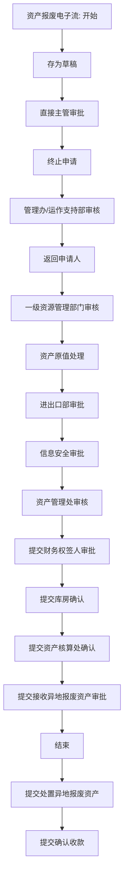

# 资产报废流程

来源：`/Users/feigao/Downloads/flow_complete_design.dxl`。

## 关注范围

资产报废多级审批，含资产原值、进出口、信息安全、财务、库房、异地处置等分支。

## 入口与表单

| 视图 | 选择公式 | 新建入口 |
| --- | --- | --- |
| 资产报废\归档\按资产编号 | `SELECT form="zcbf"&mark="1"` | - |
| 资产报废\归档\按申请人ID | `SELECT form="zcbf"&mark="1"` | - |
| 资产报废\按申请人ID | `SELECT form="zcbf"` | zcbf |
| 资产报废\按填报日期 | `SELECT form="zcbf"` | zcbf |
| 资产报废\归档\三年转个人 | `SELECT form="zcbf"&mark="1"&aa_4="是"` | - |
| 设置\资产核算处id（资产报废） | `SELECT form="zichanchu3"` | - |
| 资产报废\按部门编码 | `SELECT form="zcbf"` | zcbf |
| 资产报废\归档\按结束时间 | `SELECT form="zcbf"&(mark="1" \| @Contains(NOW_STATUS;"结束"))` | - |
| 资产报废\按当前处理人 | `SELECT form="zcbf"` | zcbf |
| 资产报废\归档\按资产核算处结束时间 | `SELECT form="zcbf"&mark="1"&mark_1="1"` | - |
| 资产报废\归档\按部门编码 | `SELECT form="zcbf"&mark="1"` | - |
| 资产报废\按状态 | `SELECT form="zcbf"` | zcbf |

## 表单字段与按钮逻辑

### 资产报废电子流

- 默认 businessType：`ASSET_SCRAP`
- 表单属性：`alias=zcbf; editonopen=true; designerversion=8.5.3; publicaccess=false`
- 字段/按钮/action 数：744 / 43 / 7
- 状态字段证据：`now_status` 相关状态摘要：存为草稿 / 直接主管审批 / 终止申请 / 管理办/运作支持部审核 / 返回申请人 / 一级资源管理部门审核 / 资产原值处理 / 进出口部审批 / 信息安全审批 / 资产管理处审核 / 提交财务权签人审批 / 提交库房确认 / 提交资产核算处确认 / 提交接收异地报废资产审批 / 结束 / 提交处置异地报废资产 / 提交确认收款

#### 关键字段

| # | 字段名 | 类型 | kind | 属性摘要 | 默认/转换/校验/关键词摘要 |
| ---: | --- | --- | --- | --- | --- |
| 1 | `now_status` | `text` | `computed` | type=text; kind=computed; name=now_status | defaultvalue: @If(now_status="";"填写申请";now_status) |
| 2 | `current_processor` | `text` | `computedfordisplay` | type=text; kind=computedfordisplay; name=current_processor | defaultvalue: @Name([CN];Author) |
| 3 | `DocNo` | `text` | `computedwhencomposed` | type=text; kind=computedwhencomposed; name=DocNo | defaultvalue: "" |
| 4 | `shenqingid` | `names` | `computedwhencomposed` | type=names; kind=computedwhencomposed; name=shenqingid | defaultvalue: @V3UserName |
| 5 | `workcode` | `text` | `computedwhencomposed` | type=text; kind=computedwhencomposed; name=workcode | defaultvalue: sNo:=@Trim(@RightBack(@Name([CN];shenqingid);" ")); @If(@Length(sNo)=4;"0"+sNo;sNo) |
| 6 | `data` | `datetime` | `computedwhencomposed` | type=datetime; kind=computedwhencomposed; name=data | defaultvalue: @Created |
| 7 | `number` | `number` | `editable` | type=number; kind=editable; name=number |  |
| 8 | `zcbh` | `text` | `computed` | type=text; kind=computed; name=zcbh | defaultvalue: zcbh |
| 9 | `zcmc` | `text` | `computed` | type=text; kind=computed; name=zcmc | defaultvalue: zcmc |
| 10 | `gueige` | `text` | `editable` | type=text; kind=editable; name=gueige |  |
| 11 | `fswp` | `text` | `computed` | type=text; kind=computed; name=fswp | defaultvalue: fswp |
| 12 | `syrid` | `names` | `computed` | type=names; kind=computed; name=syrid | defaultvalue: syrid |
| 13 | `zccpbianhao` | `text` | `computed` | type=text; kind=computed; name=zccpbianhao | defaultvalue: @If(zccpbianhao="";"";zccpbianhao); entering: Sub Entering(Source As Field) Dim uidoc As notesuidocument Dim wks As New notesuiworkspace Dim doc As notesdocument Dim view As notesview Set uidoc=wks.currentdocument Set doc=uid… |
| 14 | `bmbm` | `text` | `computed` | type=text; kind=computed; name=bmbm | defaultvalue: bmbm |
| 15 | `szbm` | `text` | `computed` | type=text; kind=computed; name=szbm | defaultvalue: szbm |
| 16 | `time` | `text` | `computed` | type=text; kind=computed; name=time; allowmultivalues=true | defaultvalue: time |
| 17 | `name` | `text` | `computed` | type=text; kind=computed; name=name | defaultvalue: name |
| 18 | `telephone` | `text` | `editable` | type=text; kind=editable; name=telephone |  |
| 19 | `didian` | `text` | `editable` | type=text; kind=editable; name=didian |  |
| 20 | `wmht` | `text` | `computed` | type=text; kind=computed; name=wmht | defaultvalue: wmht |
| 21 | `Jkdata` | `text` | `computed` | type=text; kind=computed; name=Jkdata; allowmultivalues=true | defaultvalue: Jkdata |
| 22 | `c_bt` | `text` | `computedwhencomposed` | type=text; kind=computedwhencomposed; name=c_bt; allowmultivalues=true | defaultvalue: c_bt |
| 23 | `aa_4` | `keyword` | `editable` | type=keyword; kind=editable; name=aa_4 | defaultvalue: "否"; entering: Sub Entering(Source As Field) Messagebox("公司信息安全规定电脑转个人必须低级格式化，严禁未经低格擅自转个人。请将便携机移交信息技术部（阳光雨露）进行低格处理"),64,"注意" End Sub; keywords: 否 / 是 |
| 24 | `ydbf` | `keyword` | `editable` | type=keyword; kind=editable; name=ydbf | keywords: 是 / 否 |
| 25 | `ccjz` | `keyword` | `editable` | type=keyword; kind=editable; name=ccjz | keywords: 是 / 否 |
| 26 | `sfyf` | `text` | `editable` | type=text; kind=editable; name=sfyf |  |
| 27 | `yysm` | `text` | `editable` | type=text; kind=editable; name=yysm |  |
| 28 | `yysm_1` | `richtext` | `editable` | type=richtext; kind=editable; name=yysm_1 |  |
| 29 | `wxyy` | `keyword` | `editable` | type=keyword; kind=editable; name=wxyy | defaultvalue: "否"; keywords: 否 / 是 |
| 30 | `fj` | `richtext` | `editable` | type=richtext; kind=editable; name=fj |  |
| ... | ... | ... | ... | ... | 共 744 个字段，完整字段见全量分析或 DXL |

#### 按钮/action 摘要

| 类型 | 文本/标题 | 摘要 |
| --- | --- | --- |
| action | Categori_ze |  |
| action | _Edit Document |  |
| action | Send Docu_ment |  |
| action | _Forward |  |
| action | _Move To Folder... |  |
| action | _Remove From Folder |  |
| action | 退出 | click: @Command([FileCloseWindow]) |
| button | (无显示文本/图标按钮) | 选择视图 资产编号; 查库 NumberView |
| button | (无显示文本/图标按钮) | click: Sub Click(Source As Button) Call bfImportNumber() End Sub |
| button | (无显示文本/图标按钮) | 选择视图 一级资源管理部门ID |
| button | (无显示文本/图标按钮) | 选择视图 信息安全审批员ID |
| button | (无显示文本/图标按钮) | 选择视图 管理办/运作支持部 |
| button | (无显示文本/图标按钮) | 状态->存为草稿 |
| button | (无显示文本/图标按钮) | 状态->直接主管审批; 校验/提示 请输入资产编号 / 公司信息安全规定电脑转个人必须低级格式化，严禁未经低格擅自转个人。请将便携机移交信息技术部（阳光雨露）进行低格处理 / 请输入所在部门 / 不同公司的资产请分开填写资产报废电子流，谢谢! / 请指定信息安全审批员ID; 含邮件/通知逻辑 |
| button | (无显示文本/图标按钮) | 状态->终止申请 |
| button | (无显示文本/图标按钮) | 状态->管理办/运作支持部审核; 校验/提示 请输入资产编号 / 请输入所在部门 / 不同公司的资产请分开填写资产报废电子流，谢谢! / 请输入领用新机器的资产编码 / 请输入领用新机器的日期; 含邮件/通知逻辑 |
| button | (无显示文本/图标按钮) | 状态->返回申请人; 校验/提示 请填写审批意见; 含邮件/通知逻辑 |
| button | (无显示文本/图标按钮) | 状态->直接主管审批; 校验/提示 请填写审批意见; 含邮件/通知逻辑 |
| button | (无显示文本/图标按钮) | 状态->返回申请人; 校验/提示 请填写审批意见; 含邮件/通知逻辑 |
| button | (无显示文本/图标按钮) | 状态->一级资源管理部门审核; 校验/提示 请输入主管意见; 含邮件/通知逻辑 |
| button | (无显示文本/图标按钮) | 状态->返回申请人; 校验/提示 请填写审批意见; 含邮件/通知逻辑 |
| button | (无显示文本/图标按钮) | 状态->资产原值处理; 校验/提示 请输入意见 / 请指定资产原值管理员ID; 含邮件/通知逻辑 |
| button | (无显示文本/图标按钮) | 状态->进出口部审批; 校验/提示 请输入意见 / 请指定资产管理处管理员ID; 含邮件/通知逻辑 |
| button | (无显示文本/图标按钮) | 状态->信息安全审批; 校验/提示 请输入意见; 含邮件/通知逻辑 |
| button | (无显示文本/图标按钮) | 状态->返回申请人; 校验/提示 请填写审批意见; 含邮件/通知逻辑 |
| button | (无显示文本/图标按钮) | 状态->资产原值处理; 校验/提示 请输入意见 / 请指定资产原值管理员ID; 含邮件/通知逻辑 |
| button | (无显示文本/图标按钮) | 状态->进出口部审批; 校验/提示 请输入意见 / 请指定资产管理处管理员ID; 含邮件/通知逻辑 |
| button | (无显示文本/图标按钮) | 状态->返回申请人; 校验/提示 请填写审批意见; 含邮件/通知逻辑 |
| button | (无显示文本/图标按钮) | 状态->资产原值处理; 校验/提示 请输入意见 / 请指定资产原值ID; 含邮件/通知逻辑 |
| button | (无显示文本/图标按钮) | click: Sub Click(Source As Button) Call AddRow("1",100) End Sub |
| button | (无显示文本/图标按钮) | click: Sub Click(Source As Button) Call DelRowNewV2("1") End Sub |
| button | (无显示文本/图标按钮) | click: Sub Click(Source As Button) '此按钮的作用是对于多个资产编号，将其一个一个分割出来，再单独获资产原值（只针对于申请人在填写的时候，选择多个资产编号） '2022/05/10 Dim i As Integer Dim ss As New NotesSession Dim wks As New NotesUIWorkspace Dim doc As NotesDocument Dim uidoc A |
| button | (无显示文本/图标按钮) | 状态->返回申请人; 校验/提示 请填写审批意见; 含邮件/通知逻辑 |
| button | (无显示文本/图标按钮) | 状态->资产管理处审核; 校验/提示 请指定原值 / 请输入残值 / 请输入累计折旧 / 请输入净值; 含邮件/通知逻辑 |
| button | (无显示文本/图标按钮) | 状态->返回申请人; 校验/提示 请填写审批意见; 含邮件/通知逻辑 |
| button | (无显示文本/图标按钮) | 状态->提交财务权签人审批 / 提交库房确认 / 提交资产核算处确认; 校验/提示 请指定原值 / 请输入残值 / 请输入累计折旧 / 请输入净值 / 请输入审批意见; 含邮件/通知逻辑 |
| button | (无显示文本/图标按钮) | 状态->提交接收异地报废资产审批; 校验/提示 请输入审批意见 / 请重新确认提交对象 / 请指定财务审批人ID / 请指定回收库房ID / 请指定资产核算处ID; 含邮件/通知逻辑 |
| button | (无显示文本/图标按钮) | 状态->返回申请人; 校验/提示 请填写审批意见; 含邮件/通知逻辑 |
| button | (无显示文本/图标按钮) | 状态->提交库房确认 / 提交资产核算处确认; 校验/提示 请填写审批意见; 含邮件/通知逻辑 |
| button | (无显示文本/图标按钮) | 选择视图 配件类型 |
| button | (无显示文本/图标按钮) | 状态->返回申请人; 校验/提示 请填写不接受原因; 含邮件/通知逻辑 |
| button | (无显示文本/图标按钮) | 状态->提交资产核算处确认 / 结束; 校验/提示 请提供所缺配件记录; 含邮件/通知逻辑 |
| button | (无显示文本/图标按钮) | 状态->返回申请人; 校验/提示 请填写审批意见; 含邮件/通知逻辑 |
| button | (无显示文本/图标按钮) | 状态->提交处置异地报废资产; 校验/提示 请填写审批意见; 含邮件/通知逻辑 |
| button | (无显示文本/图标按钮) | 状态->返回申请人; 校验/提示 请填写审批意见; 含邮件/通知逻辑 |
| button | (无显示文本/图标按钮) | 状态->提交确认收款 / 结束; 校验/提示 请填写审批意见; 含邮件/通知逻辑 |
| button | (无显示文本/图标按钮) | 状态->返回申请人; 校验/提示 请填写审批意见; 含邮件/通知逻辑 |
| button | (无显示文本/图标按钮) | 状态->结束; 校验/提示 请填写审批意见; 含邮件/通知逻辑 |
| button | (无显示文本/图标按钮) | 状态->返回申请人; 校验/提示 请填写意见; 含邮件/通知逻辑 |
| button | (无显示文本/图标按钮) | 状态->结束; 校验/提示 请填写鉴定意见; 含邮件/通知逻辑 |

推断主线：`存为草稿 -> 直接主管审批 -> 终止申请 -> 管理办/运作支持部审核 -> 返回申请人 -> 一级资源管理部门审核 -> 资产原值处理 -> 进出口部审批 -> 信息安全审批 -> 资产管理处审核 -> 提交财务权签人审批 -> 提交库房确认 -> 提交资产核算处确认 -> 提交接收异地报废资产审批 -> 结束 -> 提交处置异地报废资产`。

## 流程图走向（推断）

## 字段明细

### 字段明细：资产报废电子流

| # | 字段名 | 类型 | kind | 属性摘要 | 默认/转换/校验/关键词摘要 |
| ---: | --- | --- | --- | --- | --- |
| 1 | `now_status` | `text` | `computed` | type=text; kind=computed; name=now_status | defaultvalue: @If(now_status="";"填写申请";now_status) |
| 2 | `current_processor` | `text` | `computedfordisplay` | type=text; kind=computedfordisplay; name=current_processor | defaultvalue: @Name([CN];Author) |
| 3 | `DocNo` | `text` | `computedwhencomposed` | type=text; kind=computedwhencomposed; name=DocNo | defaultvalue: "" |
| 4 | `shenqingid` | `names` | `computedwhencomposed` | type=names; kind=computedwhencomposed; name=shenqingid | defaultvalue: @V3UserName |
| 5 | `workcode` | `text` | `computedwhencomposed` | type=text; kind=computedwhencomposed; name=workcode | defaultvalue: sNo:=@Trim(@RightBack(@Name([CN];shenqingid);" ")); @If(@Length(sNo)=4;"0"+sNo;sNo) |
| 6 | `data` | `datetime` | `computedwhencomposed` | type=datetime; kind=computedwhencomposed; name=data | defaultvalue: @Created |
| 7 | `number` | `number` | `editable` | type=number; kind=editable; name=number |  |
| 8 | `zcbh` | `text` | `computed` | type=text; kind=computed; name=zcbh | defaultvalue: zcbh |
| 9 | `zcmc` | `text` | `computed` | type=text; kind=computed; name=zcmc | defaultvalue: zcmc |
| 10 | `gueige` | `text` | `editable` | type=text; kind=editable; name=gueige |  |
| 11 | `fswp` | `text` | `computed` | type=text; kind=computed; name=fswp | defaultvalue: fswp |
| 12 | `syrid` | `names` | `computed` | type=names; kind=computed; name=syrid | defaultvalue: syrid |
| 13 | `zccpbianhao` | `text` | `computed` | type=text; kind=computed; name=zccpbianhao | defaultvalue: @If(zccpbianhao="";"";zccpbianhao); entering: Sub Entering(Source As Field) Dim uidoc As notesuidocument Dim wks As New notesuiworkspace Dim doc As notesdocument Dim view As notesview Set uidoc=wks.currentdocument Set doc=uid… |
| 14 | `bmbm` | `text` | `computed` | type=text; kind=computed; name=bmbm | defaultvalue: bmbm |
| 15 | `szbm` | `text` | `computed` | type=text; kind=computed; name=szbm | defaultvalue: szbm |
| 16 | `time` | `text` | `computed` | type=text; kind=computed; name=time; allowmultivalues=true | defaultvalue: time |
| 17 | `name` | `text` | `computed` | type=text; kind=computed; name=name | defaultvalue: name |
| 18 | `telephone` | `text` | `editable` | type=text; kind=editable; name=telephone |  |
| 19 | `didian` | `text` | `editable` | type=text; kind=editable; name=didian |  |
| 20 | `wmht` | `text` | `computed` | type=text; kind=computed; name=wmht | defaultvalue: wmht |
| 21 | `Jkdata` | `text` | `computed` | type=text; kind=computed; name=Jkdata; allowmultivalues=true | defaultvalue: Jkdata |
| 22 | `c_bt` | `text` | `computedwhencomposed` | type=text; kind=computedwhencomposed; name=c_bt; allowmultivalues=true | defaultvalue: c_bt |
| 23 | `aa_4` | `keyword` | `editable` | type=keyword; kind=editable; name=aa_4 | defaultvalue: "否"; entering: Sub Entering(Source As Field) Messagebox("公司信息安全规定电脑转个人必须低级格式化，严禁未经低格擅自转个人。请将便携机移交信息技术部（阳光雨露）进行低格处理"),64,"注意" End Sub; keywords: 否 / 是 |
| 24 | `ydbf` | `keyword` | `editable` | type=keyword; kind=editable; name=ydbf | keywords: 是 / 否 |
| 25 | `ccjz` | `keyword` | `editable` | type=keyword; kind=editable; name=ccjz | keywords: 是 / 否 |
| 26 | `sfyf` | `text` | `editable` | type=text; kind=editable; name=sfyf |  |
| 27 | `yysm` | `text` | `editable` | type=text; kind=editable; name=yysm |  |
| 28 | `yysm_1` | `richtext` | `editable` | type=richtext; kind=editable; name=yysm_1 |  |
| 29 | `wxyy` | `keyword` | `editable` | type=keyword; kind=editable; name=wxyy | defaultvalue: "否"; keywords: 否 / 是 |
| 30 | `fj` | `richtext` | `editable` | type=richtext; kind=editable; name=fj |  |
| 31 | `dcpz` | `keyword` | `editable` | type=keyword; kind=editable; name=dcpz | defaultvalue: "否"; keywords: 否 / 是 |
| 32 | `pzsm` | `text` | `editable` | type=text; kind=editable; name=pzsm |  |
| 33 | `aa_5` | `keyword` | `editable` | type=keyword; kind=editable; name=aa_5 | defaultvalue: "否"; keywords: 否 / 是 |
| 34 | `lowFormatCode` | `text` | `editable` | type=text; kind=editable; name=lowFormatCode |  |
| 35 | `zichanbianma` | `text` | `editable` | type=text; kind=editable; name=zichanbianma |  |
| 36 | `riqi` | `text` | `editable` | type=text; kind=editable; name=riqi | initialize: Sub Initialize End Sub; entering: Sub Entering(Source As Field) Messagebox("对于新购买的，以固定资产查询系统的领用日期为准；如果是转移或调拨的，以转移、调拨审批通过结束日期为准。其他情况，以当前日期为准。"),64,"注意" End Sub; exiting: Sub Exiting(Source As Field) Dim uidoc As notesuidocument … |
| 37 | `jzqd` | `richtext` | `editable` | type=richtext; kind=editable; name=jzqd |  |
| 38 | `jbr` | `text` | `editable` | type=text; kind=editable; name=jbr | defaultvalue: x:= @DbLookup( "":"NoCache";"ap01-ds/uniview":"hr/telephoneall.nsf";"DepartView";workcode;3 ); @If(@IsError(x);"";x) |
| 39 | `telephonecode` | `text` | `editable` | type=text; kind=editable; name=telephonecode | defaultvalue: z:= @DbLookup( "":"NoCache";"ap01-ds/uniview":"hr/telephoneall.nsf";"DepartView";workcode;4 ); @If(@IsError(z);"";z) |
| 40 | `bmzgid` | `names` | `editable` | type=names; kind=editable; name=bmzgid |  |
| 41 | `zymangerid` | `names` | `computed` | type=names; kind=computed; name=zymangerid | defaultvalue: zymangerid |
| 42 | `dept` | `text` | `computed` | type=text; kind=computed; name=dept | defaultvalue: dept |
| 43 | `ISmanager` | `names` | `computed` | type=names; kind=computed; name=ISmanager | defaultvalue: ISmanager |
| 44 | `bfzc` | `names` | `editable` | type=names; kind=editable; name=bfzc |  |
| 45 | `bscms` | `names` | `editable` | type=names; kind=editable; name=bscms |  |
| 46 | `yzzc` | `names` | `computed` | type=names; kind=computed; name=yzzc | defaultvalue: yzzc |
| 47 | `sign1` | `names` | `computed` | type=names; kind=computed; name=sign1 | defaultvalue: sign1 |
| 48 | `signtime1` | `datetime` | `computed` | type=datetime; kind=computed; name=signtime1 | defaultvalue: signtime1 |
| 49 | `yijian4_5` | `text` | `editable` | type=text; kind=editable; name=yijian4_5 |  |
| 50 | `sign6_5` | `names` | `computed` | type=names; kind=computed; name=sign6_5 | defaultvalue: sign6_5 |
| 51 | `signtime6_5` | `datetime` | `computed` | type=datetime; kind=computed; name=signtime6_5 | defaultvalue: signtime6_5 |
| 52 | `yijian1` | `text` | `editable` | type=text; kind=editable; name=yijian1 |  |
| 53 | `sign3` | `names` | `computed` | type=names; kind=computed; name=sign3 | defaultvalue: sign3 |
| 54 | `signtime3` | `datetime` | `computed` | type=datetime; kind=computed; name=signtime3 | defaultvalue: signtime3 |
| 55 | `yijian2` | `text` | `editable` | type=text; kind=editable; name=yijian2 |  |
| 56 | `zcyzid` | `names` | `computedwhencomposed` | type=names; kind=computedwhencomposed; name=zcyzid | defaultvalue: zcyz:=@DbColumn("":nocache;"":"";"zichanchu3";4); @If(@IsError(zcyz);"";zcyz) |
| 57 | `jckmangerid` | `names` | `computed` | type=names; kind=computed; name=jckmangerid | defaultvalue: jckmangerid |
| 58 | `sign4` | `names` | `computed` | type=names; kind=computed; name=sign4 | defaultvalue: sign4 |
| 59 | `signtime4` | `datetime` | `computed` | type=datetime; kind=computed; name=signtime4 | defaultvalue: signtime4 |
| 60 | `yijian5` | `text` | `editable` | type=text; kind=editable; name=yijian5 |  |
| 61 | `spfj` | `richtext` | `editable` | type=richtext; kind=editable; name=spfj |  |
| 62 | `sign3_1` | `names` | `computed` | type=names; kind=computed; name=sign3_1 | defaultvalue: sign3_1 |
| 63 | `signtime3_1` | `datetime` | `computed` | type=datetime; kind=computed; name=signtime3_1 | defaultvalue: signtime3_1 |
| 64 | `yijian8` | `text` | `editable` | type=text; kind=editable; name=yijian8 |  |
| 65 | `zcyz1id` | `names` | `computedwhencomposed` | type=names; kind=computedwhencomposed; name=zcyz1id | defaultvalue: zcyz:=@DbColumn("":nocache;"":"";"zichanchu3";4); @If(@IsError(zcyz);"";zcyz) |
| 66 | `sign8` | `names` | `computed` | type=names; kind=computed; name=sign8 | defaultvalue: sign8 |
| 67 | `signtime8` | `datetime` | `computed` | type=datetime; kind=computed; name=signtime8 | defaultvalue: signtime8 |
| 68 | `yuanzhi` | `number` | `editable` | type=number; kind=editable; name=yuanzhi | defaultvalue: 0; exiting: Sub Exiting(Source As Field) End Sub |
| 69 | `canzhi` | `number` | `editable` | type=number; kind=editable; name=canzhi | defaultvalue: 0 |
| 70 | `leijizhejiu` | `number` | `editable` | type=number; kind=editable; name=leijizhejiu | defaultvalue: 0; exiting: Sub Exiting(Source As Field) Dim uidoc As notesuidocument Dim doc As notesdocument Dim wks As New notesuiworkspace Set uidoc=wks.currentdocument Set doc=uidoc.document If Trim(Cst… |
| 71 | `jingzhi22` | `number` | `editable` | type=number; kind=editable; name=jingzhi22 | defaultvalue: 0; exiting: Sub Exiting(Source As Field) Dim uidoc As notesuidocument Dim doc As notesdocument Dim wks As New notesuiworkspace Set uidoc=wks.currentdocument Set doc=uidoc.document If Trim(Cst… |
| 72 | `CountNumber` | `text` | `editable` | type=text; kind=editable; name=CountNumber | defaultvalue: "1" |
| 73 | `AssetNumber_1` | `text` | `editable` | type=text; kind=editable; name=AssetNumber_1 | exiting: Sub Exiting(Source As Field) Dim uidoc As notesuidocument Dim doc,doc1 As notesdocument Dim wrk As New notesuiworkspace Dim view As notesview Dim db As notesdatabase Dim session A… |
| 74 | `AssetName_1` | `text` | `editable` | type=text; kind=editable; name=AssetName_1 |  |
| 75 | `AssetType_1` | `text` | `editable` | type=text; kind=editable; name=AssetType_1 |  |
| 76 | `yuanzhi_1` | `number` | `editable` | type=number; kind=editable; name=yuanzhi_1 | defaultvalue: 0; exiting: Sub Exiting(Source As Field) %REM Dim uidoc As notesuidocument Dim doc As notesdocument Dim wks As New notesuiworkspace Set uidoc=wks.currentdocument Set doc=uidoc.document If doc… |
| 77 | `leijizhejiu_1` | `number` | `editable` | type=number; kind=editable; name=leijizhejiu_1 | defaultvalue: 0; exiting: Sub Exiting(Source As Field) Dim uidoc As notesuidocument Dim doc As notesdocument Dim wks As New notesuiworkspace Dim jinzhi As Double Dim yuanzhi As Double Dim zhejiu As Double … |
| 78 | `jingzhi_1` | `number` | `editable` | type=number; kind=editable; name=jingzhi_1 | defaultvalue: 0; exiting: Sub Exiting(Source As Field) End Sub |
| 79 | `AssetNumber_2` | `text` | `editable` | type=text; kind=editable; name=AssetNumber_2 | exiting: Sub Exiting(Source As Field) Dim uidoc As notesuidocument Dim doc,doc1 As notesdocument Dim wrk As New notesuiworkspace Dim view As notesview Dim db As notesdatabase Dim session A… |
| 80 | `AssetName_2` | `text` | `editable` | type=text; kind=editable; name=AssetName_2 |  |
| 81 | `AssetType_2` | `text` | `editable` | type=text; kind=editable; name=AssetType_2 |  |
| 82 | `yuanzhi_2` | `number` | `editable` | type=number; kind=editable; name=yuanzhi_2 | defaultvalue: 0; exiting: Sub Exiting(Source As Field) End Sub |
| 83 | `leijizhejiu_2` | `number` | `editable` | type=number; kind=editable; name=leijizhejiu_2 | defaultvalue: 0; exiting: Sub Exiting(Source As Field) Dim uidoc As notesuidocument Dim doc As notesdocument Dim wks As New notesuiworkspace Dim jinzhi As Double Dim yuanzhi As Double Dim zhejiu As Double … |
| 84 | `jingzhi_2` | `number` | `editable` | type=number; kind=editable; name=jingzhi_2 | defaultvalue: 0; exiting: Sub Exiting(Source As Field) End Sub |
| 85 | `AssetNumber_3` | `text` | `editable` | type=text; kind=editable; name=AssetNumber_3 | exiting: Sub Exiting(Source As Field) Dim uidoc As notesuidocument Dim doc,doc1 As notesdocument Dim wrk As New notesuiworkspace Dim view As notesview Dim db As notesdatabase Dim session A… |
| 86 | `AssetName_3` | `text` | `editable` | type=text; kind=editable; name=AssetName_3 |  |
| 87 | `AssetType_3` | `text` | `editable` | type=text; kind=editable; name=AssetType_3 |  |
| 88 | `yuanzhi_3` | `number` | `editable` | type=number; kind=editable; name=yuanzhi_3 | defaultvalue: 0; exiting: Sub Exiting(Source As Field) End Sub |
| 89 | `leijizhejiu_3` | `number` | `editable` | type=number; kind=editable; name=leijizhejiu_3 | defaultvalue: 0; exiting: Sub Exiting(Source As Field) Dim uidoc As notesuidocument Dim doc As notesdocument Dim wks As New notesuiworkspace Dim jinzhi As Double Dim yuanzhi As Double Dim zhejiu As Double … |
| 90 | `jingzhi_3` | `number` | `editable` | type=number; kind=editable; name=jingzhi_3 | defaultvalue: 0; exiting: Sub Exiting(Source As Field) End Sub |
| 91 | `AssetNumber_4` | `text` | `editable` | type=text; kind=editable; name=AssetNumber_4 | exiting: Sub Exiting(Source As Field) Dim uidoc As notesuidocument Dim doc,doc1 As notesdocument Dim wrk As New notesuiworkspace Dim view As notesview Dim db As notesdatabase Dim session A… |
| 92 | `AssetName_4` | `text` | `editable` | type=text; kind=editable; name=AssetName_4 |  |
| 93 | `AssetType_4` | `text` | `editable` | type=text; kind=editable; name=AssetType_4 |  |
| 94 | `yuanzhi_4` | `number` | `editable` | type=number; kind=editable; name=yuanzhi_4 | defaultvalue: 0; exiting: Sub Exiting(Source As Field) End Sub |
| 95 | `leijizhejiu_4` | `number` | `editable` | type=number; kind=editable; name=leijizhejiu_4 | defaultvalue: 0; exiting: Sub Exiting(Source As Field) Dim uidoc As notesuidocument Dim doc As notesdocument Dim wks As New notesuiworkspace Dim jinzhi As Double Dim yuanzhi As Double Dim zhejiu As Double … |
| 96 | `jingzhi_4` | `number` | `editable` | type=number; kind=editable; name=jingzhi_4 | defaultvalue: 0; exiting: Sub Exiting(Source As Field) End Sub |
| 97 | `AssetNumber_5` | `text` | `editable` | type=text; kind=editable; name=AssetNumber_5 | exiting: Sub Exiting(Source As Field) Dim uidoc As notesuidocument Dim doc,doc1 As notesdocument Dim wrk As New notesuiworkspace Dim view As notesview Dim db As notesdatabase Dim session A… |
| 98 | `AssetName_5` | `text` | `editable` | type=text; kind=editable; name=AssetName_5 |  |
| 99 | `AssetType_5` | `text` | `editable` | type=text; kind=editable; name=AssetType_5 |  |
| 100 | `yuanzhi_5` | `number` | `editable` | type=number; kind=editable; name=yuanzhi_5 | defaultvalue: 0; exiting: Sub Exiting(Source As Field) End Sub |
| 101 | `leijizhejiu_5` | `number` | `editable` | type=number; kind=editable; name=leijizhejiu_5 | defaultvalue: 0; exiting: Sub Exiting(Source As Field) Dim uidoc As notesuidocument Dim doc As notesdocument Dim wks As New notesuiworkspace Dim jinzhi As Double Dim yuanzhi As Double Dim zhejiu As Double … |
| 102 | `jingzhi_5` | `number` | `editable` | type=number; kind=editable; name=jingzhi_5 | defaultvalue: 0; exiting: Sub Exiting(Source As Field) End Sub |
| 103 | `AssetNumber_6` | `text` | `editable` | type=text; kind=editable; name=AssetNumber_6 | exiting: Sub Exiting(Source As Field) Dim uidoc As notesuidocument Dim doc,doc1 As notesdocument Dim wrk As New notesuiworkspace Dim view As notesview Dim db As notesdatabase Dim session A… |
| 104 | `AssetName_6` | `text` | `editable` | type=text; kind=editable; name=AssetName_6 |  |
| 105 | `AssetType_6` | `text` | `editable` | type=text; kind=editable; name=AssetType_6 |  |
| 106 | `yuanzhi_6` | `number` | `editable` | type=number; kind=editable; name=yuanzhi_6 | defaultvalue: 0; exiting: Sub Exiting(Source As Field) End Sub |
| 107 | `leijizhejiu_6` | `number` | `editable` | type=number; kind=editable; name=leijizhejiu_6 | defaultvalue: 0; exiting: Sub Exiting(Source As Field) Dim uidoc As notesuidocument Dim doc As notesdocument Dim wks As New notesuiworkspace Dim jinzhi As Double Dim yuanzhi As Double Dim zhejiu As Double … |
| 108 | `jingzhi_6` | `number` | `editable` | type=number; kind=editable; name=jingzhi_6 | defaultvalue: 0; exiting: Sub Exiting(Source As Field) End Sub |
| 109 | `AssetNumber_7` | `text` | `editable` | type=text; kind=editable; name=AssetNumber_7 | exiting: Sub Exiting(Source As Field) Dim uidoc As notesuidocument Dim doc,doc1 As notesdocument Dim wrk As New notesuiworkspace Dim view As notesview Dim db As notesdatabase Dim session A… |
| 110 | `AssetName_7` | `text` | `editable` | type=text; kind=editable; name=AssetName_7 |  |
| 111 | `AssetType_7` | `text` | `editable` | type=text; kind=editable; name=AssetType_7 |  |
| 112 | `yuanzhi_7` | `number` | `editable` | type=number; kind=editable; name=yuanzhi_7 | defaultvalue: 0; exiting: Sub Exiting(Source As Field) End Sub |
| 113 | `leijizhejiu_7` | `number` | `editable` | type=number; kind=editable; name=leijizhejiu_7 | defaultvalue: 0; exiting: Sub Exiting(Source As Field) Dim uidoc As notesuidocument Dim doc As notesdocument Dim wks As New notesuiworkspace Dim jinzhi As Double Dim yuanzhi As Double Dim zhejiu As Double … |
| 114 | `jingzhi_7` | `number` | `editable` | type=number; kind=editable; name=jingzhi_7 | defaultvalue: 0; exiting: Sub Exiting(Source As Field) End Sub |
| 115 | `AssetNumber_8` | `text` | `editable` | type=text; kind=editable; name=AssetNumber_8 | exiting: Sub Exiting(Source As Field) Dim uidoc As notesuidocument Dim doc,doc1 As notesdocument Dim wrk As New notesuiworkspace Dim view As notesview Dim db As notesdatabase Dim session A… |
| 116 | `AssetName_8` | `text` | `editable` | type=text; kind=editable; name=AssetName_8 |  |
| 117 | `AssetType_8` | `text` | `editable` | type=text; kind=editable; name=AssetType_8 |  |
| 118 | `yuanzhi_8` | `number` | `editable` | type=number; kind=editable; name=yuanzhi_8 | defaultvalue: 0; exiting: Sub Exiting(Source As Field) End Sub |
| 119 | `leijizhejiu_8` | `number` | `editable` | type=number; kind=editable; name=leijizhejiu_8 | defaultvalue: 0; exiting: Sub Exiting(Source As Field) Dim uidoc As notesuidocument Dim doc As notesdocument Dim wks As New notesuiworkspace Dim jinzhi As Double Dim yuanzhi As Double Dim zhejiu As Double … |
| 120 | `jingzhi_8` | `number` | `editable` | type=number; kind=editable; name=jingzhi_8 | defaultvalue: 0; exiting: Sub Exiting(Source As Field) End Sub |
| 121 | `AssetNumber_9` | `text` | `editable` | type=text; kind=editable; name=AssetNumber_9 | exiting: Sub Exiting(Source As Field) Dim uidoc As notesuidocument Dim doc,doc1 As notesdocument Dim wrk As New notesuiworkspace Dim view As notesview Dim db As notesdatabase Dim session A… |
| 122 | `AssetName_9` | `text` | `editable` | type=text; kind=editable; name=AssetName_9 |  |
| 123 | `AssetType_9` | `text` | `editable` | type=text; kind=editable; name=AssetType_9 |  |
| 124 | `yuanzhi_9` | `number` | `editable` | type=number; kind=editable; name=yuanzhi_9 | defaultvalue: 0; exiting: Sub Exiting(Source As Field) End Sub |
| 125 | `leijizhejiu_9` | `number` | `editable` | type=number; kind=editable; name=leijizhejiu_9 | defaultvalue: 0; exiting: Sub Exiting(Source As Field) Dim uidoc As notesuidocument Dim doc As notesdocument Dim wks As New notesuiworkspace Dim jinzhi As Double Dim yuanzhi As Double Dim zhejiu As Double … |
| 126 | `jingzhi_9` | `number` | `editable` | type=number; kind=editable; name=jingzhi_9 | defaultvalue: 0; exiting: Sub Exiting(Source As Field) End Sub |
| 127 | `AssetNumber_10` | `text` | `editable` | type=text; kind=editable; name=AssetNumber_10 | exiting: Sub Exiting(Source As Field) Dim uidoc As notesuidocument Dim doc,doc1 As notesdocument Dim wrk As New notesuiworkspace Dim view As notesview Dim db As notesdatabase Dim session A… |
| 128 | `AssetName_10` | `text` | `editable` | type=text; kind=editable; name=AssetName_10 |  |
| 129 | `AssetType_10` | `text` | `editable` | type=text; kind=editable; name=AssetType_10 |  |
| 130 | `yuanzhi_10` | `number` | `editable` | type=number; kind=editable; name=yuanzhi_10 | defaultvalue: 0; exiting: Sub Exiting(Source As Field) End Sub |
| 131 | `leijizhejiu_10` | `number` | `editable` | type=number; kind=editable; name=leijizhejiu_10 | defaultvalue: 0; exiting: Sub Exiting(Source As Field) Dim uidoc As notesuidocument Dim doc As notesdocument Dim wks As New notesuiworkspace Dim jinzhi As Double Dim yuanzhi As Double Dim zhejiu As Double … |
| 132 | `jingzhi_10` | `number` | `editable` | type=number; kind=editable; name=jingzhi_10 | defaultvalue: 0; exiting: Sub Exiting(Source As Field) End Sub |
| 133 | `AssetNumber_11` | `text` | `editable` | type=text; kind=editable; name=AssetNumber_11 |  |
| 134 | `AssetName_11` | `text` | `editable` | type=text; kind=editable; name=AssetName_11 |  |
| 135 | `AssetType_11` | `text` | `editable` | type=text; kind=editable; name=AssetType_11 |  |
| 136 | `yuanzhi_11` | `number` | `editable` | type=number; kind=editable; name=yuanzhi_11 | defaultvalue: 0; exiting: Sub Exiting(Source As Field) End Sub |
| 137 | `leijizhejiu_11` | `number` | `editable` | type=number; kind=editable; name=leijizhejiu_11 | defaultvalue: 0; exiting: Sub Exiting(Source As Field) Dim uidoc As notesuidocument Dim doc As notesdocument Dim wks As New notesuiworkspace Dim jinzhi As Double Dim yuanzhi As Double Dim zhejiu As Double … |
| 138 | `jingzhi_11` | `number` | `editable` | type=number; kind=editable; name=jingzhi_11 | defaultvalue: 0; exiting: Sub Exiting(Source As Field) End Sub |
| 139 | `AssetNumber_12` | `text` | `editable` | type=text; kind=editable; name=AssetNumber_12 |  |
| 140 | `AssetName_12` | `text` | `editable` | type=text; kind=editable; name=AssetName_12 |  |
| 141 | `AssetType_12` | `text` | `editable` | type=text; kind=editable; name=AssetType_12 |  |
| 142 | `yuanzhi_12` | `number` | `editable` | type=number; kind=editable; name=yuanzhi_12 | defaultvalue: 0; exiting: Sub Exiting(Source As Field) End Sub |
| 143 | `leijizhejiu_12` | `number` | `editable` | type=number; kind=editable; name=leijizhejiu_12 | defaultvalue: 0; exiting: Sub Exiting(Source As Field) Dim uidoc As notesuidocument Dim doc As notesdocument Dim wks As New notesuiworkspace Dim jinzhi As Double Dim yuanzhi As Double Dim zhejiu As Double … |
| 144 | `jingzhi_12` | `number` | `editable` | type=number; kind=editable; name=jingzhi_12 | defaultvalue: 0; exiting: Sub Exiting(Source As Field) End Sub |
| 145 | `AssetNumber_13` | `text` | `editable` | type=text; kind=editable; name=AssetNumber_13 |  |
| 146 | `AssetName_13` | `text` | `editable` | type=text; kind=editable; name=AssetName_13 |  |
| 147 | `AssetType_13` | `text` | `editable` | type=text; kind=editable; name=AssetType_13 |  |
| 148 | `yuanzhi_13` | `number` | `editable` | type=number; kind=editable; name=yuanzhi_13 | defaultvalue: 0; exiting: Sub Exiting(Source As Field) End Sub |
| 149 | `leijizhejiu_13` | `number` | `editable` | type=number; kind=editable; name=leijizhejiu_13 | defaultvalue: 0; exiting: Sub Exiting(Source As Field) Dim uidoc As notesuidocument Dim doc As notesdocument Dim wks As New notesuiworkspace Dim jinzhi As Double Dim yuanzhi As Double Dim zhejiu As Double … |
| 150 | `jingzhi_13` | `number` | `editable` | type=number; kind=editable; name=jingzhi_13 | defaultvalue: 0; exiting: Sub Exiting(Source As Field) End Sub |
| 151 | `AssetNumber_14` | `text` | `editable` | type=text; kind=editable; name=AssetNumber_14 |  |
| 152 | `AssetName_14` | `text` | `editable` | type=text; kind=editable; name=AssetName_14 |  |
| 153 | `AssetType_14` | `text` | `editable` | type=text; kind=editable; name=AssetType_14 |  |
| 154 | `yuanzhi_14` | `number` | `editable` | type=number; kind=editable; name=yuanzhi_14 | defaultvalue: 0; exiting: Sub Exiting(Source As Field) End Sub |
| 155 | `leijizhejiu_14` | `number` | `editable` | type=number; kind=editable; name=leijizhejiu_14 | defaultvalue: 0; exiting: Sub Exiting(Source As Field) Dim uidoc As notesuidocument Dim doc As notesdocument Dim wks As New notesuiworkspace Dim jinzhi As Double Dim yuanzhi As Double Dim zhejiu As Double … |
| 156 | `jingzhi_14` | `number` | `editable` | type=number; kind=editable; name=jingzhi_14 | defaultvalue: 0; exiting: Sub Exiting(Source As Field) End Sub |
| 157 | `AssetNumber_15` | `text` | `editable` | type=text; kind=editable; name=AssetNumber_15 |  |
| 158 | `AssetName_15` | `text` | `editable` | type=text; kind=editable; name=AssetName_15 |  |
| 159 | `AssetType_15` | `text` | `editable` | type=text; kind=editable; name=AssetType_15 |  |
| 160 | `yuanzhi_15` | `number` | `editable` | type=number; kind=editable; name=yuanzhi_15 | defaultvalue: 0; exiting: Sub Exiting(Source As Field) End Sub |
| 161 | `leijizhejiu_15` | `number` | `editable` | type=number; kind=editable; name=leijizhejiu_15 | defaultvalue: 0; exiting: Sub Exiting(Source As Field) Dim uidoc As notesuidocument Dim doc As notesdocument Dim wks As New notesuiworkspace Dim jinzhi As Double Dim yuanzhi As Double Dim zhejiu As Double … |
| 162 | `jingzhi_15` | `number` | `editable` | type=number; kind=editable; name=jingzhi_15 | defaultvalue: 0; exiting: Sub Exiting(Source As Field) End Sub |
| 163 | `AssetNumber_16` | `text` | `editable` | type=text; kind=editable; name=AssetNumber_16 |  |
| 164 | `AssetName_16` | `text` | `editable` | type=text; kind=editable; name=AssetName_16 |  |
| 165 | `AssetType_16` | `text` | `editable` | type=text; kind=editable; name=AssetType_16 |  |
| 166 | `yuanzhi_16` | `number` | `editable` | type=number; kind=editable; name=yuanzhi_16 | defaultvalue: 0; exiting: Sub Exiting(Source As Field) End Sub |
| 167 | `leijizhejiu_16` | `number` | `editable` | type=number; kind=editable; name=leijizhejiu_16 | defaultvalue: 0; exiting: Sub Exiting(Source As Field) Dim uidoc As notesuidocument Dim doc As notesdocument Dim wks As New notesuiworkspace Dim jinzhi As Double Dim yuanzhi As Double Dim zhejiu As Double … |
| 168 | `jingzhi_16` | `number` | `editable` | type=number; kind=editable; name=jingzhi_16 | defaultvalue: 0; exiting: Sub Exiting(Source As Field) End Sub |
| 169 | `AssetNumber_17` | `text` | `editable` | type=text; kind=editable; name=AssetNumber_17 |  |
| 170 | `AssetName_17` | `text` | `editable` | type=text; kind=editable; name=AssetName_17 |  |
| 171 | `AssetType_17` | `text` | `editable` | type=text; kind=editable; name=AssetType_17 |  |
| 172 | `yuanzhi_17` | `number` | `editable` | type=number; kind=editable; name=yuanzhi_17 | defaultvalue: 0; exiting: Sub Exiting(Source As Field) End Sub |
| 173 | `leijizhejiu_17` | `number` | `editable` | type=number; kind=editable; name=leijizhejiu_17 | defaultvalue: 0; exiting: Sub Exiting(Source As Field) Dim uidoc As notesuidocument Dim doc As notesdocument Dim wks As New notesuiworkspace Dim jinzhi As Double Dim yuanzhi As Double Dim zhejiu As Double … |
| 174 | `jingzhi_17` | `number` | `editable` | type=number; kind=editable; name=jingzhi_17 | defaultvalue: 0; exiting: Sub Exiting(Source As Field) End Sub |
| 175 | `AssetNumber_18` | `text` | `editable` | type=text; kind=editable; name=AssetNumber_18 |  |
| 176 | `AssetName_18` | `text` | `editable` | type=text; kind=editable; name=AssetName_18 |  |
| 177 | `AssetType_18` | `text` | `editable` | type=text; kind=editable; name=AssetType_18 |  |
| 178 | `yuanzhi_18` | `number` | `editable` | type=number; kind=editable; name=yuanzhi_18 | defaultvalue: 0; exiting: Sub Exiting(Source As Field) End Sub |
| 179 | `leijizhejiu_18` | `number` | `editable` | type=number; kind=editable; name=leijizhejiu_18 | defaultvalue: 0; exiting: Sub Exiting(Source As Field) Dim uidoc As notesuidocument Dim doc As notesdocument Dim wks As New notesuiworkspace Dim jinzhi As Double Dim yuanzhi As Double Dim zhejiu As Double … |
| 180 | `jingzhi_18` | `number` | `editable` | type=number; kind=editable; name=jingzhi_18 | defaultvalue: 0; exiting: Sub Exiting(Source As Field) End Sub |
| 181 | `AssetNumber_19` | `text` | `editable` | type=text; kind=editable; name=AssetNumber_19 |  |
| 182 | `AssetName_19` | `text` | `editable` | type=text; kind=editable; name=AssetName_19 |  |
| 183 | `AssetType_19` | `text` | `editable` | type=text; kind=editable; name=AssetType_19 |  |
| 184 | `yuanzhi_19` | `number` | `editable` | type=number; kind=editable; name=yuanzhi_19 | defaultvalue: 0; exiting: Sub Exiting(Source As Field) End Sub |
| 185 | `leijizhejiu_19` | `number` | `editable` | type=number; kind=editable; name=leijizhejiu_19 | defaultvalue: 0; exiting: Sub Exiting(Source As Field) Dim uidoc As notesuidocument Dim doc As notesdocument Dim wks As New notesuiworkspace Dim jinzhi As Double Dim yuanzhi As Double Dim zhejiu As Double … |
| 186 | `jingzhi_19` | `number` | `editable` | type=number; kind=editable; name=jingzhi_19 | defaultvalue: 0; exiting: Sub Exiting(Source As Field) End Sub |
| 187 | `AssetNumber_20` | `text` | `editable` | type=text; kind=editable; name=AssetNumber_20 |  |
| 188 | `AssetName_20` | `text` | `editable` | type=text; kind=editable; name=AssetName_20 |  |
| 189 | `AssetType_20` | `text` | `editable` | type=text; kind=editable; name=AssetType_20 |  |
| 190 | `yuanzhi_20` | `number` | `editable` | type=number; kind=editable; name=yuanzhi_20 | defaultvalue: 0; exiting: Sub Exiting(Source As Field) End Sub |
| 191 | `leijizhejiu_20` | `number` | `editable` | type=number; kind=editable; name=leijizhejiu_20 | defaultvalue: 0; exiting: Sub Exiting(Source As Field) Dim uidoc As notesuidocument Dim doc As notesdocument Dim wks As New notesuiworkspace Dim jinzhi As Double Dim yuanzhi As Double Dim zhejiu As Double … |
| 192 | `jingzhi_20` | `number` | `editable` | type=number; kind=editable; name=jingzhi_20 | defaultvalue: 0; exiting: Sub Exiting(Source As Field) End Sub |
| 193 | `AssetNumber_21` | `text` | `editable` | type=text; kind=editable; name=AssetNumber_21 |  |
| 194 | `AssetName_21` | `text` | `editable` | type=text; kind=editable; name=AssetName_21 |  |
| 195 | `AssetType_21` | `text` | `editable` | type=text; kind=editable; name=AssetType_21 |  |
| 196 | `yuanzhi_21` | `number` | `editable` | type=number; kind=editable; name=yuanzhi_21 | defaultvalue: 0; exiting: Sub Exiting(Source As Field) End Sub |
| 197 | `leijizhejiu_21` | `number` | `editable` | type=number; kind=editable; name=leijizhejiu_21 | defaultvalue: 0; exiting: Sub Exiting(Source As Field) Dim uidoc As notesuidocument Dim doc As notesdocument Dim wks As New notesuiworkspace Dim jinzhi As Double Dim yuanzhi As Double Dim zhejiu As Double … |
| 198 | `jingzhi_21` | `number` | `editable` | type=number; kind=editable; name=jingzhi_21 | defaultvalue: 0; exiting: Sub Exiting(Source As Field) End Sub |
| 199 | `AssetNumber_22` | `text` | `editable` | type=text; kind=editable; name=AssetNumber_22 |  |
| 200 | `AssetName_22` | `text` | `editable` | type=text; kind=editable; name=AssetName_22 |  |
| 201 | `AssetType_22` | `text` | `editable` | type=text; kind=editable; name=AssetType_22 |  |
| 202 | `yuanzhi_22` | `number` | `editable` | type=number; kind=editable; name=yuanzhi_22 | defaultvalue: 0; exiting: Sub Exiting(Source As Field) End Sub |
| 203 | `leijizhejiu_22` | `number` | `editable` | type=number; kind=editable; name=leijizhejiu_22 | defaultvalue: 0; exiting: Sub Exiting(Source As Field) Dim uidoc As notesuidocument Dim doc As notesdocument Dim wks As New notesuiworkspace Dim jinzhi As Double Dim yuanzhi As Double Dim zhejiu As Double … |
| 204 | `jingzhi_22` | `number` | `editable` | type=number; kind=editable; name=jingzhi_22 | defaultvalue: 0; exiting: Sub Exiting(Source As Field) End Sub |
| 205 | `AssetNumber_23` | `text` | `editable` | type=text; kind=editable; name=AssetNumber_23 |  |
| 206 | `AssetName_23` | `text` | `editable` | type=text; kind=editable; name=AssetName_23 |  |
| 207 | `AssetType_23` | `text` | `editable` | type=text; kind=editable; name=AssetType_23 |  |
| 208 | `yuanzhi_23` | `number` | `editable` | type=number; kind=editable; name=yuanzhi_23 | defaultvalue: 0; exiting: Sub Exiting(Source As Field) End Sub |
| 209 | `leijizhejiu_23` | `number` | `editable` | type=number; kind=editable; name=leijizhejiu_23 | defaultvalue: 0; exiting: Sub Exiting(Source As Field) Dim uidoc As notesuidocument Dim doc As notesdocument Dim wks As New notesuiworkspace Dim jinzhi As Double Dim yuanzhi As Double Dim zhejiu As Double … |
| 210 | `jingzhi_23` | `number` | `editable` | type=number; kind=editable; name=jingzhi_23 | defaultvalue: 0; exiting: Sub Exiting(Source As Field) End Sub |
| 211 | `AssetNumber_24` | `text` | `editable` | type=text; kind=editable; name=AssetNumber_24 |  |
| 212 | `AssetName_24` | `text` | `editable` | type=text; kind=editable; name=AssetName_24 |  |
| 213 | `AssetType_24` | `text` | `editable` | type=text; kind=editable; name=AssetType_24 |  |
| 214 | `yuanzhi_24` | `number` | `editable` | type=number; kind=editable; name=yuanzhi_24 | defaultvalue: 0; exiting: Sub Exiting(Source As Field) End Sub |
| 215 | `leijizhejiu_24` | `number` | `editable` | type=number; kind=editable; name=leijizhejiu_24 | defaultvalue: 0; exiting: Sub Exiting(Source As Field) Dim uidoc As notesuidocument Dim doc As notesdocument Dim wks As New notesuiworkspace Dim jinzhi As Double Dim yuanzhi As Double Dim zhejiu As Double … |
| 216 | `jingzhi_24` | `number` | `editable` | type=number; kind=editable; name=jingzhi_24 | defaultvalue: 0; exiting: Sub Exiting(Source As Field) End Sub |
| 217 | `AssetNumber_25` | `text` | `editable` | type=text; kind=editable; name=AssetNumber_25 |  |
| 218 | `AssetName_25` | `text` | `editable` | type=text; kind=editable; name=AssetName_25 |  |
| 219 | `AssetType_25` | `text` | `editable` | type=text; kind=editable; name=AssetType_25 |  |
| 220 | `yuanzhi_25` | `number` | `editable` | type=number; kind=editable; name=yuanzhi_25 | defaultvalue: 0; exiting: Sub Exiting(Source As Field) End Sub |
| 221 | `leijizhejiu_25` | `number` | `editable` | type=number; kind=editable; name=leijizhejiu_25 | defaultvalue: 0; exiting: Sub Exiting(Source As Field) Dim uidoc As notesuidocument Dim doc As notesdocument Dim wks As New notesuiworkspace Dim jinzhi As Double Dim yuanzhi As Double Dim zhejiu As Double … |
| 222 | `jingzhi_25` | `number` | `editable` | type=number; kind=editable; name=jingzhi_25 | defaultvalue: 0; exiting: Sub Exiting(Source As Field) End Sub |
| 223 | `AssetNumber_26` | `text` | `editable` | type=text; kind=editable; name=AssetNumber_26 |  |
| 224 | `AssetName_26` | `text` | `editable` | type=text; kind=editable; name=AssetName_26 |  |
| 225 | `AssetType_26` | `text` | `editable` | type=text; kind=editable; name=AssetType_26 |  |
| 226 | `yuanzhi_26` | `number` | `editable` | type=number; kind=editable; name=yuanzhi_26 | defaultvalue: 0; exiting: Sub Exiting(Source As Field) End Sub |
| 227 | `leijizhejiu_26` | `number` | `editable` | type=number; kind=editable; name=leijizhejiu_26 | defaultvalue: 0; exiting: Sub Exiting(Source As Field) Dim uidoc As notesuidocument Dim doc As notesdocument Dim wks As New notesuiworkspace Dim jinzhi As Double Dim yuanzhi As Double Dim zhejiu As Double … |
| 228 | `jingzhi_26` | `number` | `editable` | type=number; kind=editable; name=jingzhi_26 | defaultvalue: 0; exiting: Sub Exiting(Source As Field) End Sub |
| 229 | `AssetNumber_27` | `text` | `editable` | type=text; kind=editable; name=AssetNumber_27 |  |
| 230 | `AssetName_27` | `text` | `editable` | type=text; kind=editable; name=AssetName_27 |  |
| 231 | `AssetType_27` | `text` | `editable` | type=text; kind=editable; name=AssetType_27 |  |
| 232 | `yuanzhi_27` | `number` | `editable` | type=number; kind=editable; name=yuanzhi_27 | defaultvalue: 0; exiting: Sub Exiting(Source As Field) End Sub |
| 233 | `leijizhejiu_27` | `number` | `editable` | type=number; kind=editable; name=leijizhejiu_27 | defaultvalue: 0; exiting: Sub Exiting(Source As Field) Dim uidoc As notesuidocument Dim doc As notesdocument Dim wks As New notesuiworkspace Dim jinzhi As Double Dim yuanzhi As Double Dim zhejiu As Double … |
| 234 | `jingzhi_27` | `number` | `editable` | type=number; kind=editable; name=jingzhi_27 | defaultvalue: 0; exiting: Sub Exiting(Source As Field) End Sub |
| 235 | `AssetNumber_28` | `text` | `editable` | type=text; kind=editable; name=AssetNumber_28 |  |
| 236 | `AssetName_28` | `text` | `editable` | type=text; kind=editable; name=AssetName_28 |  |
| 237 | `AssetType_28` | `text` | `editable` | type=text; kind=editable; name=AssetType_28 |  |
| 238 | `yuanzhi_28` | `number` | `editable` | type=number; kind=editable; name=yuanzhi_28 | defaultvalue: 0; exiting: Sub Exiting(Source As Field) End Sub |
| 239 | `leijizhejiu_28` | `number` | `editable` | type=number; kind=editable; name=leijizhejiu_28 | defaultvalue: 0; exiting: Sub Exiting(Source As Field) Dim uidoc As notesuidocument Dim doc As notesdocument Dim wks As New notesuiworkspace Dim jinzhi As Double Dim yuanzhi As Double Dim zhejiu As Double … |
| 240 | `jingzhi_28` | `number` | `editable` | type=number; kind=editable; name=jingzhi_28 | defaultvalue: 0; exiting: Sub Exiting(Source As Field) End Sub |
| 241 | `AssetNumber_29` | `text` | `editable` | type=text; kind=editable; name=AssetNumber_29 |  |
| 242 | `AssetName_29` | `text` | `editable` | type=text; kind=editable; name=AssetName_29 |  |
| 243 | `AssetType_29` | `text` | `editable` | type=text; kind=editable; name=AssetType_29 |  |
| 244 | `yuanzhi_29` | `number` | `editable` | type=number; kind=editable; name=yuanzhi_29 | defaultvalue: 0; exiting: Sub Exiting(Source As Field) End Sub |
| 245 | `leijizhejiu_29` | `number` | `editable` | type=number; kind=editable; name=leijizhejiu_29 | defaultvalue: 0; exiting: Sub Exiting(Source As Field) Dim uidoc As notesuidocument Dim doc As notesdocument Dim wks As New notesuiworkspace Dim jinzhi As Double Dim yuanzhi As Double Dim zhejiu As Double … |
| 246 | `jingzhi_29` | `number` | `editable` | type=number; kind=editable; name=jingzhi_29 | defaultvalue: 0; exiting: Sub Exiting(Source As Field) End Sub |
| 247 | `AssetNumber_30` | `text` | `editable` | type=text; kind=editable; name=AssetNumber_30 |  |
| 248 | `AssetName_30` | `text` | `editable` | type=text; kind=editable; name=AssetName_30 |  |
| 249 | `AssetType_30` | `text` | `editable` | type=text; kind=editable; name=AssetType_30 |  |
| 250 | `yuanzhi_30` | `number` | `editable` | type=number; kind=editable; name=yuanzhi_30 | defaultvalue: 0; exiting: Sub Exiting(Source As Field) End Sub |
| 251 | `leijizhejiu_30` | `number` | `editable` | type=number; kind=editable; name=leijizhejiu_30 | defaultvalue: 0; exiting: Sub Exiting(Source As Field) Dim uidoc As notesuidocument Dim doc As notesdocument Dim wks As New notesuiworkspace Dim jinzhi As Double Dim yuanzhi As Double Dim zhejiu As Double … |
| 252 | `jingzhi_30` | `number` | `editable` | type=number; kind=editable; name=jingzhi_30 | defaultvalue: 0; exiting: Sub Exiting(Source As Field) End Sub |
| 253 | `AssetNumber_31` | `text` | `editable` | type=text; kind=editable; name=AssetNumber_31 |  |
| 254 | `AssetName_31` | `text` | `editable` | type=text; kind=editable; name=AssetName_31 |  |
| 255 | `AssetType_31` | `text` | `editable` | type=text; kind=editable; name=AssetType_31 |  |
| 256 | `yuanzhi_31` | `number` | `editable` | type=number; kind=editable; name=yuanzhi_31 | defaultvalue: 0; exiting: Sub Exiting(Source As Field) End Sub |
| 257 | `leijizhejiu_31` | `number` | `editable` | type=number; kind=editable; name=leijizhejiu_31 | defaultvalue: 0; exiting: Sub Exiting(Source As Field) Dim uidoc As notesuidocument Dim doc As notesdocument Dim wks As New notesuiworkspace Dim jinzhi As Double Dim yuanzhi As Double Dim zhejiu As Double … |
| 258 | `jingzhi_31` | `number` | `editable` | type=number; kind=editable; name=jingzhi_31 | defaultvalue: 0; exiting: Sub Exiting(Source As Field) End Sub |
| 259 | `AssetNumber_32` | `text` | `editable` | type=text; kind=editable; name=AssetNumber_32 |  |
| 260 | `AssetName_32` | `text` | `editable` | type=text; kind=editable; name=AssetName_32 |  |
| 261 | `AssetType_32` | `text` | `editable` | type=text; kind=editable; name=AssetType_32 |  |
| 262 | `yuanzhi_32` | `number` | `editable` | type=number; kind=editable; name=yuanzhi_32 | defaultvalue: 0; exiting: Sub Exiting(Source As Field) End Sub |
| 263 | `leijizhejiu_32` | `number` | `editable` | type=number; kind=editable; name=leijizhejiu_32 | defaultvalue: 0; exiting: Sub Exiting(Source As Field) Dim uidoc As notesuidocument Dim doc As notesdocument Dim wks As New notesuiworkspace Dim jinzhi As Double Dim yuanzhi As Double Dim zhejiu As Double … |
| 264 | `jingzhi_32` | `number` | `editable` | type=number; kind=editable; name=jingzhi_32 | defaultvalue: 0; exiting: Sub Exiting(Source As Field) End Sub |
| 265 | `AssetNumber_33` | `text` | `editable` | type=text; kind=editable; name=AssetNumber_33 |  |
| 266 | `AssetName_33` | `text` | `editable` | type=text; kind=editable; name=AssetName_33 |  |
| 267 | `AssetType_33` | `text` | `editable` | type=text; kind=editable; name=AssetType_33 |  |
| 268 | `yuanzhi_33` | `number` | `editable` | type=number; kind=editable; name=yuanzhi_33 | defaultvalue: 0; exiting: Sub Exiting(Source As Field) End Sub |
| 269 | `leijizhejiu_33` | `number` | `editable` | type=number; kind=editable; name=leijizhejiu_33 | defaultvalue: 0; exiting: Sub Exiting(Source As Field) Dim uidoc As notesuidocument Dim doc As notesdocument Dim wks As New notesuiworkspace Dim jinzhi As Double Dim yuanzhi As Double Dim zhejiu As Double … |
| 270 | `jingzhi_33` | `number` | `editable` | type=number; kind=editable; name=jingzhi_33 | defaultvalue: 0; exiting: Sub Exiting(Source As Field) End Sub |
| 271 | `AssetNumber_34` | `text` | `editable` | type=text; kind=editable; name=AssetNumber_34 |  |
| 272 | `AssetName_34` | `text` | `editable` | type=text; kind=editable; name=AssetName_34 |  |
| 273 | `AssetType_34` | `text` | `editable` | type=text; kind=editable; name=AssetType_34 |  |
| 274 | `yuanzhi_34` | `number` | `editable` | type=number; kind=editable; name=yuanzhi_34 | defaultvalue: 0; exiting: Sub Exiting(Source As Field) End Sub |
| 275 | `leijizhejiu_34` | `number` | `editable` | type=number; kind=editable; name=leijizhejiu_34 | defaultvalue: 0; exiting: Sub Exiting(Source As Field) Dim uidoc As notesuidocument Dim doc As notesdocument Dim wks As New notesuiworkspace Dim jinzhi As Double Dim yuanzhi As Double Dim zhejiu As Double … |
| 276 | `jingzhi_34` | `number` | `editable` | type=number; kind=editable; name=jingzhi_34 | defaultvalue: 0; exiting: Sub Exiting(Source As Field) End Sub |
| 277 | `AssetNumber_35` | `text` | `editable` | type=text; kind=editable; name=AssetNumber_35 |  |
| 278 | `AssetName_35` | `text` | `editable` | type=text; kind=editable; name=AssetName_35 |  |
| 279 | `AssetType_35` | `text` | `editable` | type=text; kind=editable; name=AssetType_35 |  |
| 280 | `yuanzhi_35` | `number` | `editable` | type=number; kind=editable; name=yuanzhi_35 | defaultvalue: 0; exiting: Sub Exiting(Source As Field) End Sub |
| 281 | `leijizhejiu_35` | `number` | `editable` | type=number; kind=editable; name=leijizhejiu_35 | defaultvalue: 0; exiting: Sub Exiting(Source As Field) Dim uidoc As notesuidocument Dim doc As notesdocument Dim wks As New notesuiworkspace Dim jinzhi As Double Dim yuanzhi As Double Dim zhejiu As Double … |
| 282 | `jingzhi_35` | `number` | `editable` | type=number; kind=editable; name=jingzhi_35 | defaultvalue: 0; exiting: Sub Exiting(Source As Field) End Sub |
| 283 | `AssetNumber_36` | `text` | `editable` | type=text; kind=editable; name=AssetNumber_36 |  |
| 284 | `AssetName_36` | `text` | `editable` | type=text; kind=editable; name=AssetName_36 |  |
| 285 | `AssetType_36` | `text` | `editable` | type=text; kind=editable; name=AssetType_36 |  |
| 286 | `yuanzhi_36` | `number` | `editable` | type=number; kind=editable; name=yuanzhi_36 | defaultvalue: 0; exiting: Sub Exiting(Source As Field) End Sub |
| 287 | `leijizhejiu_36` | `number` | `editable` | type=number; kind=editable; name=leijizhejiu_36 | defaultvalue: 0; exiting: Sub Exiting(Source As Field) Dim uidoc As notesuidocument Dim doc As notesdocument Dim wks As New notesuiworkspace Dim jinzhi As Double Dim yuanzhi As Double Dim zhejiu As Double … |
| 288 | `jingzhi_36` | `number` | `editable` | type=number; kind=editable; name=jingzhi_36 | defaultvalue: 0; exiting: Sub Exiting(Source As Field) End Sub |
| 289 | `AssetNumber_37` | `text` | `editable` | type=text; kind=editable; name=AssetNumber_37 |  |
| 290 | `AssetName_37` | `text` | `editable` | type=text; kind=editable; name=AssetName_37 |  |
| 291 | `AssetType_37` | `text` | `editable` | type=text; kind=editable; name=AssetType_37 |  |
| 292 | `yuanzhi_37` | `number` | `editable` | type=number; kind=editable; name=yuanzhi_37 | defaultvalue: 0; exiting: Sub Exiting(Source As Field) End Sub |
| 293 | `leijizhejiu_37` | `number` | `editable` | type=number; kind=editable; name=leijizhejiu_37 | defaultvalue: 0; exiting: Sub Exiting(Source As Field) Dim uidoc As notesuidocument Dim doc As notesdocument Dim wks As New notesuiworkspace Dim jinzhi As Double Dim yuanzhi As Double Dim zhejiu As Double … |
| 294 | `jingzhi_37` | `number` | `editable` | type=number; kind=editable; name=jingzhi_37 | defaultvalue: 0; exiting: Sub Exiting(Source As Field) End Sub |
| 295 | `AssetNumber_38` | `text` | `editable` | type=text; kind=editable; name=AssetNumber_38 |  |
| 296 | `AssetName_38` | `text` | `editable` | type=text; kind=editable; name=AssetName_38 |  |
| 297 | `AssetType_38` | `text` | `editable` | type=text; kind=editable; name=AssetType_38 |  |
| 298 | `yuanzhi_38` | `number` | `editable` | type=number; kind=editable; name=yuanzhi_38 | defaultvalue: 0; exiting: Sub Exiting(Source As Field) End Sub |
| 299 | `leijizhejiu_38` | `number` | `editable` | type=number; kind=editable; name=leijizhejiu_38 | defaultvalue: 0; exiting: Sub Exiting(Source As Field) Dim uidoc As notesuidocument Dim doc As notesdocument Dim wks As New notesuiworkspace Dim jinzhi As Double Dim yuanzhi As Double Dim zhejiu As Double … |
| 300 | `jingzhi_38` | `number` | `editable` | type=number; kind=editable; name=jingzhi_38 | defaultvalue: 0; exiting: Sub Exiting(Source As Field) End Sub |
| 301 | `AssetNumber_39` | `text` | `editable` | type=text; kind=editable; name=AssetNumber_39 |  |
| 302 | `AssetName_39` | `text` | `editable` | type=text; kind=editable; name=AssetName_39 |  |
| 303 | `AssetType_39` | `text` | `editable` | type=text; kind=editable; name=AssetType_39 |  |
| 304 | `yuanzhi_39` | `number` | `editable` | type=number; kind=editable; name=yuanzhi_39 | defaultvalue: 0; exiting: Sub Exiting(Source As Field) End Sub |
| 305 | `leijizhejiu_39` | `number` | `editable` | type=number; kind=editable; name=leijizhejiu_39 | defaultvalue: 0; exiting: Sub Exiting(Source As Field) Dim uidoc As notesuidocument Dim doc As notesdocument Dim wks As New notesuiworkspace Dim jinzhi As Double Dim yuanzhi As Double Dim zhejiu As Double … |
| 306 | `jingzhi_39` | `number` | `editable` | type=number; kind=editable; name=jingzhi_39 | defaultvalue: 0; exiting: Sub Exiting(Source As Field) End Sub |
| 307 | `AssetNumber_40` | `text` | `editable` | type=text; kind=editable; name=AssetNumber_40 |  |
| 308 | `AssetName_40` | `text` | `editable` | type=text; kind=editable; name=AssetName_40 |  |
| 309 | `AssetType_40` | `text` | `editable` | type=text; kind=editable; name=AssetType_40 |  |
| 310 | `yuanzhi_40` | `number` | `editable` | type=number; kind=editable; name=yuanzhi_40 | defaultvalue: 0; exiting: Sub Exiting(Source As Field) End Sub |
| 311 | `leijizhejiu_40` | `number` | `editable` | type=number; kind=editable; name=leijizhejiu_40 | defaultvalue: 0; exiting: Sub Exiting(Source As Field) Dim uidoc As notesuidocument Dim doc As notesdocument Dim wks As New notesuiworkspace Dim jinzhi As Double Dim yuanzhi As Double Dim zhejiu As Double … |
| 312 | `jingzhi_40` | `number` | `editable` | type=number; kind=editable; name=jingzhi_40 | defaultvalue: 0; exiting: Sub Exiting(Source As Field) End Sub |
| 313 | `AssetNumber_41` | `text` | `editable` | type=text; kind=editable; name=AssetNumber_41 |  |
| 314 | `AssetName_41` | `text` | `editable` | type=text; kind=editable; name=AssetName_41 |  |
| 315 | `AssetType_41` | `text` | `editable` | type=text; kind=editable; name=AssetType_41 |  |
| 316 | `yuanzhi_41` | `number` | `editable` | type=number; kind=editable; name=yuanzhi_41 | defaultvalue: 0; exiting: Sub Exiting(Source As Field) End Sub |
| 317 | `leijizhejiu_41` | `number` | `editable` | type=number; kind=editable; name=leijizhejiu_41 | defaultvalue: 0; exiting: Sub Exiting(Source As Field) Dim uidoc As notesuidocument Dim doc As notesdocument Dim wks As New notesuiworkspace Dim jinzhi As Double Dim yuanzhi As Double Dim zhejiu As Double … |
| 318 | `jingzhi_41` | `number` | `editable` | type=number; kind=editable; name=jingzhi_41 | defaultvalue: 0; exiting: Sub Exiting(Source As Field) End Sub |
| 319 | `AssetNumber_42` | `text` | `editable` | type=text; kind=editable; name=AssetNumber_42 |  |
| 320 | `AssetName_42` | `text` | `editable` | type=text; kind=editable; name=AssetName_42 |  |
| 321 | `AssetType_42` | `text` | `editable` | type=text; kind=editable; name=AssetType_42 |  |
| 322 | `yuanzhi_42` | `number` | `editable` | type=number; kind=editable; name=yuanzhi_42 | defaultvalue: 0; exiting: Sub Exiting(Source As Field) End Sub |
| 323 | `leijizhejiu_42` | `number` | `editable` | type=number; kind=editable; name=leijizhejiu_42 | defaultvalue: 0; exiting: Sub Exiting(Source As Field) Dim uidoc As notesuidocument Dim doc As notesdocument Dim wks As New notesuiworkspace Dim jinzhi As Double Dim yuanzhi As Double Dim zhejiu As Double … |
| 324 | `jingzhi_42` | `number` | `editable` | type=number; kind=editable; name=jingzhi_42 | defaultvalue: 0; exiting: Sub Exiting(Source As Field) End Sub |
| 325 | `AssetNumber_43` | `text` | `editable` | type=text; kind=editable; name=AssetNumber_43 |  |
| 326 | `AssetName_43` | `text` | `editable` | type=text; kind=editable; name=AssetName_43 |  |
| 327 | `AssetType_43` | `text` | `editable` | type=text; kind=editable; name=AssetType_43 |  |
| 328 | `yuanzhi_43` | `number` | `editable` | type=number; kind=editable; name=yuanzhi_43 | defaultvalue: 0; exiting: Sub Exiting(Source As Field) End Sub |
| 329 | `leijizhejiu_43` | `number` | `editable` | type=number; kind=editable; name=leijizhejiu_43 | defaultvalue: 0; exiting: Sub Exiting(Source As Field) Dim uidoc As notesuidocument Dim doc As notesdocument Dim wks As New notesuiworkspace Dim jinzhi As Double Dim yuanzhi As Double Dim zhejiu As Double … |
| 330 | `jingzhi_43` | `number` | `editable` | type=number; kind=editable; name=jingzhi_43 | defaultvalue: 0; exiting: Sub Exiting(Source As Field) End Sub |
| 331 | `AssetNumber_44` | `text` | `editable` | type=text; kind=editable; name=AssetNumber_44 |  |
| 332 | `AssetName_44` | `text` | `editable` | type=text; kind=editable; name=AssetName_44 |  |
| 333 | `AssetType_44` | `text` | `editable` | type=text; kind=editable; name=AssetType_44 |  |
| 334 | `yuanzhi_44` | `number` | `editable` | type=number; kind=editable; name=yuanzhi_44 | defaultvalue: 0; exiting: Sub Exiting(Source As Field) End Sub |
| 335 | `leijizhejiu_44` | `number` | `editable` | type=number; kind=editable; name=leijizhejiu_44 | defaultvalue: 0; exiting: Sub Exiting(Source As Field) Dim uidoc As notesuidocument Dim doc As notesdocument Dim wks As New notesuiworkspace Dim jinzhi As Double Dim yuanzhi As Double Dim zhejiu As Double … |
| 336 | `jingzhi_44` | `number` | `editable` | type=number; kind=editable; name=jingzhi_44 | defaultvalue: 0; exiting: Sub Exiting(Source As Field) End Sub |
| 337 | `AssetNumber_45` | `text` | `editable` | type=text; kind=editable; name=AssetNumber_45 |  |
| 338 | `AssetName_45` | `text` | `editable` | type=text; kind=editable; name=AssetName_45 |  |
| 339 | `AssetType_45` | `text` | `editable` | type=text; kind=editable; name=AssetType_45 |  |
| 340 | `yuanzhi_45` | `number` | `editable` | type=number; kind=editable; name=yuanzhi_45 | defaultvalue: 0; exiting: Sub Exiting(Source As Field) End Sub |
| 341 | `leijizhejiu_45` | `number` | `editable` | type=number; kind=editable; name=leijizhejiu_45 | defaultvalue: 0; exiting: Sub Exiting(Source As Field) Dim uidoc As notesuidocument Dim doc As notesdocument Dim wks As New notesuiworkspace Dim jinzhi As Double Dim yuanzhi As Double Dim zhejiu As Double … |
| 342 | `jingzhi_45` | `number` | `editable` | type=number; kind=editable; name=jingzhi_45 | defaultvalue: 0; exiting: Sub Exiting(Source As Field) End Sub |
| 343 | `AssetNumber_46` | `text` | `editable` | type=text; kind=editable; name=AssetNumber_46 |  |
| 344 | `AssetName_46` | `text` | `editable` | type=text; kind=editable; name=AssetName_46 |  |
| 345 | `AssetType_46` | `text` | `editable` | type=text; kind=editable; name=AssetType_46 |  |
| 346 | `yuanzhi_46` | `number` | `editable` | type=number; kind=editable; name=yuanzhi_46 | defaultvalue: 0; exiting: Sub Exiting(Source As Field) End Sub |
| 347 | `leijizhejiu_46` | `number` | `editable` | type=number; kind=editable; name=leijizhejiu_46 | defaultvalue: 0; exiting: Sub Exiting(Source As Field) Dim uidoc As notesuidocument Dim doc As notesdocument Dim wks As New notesuiworkspace Dim jinzhi As Double Dim yuanzhi As Double Dim zhejiu As Double … |
| 348 | `jingzhi_46` | `number` | `editable` | type=number; kind=editable; name=jingzhi_46 | defaultvalue: 0; exiting: Sub Exiting(Source As Field) End Sub |
| 349 | `AssetNumber_47` | `text` | `editable` | type=text; kind=editable; name=AssetNumber_47 |  |
| 350 | `AssetName_47` | `text` | `editable` | type=text; kind=editable; name=AssetName_47 |  |
| 351 | `AssetType_47` | `text` | `editable` | type=text; kind=editable; name=AssetType_47 |  |
| 352 | `yuanzhi_47` | `number` | `editable` | type=number; kind=editable; name=yuanzhi_47 | defaultvalue: 0; exiting: Sub Exiting(Source As Field) End Sub |
| 353 | `leijizhejiu_47` | `number` | `editable` | type=number; kind=editable; name=leijizhejiu_47 | defaultvalue: 0; exiting: Sub Exiting(Source As Field) Dim uidoc As notesuidocument Dim doc As notesdocument Dim wks As New notesuiworkspace Dim jinzhi As Double Dim yuanzhi As Double Dim zhejiu As Double … |
| 354 | `jingzhi_47` | `number` | `editable` | type=number; kind=editable; name=jingzhi_47 | defaultvalue: 0; exiting: Sub Exiting(Source As Field) End Sub |
| 355 | `AssetNumber_48` | `text` | `editable` | type=text; kind=editable; name=AssetNumber_48 |  |
| 356 | `AssetName_48` | `text` | `editable` | type=text; kind=editable; name=AssetName_48 |  |
| 357 | `AssetType_48` | `text` | `editable` | type=text; kind=editable; name=AssetType_48 |  |
| 358 | `yuanzhi_48` | `number` | `editable` | type=number; kind=editable; name=yuanzhi_48 | defaultvalue: 0; exiting: Sub Exiting(Source As Field) End Sub |
| 359 | `leijizhejiu_48` | `number` | `editable` | type=number; kind=editable; name=leijizhejiu_48 | defaultvalue: 0; exiting: Sub Exiting(Source As Field) Dim uidoc As notesuidocument Dim doc As notesdocument Dim wks As New notesuiworkspace Dim jinzhi As Double Dim yuanzhi As Double Dim zhejiu As Double … |
| 360 | `jingzhi_48` | `number` | `editable` | type=number; kind=editable; name=jingzhi_48 | defaultvalue: 0; exiting: Sub Exiting(Source As Field) End Sub |
| 361 | `AssetNumber_49` | `text` | `editable` | type=text; kind=editable; name=AssetNumber_49 |  |
| 362 | `AssetName_49` | `text` | `editable` | type=text; kind=editable; name=AssetName_49 |  |
| 363 | `AssetType_49` | `text` | `editable` | type=text; kind=editable; name=AssetType_49 |  |
| 364 | `yuanzhi_49` | `number` | `editable` | type=number; kind=editable; name=yuanzhi_49 | defaultvalue: 0; exiting: Sub Exiting(Source As Field) End Sub |
| 365 | `leijizhejiu_49` | `number` | `editable` | type=number; kind=editable; name=leijizhejiu_49 | defaultvalue: 0; exiting: Sub Exiting(Source As Field) Dim uidoc As notesuidocument Dim doc As notesdocument Dim wks As New notesuiworkspace Dim jinzhi As Double Dim yuanzhi As Double Dim zhejiu As Double … |
| 366 | `jingzhi_49` | `number` | `editable` | type=number; kind=editable; name=jingzhi_49 | defaultvalue: 0; exiting: Sub Exiting(Source As Field) End Sub |
| 367 | `AssetNumber_50` | `text` | `editable` | type=text; kind=editable; name=AssetNumber_50 |  |
| 368 | `AssetName_50` | `text` | `editable` | type=text; kind=editable; name=AssetName_50 |  |
| 369 | `AssetType_50` | `text` | `editable` | type=text; kind=editable; name=AssetType_50 |  |
| 370 | `yuanzhi_50` | `number` | `editable` | type=number; kind=editable; name=yuanzhi_50 | defaultvalue: 0; exiting: Sub Exiting(Source As Field) End Sub |
| 371 | `leijizhejiu_50` | `number` | `editable` | type=number; kind=editable; name=leijizhejiu_50 | defaultvalue: 0; exiting: Sub Exiting(Source As Field) Dim uidoc As notesuidocument Dim doc As notesdocument Dim wks As New notesuiworkspace Dim jinzhi As Double Dim yuanzhi As Double Dim zhejiu As Double … |
| 372 | `jingzhi_50` | `number` | `editable` | type=number; kind=editable; name=jingzhi_50 | defaultvalue: 0; exiting: Sub Exiting(Source As Field) End Sub |
| 373 | `AssetNumber_51` | `text` | `editable` | type=text; kind=editable; name=AssetNumber_51 |  |
| 374 | `AssetName_51` | `text` | `editable` | type=text; kind=editable; name=AssetName_51 |  |
| 375 | `AssetType_51` | `text` | `editable` | type=text; kind=editable; name=AssetType_51 |  |
| 376 | `yuanzhi_51` | `number` | `editable` | type=number; kind=editable; name=yuanzhi_51 | defaultvalue: 0; exiting: Sub Exiting(Source As Field) End Sub |
| 377 | `leijizhejiu_51` | `number` | `editable` | type=number; kind=editable; name=leijizhejiu_51 | defaultvalue: 0; exiting: Sub Exiting(Source As Field) Dim uidoc As notesuidocument Dim doc As notesdocument Dim wks As New notesuiworkspace Dim jinzhi As Double Dim yuanzhi As Double Dim zhejiu As Double … |
| 378 | `jingzhi_51` | `number` | `editable` | type=number; kind=editable; name=jingzhi_51 | defaultvalue: 0; exiting: Sub Exiting(Source As Field) End Sub |
| 379 | `AssetNumber_52` | `text` | `editable` | type=text; kind=editable; name=AssetNumber_52 |  |
| 380 | `AssetName_52` | `text` | `editable` | type=text; kind=editable; name=AssetName_52 |  |
| 381 | `AssetType_52` | `text` | `editable` | type=text; kind=editable; name=AssetType_52 |  |
| 382 | `yuanzhi_52` | `number` | `editable` | type=number; kind=editable; name=yuanzhi_52 | defaultvalue: 0; exiting: Sub Exiting(Source As Field) End Sub |
| 383 | `leijizhejiu_52` | `number` | `editable` | type=number; kind=editable; name=leijizhejiu_52 | defaultvalue: 0; exiting: Sub Exiting(Source As Field) Dim uidoc As notesuidocument Dim doc As notesdocument Dim wks As New notesuiworkspace Dim jinzhi As Double Dim yuanzhi As Double Dim zhejiu As Double … |
| 384 | `jingzhi_52` | `number` | `editable` | type=number; kind=editable; name=jingzhi_52 | defaultvalue: 0; exiting: Sub Exiting(Source As Field) End Sub |
| 385 | `AssetNumber_53` | `text` | `editable` | type=text; kind=editable; name=AssetNumber_53 |  |
| 386 | `AssetName_53` | `text` | `editable` | type=text; kind=editable; name=AssetName_53 |  |
| 387 | `AssetType_53` | `text` | `editable` | type=text; kind=editable; name=AssetType_53 |  |
| 388 | `yuanzhi_53` | `number` | `editable` | type=number; kind=editable; name=yuanzhi_53 | defaultvalue: 0; exiting: Sub Exiting(Source As Field) End Sub |
| 389 | `leijizhejiu_53` | `number` | `editable` | type=number; kind=editable; name=leijizhejiu_53 | defaultvalue: 0; exiting: Sub Exiting(Source As Field) Dim uidoc As notesuidocument Dim doc As notesdocument Dim wks As New notesuiworkspace Dim jinzhi As Double Dim yuanzhi As Double Dim zhejiu As Double … |
| 390 | `jingzhi_53` | `number` | `editable` | type=number; kind=editable; name=jingzhi_53 | defaultvalue: 0; exiting: Sub Exiting(Source As Field) End Sub |
| 391 | `AssetNumber_54` | `text` | `editable` | type=text; kind=editable; name=AssetNumber_54 |  |
| 392 | `AssetName_54` | `text` | `editable` | type=text; kind=editable; name=AssetName_54 |  |
| 393 | `AssetType_54` | `text` | `editable` | type=text; kind=editable; name=AssetType_54 |  |
| 394 | `yuanzhi_54` | `number` | `editable` | type=number; kind=editable; name=yuanzhi_54 | defaultvalue: 0; exiting: Sub Exiting(Source As Field) End Sub |
| 395 | `leijizhejiu_54` | `number` | `editable` | type=number; kind=editable; name=leijizhejiu_54 | defaultvalue: 0; exiting: Sub Exiting(Source As Field) Dim uidoc As notesuidocument Dim doc As notesdocument Dim wks As New notesuiworkspace Dim jinzhi As Double Dim yuanzhi As Double Dim zhejiu As Double … |
| 396 | `jingzhi_54` | `number` | `editable` | type=number; kind=editable; name=jingzhi_54 | defaultvalue: 0; exiting: Sub Exiting(Source As Field) End Sub |
| 397 | `AssetNumber_55` | `text` | `editable` | type=text; kind=editable; name=AssetNumber_55 |  |
| 398 | `AssetName_55` | `text` | `editable` | type=text; kind=editable; name=AssetName_55 |  |
| 399 | `AssetType_55` | `text` | `editable` | type=text; kind=editable; name=AssetType_55 |  |
| 400 | `yuanzhi_55` | `number` | `editable` | type=number; kind=editable; name=yuanzhi_55 | defaultvalue: 0; exiting: Sub Exiting(Source As Field) End Sub |
| 401 | `leijizhejiu_55` | `number` | `editable` | type=number; kind=editable; name=leijizhejiu_55 | defaultvalue: 0; exiting: Sub Exiting(Source As Field) Dim uidoc As notesuidocument Dim doc As notesdocument Dim wks As New notesuiworkspace Dim jinzhi As Double Dim yuanzhi As Double Dim zhejiu As Double … |
| 402 | `jingzhi_55` | `number` | `editable` | type=number; kind=editable; name=jingzhi_55 | defaultvalue: 0; exiting: Sub Exiting(Source As Field) End Sub |
| 403 | `AssetNumber_56` | `text` | `editable` | type=text; kind=editable; name=AssetNumber_56 |  |
| 404 | `AssetName_56` | `text` | `editable` | type=text; kind=editable; name=AssetName_56 |  |
| 405 | `AssetType_56` | `text` | `editable` | type=text; kind=editable; name=AssetType_56 |  |
| 406 | `yuanzhi_56` | `number` | `editable` | type=number; kind=editable; name=yuanzhi_56 | defaultvalue: 0; exiting: Sub Exiting(Source As Field) End Sub |
| 407 | `leijizhejiu_56` | `number` | `editable` | type=number; kind=editable; name=leijizhejiu_56 | defaultvalue: 0; exiting: Sub Exiting(Source As Field) Dim uidoc As notesuidocument Dim doc As notesdocument Dim wks As New notesuiworkspace Dim jinzhi As Double Dim yuanzhi As Double Dim zhejiu As Double … |
| 408 | `jingzhi_56` | `number` | `editable` | type=number; kind=editable; name=jingzhi_56 | defaultvalue: 0; exiting: Sub Exiting(Source As Field) End Sub |
| 409 | `AssetNumber_57` | `text` | `editable` | type=text; kind=editable; name=AssetNumber_57 |  |
| 410 | `AssetName_57` | `text` | `editable` | type=text; kind=editable; name=AssetName_57 |  |
| 411 | `AssetType_57` | `text` | `editable` | type=text; kind=editable; name=AssetType_57 |  |
| 412 | `yuanzhi_57` | `number` | `editable` | type=number; kind=editable; name=yuanzhi_57 | defaultvalue: 0; exiting: Sub Exiting(Source As Field) End Sub |
| 413 | `leijizhejiu_57` | `number` | `editable` | type=number; kind=editable; name=leijizhejiu_57 | defaultvalue: 0; exiting: Sub Exiting(Source As Field) Dim uidoc As notesuidocument Dim doc As notesdocument Dim wks As New notesuiworkspace Dim jinzhi As Double Dim yuanzhi As Double Dim zhejiu As Double … |
| 414 | `jingzhi_57` | `number` | `editable` | type=number; kind=editable; name=jingzhi_57 | defaultvalue: 0; exiting: Sub Exiting(Source As Field) End Sub |
| 415 | `AssetNumber_58` | `text` | `editable` | type=text; kind=editable; name=AssetNumber_58 |  |
| 416 | `AssetName_58` | `text` | `editable` | type=text; kind=editable; name=AssetName_58 |  |
| 417 | `AssetType_58` | `text` | `editable` | type=text; kind=editable; name=AssetType_58 |  |
| 418 | `yuanzhi_58` | `number` | `editable` | type=number; kind=editable; name=yuanzhi_58 | defaultvalue: 0; exiting: Sub Exiting(Source As Field) End Sub |
| 419 | `leijizhejiu_58` | `number` | `editable` | type=number; kind=editable; name=leijizhejiu_58 | defaultvalue: 0; exiting: Sub Exiting(Source As Field) Dim uidoc As notesuidocument Dim doc As notesdocument Dim wks As New notesuiworkspace Dim jinzhi As Double Dim yuanzhi As Double Dim zhejiu As Double … |
| 420 | `jingzhi_58` | `number` | `editable` | type=number; kind=editable; name=jingzhi_58 | defaultvalue: 0; exiting: Sub Exiting(Source As Field) End Sub |
| 421 | `AssetNumber_59` | `text` | `editable` | type=text; kind=editable; name=AssetNumber_59 |  |
| 422 | `AssetName_59` | `text` | `editable` | type=text; kind=editable; name=AssetName_59 |  |
| 423 | `AssetType_59` | `text` | `editable` | type=text; kind=editable; name=AssetType_59 |  |
| 424 | `yuanzhi_59` | `number` | `editable` | type=number; kind=editable; name=yuanzhi_59 | defaultvalue: 0; exiting: Sub Exiting(Source As Field) End Sub |
| 425 | `leijizhejiu_59` | `number` | `editable` | type=number; kind=editable; name=leijizhejiu_59 | defaultvalue: 0; exiting: Sub Exiting(Source As Field) Dim uidoc As notesuidocument Dim doc As notesdocument Dim wks As New notesuiworkspace Dim jinzhi As Double Dim yuanzhi As Double Dim zhejiu As Double … |
| 426 | `jingzhi_59` | `number` | `editable` | type=number; kind=editable; name=jingzhi_59 | defaultvalue: 0; exiting: Sub Exiting(Source As Field) End Sub |
| 427 | `AssetNumber_60` | `text` | `editable` | type=text; kind=editable; name=AssetNumber_60 |  |
| 428 | `AssetName_60` | `text` | `editable` | type=text; kind=editable; name=AssetName_60 |  |
| 429 | `AssetType_60` | `text` | `editable` | type=text; kind=editable; name=AssetType_60 |  |
| 430 | `yuanzhi_60` | `number` | `editable` | type=number; kind=editable; name=yuanzhi_60 | defaultvalue: 0; exiting: Sub Exiting(Source As Field) End Sub |
| 431 | `leijizhejiu_60` | `number` | `editable` | type=number; kind=editable; name=leijizhejiu_60 | defaultvalue: 0; exiting: Sub Exiting(Source As Field) Dim uidoc As notesuidocument Dim doc As notesdocument Dim wks As New notesuiworkspace Dim jinzhi As Double Dim yuanzhi As Double Dim zhejiu As Double … |
| 432 | `jingzhi_60` | `number` | `editable` | type=number; kind=editable; name=jingzhi_60 | defaultvalue: 0; exiting: Sub Exiting(Source As Field) End Sub |
| 433 | `AssetNumber_61` | `text` | `editable` | type=text; kind=editable; name=AssetNumber_61 |  |
| 434 | `AssetName_61` | `text` | `editable` | type=text; kind=editable; name=AssetName_61 |  |
| 435 | `AssetType_61` | `text` | `editable` | type=text; kind=editable; name=AssetType_61 |  |
| 436 | `yuanzhi_61` | `number` | `editable` | type=number; kind=editable; name=yuanzhi_61 | defaultvalue: 0; exiting: Sub Exiting(Source As Field) End Sub |
| 437 | `leijizhejiu_61` | `number` | `editable` | type=number; kind=editable; name=leijizhejiu_61 | defaultvalue: 0; exiting: Sub Exiting(Source As Field) Dim uidoc As notesuidocument Dim doc As notesdocument Dim wks As New notesuiworkspace Dim jinzhi As Double Dim yuanzhi As Double Dim zhejiu As Double … |
| 438 | `jingzhi_61` | `number` | `editable` | type=number; kind=editable; name=jingzhi_61 | defaultvalue: 0; exiting: Sub Exiting(Source As Field) End Sub |
| 439 | `AssetNumber_62` | `text` | `editable` | type=text; kind=editable; name=AssetNumber_62 |  |
| 440 | `AssetName_62` | `text` | `editable` | type=text; kind=editable; name=AssetName_62 |  |
| 441 | `AssetType_62` | `text` | `editable` | type=text; kind=editable; name=AssetType_62 |  |
| 442 | `yuanzhi_62` | `number` | `editable` | type=number; kind=editable; name=yuanzhi_62 | defaultvalue: 0; exiting: Sub Exiting(Source As Field) End Sub |
| 443 | `leijizhejiu_62` | `number` | `editable` | type=number; kind=editable; name=leijizhejiu_62 | defaultvalue: 0; exiting: Sub Exiting(Source As Field) Dim uidoc As notesuidocument Dim doc As notesdocument Dim wks As New notesuiworkspace Dim jinzhi As Double Dim yuanzhi As Double Dim zhejiu As Double … |
| 444 | `jingzhi_62` | `number` | `editable` | type=number; kind=editable; name=jingzhi_62 | defaultvalue: 0; exiting: Sub Exiting(Source As Field) End Sub |
| 445 | `AssetNumber_63` | `text` | `editable` | type=text; kind=editable; name=AssetNumber_63 |  |
| 446 | `AssetName_63` | `text` | `editable` | type=text; kind=editable; name=AssetName_63 |  |
| 447 | `AssetType_63` | `text` | `editable` | type=text; kind=editable; name=AssetType_63 |  |
| 448 | `yuanzhi_63` | `number` | `editable` | type=number; kind=editable; name=yuanzhi_63 | defaultvalue: 0; exiting: Sub Exiting(Source As Field) End Sub |
| 449 | `leijizhejiu_63` | `number` | `editable` | type=number; kind=editable; name=leijizhejiu_63 | defaultvalue: 0; exiting: Sub Exiting(Source As Field) Dim uidoc As notesuidocument Dim doc As notesdocument Dim wks As New notesuiworkspace Dim jinzhi As Double Dim yuanzhi As Double Dim zhejiu As Double … |
| 450 | `jingzhi_63` | `number` | `editable` | type=number; kind=editable; name=jingzhi_63 | defaultvalue: 0; exiting: Sub Exiting(Source As Field) End Sub |
| 451 | `AssetNumber_64` | `text` | `editable` | type=text; kind=editable; name=AssetNumber_64 |  |
| 452 | `AssetName_64` | `text` | `editable` | type=text; kind=editable; name=AssetName_64 |  |
| 453 | `AssetType_64` | `text` | `editable` | type=text; kind=editable; name=AssetType_64 |  |
| 454 | `yuanzhi_64` | `number` | `editable` | type=number; kind=editable; name=yuanzhi_64 | defaultvalue: 0; exiting: Sub Exiting(Source As Field) End Sub |
| 455 | `leijizhejiu_64` | `number` | `editable` | type=number; kind=editable; name=leijizhejiu_64 | defaultvalue: 0; exiting: Sub Exiting(Source As Field) Dim uidoc As notesuidocument Dim doc As notesdocument Dim wks As New notesuiworkspace Dim jinzhi As Double Dim yuanzhi As Double Dim zhejiu As Double … |
| 456 | `jingzhi_64` | `number` | `editable` | type=number; kind=editable; name=jingzhi_64 | defaultvalue: 0; exiting: Sub Exiting(Source As Field) End Sub |
| 457 | `AssetNumber_65` | `text` | `editable` | type=text; kind=editable; name=AssetNumber_65 |  |
| 458 | `AssetName_65` | `text` | `editable` | type=text; kind=editable; name=AssetName_65 |  |
| 459 | `AssetType_65` | `text` | `editable` | type=text; kind=editable; name=AssetType_65 |  |
| 460 | `yuanzhi_65` | `number` | `editable` | type=number; kind=editable; name=yuanzhi_65 | defaultvalue: 0; exiting: Sub Exiting(Source As Field) End Sub |
| 461 | `leijizhejiu_65` | `number` | `editable` | type=number; kind=editable; name=leijizhejiu_65 | defaultvalue: 0; exiting: Sub Exiting(Source As Field) Dim uidoc As notesuidocument Dim doc As notesdocument Dim wks As New notesuiworkspace Dim jinzhi As Double Dim yuanzhi As Double Dim zhejiu As Double … |
| 462 | `jingzhi_65` | `number` | `editable` | type=number; kind=editable; name=jingzhi_65 | defaultvalue: 0; exiting: Sub Exiting(Source As Field) End Sub |
| 463 | `AssetNumber_66` | `text` | `editable` | type=text; kind=editable; name=AssetNumber_66 |  |
| 464 | `AssetName_66` | `text` | `editable` | type=text; kind=editable; name=AssetName_66 |  |
| 465 | `AssetType_66` | `text` | `editable` | type=text; kind=editable; name=AssetType_66 |  |
| 466 | `yuanzhi_66` | `number` | `editable` | type=number; kind=editable; name=yuanzhi_66 | defaultvalue: 0; exiting: Sub Exiting(Source As Field) End Sub |
| 467 | `leijizhejiu_66` | `number` | `editable` | type=number; kind=editable; name=leijizhejiu_66 | defaultvalue: 0; exiting: Sub Exiting(Source As Field) Dim uidoc As notesuidocument Dim doc As notesdocument Dim wks As New notesuiworkspace Dim jinzhi As Double Dim yuanzhi As Double Dim zhejiu As Double … |
| 468 | `jingzhi_66` | `number` | `editable` | type=number; kind=editable; name=jingzhi_66 | defaultvalue: 0; exiting: Sub Exiting(Source As Field) End Sub |
| 469 | `AssetNumber_67` | `text` | `editable` | type=text; kind=editable; name=AssetNumber_67 |  |
| 470 | `AssetName_67` | `text` | `editable` | type=text; kind=editable; name=AssetName_67 |  |
| 471 | `AssetType_67` | `text` | `editable` | type=text; kind=editable; name=AssetType_67 |  |
| 472 | `yuanzhi_67` | `number` | `editable` | type=number; kind=editable; name=yuanzhi_67 | defaultvalue: 0; exiting: Sub Exiting(Source As Field) End Sub |
| 473 | `leijizhejiu_67` | `number` | `editable` | type=number; kind=editable; name=leijizhejiu_67 | defaultvalue: 0; exiting: Sub Exiting(Source As Field) Dim uidoc As notesuidocument Dim doc As notesdocument Dim wks As New notesuiworkspace Dim jinzhi As Double Dim yuanzhi As Double Dim zhejiu As Double … |
| 474 | `jingzhi_67` | `number` | `editable` | type=number; kind=editable; name=jingzhi_67 | defaultvalue: 0; exiting: Sub Exiting(Source As Field) End Sub |
| 475 | `AssetNumber_68` | `text` | `editable` | type=text; kind=editable; name=AssetNumber_68 |  |
| 476 | `AssetName_68` | `text` | `editable` | type=text; kind=editable; name=AssetName_68 |  |
| 477 | `AssetType_68` | `text` | `editable` | type=text; kind=editable; name=AssetType_68 |  |
| 478 | `yuanzhi_68` | `number` | `editable` | type=number; kind=editable; name=yuanzhi_68 | defaultvalue: 0; exiting: Sub Exiting(Source As Field) End Sub |
| 479 | `leijizhejiu_68` | `number` | `editable` | type=number; kind=editable; name=leijizhejiu_68 | defaultvalue: 0; exiting: Sub Exiting(Source As Field) Dim uidoc As notesuidocument Dim doc As notesdocument Dim wks As New notesuiworkspace Dim jinzhi As Double Dim yuanzhi As Double Dim zhejiu As Double … |
| 480 | `jingzhi_68` | `number` | `editable` | type=number; kind=editable; name=jingzhi_68 | defaultvalue: 0; exiting: Sub Exiting(Source As Field) End Sub |
| 481 | `AssetNumber_69` | `text` | `editable` | type=text; kind=editable; name=AssetNumber_69 |  |
| 482 | `AssetName_69` | `text` | `editable` | type=text; kind=editable; name=AssetName_69 |  |
| 483 | `AssetType_69` | `text` | `editable` | type=text; kind=editable; name=AssetType_69 |  |
| 484 | `yuanzhi_69` | `number` | `editable` | type=number; kind=editable; name=yuanzhi_69 | defaultvalue: 0; exiting: Sub Exiting(Source As Field) End Sub |
| 485 | `leijizhejiu_69` | `number` | `editable` | type=number; kind=editable; name=leijizhejiu_69 | defaultvalue: 0; exiting: Sub Exiting(Source As Field) Dim uidoc As notesuidocument Dim doc As notesdocument Dim wks As New notesuiworkspace Dim jinzhi As Double Dim yuanzhi As Double Dim zhejiu As Double … |
| 486 | `jingzhi_69` | `number` | `editable` | type=number; kind=editable; name=jingzhi_69 | defaultvalue: 0; exiting: Sub Exiting(Source As Field) End Sub |
| 487 | `AssetNumber_70` | `text` | `editable` | type=text; kind=editable; name=AssetNumber_70 |  |
| 488 | `AssetName_70` | `text` | `editable` | type=text; kind=editable; name=AssetName_70 |  |
| 489 | `AssetType_70` | `text` | `editable` | type=text; kind=editable; name=AssetType_70 |  |
| 490 | `yuanzhi_70` | `number` | `editable` | type=number; kind=editable; name=yuanzhi_70 | defaultvalue: 0; exiting: Sub Exiting(Source As Field) End Sub |
| 491 | `leijizhejiu_70` | `number` | `editable` | type=number; kind=editable; name=leijizhejiu_70 | defaultvalue: 0; exiting: Sub Exiting(Source As Field) Dim uidoc As notesuidocument Dim doc As notesdocument Dim wks As New notesuiworkspace Dim jinzhi As Double Dim yuanzhi As Double Dim zhejiu As Double … |
| 492 | `jingzhi_70` | `number` | `editable` | type=number; kind=editable; name=jingzhi_70 | defaultvalue: 0; exiting: Sub Exiting(Source As Field) End Sub |
| 493 | `AssetNumber_71` | `text` | `editable` | type=text; kind=editable; name=AssetNumber_71 |  |
| 494 | `AssetName_71` | `text` | `editable` | type=text; kind=editable; name=AssetName_71 |  |
| 495 | `AssetType_71` | `text` | `editable` | type=text; kind=editable; name=AssetType_71 |  |
| 496 | `yuanzhi_71` | `number` | `editable` | type=number; kind=editable; name=yuanzhi_71 | defaultvalue: 0; exiting: Sub Exiting(Source As Field) End Sub |
| 497 | `leijizhejiu_71` | `number` | `editable` | type=number; kind=editable; name=leijizhejiu_71 | defaultvalue: 0; exiting: Sub Exiting(Source As Field) Dim uidoc As notesuidocument Dim doc As notesdocument Dim wks As New notesuiworkspace Dim jinzhi As Double Dim yuanzhi As Double Dim zhejiu As Double … |
| 498 | `jingzhi_71` | `number` | `editable` | type=number; kind=editable; name=jingzhi_71 | defaultvalue: 0; exiting: Sub Exiting(Source As Field) End Sub |
| 499 | `AssetNumber_72` | `text` | `editable` | type=text; kind=editable; name=AssetNumber_72 |  |
| 500 | `AssetName_72` | `text` | `editable` | type=text; kind=editable; name=AssetName_72 |  |
| 501 | `AssetType_72` | `text` | `editable` | type=text; kind=editable; name=AssetType_72 |  |
| 502 | `yuanzhi_72` | `number` | `editable` | type=number; kind=editable; name=yuanzhi_72 | defaultvalue: 0; exiting: Sub Exiting(Source As Field) End Sub |
| 503 | `leijizhejiu_72` | `number` | `editable` | type=number; kind=editable; name=leijizhejiu_72 | defaultvalue: 0; exiting: Sub Exiting(Source As Field) Dim uidoc As notesuidocument Dim doc As notesdocument Dim wks As New notesuiworkspace Dim jinzhi As Double Dim yuanzhi As Double Dim zhejiu As Double … |
| 504 | `jingzhi_72` | `number` | `editable` | type=number; kind=editable; name=jingzhi_72 | defaultvalue: 0; exiting: Sub Exiting(Source As Field) End Sub |
| 505 | `AssetNumber_73` | `text` | `editable` | type=text; kind=editable; name=AssetNumber_73 |  |
| 506 | `AssetName_73` | `text` | `editable` | type=text; kind=editable; name=AssetName_73 |  |
| 507 | `AssetType_73` | `text` | `editable` | type=text; kind=editable; name=AssetType_73 |  |
| 508 | `yuanzhi_73` | `number` | `editable` | type=number; kind=editable; name=yuanzhi_73 | defaultvalue: 0; exiting: Sub Exiting(Source As Field) End Sub |
| 509 | `leijizhejiu_73` | `number` | `editable` | type=number; kind=editable; name=leijizhejiu_73 | defaultvalue: 0; exiting: Sub Exiting(Source As Field) Dim uidoc As notesuidocument Dim doc As notesdocument Dim wks As New notesuiworkspace Dim jinzhi As Double Dim yuanzhi As Double Dim zhejiu As Double … |
| 510 | `jingzhi_73` | `number` | `editable` | type=number; kind=editable; name=jingzhi_73 | defaultvalue: 0; exiting: Sub Exiting(Source As Field) End Sub |
| 511 | `AssetNumber_74` | `text` | `editable` | type=text; kind=editable; name=AssetNumber_74 |  |
| 512 | `AssetName_74` | `text` | `editable` | type=text; kind=editable; name=AssetName_74 |  |
| 513 | `AssetType_74` | `text` | `editable` | type=text; kind=editable; name=AssetType_74 |  |
| 514 | `yuanzhi_74` | `number` | `editable` | type=number; kind=editable; name=yuanzhi_74 | defaultvalue: 0; exiting: Sub Exiting(Source As Field) End Sub |
| 515 | `leijizhejiu_74` | `number` | `editable` | type=number; kind=editable; name=leijizhejiu_74 | defaultvalue: 0; exiting: Sub Exiting(Source As Field) Dim uidoc As notesuidocument Dim doc As notesdocument Dim wks As New notesuiworkspace Dim jinzhi As Double Dim yuanzhi As Double Dim zhejiu As Double … |
| 516 | `jingzhi_74` | `number` | `editable` | type=number; kind=editable; name=jingzhi_74 | defaultvalue: 0; exiting: Sub Exiting(Source As Field) End Sub |
| 517 | `AssetNumber_75` | `text` | `editable` | type=text; kind=editable; name=AssetNumber_75 |  |
| 518 | `AssetName_75` | `text` | `editable` | type=text; kind=editable; name=AssetName_75 |  |
| 519 | `AssetType_75` | `text` | `editable` | type=text; kind=editable; name=AssetType_75 |  |
| 520 | `yuanzhi_75` | `number` | `editable` | type=number; kind=editable; name=yuanzhi_75 | defaultvalue: 0; exiting: Sub Exiting(Source As Field) End Sub |
| 521 | `leijizhejiu_75` | `number` | `editable` | type=number; kind=editable; name=leijizhejiu_75 | defaultvalue: 0; exiting: Sub Exiting(Source As Field) Dim uidoc As notesuidocument Dim doc As notesdocument Dim wks As New notesuiworkspace Dim jinzhi As Double Dim yuanzhi As Double Dim zhejiu As Double … |
| 522 | `jingzhi_75` | `number` | `editable` | type=number; kind=editable; name=jingzhi_75 | defaultvalue: 0; exiting: Sub Exiting(Source As Field) End Sub |
| 523 | `AssetNumber_76` | `text` | `editable` | type=text; kind=editable; name=AssetNumber_76 |  |
| 524 | `AssetName_76` | `text` | `editable` | type=text; kind=editable; name=AssetName_76 |  |
| 525 | `AssetType_76` | `text` | `editable` | type=text; kind=editable; name=AssetType_76 |  |
| 526 | `yuanzhi_76` | `number` | `editable` | type=number; kind=editable; name=yuanzhi_76 | defaultvalue: 0; exiting: Sub Exiting(Source As Field) End Sub |
| 527 | `leijizhejiu_76` | `number` | `editable` | type=number; kind=editable; name=leijizhejiu_76 | defaultvalue: 0; exiting: Sub Exiting(Source As Field) Dim uidoc As notesuidocument Dim doc As notesdocument Dim wks As New notesuiworkspace Dim jinzhi As Double Dim yuanzhi As Double Dim zhejiu As Double … |
| 528 | `jingzhi_76` | `number` | `editable` | type=number; kind=editable; name=jingzhi_76 | defaultvalue: 0; exiting: Sub Exiting(Source As Field) End Sub |
| 529 | `AssetNumber_77` | `text` | `editable` | type=text; kind=editable; name=AssetNumber_77 |  |
| 530 | `AssetName_77` | `text` | `editable` | type=text; kind=editable; name=AssetName_77 |  |
| 531 | `AssetType_77` | `text` | `editable` | type=text; kind=editable; name=AssetType_77 |  |
| 532 | `yuanzhi_77` | `number` | `editable` | type=number; kind=editable; name=yuanzhi_77 | defaultvalue: 0; exiting: Sub Exiting(Source As Field) End Sub |
| 533 | `leijizhejiu_77` | `number` | `editable` | type=number; kind=editable; name=leijizhejiu_77 | defaultvalue: 0; exiting: Sub Exiting(Source As Field) Dim uidoc As notesuidocument Dim doc As notesdocument Dim wks As New notesuiworkspace Dim jinzhi As Double Dim yuanzhi As Double Dim zhejiu As Double … |
| 534 | `jingzhi_77` | `number` | `editable` | type=number; kind=editable; name=jingzhi_77 | defaultvalue: 0; exiting: Sub Exiting(Source As Field) End Sub |
| 535 | `AssetNumber_78` | `text` | `editable` | type=text; kind=editable; name=AssetNumber_78 |  |
| 536 | `AssetName_78` | `text` | `editable` | type=text; kind=editable; name=AssetName_78 |  |
| 537 | `AssetType_78` | `text` | `editable` | type=text; kind=editable; name=AssetType_78 |  |
| 538 | `yuanzhi_78` | `number` | `editable` | type=number; kind=editable; name=yuanzhi_78 | defaultvalue: 0; exiting: Sub Exiting(Source As Field) End Sub |
| 539 | `leijizhejiu_78` | `number` | `editable` | type=number; kind=editable; name=leijizhejiu_78 | defaultvalue: 0; exiting: Sub Exiting(Source As Field) Dim uidoc As notesuidocument Dim doc As notesdocument Dim wks As New notesuiworkspace Dim jinzhi As Double Dim yuanzhi As Double Dim zhejiu As Double … |
| 540 | `jingzhi_78` | `number` | `editable` | type=number; kind=editable; name=jingzhi_78 | defaultvalue: 0; exiting: Sub Exiting(Source As Field) End Sub |
| 541 | `AssetNumber_79` | `text` | `editable` | type=text; kind=editable; name=AssetNumber_79 |  |
| 542 | `AssetName_79` | `text` | `editable` | type=text; kind=editable; name=AssetName_79 |  |
| 543 | `AssetType_79` | `text` | `editable` | type=text; kind=editable; name=AssetType_79 |  |
| 544 | `yuanzhi_79` | `number` | `editable` | type=number; kind=editable; name=yuanzhi_79 | defaultvalue: 0; exiting: Sub Exiting(Source As Field) End Sub |
| 545 | `leijizhejiu_79` | `number` | `editable` | type=number; kind=editable; name=leijizhejiu_79 | defaultvalue: 0; exiting: Sub Exiting(Source As Field) Dim uidoc As notesuidocument Dim doc As notesdocument Dim wks As New notesuiworkspace Dim jinzhi As Double Dim yuanzhi As Double Dim zhejiu As Double … |
| 546 | `jingzhi_79` | `number` | `editable` | type=number; kind=editable; name=jingzhi_79 | defaultvalue: 0; exiting: Sub Exiting(Source As Field) End Sub |
| 547 | `AssetNumber_80` | `text` | `editable` | type=text; kind=editable; name=AssetNumber_80 |  |
| 548 | `AssetName_80` | `text` | `editable` | type=text; kind=editable; name=AssetName_80 |  |
| 549 | `AssetType_80` | `text` | `editable` | type=text; kind=editable; name=AssetType_80 |  |
| 550 | `yuanzhi_80` | `number` | `editable` | type=number; kind=editable; name=yuanzhi_80 | defaultvalue: 0; exiting: Sub Exiting(Source As Field) End Sub |
| 551 | `leijizhejiu_80` | `number` | `editable` | type=number; kind=editable; name=leijizhejiu_80 | defaultvalue: 0; exiting: Sub Exiting(Source As Field) Dim uidoc As notesuidocument Dim doc As notesdocument Dim wks As New notesuiworkspace Dim jinzhi As Double Dim yuanzhi As Double Dim zhejiu As Double … |
| 552 | `jingzhi_80` | `number` | `editable` | type=number; kind=editable; name=jingzhi_80 | defaultvalue: 0; exiting: Sub Exiting(Source As Field) End Sub |
| 553 | `AssetNumber_81` | `text` | `editable` | type=text; kind=editable; name=AssetNumber_81 |  |
| 554 | `AssetName_81` | `text` | `editable` | type=text; kind=editable; name=AssetName_81 |  |
| 555 | `AssetType_81` | `text` | `editable` | type=text; kind=editable; name=AssetType_81 |  |
| 556 | `yuanzhi_81` | `number` | `editable` | type=number; kind=editable; name=yuanzhi_81 | defaultvalue: 0; exiting: Sub Exiting(Source As Field) End Sub |
| 557 | `leijizhejiu_81` | `number` | `editable` | type=number; kind=editable; name=leijizhejiu_81 | defaultvalue: 0; exiting: Sub Exiting(Source As Field) Dim uidoc As notesuidocument Dim doc As notesdocument Dim wks As New notesuiworkspace Dim jinzhi As Double Dim yuanzhi As Double Dim zhejiu As Double … |
| 558 | `jingzhi_81` | `number` | `editable` | type=number; kind=editable; name=jingzhi_81 | defaultvalue: 0; exiting: Sub Exiting(Source As Field) End Sub |
| 559 | `AssetNumber_82` | `text` | `editable` | type=text; kind=editable; name=AssetNumber_82 |  |
| 560 | `AssetName_82` | `text` | `editable` | type=text; kind=editable; name=AssetName_82 |  |
| 561 | `AssetType_82` | `text` | `editable` | type=text; kind=editable; name=AssetType_82 |  |
| 562 | `yuanzhi_82` | `number` | `editable` | type=number; kind=editable; name=yuanzhi_82 | defaultvalue: 0; exiting: Sub Exiting(Source As Field) End Sub |
| 563 | `leijizhejiu_82` | `number` | `editable` | type=number; kind=editable; name=leijizhejiu_82 | defaultvalue: 0; exiting: Sub Exiting(Source As Field) Dim uidoc As notesuidocument Dim doc As notesdocument Dim wks As New notesuiworkspace Dim jinzhi As Double Dim yuanzhi As Double Dim zhejiu As Double … |
| 564 | `jingzhi_82` | `number` | `editable` | type=number; kind=editable; name=jingzhi_82 | defaultvalue: 0; exiting: Sub Exiting(Source As Field) End Sub |
| 565 | `AssetNumber_83` | `text` | `editable` | type=text; kind=editable; name=AssetNumber_83 |  |
| 566 | `AssetName_83` | `text` | `editable` | type=text; kind=editable; name=AssetName_83 |  |
| 567 | `AssetType_83` | `text` | `editable` | type=text; kind=editable; name=AssetType_83 |  |
| 568 | `yuanzhi_83` | `number` | `editable` | type=number; kind=editable; name=yuanzhi_83 | defaultvalue: 0; exiting: Sub Exiting(Source As Field) End Sub |
| 569 | `leijizhejiu_83` | `number` | `editable` | type=number; kind=editable; name=leijizhejiu_83 | defaultvalue: 0; exiting: Sub Exiting(Source As Field) Dim uidoc As notesuidocument Dim doc As notesdocument Dim wks As New notesuiworkspace Dim jinzhi As Double Dim yuanzhi As Double Dim zhejiu As Double … |
| 570 | `jingzhi_83` | `number` | `editable` | type=number; kind=editable; name=jingzhi_83 | defaultvalue: 0; exiting: Sub Exiting(Source As Field) End Sub |
| 571 | `AssetNumber_84` | `text` | `editable` | type=text; kind=editable; name=AssetNumber_84 |  |
| 572 | `AssetName_84` | `text` | `editable` | type=text; kind=editable; name=AssetName_84 |  |
| 573 | `AssetType_84` | `text` | `editable` | type=text; kind=editable; name=AssetType_84 |  |
| 574 | `yuanzhi_84` | `number` | `editable` | type=number; kind=editable; name=yuanzhi_84 | defaultvalue: 0; exiting: Sub Exiting(Source As Field) End Sub |
| 575 | `leijizhejiu_84` | `number` | `editable` | type=number; kind=editable; name=leijizhejiu_84 | defaultvalue: 0; exiting: Sub Exiting(Source As Field) Dim uidoc As notesuidocument Dim doc As notesdocument Dim wks As New notesuiworkspace Dim jinzhi As Double Dim yuanzhi As Double Dim zhejiu As Double … |
| 576 | `jingzhi_84` | `number` | `editable` | type=number; kind=editable; name=jingzhi_84 | defaultvalue: 0; exiting: Sub Exiting(Source As Field) End Sub |
| 577 | `AssetNumber_85` | `text` | `editable` | type=text; kind=editable; name=AssetNumber_85 |  |
| 578 | `AssetName_85` | `text` | `editable` | type=text; kind=editable; name=AssetName_85 |  |
| 579 | `AssetType_85` | `text` | `editable` | type=text; kind=editable; name=AssetType_85 |  |
| 580 | `yuanzhi_85` | `number` | `editable` | type=number; kind=editable; name=yuanzhi_85 | defaultvalue: 0; exiting: Sub Exiting(Source As Field) End Sub |
| 581 | `leijizhejiu_85` | `number` | `editable` | type=number; kind=editable; name=leijizhejiu_85 | defaultvalue: 0; exiting: Sub Exiting(Source As Field) Dim uidoc As notesuidocument Dim doc As notesdocument Dim wks As New notesuiworkspace Dim jinzhi As Double Dim yuanzhi As Double Dim zhejiu As Double … |
| 582 | `jingzhi_85` | `number` | `editable` | type=number; kind=editable; name=jingzhi_85 | defaultvalue: 0; exiting: Sub Exiting(Source As Field) End Sub |
| 583 | `AssetNumber_86` | `text` | `editable` | type=text; kind=editable; name=AssetNumber_86 |  |
| 584 | `AssetName_86` | `text` | `editable` | type=text; kind=editable; name=AssetName_86 |  |
| 585 | `AssetType_86` | `text` | `editable` | type=text; kind=editable; name=AssetType_86 |  |
| 586 | `yuanzhi_86` | `number` | `editable` | type=number; kind=editable; name=yuanzhi_86 | defaultvalue: 0; exiting: Sub Exiting(Source As Field) End Sub |
| 587 | `leijizhejiu_86` | `number` | `editable` | type=number; kind=editable; name=leijizhejiu_86 | defaultvalue: 0; exiting: Sub Exiting(Source As Field) Dim uidoc As notesuidocument Dim doc As notesdocument Dim wks As New notesuiworkspace Dim jinzhi As Double Dim yuanzhi As Double Dim zhejiu As Double … |
| 588 | `jingzhi_86` | `number` | `editable` | type=number; kind=editable; name=jingzhi_86 | defaultvalue: 0; exiting: Sub Exiting(Source As Field) End Sub |
| 589 | `AssetNumber_87` | `text` | `editable` | type=text; kind=editable; name=AssetNumber_87 |  |
| 590 | `AssetName_87` | `text` | `editable` | type=text; kind=editable; name=AssetName_87 |  |
| 591 | `AssetType_87` | `text` | `editable` | type=text; kind=editable; name=AssetType_87 |  |
| 592 | `yuanzhi_87` | `number` | `editable` | type=number; kind=editable; name=yuanzhi_87 | defaultvalue: 0; exiting: Sub Exiting(Source As Field) End Sub |
| 593 | `leijizhejiu_87` | `number` | `editable` | type=number; kind=editable; name=leijizhejiu_87 | defaultvalue: 0; exiting: Sub Exiting(Source As Field) Dim uidoc As notesuidocument Dim doc As notesdocument Dim wks As New notesuiworkspace Dim jinzhi As Double Dim yuanzhi As Double Dim zhejiu As Double … |
| 594 | `jingzhi_87` | `number` | `editable` | type=number; kind=editable; name=jingzhi_87 | defaultvalue: 0; exiting: Sub Exiting(Source As Field) End Sub |
| 595 | `AssetNumber_88` | `text` | `editable` | type=text; kind=editable; name=AssetNumber_88 |  |
| 596 | `AssetName_88` | `text` | `editable` | type=text; kind=editable; name=AssetName_88 |  |
| 597 | `AssetType_88` | `text` | `editable` | type=text; kind=editable; name=AssetType_88 |  |
| 598 | `yuanzhi_88` | `number` | `editable` | type=number; kind=editable; name=yuanzhi_88 | defaultvalue: 0; exiting: Sub Exiting(Source As Field) End Sub |
| 599 | `leijizhejiu_88` | `number` | `editable` | type=number; kind=editable; name=leijizhejiu_88 | defaultvalue: 0; exiting: Sub Exiting(Source As Field) Dim uidoc As notesuidocument Dim doc As notesdocument Dim wks As New notesuiworkspace Dim jinzhi As Double Dim yuanzhi As Double Dim zhejiu As Double … |
| 600 | `jingzhi_88` | `number` | `editable` | type=number; kind=editable; name=jingzhi_88 | defaultvalue: 0; exiting: Sub Exiting(Source As Field) End Sub |
| 601 | `AssetNumber_89` | `text` | `editable` | type=text; kind=editable; name=AssetNumber_89 |  |
| 602 | `AssetName_89` | `text` | `editable` | type=text; kind=editable; name=AssetName_89 |  |
| 603 | `AssetType_89` | `text` | `editable` | type=text; kind=editable; name=AssetType_89 |  |
| 604 | `yuanzhi_89` | `number` | `editable` | type=number; kind=editable; name=yuanzhi_89 | defaultvalue: 0; exiting: Sub Exiting(Source As Field) End Sub |
| 605 | `leijizhejiu_89` | `number` | `editable` | type=number; kind=editable; name=leijizhejiu_89 | defaultvalue: 0; exiting: Sub Exiting(Source As Field) Dim uidoc As notesuidocument Dim doc As notesdocument Dim wks As New notesuiworkspace Dim jinzhi As Double Dim yuanzhi As Double Dim zhejiu As Double … |
| 606 | `jingzhi_89` | `number` | `editable` | type=number; kind=editable; name=jingzhi_89 | defaultvalue: 0; exiting: Sub Exiting(Source As Field) End Sub |
| 607 | `AssetNumber_90` | `text` | `editable` | type=text; kind=editable; name=AssetNumber_90 |  |
| 608 | `AssetName_90` | `text` | `editable` | type=text; kind=editable; name=AssetName_90 |  |
| 609 | `AssetType_90` | `text` | `editable` | type=text; kind=editable; name=AssetType_90 |  |
| 610 | `yuanzhi_90` | `number` | `editable` | type=number; kind=editable; name=yuanzhi_90 | defaultvalue: 0; exiting: Sub Exiting(Source As Field) End Sub |
| 611 | `leijizhejiu_90` | `number` | `editable` | type=number; kind=editable; name=leijizhejiu_90 | defaultvalue: 0; exiting: Sub Exiting(Source As Field) Dim uidoc As notesuidocument Dim doc As notesdocument Dim wks As New notesuiworkspace Dim jinzhi As Double Dim yuanzhi As Double Dim zhejiu As Double … |
| 612 | `jingzhi_90` | `number` | `editable` | type=number; kind=editable; name=jingzhi_90 | defaultvalue: 0; exiting: Sub Exiting(Source As Field) End Sub |
| 613 | `AssetNumber_91` | `text` | `editable` | type=text; kind=editable; name=AssetNumber_91 |  |
| 614 | `AssetName_91` | `text` | `editable` | type=text; kind=editable; name=AssetName_91 |  |
| 615 | `AssetType_91` | `text` | `editable` | type=text; kind=editable; name=AssetType_91 |  |
| 616 | `yuanzhi_91` | `number` | `editable` | type=number; kind=editable; name=yuanzhi_91 | defaultvalue: 0; exiting: Sub Exiting(Source As Field) End Sub |
| 617 | `leijizhejiu_91` | `number` | `editable` | type=number; kind=editable; name=leijizhejiu_91 | defaultvalue: 0; exiting: Sub Exiting(Source As Field) Dim uidoc As notesuidocument Dim doc As notesdocument Dim wks As New notesuiworkspace Dim jinzhi As Double Dim yuanzhi As Double Dim zhejiu As Double … |
| 618 | `jingzhi_91` | `number` | `editable` | type=number; kind=editable; name=jingzhi_91 | defaultvalue: 0; exiting: Sub Exiting(Source As Field) End Sub |
| 619 | `AssetNumber_92` | `text` | `editable` | type=text; kind=editable; name=AssetNumber_92 |  |
| 620 | `AssetName_92` | `text` | `editable` | type=text; kind=editable; name=AssetName_92 |  |
| 621 | `AssetType_92` | `text` | `editable` | type=text; kind=editable; name=AssetType_92 |  |
| 622 | `yuanzhi_92` | `number` | `editable` | type=number; kind=editable; name=yuanzhi_92 | defaultvalue: 0; exiting: Sub Exiting(Source As Field) End Sub |
| 623 | `leijizhejiu_92` | `number` | `editable` | type=number; kind=editable; name=leijizhejiu_92 | defaultvalue: 0; exiting: Sub Exiting(Source As Field) Dim uidoc As notesuidocument Dim doc As notesdocument Dim wks As New notesuiworkspace Dim jinzhi As Double Dim yuanzhi As Double Dim zhejiu As Double … |
| 624 | `jingzhi_92` | `number` | `editable` | type=number; kind=editable; name=jingzhi_92 | defaultvalue: 0; exiting: Sub Exiting(Source As Field) End Sub |
| 625 | `AssetNumber_93` | `text` | `editable` | type=text; kind=editable; name=AssetNumber_93 |  |
| 626 | `AssetName_93` | `text` | `editable` | type=text; kind=editable; name=AssetName_93 |  |
| 627 | `AssetType_93` | `text` | `editable` | type=text; kind=editable; name=AssetType_93 |  |
| 628 | `yuanzhi_93` | `number` | `editable` | type=number; kind=editable; name=yuanzhi_93 | defaultvalue: 0; exiting: Sub Exiting(Source As Field) End Sub |
| 629 | `leijizhejiu_93` | `number` | `editable` | type=number; kind=editable; name=leijizhejiu_93 | defaultvalue: 0; exiting: Sub Exiting(Source As Field) Dim uidoc As notesuidocument Dim doc As notesdocument Dim wks As New notesuiworkspace Dim jinzhi As Double Dim yuanzhi As Double Dim zhejiu As Double … |
| 630 | `jingzhi_93` | `number` | `editable` | type=number; kind=editable; name=jingzhi_93 | defaultvalue: 0; exiting: Sub Exiting(Source As Field) End Sub |
| 631 | `AssetNumber_94` | `text` | `editable` | type=text; kind=editable; name=AssetNumber_94 |  |
| 632 | `AssetName_94` | `text` | `editable` | type=text; kind=editable; name=AssetName_94 |  |
| 633 | `AssetType_94` | `text` | `editable` | type=text; kind=editable; name=AssetType_94 |  |
| 634 | `yuanzhi_94` | `number` | `editable` | type=number; kind=editable; name=yuanzhi_94 | defaultvalue: 0; exiting: Sub Exiting(Source As Field) End Sub |
| 635 | `leijizhejiu_94` | `number` | `editable` | type=number; kind=editable; name=leijizhejiu_94 | defaultvalue: 0; exiting: Sub Exiting(Source As Field) Dim uidoc As notesuidocument Dim doc As notesdocument Dim wks As New notesuiworkspace Dim jinzhi As Double Dim yuanzhi As Double Dim zhejiu As Double … |
| 636 | `jingzhi_94` | `number` | `editable` | type=number; kind=editable; name=jingzhi_94 | defaultvalue: 0; exiting: Sub Exiting(Source As Field) End Sub |
| 637 | `AssetNumber_95` | `text` | `editable` | type=text; kind=editable; name=AssetNumber_95 |  |
| 638 | `AssetName_95` | `text` | `editable` | type=text; kind=editable; name=AssetName_95 |  |
| 639 | `AssetType_95` | `text` | `editable` | type=text; kind=editable; name=AssetType_95 |  |
| 640 | `yuanzhi_95` | `number` | `editable` | type=number; kind=editable; name=yuanzhi_95 | defaultvalue: 0; exiting: Sub Exiting(Source As Field) End Sub |
| 641 | `leijizhejiu_95` | `number` | `editable` | type=number; kind=editable; name=leijizhejiu_95 | defaultvalue: 0; exiting: Sub Exiting(Source As Field) Dim uidoc As notesuidocument Dim doc As notesdocument Dim wks As New notesuiworkspace Dim jinzhi As Double Dim yuanzhi As Double Dim zhejiu As Double … |
| 642 | `jingzhi_95` | `number` | `editable` | type=number; kind=editable; name=jingzhi_95 | defaultvalue: 0; exiting: Sub Exiting(Source As Field) End Sub |
| 643 | `AssetNumber_96` | `text` | `editable` | type=text; kind=editable; name=AssetNumber_96 |  |
| 644 | `AssetName_96` | `text` | `editable` | type=text; kind=editable; name=AssetName_96 |  |
| 645 | `AssetType_96` | `text` | `editable` | type=text; kind=editable; name=AssetType_96 |  |
| 646 | `yuanzhi_96` | `number` | `editable` | type=number; kind=editable; name=yuanzhi_96 | defaultvalue: 0; exiting: Sub Exiting(Source As Field) End Sub |
| 647 | `leijizhejiu_96` | `number` | `editable` | type=number; kind=editable; name=leijizhejiu_96 | defaultvalue: 0; exiting: Sub Exiting(Source As Field) Dim uidoc As notesuidocument Dim doc As notesdocument Dim wks As New notesuiworkspace Dim jinzhi As Double Dim yuanzhi As Double Dim zhejiu As Double … |
| 648 | `jingzhi_96` | `number` | `editable` | type=number; kind=editable; name=jingzhi_96 | defaultvalue: 0; exiting: Sub Exiting(Source As Field) End Sub |
| 649 | `AssetNumber_97` | `text` | `editable` | type=text; kind=editable; name=AssetNumber_97 |  |
| 650 | `AssetName_97` | `text` | `editable` | type=text; kind=editable; name=AssetName_97 |  |
| 651 | `AssetType_97` | `text` | `editable` | type=text; kind=editable; name=AssetType_97 |  |
| 652 | `yuanzhi_97` | `number` | `editable` | type=number; kind=editable; name=yuanzhi_97 | defaultvalue: 0; exiting: Sub Exiting(Source As Field) End Sub |
| 653 | `leijizhejiu_97` | `number` | `editable` | type=number; kind=editable; name=leijizhejiu_97 | defaultvalue: 0; exiting: Sub Exiting(Source As Field) Dim uidoc As notesuidocument Dim doc As notesdocument Dim wks As New notesuiworkspace Dim jinzhi As Double Dim yuanzhi As Double Dim zhejiu As Double … |
| 654 | `jingzhi_97` | `number` | `editable` | type=number; kind=editable; name=jingzhi_97 | defaultvalue: 0; exiting: Sub Exiting(Source As Field) End Sub |
| 655 | `AssetNumber_98` | `text` | `editable` | type=text; kind=editable; name=AssetNumber_98 |  |
| 656 | `AssetName_98` | `text` | `editable` | type=text; kind=editable; name=AssetName_98 |  |
| 657 | `AssetType_98` | `text` | `editable` | type=text; kind=editable; name=AssetType_98 |  |
| 658 | `yuanzhi_98` | `number` | `editable` | type=number; kind=editable; name=yuanzhi_98 | defaultvalue: 0; exiting: Sub Exiting(Source As Field) End Sub |
| 659 | `leijizhejiu_98` | `number` | `editable` | type=number; kind=editable; name=leijizhejiu_98 | defaultvalue: 0; exiting: Sub Exiting(Source As Field) Dim uidoc As notesuidocument Dim doc As notesdocument Dim wks As New notesuiworkspace Dim jinzhi As Double Dim yuanzhi As Double Dim zhejiu As Double … |
| 660 | `jingzhi_98` | `number` | `editable` | type=number; kind=editable; name=jingzhi_98 | defaultvalue: 0; exiting: Sub Exiting(Source As Field) End Sub |
| 661 | `AssetNumber_99` | `text` | `editable` | type=text; kind=editable; name=AssetNumber_99 |  |
| 662 | `AssetName_99` | `text` | `editable` | type=text; kind=editable; name=AssetName_99 |  |
| 663 | `AssetType_99` | `text` | `editable` | type=text; kind=editable; name=AssetType_99 |  |
| 664 | `yuanzhi_99` | `number` | `editable` | type=number; kind=editable; name=yuanzhi_99 | defaultvalue: 0; exiting: Sub Exiting(Source As Field) End Sub |
| 665 | `leijizhejiu_99` | `number` | `editable` | type=number; kind=editable; name=leijizhejiu_99 | defaultvalue: 0; exiting: Sub Exiting(Source As Field) Dim uidoc As notesuidocument Dim doc As notesdocument Dim wks As New notesuiworkspace Dim jinzhi As Double Dim yuanzhi As Double Dim zhejiu As Double … |
| 666 | `jingzhi_99` | `number` | `editable` | type=number; kind=editable; name=jingzhi_99 | defaultvalue: 0; exiting: Sub Exiting(Source As Field) End Sub |
| 667 | `AssetNumber_100` | `text` | `editable` | type=text; kind=editable; name=AssetNumber_100 |  |
| 668 | `AssetName_100` | `text` | `editable` | type=text; kind=editable; name=AssetName_100 |  |
| 669 | `AssetType_100` | `text` | `editable` | type=text; kind=editable; name=AssetType_100 |  |
| 670 | `yuanzhi_100` | `number` | `editable` | type=number; kind=editable; name=yuanzhi_100 | defaultvalue: 0; exiting: Sub Exiting(Source As Field) End Sub |
| 671 | `leijizhejiu_100` | `number` | `editable` | type=number; kind=editable; name=leijizhejiu_100 | defaultvalue: 0; exiting: Sub Exiting(Source As Field) Dim uidoc As notesuidocument Dim doc As notesdocument Dim wks As New notesuiworkspace Dim jinzhi As Double Dim yuanzhi As Double Dim zhejiu As Double … |
| 672 | `jingzhi_100` | `number` | `editable` | type=number; kind=editable; name=jingzhi_100 | defaultvalue: 0; exiting: Sub Exiting(Source As Field) End Sub |
| 673 | `CountCost1` | `number` | `editable` | type=number; kind=editable; name=CountCost1 | entering: Sub Entering(Source As Field) Dim wks As New NotesUIWorkspace Dim uidoc As NotesUIDocument Dim doc As NotesDocument Set uidoc = wks.CurrentDocument Set doc = uidoc.Document '计算Cap… |
| 674 | `CountDepreciation1` | `number` | `editable` | type=number; kind=editable; name=CountDepreciation1 | entering: Sub Entering(Source As Field) Dim wks As New NotesUIWorkspace Dim uidoc As NotesUIDocument Dim doc As NotesDocument Set uidoc = wks.CurrentDocument Set doc = uidoc.Document '计算Cap…; exiting: Sub Exiting(Source As Field) Dim uidoc… |
| 675 | `CountNetBookValue1` | `number` | `editable` | type=number; kind=editable; name=CountNetBookValue1 | entering: Sub Entering(Source As Field) Dim wks As New NotesUIWorkspace Dim uidoc As NotesUIDocument Dim doc As NotesDocument Set uidoc = wks.CurrentDocument Set doc = uidoc.Document '计算Cap… |
| 676 | `CountCost2` | `number` | `editable` | type=number; kind=editable; name=CountCost2 | entering: Sub Entering(Source As Field) Dim wks As New NotesUIWorkspace Dim uidoc As NotesUIDocument Dim doc As NotesDocument Set uidoc = wks.CurrentDocument Set doc = uidoc.Document '计算Exp… |
| 677 | `CountDepreciation2` | `number` | `editable` | type=number; kind=editable; name=CountDepreciation2 | entering: Sub Entering(Source As Field) Dim wks As New NotesUIWorkspace Dim uidoc As NotesUIDocument Dim doc As NotesDocument Set uidoc = wks.CurrentDocument Set doc = uidoc.Document '计算Exp…; exiting: Sub Exiting(Source As Field) Dim uidoc… |
| 678 | `CountNetBookValue2` | `number` | `editable` | type=number; kind=editable; name=CountNetBookValue2 | entering: Sub Entering(Source As Field) Dim wks As New NotesUIWorkspace Dim uidoc As NotesUIDocument Dim doc As NotesDocument Set uidoc = wks.CurrentDocument Set doc = uidoc.Document '计算Exp… |
| 679 | `TotalCost` | `number` | `editable` | type=number; kind=editable; name=TotalCost | entering: Sub Entering(Source As Field) Dim wks As New NotesUIWorkspace Dim uidoc As NotesUIDocument Dim doc As NotesDocument Set uidoc = wks.CurrentDocument Set doc = uidoc.Document '计算合计 … |
| 680 | `TotalDepreciation` | `number` | `editable` | type=number; kind=editable; name=TotalDepreciation | entering: Sub Entering(Source As Field) Dim wks As New NotesUIWorkspace Dim uidoc As NotesUIDocument Dim doc As NotesDocument Set uidoc = wks.CurrentDocument Set doc = uidoc.Document '计算合计 …; exiting: Sub Exiting(Source As Field) Dim uidoc… |
| 681 | `TotalNetBookValue` | `number` | `editable` | type=number; kind=editable; name=TotalNetBookValue | entering: Sub Entering(Source As Field) Dim wks As New NotesUIWorkspace Dim uidoc As NotesUIDocument Dim doc As NotesDocument Set uidoc = wks.CurrentDocument Set doc = uidoc.Document '计算合计 … |
| 682 | `zcmangerid` | `names` | `computed` | type=names; kind=computed; name=zcmangerid | defaultvalue: zcmangerid |
| 683 | `sign5_1` | `names` | `computed` | type=names; kind=computed; name=sign5_1 | defaultvalue: sign5 |
| 684 | `signtime5_1` | `datetime` | `computed` | type=datetime; kind=computed; name=signtime5_1 | defaultvalue: signtime5 |
| 685 | `yuanzhiold` | `number` | `computedfordisplay` | type=number; kind=computedfordisplay; name=yuanzhiold | defaultvalue: yuanzhi |
| 686 | `canzhiold` | `number` | `computedfordisplay` | type=number; kind=computedfordisplay; name=canzhiold | defaultvalue: canzhi |
| 687 | `leijizhejiuold` | `number` | `computedfordisplay` | type=number; kind=computedfordisplay; name=leijizhejiuold | defaultvalue: leijizhejiu |
| 688 | `jingzhiold` | `number` | `computedfordisplay` | type=number; kind=computedfordisplay; name=jingzhiold | defaultvalue: jingzhi |
| 689 | `CountCost1_1` | `number` | `editable` | type=number; kind=editable; name=CountCost1_1 |  |
| 690 | `CountDepreciation1_1` | `number` | `editable` | type=number; kind=editable; name=CountDepreciation1_1 |  |
| 691 | `CountNetBookValue1_1` | `number` | `editable` | type=number; kind=editable; name=CountNetBookValue1_1 |  |
| 692 | `CountCost2_1` | `number` | `editable` | type=number; kind=editable; name=CountCost2_1 |  |
| 693 | `CountDepreciation2_1` | `number` | `editable` | type=number; kind=editable; name=CountDepreciation2_1 |  |
| 694 | `CountNetBookValue2_1` | `number` | `editable` | type=number; kind=editable; name=CountNetBookValue2_1 |  |
| 695 | `TotalCost_1` | `number` | `computedfordisplay` | type=number; kind=computedfordisplay; name=TotalCost_1 | defaultvalue: TotalCost |
| 696 | `TotalDepreciation_1` | `number` | `computedfordisplay` | type=number; kind=computedfordisplay; name=TotalDepreciation_1 | defaultvalue: TotalDepreciation |
| 697 | `TotalNetBookValue_1` | `number` | `computedfordisplay` | type=number; kind=computedfordisplay; name=TotalNetBookValue_1 | defaultvalue: TotalNetBookValue |
| 698 | `jine` | `number` | `editable` | type=number; kind=editable; name=jine | defaultvalue: jine |
| 699 | `yijian3` | `text` | `editable` | type=text; kind=editable; name=yijian3 |  |
| 700 | `append` | `richtext` | `editable` | type=richtext; kind=editable; name=append |  |
| 701 | `aa` | `keyword` | `editable` | type=keyword; kind=editable; name=aa | defaultvalue: "否"; keywords: 否 / 是 |
| 702 | `cwspid` | `names` | `editable` | type=names; kind=editable; name=cwspid |  |
| 703 | `aa_2` | `keyword` | `editable` | type=keyword; kind=editable; name=aa_2 | defaultvalue: "否"; keywords: 否 / 是 |
| 704 | `aa_3` | `keyword` | `editable` | type=keyword; kind=editable; name=aa_3 | defaultvalue: "否"; keywords: 否 / 是 |
| 705 | `mangerid` | `names` | `editable` | type=names; kind=editable; name=mangerid | defaultvalue: mangerid |
| 706 | `guanlichuid` | `text` | `computed` | type=text; kind=computed; name=guanlichuid | defaultvalue: guanlichuid |
| 707 | `sign5` | `names` | `computed` | type=names; kind=computed; name=sign5 | defaultvalue: sign5 |
| 708 | `signtime5` | `datetime` | `computed` | type=datetime; kind=computed; name=signtime5 | defaultvalue: signtime5 |
| 709 | `yijian4` | `text` | `editable` | type=text; kind=editable; name=yijian4 |  |
| 710 | `sign6` | `names` | `computed` | type=names; kind=computed; name=sign6 | defaultvalue: sign6 |
| 711 | `signtime6` | `datetime` | `computed` | type=datetime; kind=computed; name=signtime6 | defaultvalue: signtime6 |
| 712 | `yijian2_1_1` | `text` | `editable` | type=text; kind=editable; name=yijian2_1_1 |  |
| 713 | `yijian2_1` | `text` | `editable` | type=text; kind=editable; name=yijian2_1 |  |
| 714 | `aa_1` | `keyword` | `editable` | type=keyword; kind=editable; name=aa_1 | defaultvalue: "否"; keywords: 否 / 是 |
| 715 | `querenyijian1` | `text` | `editable` | type=text; kind=editable; name=querenyijian1; allowmultivalues=true | defaultvalue: "" |
| 716 | `querenyijian` | `text` | `editable` | type=text; kind=editable; name=querenyijian |  |
| 717 | `guanlichuid_1` | `text` | `computed` | type=text; kind=computed; name=guanlichuid_1 | defaultvalue: guanlichuid_1 |
| 718 | `sign6_1` | `names` | `computed` | type=names; kind=computed; name=sign6_1 | defaultvalue: sign6_1 |
| 719 | `signtime6_1` | `datetime` | `computed` | type=datetime; kind=computed; name=signtime6_1 | defaultvalue: signtime6_1 |
| 720 | `yijian4_2` | `text` | `editable` | type=text; kind=editable; name=yijian4_2 |  |
| 721 | `sign6_2` | `names` | `computed` | type=names; kind=computed; name=sign6_2 | defaultvalue: sign6_2 |
| 722 | `signtime6_2` | `datetime` | `computed` | type=datetime; kind=computed; name=signtime6_2 | defaultvalue: signtime6_2 |
| 723 | `yijian4_3` | `text` | `editable` | type=text; kind=editable; name=yijian4_3 |  |
| 724 | `bmsy` | `keyword` | `editable` | type=keyword; kind=editable; name=bmsy | keywords: 是 / 否 |
| 725 | `sign6_3` | `names` | `computed` | type=names; kind=computed; name=sign6_3 | defaultvalue: sign6_3 |
| 726 | `signtime6_3` | `datetime` | `computed` | type=datetime; kind=computed; name=signtime6_3 | defaultvalue: signtime6_3 |
| 727 | `yijian4_4` | `text` | `editable` | type=text; kind=editable; name=yijian4_4 |  |
| 728 | `sign6_4` | `names` | `computed` | type=names; kind=computed; name=sign6_4 | defaultvalue: sign6_4 |
| 729 | `signtime6_4` | `datetime` | `computed` | type=datetime; kind=computed; name=signtime6_4 | defaultvalue: signtime6_4 |
| 730 | `yijian4_1` | `text` | `editable` | type=text; kind=editable; name=yijian4_1 |  |
| 731 | `sign7` | `names` | `computed` | type=names; kind=computed; name=sign7 | defaultvalue: sign7 |
| 732 | `signtime7` | `datetime` | `computed` | type=datetime; kind=computed; name=signtime7 | defaultvalue: signtime7 |
| 733 | `author` | `authors` | `editable` | type=authors; kind=editable; name=author; allowmultivalues=true | defaultvalue: @UserName |
| 734 | `reader` | `readers` | `editable` | type=readers; kind=editable; name=reader; allowmultivalues=true | defaultvalue: @UserName |
| 735 | `mark` | `text` | `editable` | type=text; kind=editable; name=mark | defaultvalue: "" |
| 736 | `mark_1` | `text` | `editable` | type=text; kind=editable; name=mark_1 | defaultvalue: "" |
| 737 | `author_1` | `authors` | `editable` | type=authors; kind=editable; name=author_1; allowmultivalues=true | defaultvalue: "[管理员]" |
| 738 | `reader_1` | `readers` | `editable` | type=readers; kind=editable; name=reader_1; allowmultivalues=true | defaultvalue: "[管理员]":"[查询打印]":"[资产报废读]" |
| 739 | `finish` | `datetime` | `editable` | type=datetime; kind=editable; name=finish |  |
| 740 | `finisher` | `names` | `editable` | type=names; kind=editable; name=finisher |  |
| 741 | `server_name` | `text` | `computed` | type=text; kind=computed; name=server_name | defaultvalue: @If(server_name!="";server_name; @Subset(@DbColumn("":"Nocache"; "";"pzb";1);1)) |
| 742 | `data_name` | `text` | `computed` | type=text; kind=computed; name=data_name | defaultvalue: @If(data_name!="";data_name; @Subset(@DbColumn("":"Nocache"; "";"pzb";2);1)) |
| 743 | `date` | `datetime` | `editable` | type=datetime; kind=editable; name=date | defaultvalue: @TextToTime("2001-8-16") |
| 744 | `zjglb` | `authors` | `editable` | type=authors; kind=editable; name=zjglb |  |

## 证据边界

- 可直接确认：表单、字段、字段事件、按钮/action、视图选择公式、代理节点、状态字段取值。
- 需要推断：按钮状态赋值组合成的主干流程、`mark` 与归档含义、`current_processor` 与处理人展示关系。
- 不能仅凭 DXL 完全确认：Notes ACL、运行期角色、外部 NSF 查询结果、客户端打印效果、所有隐藏条件与字段的一一映射。
- 本文为从 DXL 恢复生成的分析文档；如需生产发布，还需按缺口分析补齐业务类型、角色、字段映射和条件决策表。
