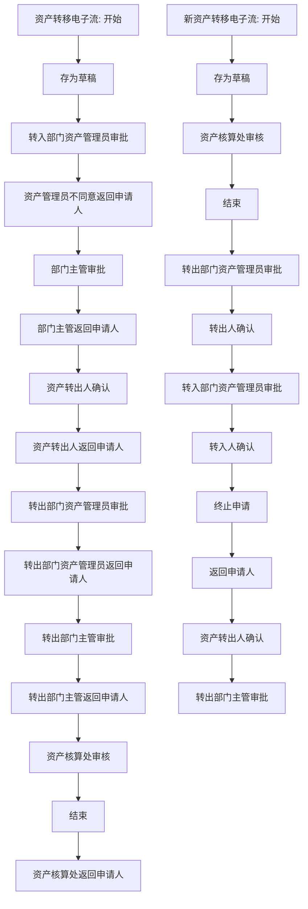

# 资产转移流程

来源：`/Users/feigao/Downloads/flow_complete_design.dxl`。

## 关注范围

资产转出、转入确认、双方部门资产管理员审批和资产核算处审核。

## 入口与表单

| 视图 | 选择公式 | 新建入口 |
| --- | --- | --- |
| 资产转移\按状态 | `SELECT (form="zczy"\|form="新资产转移电子流")&mark=""` | 新资产转移电子流 |
| 资产转移\按状态 | `SELECT (form="zczy"\|form="新资产转移电子流")&mark=""` | 新资产转移电子流 |
| 资产转移\归档\按转出部门编码 | `SELECT (form="zczy"\|form="新资产转移电子流")&mark="1"` | - |
| 资产转移\归档\按转出部门编码 | `SELECT (form="zczy"\|form="新资产转移电子流")&mark="1"` | - |
| 资产转移\归档\按申请人ID | `SELECT (form="zczy"\|form="新资产转移电子流")&mark="1"` | - |
| 资产转移\归档\按申请人ID | `SELECT (form="zczy"\|form="新资产转移电子流")&mark="1"` | - |
| 设置\资产核算处id（资产转移） | `SELECT form="zichanchu"` | - |
| 设置\资产核算处id（资产转移） | `SELECT form="zichanchu"` | - |
| 资产转移\归档\按转入部门编码 | `SELECT (form="zczy"\|form="新资产转移电子流")&mark="1"` | - |
| 资产转移\归档\按转入部门编码 | `SELECT (form="zczy"\|form="新资产转移电子流")&mark="1"` | - |
| 资产转移\按转入部门编码 | `SELECT (form="zczy"\|form="新资产转移电子流")&mark=""` | 新资产转移电子流 |
| 资产转移\按转入部门编码 | `SELECT (form="zczy"\|form="新资产转移电子流")&mark=""` | 新资产转移电子流 |

## 表单字段与按钮逻辑

### 资产转移电子流

- 默认 businessType：`ASSET_TRANSFER_LEGACY / ASSET_TRANSFER_NEW`
- 表单属性：`alias=zczy; nocompose=true; editonopen=true; designerversion=8.5.3; publicaccess=false`
- 字段/按钮/action 数：64 / 16 / 7
- 状态字段证据：`now_status` 相关状态摘要：存为草稿 / 转入部门资产管理员审批 / 资产管理员不同意返回申请人 / 部门主管审批 / 部门主管返回申请人 / 资产转出人确认 / 资产转出人返回申请人 / 转出部门资产管理员审批 / 转出部门资产管理员返回申请人 / 转出部门主管审批 / 转出部门主管返回申请人 / 资产核算处审核 / 结束 / 资产核算处返回申请人

#### 关键字段

| # | 字段名 | 类型 | kind | 属性摘要 | 默认/转换/校验/关键词摘要 |
| ---: | --- | --- | --- | --- | --- |
| 1 | `now_status` | `text` | `computed` | type=text; kind=computed; name=now_status | defaultvalue: @If(now_status="";"填写申请";now_status) |
| 2 | `shenqingid` | `names` | `computedwhencomposed` | type=names; kind=computedwhencomposed; name=shenqingid | defaultvalue: @UserName |
| 3 | `bianhao` | `text` | `computed` | type=text; kind=computed; name=bianhao | defaultvalue: bianhao |
| 4 | `rqi` | `datetime` | `computedwhencomposed` | type=datetime; kind=computedwhencomposed; name=rqi | defaultvalue: @Created |
| 5 | `bianhao1` | `text` | `computed` | type=text; kind=computed; name=bianhao1 | defaultvalue: bianhao1; entering: Sub Entering(Source As Field) Dim uidoc As notesuidocument Dim wks As New notesuiworkspace Dim doc As notesdocument Dim view As notesview Set uidoc=wks.currentdocument Set doc=uid… |
| 6 | `mingcheng1` | `text` | `computed` | type=text; kind=computed; name=mingcheng1 | defaultvalue: mingcheng1 |
| 7 | `xinghao1` | `text` | `editable` | type=text; kind=editable; name=xinghao1 | defaultvalue: xinghao1 |
| 8 | `wupin` | `text` | `computed` | type=text; kind=computed; name=wupin | defaultvalue: wupin |
| 9 | `zcrID` | `names` | `editable` | type=names; kind=editable; name=zcrID |  |
| 10 | `zrlID` | `names` | `computedwhencomposed` | type=names; kind=computedwhencomposed; name=zrlID | defaultvalue: @V3UserName |
| 11 | `zcbmbm` | `text` | `computed` | type=text; kind=computed; name=zcbmbm | defaultvalue: zcbmbm |
| 12 | `zcbm` | `text` | `computed` | type=text; kind=computed; name=zcbm | defaultvalue: zcbm |
| 13 | `zcren` | `text` | `computed` | type=text; kind=computed; name=zcren | defaultvalue: zcren |
| 14 | `zrbmbm` | `text` | `computedwhencomposed` | type=text; kind=computedwhencomposed; name=zrbmbm | defaultvalue: "" |
| 15 | `zrbm` | `text` | `computedwhencomposed` | type=text; kind=computedwhencomposed; name=zrbm | defaultvalue: "" |
| 16 | `zrren` | `text` | `editable` | type=text; kind=editable; name=zrren |  |
| 17 | `yuanyin` | `text` | `editable` | type=text; kind=editable; name=yuanyin |  |
| 18 | `zccpbianhao` | `text` | `computed` | type=text; kind=computed; name=zccpbianhao | defaultvalue: @If(zccpbianhao="";"";zccpbianhao); entering: Sub Entering(Source As Field) Dim uidoc As notesuidocument Dim wks As New notesuiworkspace Dim doc As notesdocument Dim view As notesview Set uidoc=wks.currentdocument Set doc=uid… |
| 19 | `hetonghao` | `text` | `computed` | type=text; kind=computed; name=hetonghao | defaultvalue: hetonghao |
| 20 | `mangerid` | `names` | `editable` | type=names; kind=editable; name=mangerid |  |
| 21 | `sign1` | `names` | `computed` | type=names; kind=computed; name=sign1 | defaultvalue: sign1 |
| 22 | `signtime1` | `datetime` | `computed` | type=datetime; kind=computed; name=signtime1 | defaultvalue: signtime1 |
| 23 | `yijian` | `text` | `editable` | type=text; kind=editable; name=yijian |  |
| 24 | `memo` | `text` | `editable` | type=text; kind=editable; name=memo |  |
| 25 | `zhuguanid` | `names` | `editable` | type=names; kind=editable; name=zhuguanid |  |
| 26 | `sign2` | `names` | `computed` | type=names; kind=computed; name=sign2 | defaultvalue: sign2 |
| 27 | `signtime2` | `datetime` | `computed` | type=datetime; kind=computed; name=signtime2 | defaultvalue: signtime2 |
| 28 | `yijian_1` | `text` | `editable` | type=text; kind=editable; name=yijian_1 |  |
| 29 | `memo1` | `text` | `editable` | type=text; kind=editable; name=memo1 |  |
| 30 | `zhuanchuid` | `names` | `computed` | type=names; kind=computed; name=zhuanchuid | defaultvalue: zcrID |
| ... | ... | ... | ... | ... | 共 64 个字段，完整字段见全量分析或 DXL |

#### 按钮/action 摘要

| 类型 | 文本/标题 | 摘要 |
| --- | --- | --- |
| action | Categori_ze |  |
| action | _Edit Document |  |
| action | Send Docu_ment |  |
| action | _Forward |  |
| action | _Move To Folder... |  |
| action | _Remove From Folder |  |
| action | 退出 | click: @Command([FileCloseWindow]) |
| button | (无显示文本/图标按钮) | 选择视图 资产编号; 查库 NumberView |
| button | (无显示文本/图标按钮) | 选择视图 部门编码查询; 查库 bmbm |
| button | (无显示文本/图标按钮) | 状态->存为草稿 |
| button | (无显示文本/图标按钮) | 状态->转入部门资产管理员审批; 校验/提示 请输入资产编号 / 请输入转出人ID / 请输入所缺配件 / 请输入转入人ID / 请输入转出部门; 含邮件/通知逻辑 |
| button | (无显示文本/图标按钮) | 状态->资产管理员不同意返回申请人; 校验/提示 请填写审批意见; 含邮件/通知逻辑 |
| button | (无显示文本/图标按钮) | 状态->部门主管审批; 校验/提示 请输入审批意见 / 请输入接收部门主管ID; 含邮件/通知逻辑 |
| button | (无显示文本/图标按钮) | 状态->部门主管返回申请人; 校验/提示 请填写审批意见; 含邮件/通知逻辑 |
| button | (无显示文本/图标按钮) | 状态->资产转出人确认; 校验/提示 请输入审批意见 / 请输入资产转出人ID; 含邮件/通知逻辑 |
| button | (无显示文本/图标按钮) | 状态->资产转出人返回申请人; 校验/提示 请填写确认意见; 含邮件/通知逻辑 |
| button | (无显示文本/图标按钮) | 状态->转出部门资产管理员审批; 校验/提示 请输入确认意见 / 请输入资产管理员ID; 含邮件/通知逻辑 |
| button | (无显示文本/图标按钮) | 状态->转出部门资产管理员返回申请人; 校验/提示 请填写审批意见; 含邮件/通知逻辑 |
| button | (无显示文本/图标按钮) | 状态->转出部门主管审批; 校验/提示 请输入审批意见 / 请输入转出部门主管ID / 请输入资产核算处ID; 含邮件/通知逻辑 |
| button | (无显示文本/图标按钮) | 状态->转出部门主管返回申请人; 校验/提示 请填写审批意见; 含邮件/通知逻辑 |
| button | (无显示文本/图标按钮) | 状态->资产核算处审核; 校验/提示 请输入审批意见; 含邮件/通知逻辑 |
| button | (无显示文本/图标按钮) | 状态->结束; 校验/提示 请填写审批意见; 含邮件/通知逻辑 |
| button | (无显示文本/图标按钮) | 状态->资产核算处返回申请人; 校验/提示 请填写意见; 含邮件/通知逻辑 |

推断主线：`存为草稿 -> 转入部门资产管理员审批 -> 资产管理员不同意返回申请人 -> 部门主管审批 -> 部门主管返回申请人 -> 资产转出人确认 -> 资产转出人返回申请人 -> 转出部门资产管理员审批 -> 转出部门资产管理员返回申请人 -> 转出部门主管审批 -> 转出部门主管返回申请人 -> 资产核算处审核 -> 结束 -> 资产核算处返回申请人`。

### 新资产转移电子流

- 默认 businessType：`ASSET_TRANSFER_LEGACY / ASSET_TRANSFER_NEW`
- 表单属性：`editonopen=true; designerversion=8.5.3; publicaccess=false`
- 字段/按钮/action 数：90 / 29 / 9
- 状态字段证据：`now_status` 相关状态摘要：存为草稿 / 资产核算处审核 / 结束 / 转出部门资产管理员审批 / 转出人确认 / 转入部门资产管理员审批 / 转入人确认 / 终止申请 / 返回申请人 / 资产转出人确认 / 转出部门主管审批

#### 关键字段

| # | 字段名 | 类型 | kind | 属性摘要 | 默认/转换/校验/关键词摘要 |
| ---: | --- | --- | --- | --- | --- |
| 1 | `DispTitle` | `text` | `computedfordisplay` | type=text; kind=computedfordisplay; name=DispTitle | defaultvalue: @If(@Subset(@DbName;1)="";"(本地打开 请勿审批! 否则签名时间、流水号等极易紊乱。)";@Contains(@Subset(@DbName;1);"ts");"(这是测试文档, 非参与测试可不予理会,多有打扰!)";"") |
| 2 | `now_status` | `text` | `computed` | type=text; kind=computed; name=now_status | defaultvalue: @If(now_status="";"填写申请";now_status) |
| 3 | `guanlichuid` | `text` | `computed` | type=text; kind=computed; name=guanlichuid | defaultvalue: guanlichuid |
| 4 | `current_processor` | `text` | `computedfordisplay` | type=text; kind=computedfordisplay; name=current_processor | defaultvalue: @Name([CN];Author) |
| 5 | `shenqingid` | `names` | `computedwhencomposed` | type=names; kind=computedwhencomposed; name=shenqingid | defaultvalue: @UserName |
| 6 | `bianhao` | `text` | `computed` | type=text; kind=computed; name=bianhao | defaultvalue: bianhao |
| 7 | `rqi` | `datetime` | `computedwhencomposed` | type=datetime; kind=computedwhencomposed; name=rqi | defaultvalue: @Created |
| 8 | `bianhao1` | `text` | `computed` | type=text; kind=computed; name=bianhao1; allowmultivalues=true | defaultvalue: bianhao1 |
| 9 | `mingcheng1` | `text` | `computed` | type=text; kind=computed; name=mingcheng1 | defaultvalue: mingcheng1 |
| 10 | `wupin` | `text` | `computed` | type=text; kind=computed; name=wupin | defaultvalue: wupin |
| 11 | `xinghao1` | `text` | `editable` | type=text; kind=editable; name=xinghao1 | defaultvalue: xinghao1 |
| 12 | `hetonghao` | `text` | `computed` | type=text; kind=computed; name=hetonghao | defaultvalue: hetonghao |
| 13 | `glgs` | `text` | `editable` | type=text; kind=editable; name=glgs | defaultvalue: @If(glgs="";"";glgs); entering: Sub Entering(Source As Field) Dim uidoc As notesuidocument Dim wks As New notesuiworkspace Dim doc As notesdocument Dim view As notesview Set uidoc=wks.currentdocument Set doc=uid… |
| 14 | `zcrID` | `names` | `editable` | type=names; kind=editable; name=zcrID; allowmultivalues=true |  |
| 15 | `zcbmbm` | `text` | `computed` | type=text; kind=computed; name=zcbmbm | defaultvalue: zcbmbm |
| 16 | `c_bt` | `text` | `computed` | type=text; kind=computed; name=c_bt; allowmultivalues=true | defaultvalue: c_bt |
| 17 | `zcren` | `text` | `editable` | type=text; kind=editable; name=zcren | defaultvalue: zcren |
| 18 | `zcbm` | `text` | `computed` | type=text; kind=computed; name=zcbm | defaultvalue: zcbm |
| 19 | `OutArea` | `text` | `computed` | type=text; kind=computed; name=OutArea | defaultvalue: OutArea |
| 20 | `zrlID` | `names` | `editable` | type=names; kind=editable; name=zrlID | Postopen: Sub Postopen(Source As Notesuidocument) End Sub; exiting: Sub Exiting(Source As Field) Dim wk As New NotesUIWorkspace Dim doc As NotesDocument Set doc = wk.CurrentDocument.Document If doc.applyer(0)="" Then Dim ss As New NotesSes… |
| 21 | `zrbmbm` | `text` | `editable` | type=text; kind=editable; name=zrbmbm | defaultvalue: ""; exiting: Sub Exiting(Source As Field) Dim wk As New NotesUIWorkspace Dim doc As NotesDocument Set doc = wk.CurrentDocument.Document If Left(doc.zrbmbm(0),4)="0409" Then Msgbox "您填写的资产转入部门为… |
| 22 | `c_bt_1` | `keyword` | `editable` | type=keyword; kind=editable; name=c_bt_1 | exiting: Sub Exiting(Source As Field) End Sub |
| 23 | `zrren` | `text` | `editable` | type=text; kind=editable; name=zrren |  |
| 24 | `zrbm` | `text` | `editable` | type=text; kind=editable; name=zrbm | defaultvalue: "" |
| 25 | `InArea` | `keyword` | `editable` | type=keyword; kind=editable; name=InArea | keywords: 0000其他 / 0001杭州 / 0002西安 / 0003桐乡 / 0004济南 / 0005天津 / 0006武汉 / 0007海外 / 0008深圳 |
| 26 | `yuanyin` | `text` | `editable` | type=text; kind=editable; name=yuanyin |  |
| 27 | `zylx` | `keyword` | `editable` | type=keyword; kind=editable; name=zylx | defaultvalue: "其他资产转移"; keywords: 其他资产转移 / 员工离职交接 / 员工换岗交接 |
| 28 | `Remark` | `text` | `editable` | type=text; kind=editable; name=Remark |  |
| 29 | `zccpbianhao` | `text` | `computed` | type=text; kind=computed; name=zccpbianhao | defaultvalue: @If(zccpbianhao="";"";zccpbianhao); entering: Sub Entering(Source As Field) Dim uidoc As notesuidocument Dim wks As New notesuiworkspace Dim doc As notesdocument Dim view As notesview Set uidoc=wks.currentdocument Set doc=uid… |
| 30 | `mangerid` | `names` | `editable` | type=names; kind=editable; name=mangerid | defaultvalue: mangerid |
| ... | ... | ... | ... | ... | 共 90 个字段，完整字段见全量分析或 DXL |

#### 按钮/action 摘要

| 类型 | 文本/标题 | 摘要 |
| --- | --- | --- |
| action | Categori_ze |  |
| action | _Edit Document |  |
| action | Send Docu_ment |  |
| action | _Forward |  |
| action | _Move To Folder... |  |
| action | _Remove From Folder |  |
| action | 退出 | click: @Command([FileCloseWindow]) |
| action | 折叠 | click: @Command( [SectionCollapseAll] ) |
| action | 展开 | click: @Command( [SectionExpandAll] ) |
| button | (无显示文本/图标按钮) | click: Sub Click(Source As Button) '外联数据库需要的变量 Dim db As NotesDatabase Dim ss As New NotesSession Dim view As NotesView Dim doc As NotesDocument '本地数据库文档操作需要的变量 Dim ws As New NotesUIWorkspace Dim session As New NotesSess |
| button | (无显示文本/图标按钮) | click: Sub Click(Source As Button) '外联数据库需要的变量 Dim db As NotesDatabase Dim ss As New NotesSession Dim view As NotesView Dim doc As NotesDocument '本地数据库文档操作需要的变量 Dim ws As New NotesUIWorkspace Dim session As New NotesSess |
| button | (无显示文本/图标按钮) | click: Sub Click(Source As Button) Call ImportNumber() End Sub |
| button | (无显示文本/图标按钮) | click: Sub Click(Source As Button) Dim db As NotesDatabase Dim ss As New NotesSession Dim view As NotesView Dim doc As NotesDocument Dim ws As New NotesUIWorkspace Dim session As New NotesSession Dim uidoc As NotesUIDocu |
| button | (无显示文本/图标按钮) | 状态->存为草稿 |
| button | (无显示文本/图标按钮) | 状态->资产核算处审核 / 结束 / 转出部门资产管理员审批 / 转出人确认 / 转入部门资产管理员审批 / 转入人确认; 校验/提示 请输入资产编号 / 请输入转出人ID / 请输入所缺配件 / 请输入转入人ID / 请选择转移类型; 含邮件/通知逻辑 |
| button | (无显示文本/图标按钮) | 校验/提示 1、必须以回车结束ID的填写; 2、有“海关监管合同号”的为监管资产，转移前请咨询部门监管资产管理人员是否可进行转移;3、可支持多项资产转移;4、转入人中文名与转入人ID必须为同一个人. |
| button | (无显示文本/图标按钮) | 状态->终止申请 |
| button | (无显示文本/图标按钮) | 状态->返回申请人; 校验/提示 请填写确认意见; 含邮件/通知逻辑 |
| button | (无显示文本/图标按钮) | 状态->资产核算处审核 / 结束 / 转出部门资产管理员审批 / 资产转出人确认 / 转入部门资产管理员审批; 校验/提示 请输入确认意见 / 请输入资产管理员ID / 请输入主管ID / 请输入转入部门资产管理员正确的ID格式 / 请输入转入部门主管正确的ID格式; 含邮件/通知逻辑 |
| button | (无显示文本/图标按钮) | 校验/提示 请认真核对资产编号，资产系统配置与实物配置的一致性，对有异议可与转出人咨询，对缺少配置、附属物品的，电子流“所缺配件”栏又未注明的，可拒绝接收，点击“返回申请人”按钮。 |
| button | (无显示文本/图标按钮) | 状态->返回申请人; 校验/提示 请填写审批意见; 含邮件/通知逻辑 |
| button | (无显示文本/图标按钮) | 状态->资产核算处审核 / 结束 / 转出部门资产管理员审批 / 资产转出人确认; 校验/提示 请输入审批意见; 含邮件/通知逻辑 |
| button | (无显示文本/图标按钮) | 校验/提示 1、若您不是一级部门资产管理员，请驳回跨一级部门转移； 2、核对“转入使用人”与“转入人ID”是否为同一个人， 3、部门主管填写是否正确； 4、以及其他信息的正确性。 |
| button | (无显示文本/图标按钮) | 状态->返回申请人; 校验/提示 请填写审批意见; 含邮件/通知逻辑 |
| button | (无显示文本/图标按钮) | 状态->资产核算处审核 / 转出部门主管审批 / 转出部门资产管理员审批 / 资产转出人确认; 校验/提示 请输入审批意见; 含邮件/通知逻辑 |
| button | (无显示文本/图标按钮) | 校验/提示 请对资产转移的真实性、合理性、必要性进行审核。 |
| button | (无显示文本/图标按钮) | 状态->返回申请人; 校验/提示 请填写确认意见; 含邮件/通知逻辑 |
| button | (无显示文本/图标按钮) | 状态->转出部门资产管理员审批 / 资产核算处审核 / 结束; 校验/提示 请输入确认意见 / 请输入资产管理员ID / 请输入主管ID / 请输入转入部门资产管理员正确的ID格式 / 请输入转入部门主管正确的ID格式; 含邮件/通知逻辑 |
| button | (无显示文本/图标按钮) | 校验/提示 1、请核对资产的编号是否正确; 2、前端所填写的“所缺配件”是否正确,若缺配件,您所确认的“所缺配件”最终审核通过后,产管理处将对您进行缺配件扣款;对填写不真实的,请驳回申请。 |
| button | (无显示文本/图标按钮) | 状态->返回申请人; 校验/提示 请填写审批意见; 含邮件/通知逻辑 |
| button | (无显示文本/图标按钮) | 状态->结束; 校验/提示 请输入审批意见; 含邮件/通知逻辑 |
| button | (无显示文本/图标按钮) | 校验/提示 1、是否跨一级部门转移，对跨一级部门转移，若您不是一级部门资产管理员，请驳回转移； 2、部门主管填写是否正确； 3、以及其他信息的正确性。 |
| button | (无显示文本/图标按钮) | 状态->返回申请人; 校验/提示 请填写审批意见; 含邮件/通知逻辑 |
| button | (无显示文本/图标按钮) | 状态->资产核算处审核; 校验/提示 请输入审批意见; 含邮件/通知逻辑 |
| button | (无显示文本/图标按钮) | 校验/提示 请对资产转移的真实性、合理性、必要性进行审核。 |
| button | (无显示文本/图标按钮) | 状态->结束; 校验/提示 请填写审批意见; 含邮件/通知逻辑 |
| button | (无显示文本/图标按钮) | 状态->返回申请人; 校验/提示 请填写意见; 含邮件/通知逻辑 |
| button | (无显示文本/图标按钮) | 校验/提示 1、转入方ID与中文名是否一致； 2、跨一级部门转移所填写的资产管理员ID是否正确； 3、判断是否计量仪器； 4、备注信息查看，若为配件转移，需驳回； 5、是否海关监管设备。 |

推断主线：`存为草稿 -> 资产核算处审核 -> 结束 -> 转出部门资产管理员审批 -> 转出人确认 -> 转入部门资产管理员审批 -> 转入人确认 -> 终止申请 -> 返回申请人 -> 资产转出人确认 -> 转出部门主管审批`。

## 流程图走向（推断）

## 字段明细

### 字段明细：资产转移电子流

| # | 字段名 | 类型 | kind | 属性摘要 | 默认/转换/校验/关键词摘要 |
| ---: | --- | --- | --- | --- | --- |
| 1 | `now_status` | `text` | `computed` | type=text; kind=computed; name=now_status | defaultvalue: @If(now_status="";"填写申请";now_status) |
| 2 | `shenqingid` | `names` | `computedwhencomposed` | type=names; kind=computedwhencomposed; name=shenqingid | defaultvalue: @UserName |
| 3 | `bianhao` | `text` | `computed` | type=text; kind=computed; name=bianhao | defaultvalue: bianhao |
| 4 | `rqi` | `datetime` | `computedwhencomposed` | type=datetime; kind=computedwhencomposed; name=rqi | defaultvalue: @Created |
| 5 | `bianhao1` | `text` | `computed` | type=text; kind=computed; name=bianhao1 | defaultvalue: bianhao1; entering: Sub Entering(Source As Field) Dim uidoc As notesuidocument Dim wks As New notesuiworkspace Dim doc As notesdocument Dim view As notesview Set uidoc=wks.currentdocument Set doc=uid… |
| 6 | `mingcheng1` | `text` | `computed` | type=text; kind=computed; name=mingcheng1 | defaultvalue: mingcheng1 |
| 7 | `xinghao1` | `text` | `editable` | type=text; kind=editable; name=xinghao1 | defaultvalue: xinghao1 |
| 8 | `wupin` | `text` | `computed` | type=text; kind=computed; name=wupin | defaultvalue: wupin |
| 9 | `zcrID` | `names` | `editable` | type=names; kind=editable; name=zcrID |  |
| 10 | `zrlID` | `names` | `computedwhencomposed` | type=names; kind=computedwhencomposed; name=zrlID | defaultvalue: @V3UserName |
| 11 | `zcbmbm` | `text` | `computed` | type=text; kind=computed; name=zcbmbm | defaultvalue: zcbmbm |
| 12 | `zcbm` | `text` | `computed` | type=text; kind=computed; name=zcbm | defaultvalue: zcbm |
| 13 | `zcren` | `text` | `computed` | type=text; kind=computed; name=zcren | defaultvalue: zcren |
| 14 | `zrbmbm` | `text` | `computedwhencomposed` | type=text; kind=computedwhencomposed; name=zrbmbm | defaultvalue: "" |
| 15 | `zrbm` | `text` | `computedwhencomposed` | type=text; kind=computedwhencomposed; name=zrbm | defaultvalue: "" |
| 16 | `zrren` | `text` | `editable` | type=text; kind=editable; name=zrren |  |
| 17 | `yuanyin` | `text` | `editable` | type=text; kind=editable; name=yuanyin |  |
| 18 | `zccpbianhao` | `text` | `computed` | type=text; kind=computed; name=zccpbianhao | defaultvalue: @If(zccpbianhao="";"";zccpbianhao); entering: Sub Entering(Source As Field) Dim uidoc As notesuidocument Dim wks As New notesuiworkspace Dim doc As notesdocument Dim view As notesview Set uidoc=wks.currentdocument Set doc=uid… |
| 19 | `hetonghao` | `text` | `computed` | type=text; kind=computed; name=hetonghao | defaultvalue: hetonghao |
| 20 | `mangerid` | `names` | `editable` | type=names; kind=editable; name=mangerid |  |
| 21 | `sign1` | `names` | `computed` | type=names; kind=computed; name=sign1 | defaultvalue: sign1 |
| 22 | `signtime1` | `datetime` | `computed` | type=datetime; kind=computed; name=signtime1 | defaultvalue: signtime1 |
| 23 | `yijian` | `text` | `editable` | type=text; kind=editable; name=yijian |  |
| 24 | `memo` | `text` | `editable` | type=text; kind=editable; name=memo |  |
| 25 | `zhuguanid` | `names` | `editable` | type=names; kind=editable; name=zhuguanid |  |
| 26 | `sign2` | `names` | `computed` | type=names; kind=computed; name=sign2 | defaultvalue: sign2 |
| 27 | `signtime2` | `datetime` | `computed` | type=datetime; kind=computed; name=signtime2 | defaultvalue: signtime2 |
| 28 | `yijian_1` | `text` | `editable` | type=text; kind=editable; name=yijian_1 |  |
| 29 | `memo1` | `text` | `editable` | type=text; kind=editable; name=memo1 |  |
| 30 | `zhuanchuid` | `names` | `computed` | type=names; kind=computed; name=zhuanchuid | defaultvalue: zcrID |
| 31 | `sign3` | `text` | `computed` | type=text; kind=computed; name=sign3 | defaultvalue: sign3 |
| 32 | `signtime3` | `datetime` | `computed` | type=datetime; kind=computed; name=signtime3 | defaultvalue: signtime3 |
| 33 | `querenyijian` | `text` | `editable` | type=text; kind=editable; name=querenyijian |  |
| 34 | `memo2` | `text` | `editable` | type=text; kind=editable; name=memo2 |  |
| 35 | `zcmangerid` | `names` | `editable` | type=names; kind=editable; name=zcmangerid |  |
| 36 | `sign4` | `names` | `computed` | type=names; kind=computed; name=sign4 | defaultvalue: sign4 |
| 37 | `signtime4` | `datetime` | `computed` | type=datetime; kind=computed; name=signtime4 | defaultvalue: signtime4 |
| 38 | `shenpiyijian` | `text` | `editable` | type=text; kind=editable; name=shenpiyijian |  |
| 39 | `memo3` | `text` | `editable` | type=text; kind=editable; name=memo3 |  |
| 40 | `bumenzhuguanid` | `names` | `editable` | type=names; kind=editable; name=bumenzhuguanid |  |
| 41 | `guanlichuid` | `text` | `computed` | type=text; kind=computed; name=guanlichuid | defaultvalue: guanlichuid |
| 42 | `aa` | `keyword` | `editable` | type=keyword; kind=editable; name=aa | defaultvalue: "否"; keywords: 否 / 是 |
| 43 | `jiliangyiqi` | `text` | `computed` | type=text; kind=computed; name=jiliangyiqi | defaultvalue: jiliangyiqi |
| 44 | `sign5` | `names` | `computed` | type=names; kind=computed; name=sign5 | defaultvalue: sign5 |
| 45 | `signtime5` | `datetime` | `computed` | type=datetime; kind=computed; name=signtime5 | defaultvalue: signtime5 |
| 46 | `yijian2` | `text` | `editable` | type=text; kind=editable; name=yijian2 |  |
| 47 | `memo4` | `text` | `editable` | type=text; kind=editable; name=memo4 |  |
| 48 | `sign6` | `names` | `computed` | type=names; kind=computed; name=sign6 | defaultvalue: sign6 |
| 49 | `signtime6` | `datetime` | `computed` | type=datetime; kind=computed; name=signtime6 | defaultvalue: signtime6 |
| 50 | `yijian3` | `text` | `editable` | type=text; kind=editable; name=yijian3 |  |
| 51 | `memo5` | `text` | `editable` | type=text; kind=editable; name=memo5 |  |
| 52 | `sign7` | `names` | `computed` | type=names; kind=computed; name=sign7 | defaultvalue: sign7 |
| 53 | `signtime7` | `datetime` | `computed` | type=datetime; kind=computed; name=signtime7 | defaultvalue: signtime7 |
| 54 | `author` | `authors` | `editable` | type=authors; kind=editable; name=author; allowmultivalues=true | defaultvalue: @UserName |
| 55 | `reader` | `names` | `editable` | type=names; kind=editable; name=reader; allowmultivalues=true | defaultvalue: @UserName |
| 56 | `mark` | `text` | `editable` | type=text; kind=editable; name=mark | defaultvalue: "" |
| 57 | `t1` | `text` | `editable` | type=text; kind=editable; name=t1 |  |
| 58 | `t2` | `number` | `editable` | type=number; kind=editable; name=t2 |  |
| 59 | `author_1` | `authors` | `editable` | type=authors; kind=editable; name=author_1; allowmultivalues=true | defaultvalue: "[管理员]" |
| 60 | `reader_1` | `names` | `editable` | type=names; kind=editable; name=reader_1; allowmultivalues=true | defaultvalue: "[管理员]":"[查询打印]":"[资产转移读]" |
| 61 | `server_name` | `text` | `computed` | type=text; kind=computed; name=server_name | defaultvalue: @If(server_name!="";server_name; @Subset(@DbColumn("":"Nocache"; "";"pzb";1);1)) |
| 62 | `data_name` | `text` | `computed` | type=text; kind=computed; name=data_name | defaultvalue: @If(data_name!="";data_name; @Subset(@DbColumn("":"Nocache"; "";"pzb";2);1)) |
| 63 | `server_name1` | `text` | `computed` | type=text; kind=computed; name=server_name1 | defaultvalue: @If(server_name1!="";server_name1; @Subset(@DbColumn("":"Nocache"; "";"bmpzb";1);1)) |
| 64 | `data_name1` | `text` | `computed` | type=text; kind=computed; name=data_name1 | defaultvalue: @If(data_name1!="";data_name1; @Subset(@DbColumn("":"Nocache"; "";"bmpzb";2);1)) |

### 字段明细：新资产转移电子流

| # | 字段名 | 类型 | kind | 属性摘要 | 默认/转换/校验/关键词摘要 |
| ---: | --- | --- | --- | --- | --- |
| 1 | `DispTitle` | `text` | `computedfordisplay` | type=text; kind=computedfordisplay; name=DispTitle | defaultvalue: @If(@Subset(@DbName;1)="";"(本地打开 请勿审批! 否则签名时间、流水号等极易紊乱。)";@Contains(@Subset(@DbName;1);"ts");"(这是测试文档, 非参与测试可不予理会,多有打扰!)";"") |
| 2 | `now_status` | `text` | `computed` | type=text; kind=computed; name=now_status | defaultvalue: @If(now_status="";"填写申请";now_status) |
| 3 | `guanlichuid` | `text` | `computed` | type=text; kind=computed; name=guanlichuid | defaultvalue: guanlichuid |
| 4 | `current_processor` | `text` | `computedfordisplay` | type=text; kind=computedfordisplay; name=current_processor | defaultvalue: @Name([CN];Author) |
| 5 | `shenqingid` | `names` | `computedwhencomposed` | type=names; kind=computedwhencomposed; name=shenqingid | defaultvalue: @UserName |
| 6 | `bianhao` | `text` | `computed` | type=text; kind=computed; name=bianhao | defaultvalue: bianhao |
| 7 | `rqi` | `datetime` | `computedwhencomposed` | type=datetime; kind=computedwhencomposed; name=rqi | defaultvalue: @Created |
| 8 | `bianhao1` | `text` | `computed` | type=text; kind=computed; name=bianhao1; allowmultivalues=true | defaultvalue: bianhao1 |
| 9 | `mingcheng1` | `text` | `computed` | type=text; kind=computed; name=mingcheng1 | defaultvalue: mingcheng1 |
| 10 | `wupin` | `text` | `computed` | type=text; kind=computed; name=wupin | defaultvalue: wupin |
| 11 | `xinghao1` | `text` | `editable` | type=text; kind=editable; name=xinghao1 | defaultvalue: xinghao1 |
| 12 | `hetonghao` | `text` | `computed` | type=text; kind=computed; name=hetonghao | defaultvalue: hetonghao |
| 13 | `glgs` | `text` | `editable` | type=text; kind=editable; name=glgs | defaultvalue: @If(glgs="";"";glgs); entering: Sub Entering(Source As Field) Dim uidoc As notesuidocument Dim wks As New notesuiworkspace Dim doc As notesdocument Dim view As notesview Set uidoc=wks.currentdocument Set doc=uid… |
| 14 | `zcrID` | `names` | `editable` | type=names; kind=editable; name=zcrID; allowmultivalues=true |  |
| 15 | `zcbmbm` | `text` | `computed` | type=text; kind=computed; name=zcbmbm | defaultvalue: zcbmbm |
| 16 | `c_bt` | `text` | `computed` | type=text; kind=computed; name=c_bt; allowmultivalues=true | defaultvalue: c_bt |
| 17 | `zcren` | `text` | `editable` | type=text; kind=editable; name=zcren | defaultvalue: zcren |
| 18 | `zcbm` | `text` | `computed` | type=text; kind=computed; name=zcbm | defaultvalue: zcbm |
| 19 | `OutArea` | `text` | `computed` | type=text; kind=computed; name=OutArea | defaultvalue: OutArea |
| 20 | `zrlID` | `names` | `editable` | type=names; kind=editable; name=zrlID | Postopen: Sub Postopen(Source As Notesuidocument) End Sub; exiting: Sub Exiting(Source As Field) Dim wk As New NotesUIWorkspace Dim doc As NotesDocument Set doc = wk.CurrentDocument.Document If doc.applyer(0)="" Then Dim ss As New NotesSes… |
| 21 | `zrbmbm` | `text` | `editable` | type=text; kind=editable; name=zrbmbm | defaultvalue: ""; exiting: Sub Exiting(Source As Field) Dim wk As New NotesUIWorkspace Dim doc As NotesDocument Set doc = wk.CurrentDocument.Document If Left(doc.zrbmbm(0),4)="0409" Then Msgbox "您填写的资产转入部门为… |
| 22 | `c_bt_1` | `keyword` | `editable` | type=keyword; kind=editable; name=c_bt_1 | exiting: Sub Exiting(Source As Field) End Sub |
| 23 | `zrren` | `text` | `editable` | type=text; kind=editable; name=zrren |  |
| 24 | `zrbm` | `text` | `editable` | type=text; kind=editable; name=zrbm | defaultvalue: "" |
| 25 | `InArea` | `keyword` | `editable` | type=keyword; kind=editable; name=InArea | keywords: 0000其他 / 0001杭州 / 0002西安 / 0003桐乡 / 0004济南 / 0005天津 / 0006武汉 / 0007海外 / 0008深圳 |
| 26 | `yuanyin` | `text` | `editable` | type=text; kind=editable; name=yuanyin |  |
| 27 | `zylx` | `keyword` | `editable` | type=keyword; kind=editable; name=zylx | defaultvalue: "其他资产转移"; keywords: 其他资产转移 / 员工离职交接 / 员工换岗交接 |
| 28 | `Remark` | `text` | `editable` | type=text; kind=editable; name=Remark |  |
| 29 | `zccpbianhao` | `text` | `computed` | type=text; kind=computed; name=zccpbianhao | defaultvalue: @If(zccpbianhao="";"";zccpbianhao); entering: Sub Entering(Source As Field) Dim uidoc As notesuidocument Dim wks As New notesuiworkspace Dim doc As notesdocument Dim view As notesview Set uidoc=wks.currentdocument Set doc=uid… |
| 30 | `mangerid` | `names` | `editable` | type=names; kind=editable; name=mangerid | defaultvalue: mangerid |
| 31 | `mangerid1` | `names` | `editable` | type=names; kind=editable; name=mangerid1 | defaultvalue: mangerid1 |
| 32 | `rmangerid` | `names` | `editable` | type=names; kind=editable; name=rmangerid | exiting: Sub Exiting(Source As Field) Dim uidoc As notesuidocument Dim doc,doc1 As notesdocument Dim wks As New notesuiworkspace Dim s As New notessession Dim db As notesdatabase Set db=s.… |
| 33 | `cmangerid` | `names` | `editable` | type=names; kind=editable; name=cmangerid | exiting: Sub Exiting(Source As Field) Dim uidoc As notesuidocument Dim doc,doc1 As notesdocument Dim wks As New notesuiworkspace Dim s As New notessession Dim db As notesdatabase Set db=s.… |
| 34 | `sign1` | `names` | `computed` | type=names; kind=computed; name=sign1 | defaultvalue: sign1 |
| 35 | `signtime1` | `datetime` | `computed` | type=datetime; kind=computed; name=signtime1 | defaultvalue: signtime1 |
| 36 | `querenyijian_1` | `text` | `editable` | type=text; kind=editable; name=querenyijian_1 |  |
| 37 | `memo2_1` | `text` | `editable` | type=text; kind=editable; name=memo2_1 |  |
| 38 | `mangerid_1` | `names` | `editable` | type=names; kind=editable; name=mangerid_1 |  |
| 39 | `rmangerid_1` | `names` | `editable` | type=names; kind=editable; name=rmangerid_1 |  |
| 40 | `sign4_1` | `names` | `computed` | type=names; kind=computed; name=sign4_1 | defaultvalue: sign4_1 |
| 41 | `signtime4_1` | `datetime` | `computed` | type=datetime; kind=computed; name=signtime4_1 | defaultvalue: signtime4_1 |
| 42 | `yijian` | `text` | `editable` | type=text; kind=editable; name=yijian |  |
| 43 | `memo` | `text` | `editable` | type=text; kind=editable; name=memo |  |
| 44 | `sign2` | `names` | `computed` | type=names; kind=computed; name=sign2 | defaultvalue: sign2 |
| 45 | `signtime2` | `datetime` | `computed` | type=datetime; kind=computed; name=signtime2 | defaultvalue: signtime2 |
| 46 | `yijian_1` | `text` | `editable` | type=text; kind=editable; name=yijian_1 |  |
| 47 | `memo1` | `text` | `editable` | type=text; kind=editable; name=memo1 |  |
| 48 | `sign3` | `text` | `computed` | type=text; kind=computed; name=sign3 | defaultvalue: sign3 |
| 49 | `signtime3` | `datetime` | `computed` | type=datetime; kind=computed; name=signtime3 | defaultvalue: signtime3 |
| 50 | `querenyijian` | `text` | `editable` | type=text; kind=editable; name=querenyijian |  |
| 51 | `memo2` | `text` | `editable` | type=text; kind=editable; name=memo2 |  |
| 52 | `mangerid1_1` | `names` | `editable` | type=names; kind=editable; name=mangerid1_1 |  |
| 53 | `cmangerid_1` | `names` | `editable` | type=names; kind=editable; name=cmangerid_1 |  |
| 54 | `sign4` | `names` | `computed` | type=names; kind=computed; name=sign4 | defaultvalue: sign4 |
| 55 | `signtime4` | `datetime` | `computed` | type=datetime; kind=computed; name=signtime4 | defaultvalue: signtime4 |
| 56 | `shenpiyijian` | `text` | `editable` | type=text; kind=editable; name=shenpiyijian |  |
| 57 | `memo3` | `text` | `editable` | type=text; kind=editable; name=memo3 |  |
| 58 | `sign5` | `names` | `computed` | type=names; kind=computed; name=sign5 | defaultvalue: sign5 |
| 59 | `signtime5` | `datetime` | `computed` | type=datetime; kind=computed; name=signtime5 | defaultvalue: signtime5 |
| 60 | `yijian2` | `text` | `editable` | type=text; kind=editable; name=yijian2 |  |
| 61 | `memo4` | `text` | `editable` | type=text; kind=editable; name=memo4 |  |
| 62 | `sign6` | `names` | `computed` | type=names; kind=computed; name=sign6 | defaultvalue: sign6 |
| 63 | `signtime6` | `datetime` | `computed` | type=datetime; kind=computed; name=signtime6 | defaultvalue: signtime6 |
| 64 | `yijian3` | `text` | `editable` | type=text; kind=editable; name=yijian3 |  |
| 65 | `memo5` | `text` | `editable` | type=text; kind=editable; name=memo5 |  |
| 66 | `aa` | `keyword` | `editable` | type=keyword; kind=editable; name=aa | defaultvalue: "否"; keywords: 否 / 是 |
| 67 | `jiliangyiqi` | `text` | `computed` | type=text; kind=computed; name=jiliangyiqi | defaultvalue: jiliangyiqi |
| 68 | `sign7` | `names` | `computed` | type=names; kind=computed; name=sign7 | defaultvalue: sign7 |
| 69 | `signtime7` | `datetime` | `computed` | type=datetime; kind=computed; name=signtime7 | defaultvalue: signtime7 |
| 70 | `author` | `authors` | `editable` | type=authors; kind=editable; name=author; allowmultivalues=true | defaultvalue: @UserName |
| 71 | `reader` | `names` | `editable` | type=names; kind=editable; name=reader; allowmultivalues=true | defaultvalue: @UserName |
| 72 | `mark` | `text` | `editable` | type=text; kind=editable; name=mark | defaultvalue: "" |
| 73 | `t1` | `text` | `editable` | type=text; kind=editable; name=t1 |  |
| 74 | `t2` | `number` | `editable` | type=number; kind=editable; name=t2 |  |
| 75 | `author_1` | `authors` | `editable` | type=authors; kind=editable; name=author_1; allowmultivalues=true | defaultvalue: "[管理员]" |
| 76 | `reader_1` | `names` | `editable` | type=names; kind=editable; name=reader_1; allowmultivalues=true | defaultvalue: "[管理员]":"[查询打印]":"[资产转移读]" |
| 77 | `finish` | `datetime` | `editable` | type=datetime; kind=editable; name=finish |  |
| 78 | `finisher` | `names` | `editable` | type=names; kind=editable; name=finisher |  |
| 79 | `server_name` | `text` | `computed` | type=text; kind=computed; name=server_name | defaultvalue: @If(server_name!="";server_name; @Subset(@DbColumn("":"Nocache"; "";"pzb";1);1)) |
| 80 | `data_name` | `text` | `computed` | type=text; kind=computed; name=data_name | defaultvalue: @If(data_name!="";data_name; @Subset(@DbColumn("":"Nocache"; "";"pzb";2);1)) |
| 81 | `server_name1` | `text` | `computed` | type=text; kind=computed; name=server_name1 | defaultvalue: @If(server_name1!="";server_name1; @Subset(@DbColumn("":"Nocache"; "";"bmpzb";1);1)) |
| 82 | `data_name1` | `text` | `computed` | type=text; kind=computed; name=data_name1 | defaultvalue: @If(data_name1!="";data_name1; @Subset(@DbColumn("":"Nocache"; "";"bmpzb";2);1)) |
| 83 | `m1` | `text` | `editable` | type=text; kind=editable; name=m1 |  |
| 84 | `m2` | `text` | `editable` | type=text; kind=editable; name=m2 |  |
| 85 | `m3` | `text` | `editable` | type=text; kind=editable; name=m3 |  |
| 86 | `m4` | `text` | `editable` | type=text; kind=editable; name=m4 |  |
| 87 | `m5` | `text` | `editable` | type=text; kind=editable; name=m5 |  |
| 88 | `m6` | `text` | `editable` | type=text; kind=editable; name=m6 |  |
| 89 | `m7` | `text` | `editable` | type=text; kind=editable; name=m7 |  |
| 90 | `m8` | `text` | `editable` | type=text; kind=editable; name=m8 |  |

## 证据边界

- 可直接确认：表单、字段、字段事件、按钮/action、视图选择公式、代理节点、状态字段取值。
- 需要推断：按钮状态赋值组合成的主干流程、`mark` 与归档含义、`current_processor` 与处理人展示关系。
- 不能仅凭 DXL 完全确认：Notes ACL、运行期角色、外部 NSF 查询结果、客户端打印效果、所有隐藏条件与字段的一一映射。
- 本文为从 DXL 恢复生成的分析文档；如需生产发布，还需按缺口分析补齐业务类型、角色、字段映射和条件决策表。
