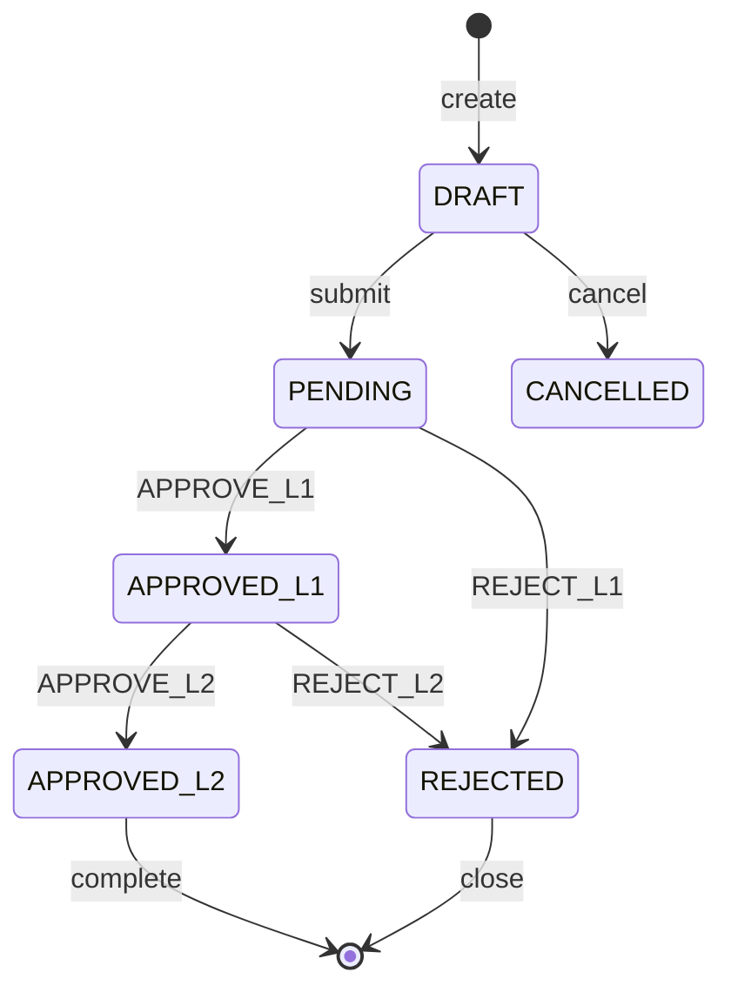

# 工单审批流程引擎 - 规格指导文档

**文档编号**: SPEC-001  
**版本**: v1.0  
**迭代**: Iteration 1  
**日期**: 2025年  
**状态**: 草稿

---

## 1. 需求与背景

### 1.1 业务场景

企业内部存在大量需要多级审批的工作流程（如采购申请、费用报销、项目立项、合同审批等），传统通过邮件或纸质传递的方式存在以下痛点：

| 痛点 | 现状描述 | 影响 |
|------|----------|------|
| 流程不可见 | 申请人无法实时知晓审批进度 | 信息不对称，沟通成本高 |
| 审批随意性 | 缺乏标准化流转规则，审批人可跳过步骤 | 风险管控失效 |
| 责任不清 | 审批记录散落于邮件，无统一归档 | 合规审计困难 |
| 效率低下 | 跨部门审批需人工逐级传递 | 流程周期长 |

### 1.2 核心价值

```
┌─────────────────────────────────────────────────────────────────────┐
│                         工单审批流程引擎                              │
├─────────────────────────────────────────────────────────────────────┤
│                                                                         │
│   状态机驱动        │  引擎内核管理状态转换，规则外操作自动拦截         │
│   ─────────────────┼─────────────────────────────────────────────    │
│                                                                         │
│   多级审批链        │  支持并行/串行审批，支持条件分支                  │
│   ─────────────────┼─────────────────────────────────────────────    │
│                                                                         │
│   实时通知          │  审批状态变更即时推送，支持邮件/WebSocket          │
│   ─────────────────┼─────────────────────────────────────────────    │
│                                                                         │
│   完整审计          │  所有操作留痕，支持追溯与合规审查                 │
│                                                                         │
└─────────────────────────────────────────────────────────────────────┘
```

### 1.3 技术选型依据

| 层级 | 技术选型 | 选型理由 |
|------|----------|----------|
| 后端框架 | Python/FastAPI | 异步原生支持，状态机集成友好，类型安全 |
| 状态机引擎 | XState / 自定义状态机 | 业界成熟方案，支持状态图可视化与复杂条件分支 |
| 数据库 | PostgreSQL | 支持 JSONB（灵活存储流程配置）、事务完整性 |
| 消息队列 | Redis Pub/Sub | 轻量级通知分发，支持 WebSocket 实时推送 |
| 前端框架 | React/TypeScript | 类型安全，组件化架构 |
| 测试框架 | pytest + Playwright | pytest 覆盖后端单元/集成测试，Playwright 覆盖 E2E |

---

## 2. 当前 Phase 对应实施目标

> **Phase 定义原则**: 每个 Phase 交付一个端到端可运行的功能闭环，后续 Phase 在其基础上叠加能力。

### 2.1 Phase 1: 核心链路交付

**范围定义**: 覆盖工单从创建到最终审批完成的全路径，但限制为**单工单类型、串行审批链、无条件分支**。

```
Phase 1 交付物边界
═══════════════════════════════════════════════════════════════════════

  ┌────────┐    ┌─────────┐    ┌──────────┐    ┌──────────┐
  │ 创建   │───▶│ 待审批  │───▶│ 审批中   │───▶│ 已完成  │
  │ 工单   │    │ (一级)  │    │ (二级)   │    │          │
  └────────┘    └─────────┘    └──────────┘    └──────────┘
                      │               │
                      ▼               ▼
               ┌───────────┐   ┌───────────┐
               │  审批拒绝  │   │  审批拒绝  │
               └───────────┘   └───────────┘

  通知触发点: [工单创建] [一级审批完成] [二级审批完成/拒绝]
```

### 2.2 Phase 2 预留能力（Iteration 2+）

- 动态审批链配置（可视化流程设计器）
- 条件分支与并行审批
- 催办与超时自动处理
- 移动端适配
- 第三方集成（钉钉/飞书/企微）

### 2.3 Phase 1 功能清单

| 功能 ID | 功能名称 | 优先级 | 描述 |
|---------|----------|--------|------|
| F-001 | 工单创建 | P0 | 用户填写表单提交工单，生成唯一工单号 |
| F-002 | 状态机流转 | P0 | 核心引擎根据审批动作驱动状态转换 |
| F-003 | 一级审批 | P0 | 组长/主管级别审批，可同意或拒绝 |
| F-004 | 二级审批 | P0 | 经理级别审批，可同意或拒绝 |
| F-005 | 审批历史 | P0 | 记录每步审批人、意见、时间戳 |
| F-006 | 消息通知 | P0 | 邮件通知关键状态变更 |
| F-007 | 工单查询 | P1 | 按状态/创建人/时间范围筛选 |

---

## 3. 边界约束

### 3.1 功能边界

| 约束类型 | 约束内容 | 违反处理 |
|----------|----------|----------|
| 审批链固定 | 仅支持预定义的串行二级审批，不支持动态配置 | 配置层校验拦截，返回 400 错误 |
| 单工单类型 | 仅支持"通用审批"类型，不支持多业务工单模板 | 类型枚举硬编码 |
| 同步审批 | 不支持会签（多人同时审批同一节点），仅串行 | 审批锁机制确保独占 |
| 状态不可逆 | 审批通过后不可撤回，拒绝后可重新发起（新建工单） | 状态机规则硬编码 |
| 操作超时 | 不实现超时自动审批/转交，Iteration 2 处理 | 接口设计预留扩展字段 |

### 3.2 非功能性约束

| 约束项 | 阈值 | 说明 |
|--------|------|------|
| API 响应时间 | P99 < 200ms | 单次状态转换操作 |
| 并发审批能力 | 100 QPS | 同一工单串行保证，最终用户无感知 |
| 消息通知延迟 | < 5s | 从状态变更到通知送达 |
| 数据持久化 | RPO = 0 | 状态变更即提交事务 |

### 3.3 禁止事项

```
┌─────────────────────────────────────────────────────────────────────┐
│  Phase 1 禁止实现清单                                                  │
├─────────────────────────────────────────────────────────────────────┤
│  ✗ 审批委托/转交功能                                                    │
│  ✗ 审批意见附件上传                                                    │
│  ✗ 工单催办/加急                                                       │
│  ✗ 批量审批操作                                                       │
│  ✗ 移动端原生 App                                                     │
│  ✗ 第三方集成（钉钉/飞书/企微）                                        │
│  ✗ 多语言国际化                                                       │
└─────────────────────────────────────────────────────────────────────┘
```

---

## 4. 验收测试基准 (ATB)

### 4.1 测试环境要求

```yaml
测试环境配置:
  数据库: PostgreSQL 15 (容器化)
  消息队列: Redis 7 (容器化)
  Python版本: 3.11+
  Node.js版本: 18+
  依赖管理: poetry (后端) / pnpm (前端)
  测试隔离: 每个测试使用独立的数据库事务回滚
```

### 4.2 ATB-001: 工单创建

| 测试编号 | 测试描述 | 输入 | 预期输出 | 物理测试方法 |
|----------|----------|------|----------|--------------|
| T-001-01 | 正常创建工单 | 完整表单数据 | 工单号生成，状态为 PENDING | `pytest tests/api/test_workorder.py::test_create_workorder_success` |
| T-001-02 | 缺少必填字段 | 空标题 | 422 错误，提示缺失字段 | `pytest tests/api/test_workorder.py::test_create_workorder_missing_field` |
| T-001-03 | 工单号唯一性 | 同一数据重复提交 | 两个不同工单号，状态均为 PENDING | `pytest tests/api/test_workorder.py::test_workorder_idempotency` |
| T-001-04 | 创建后触发通知 | 有效工单 | 消息队列中存在创建通知消息 | `pytest tests/api/test_workorder.py::test_creation_notification_published` |

### 4.3 ATB-002: 状态机流转

| 测试编号 | 测试描述 | 前置状态 | 操作 | 预期输出 | 物理测试方法 |
|----------|----------|----------|------|----------|--------------|
| T-002-01 | 有效状态转换 | PENDING | 一级审批通过 | 状态变为 APPROVED_L1 | `pytest tests/state_machine/test_transitions.py::test_l1_approval_transition` |
| T-002-02 | 无效状态转换 | PENDING | 二级审批通过 | 403 错误，状态保持 PENDING | `pytest tests/state_machine/test_transitions.py::test_invalid_transition_blocked` |
| T-002-03 | 拒绝后终止 | APPROVED_L1 | 一级拒绝 | 状态变为 REJECTED，流程终止 | `pytest tests/state_machine/test_transitions.py::test_rejection_terminates` |
| T-002-04 | 完整审批链路 | PENDING | 一级通过 → 二级通过 | 状态变为 COMPLETED | `pytest tests/state_machine/test_full_approval_chain` |

### 4.4 ATB-003: 审批操作

| 测试编号 | 测试描述 | 物理测试方法 |
|----------|----------|--------------|
| T-003-01 | 一级审批人鉴权 | `pytest tests/api/test_approval.py::test_l1_approver_authorization` |
| T-003-02 | 审批意见记录 | `pytest tests/api/test_approval.py::test_approval_comment_saved` |
| T-003-03 | 重复审批拦截 | `pytest tests/api/test_approval.py::test_duplicate_approval_rejected` |
| T-003-04 | 审批后通知分发 | `pytest tests/api/test_approval.py::test_approval_notification_flow` |

### 4.5 ATB-004: 审批历史

| 测试编号 | 测试描述 | 物理测试方法 |
|----------|----------|--------------|
| T-004-01 | 历史记录完整性 | `pytest tests/api/test_history.py::test_history_completeness` |
| T-004-02 | 时间戳顺序 | `pytest tests/api/test_history.py::test_history_chronological_order` |
| T-004-03 | 拒绝记录包含原因 | `pytest tests/api/test_history.py::test_rejection_includes_reason` |

### 4.6 ATB-005: 消息通知

| 测试编号 | 测试描述 | 验证方式 |
|----------|----------|----------|
| T-005-01 | 工单创建通知 | Mock SMTP，验证邮件发送参数 |
| T-005-02 | 审批完成通知 | Mock SMTP，验证收件人为创建人 |
| T-005-03 | 拒绝通知 | Mock SMTP，验证邮件内容包含拒绝原因 |
| T-005-04 | WebSocket 实时推送 | Playwright E2E 测试，监控前端事件 |

### 4.7 ATB-006: E2E 完整流程

```
┌─────────────────────────────────────────────────────────────────────┐
│  Playwright E2E 测试用例: complete_approval_flow.spec.ts             │
├─────────────────────────────────────────────────────────────────────┤
│  Step 1: 用户登录系统                                                │
│  Step 2: 创建新工单，填写标题"测试工单001"                              │
│  Step 3: 验证工单状态为"待一级审批"                                     │
│  Step 4: 切换一级审批人账号，进行审批操作                                │
│  Step 5: 验证状态变为"待二级审批"                                       │
│  Step 6: 切换二级审批人账号，进行审批操作                                │
│  Step 7: 验证状态变为"已完成"                                           │
│  Step 8: 验证创建人收到完成通知邮件                                      │
│  Step 9: 验证审批历史页面显示完整记录                                    │
└─────────────────────────────────────────────────────────────────────┘

执行命令: npx playwright test tests/e2e/complete_approval_flow.spec.ts
```

---

## 5. 开发切入层级序列

### 5.1 分层架构概览

```
┌─────────────────────────────────────────────────────────────────────┐
│                    接入层 (API Layer)                                 │
│  FastAPI Routes → Request Validation (Pydantic)                     │
├─────────────────────────────────────────────────────────────────────┤
│                    领域层 (Domain Layer)                             │
│  State Machine Engine → Approval Service → Workorder Service        │
├─────────────────────────────────────────────────────────────────────┤
│                    基础设施层 (Infrastructure Layer)                 │
│  Repository (SQLAlchemy) → Message Publisher (Redis)                │
├─────────────────────────────────────────────────────────────────────┤
│                    持久层 (Persistence Layer)                        │
│  PostgreSQL Tables → Migration (Alembic)                            │
└─────────────────────────────────────────────────────────────────────┘
```

### 5.2 后端开发序列

```
Phase 1 后端开发序列
═══════════════════════════════════════════════════════════════════════

[Week 1] 数据库层
  │
  ├── 1.1 设计并创建数据库表
  │       ├── workorders (工单主表)
  │       ├── approval_history (审批历史表)
  │       └── users (用户表，含角色)
  │
  ├── 1.2 Alembic 迁移脚本编写
  │
  └── 1.3 基础 Repository 层实现

[Week 2] 领域层核心
  │
  ├── 2.1 状态机定义与实现
  │       ├── 状态定义 (PENDING, APPROVED_L1, APPROVED_L2, REJECTED)
  │       ├── 事件定义 (APPROVE_L1, APPROVE_L2, REJECT)
  │       └── 转换规则实现
  │
  └── 2.2 Workorder Domain Service
          ├── create_workorder()
          └── query_workorder()

[Week 3] 领域层服务 + 基础设施
  │
  ├── 3.1 Approval Service
  │       ├── submit_approval()
  │       ├── validate_approver_role()
  │       └── emit_notification()
  │
  ├── 3.2 Redis 消息发布实现
  │
  └── 3.3 SMTP 邮件通知实现 (Mock)

[Week 4] API 层与集成
  │
  ├── 4.1 FastAPI Routes
  │       ├── POST /workorders
  │       ├── GET /workorders/{id}
  │       ├── POST /workorders/{id}/approve
  │       └── GET /workorders/{id}/history
  │
  ├── 4.2 WebSocket 实时通知端点
  │
  └── 4.3 单元测试 + 集成测试补全

[Week 5] E2E 与验收
  │
  ├── 5.1 Playwright E2E 测试编写
  │
  ├── 5.2 ATB 全量执行
  │
  └── 5.3 性能基准测试 (可选)
```

### 5.3 前端开发序列

```
Phase 1 前端开发序列
═══════════════════════════════════════════════════════════════════════

[Week 1-2] 类型定义与 API 层
  │
  ├── 1.1 types/approval.ts 类型扩展
  │
  ├── 1.2 api/workorders.ts API 客户端
  │
  └── 1.3 基础 Hooks (useWorkorder, useApproval)

[Week 3] 核心组件开发
  │
  ├── 2.1 WorkOrderForm 组件
  │
  ├── 2.2 ApprovalPanel 组件
  │
  └── 2.3 HistoryTimeline 组件

[Week 4] 审批仪表盘
  │
  ├── 3.1 AuditDashboard 页面布局
  │
  ├── 3.2 FilterBar 筛选组件
  │
  ├── 3.3 AuditTable 表格组件
  │
  └── 3.4 ActionTypePie 图表组件

[Week 5] 集成与验收
  │
  ├── 4.1 WebSocket 实时更新集成
  │
  ├── 4.2 E2E 测试补全
  │
  └── 4.3 视觉回归测试
```

### 5.4 关键里程碑检查点

| 检查点 | 交付物 | 通过标准 |
|--------|--------|----------|
| CP-1 (Week 2) | 状态机可独立运行 | 单元测试覆盖所有状态转换，覆盖率 > 90% |
| CP-2 (Week 3) | 领域服务完成 | Repository Mock 测试通过，服务层无数据库依赖 |
| CP-3 (Week 4) | API 可调用 | Swagger 文档生成，所有接口 200/400/403 响应正确 |
| CP-4 (Week 5) | 端到端贯通 | Playwright E2E 测试 100% 通过 |

### 5.5 技术债务预留

| 编号 | 预留项 | 理由 |
|------|--------|------|
| R-001 | ApprovalService.委托授权() 方法签名 | Phase 2 实现委托时无需修改接口 |
| R-002 | Workorder.type 字段 | Phase 2 扩展工单类型时增加枚举值 |
| R-003 | StateMachineConfig 外部化 | Phase 2 从数据库加载流程配置 |

---

## 6. API 接口规格

### 6.1 工单接口

| 方法 | 路径 | 描述 |
|------|------|------|
| POST | /api/v1/workorders | 创建工单 |
| GET | /api/v1/workorders | 查询工单列表 |
| GET | /api/v1/workorders/{id} | 获取工单详情 |
| POST | /api/v1/workorders/{id}/approve | 审批操作 |
| POST | /api/v1/workorders/{id}/reject | 拒绝操作 |
| GET | /api/v1/workorders/{id}/history | 获取审批历史 |

### 6.2 请求/响应示例

```typescript
// POST /api/v1/workorders - 创建工单
interface CreateWorkOrderRequest {
  title: string;           // 工单标题，必填
  description: string;     // 工单描述，必填
  priority: 'low' | 'medium' | 'high';  // 优先级
  category: string;        // 工单类别
  attachments?: string[];  // 附件URL列表
}

interface CreateWorkOrderResponse {
  id: string;              // 工单ID
  serial_number: string;   // 工单编号 WO-2025-XXXXX
  status: WorkOrderStatus; // 当前状态
  created_at: string;      // 创建时间 ISO8601
}
```

---

## 7. 数据模型

### 7.1 ER 图

```
┌──────────────────┐       ┌──────────────────────┐
│      users       │       │     workorders       │
├──────────────────┤       ├──────────────────────┤
│ id (PK)          │       │ id (PK)              │
│ username         │       │ serial_number        │
│ email            │◀──────│ creator_id (FK)      │
│ role             │       │ title                │
│ department       │       │ description          │
│ created_at       │       │ status               │
└──────────────────┘       │ priority             │
                           │ category             │
                           │ created_at           │
                           │ updated_at           │
                           └──────────┬───────────┘
                                      │
                           ┌──────────▼───────────┐
                           │   approval_history   │
                           ├──────────────────────┤
                           │ id (PK)              │
                           │ workorder_id (FK)   │
                           │ approver_id (FK)     │
                           │ action               │
                           │ comment              │
                           │ created_at           │
                           └──────────────────────┘
```

### 7.2 状态定义

| 状态码 | 状态名称 | 描述 |
|--------|----------|------|
| DRAFT | 草稿 | 工单已创建但未提交 |
| PENDING | 待一级审批 | 等待一级审批人处理 |
| APPROVED_L1 | 一级已通过 | 一级审批通过，待二级审批 |
| APPROVED_L2 | 二级已通过 | 全部审批通过 |
| REJECTED | 已拒绝 | 审批被拒绝 |
| CANCELLED | 已取消 | 工单被取消 |

---

## 8. 状态机规格

### 8.1 状态转换图 (Mermaid)



### 8.2 转换规则

| 当前状态 | 事件 | 目标状态 | 守卫条件 |
|----------|------|----------|----------|
| DRAFT | submit | PENDING | 创建人本人操作 |
| PENDING | APPROVE_L1 | APPROVED_L1 | 审批人为一级审批角色 |
| PENDING | REJECT_L1 | REJECTED | 审批人为一级审批角色，含拒绝理由 |
| APPROVED_L1 | APPROVE_L2 | APPROVED_L2 | 审批人为二级审批角色 |
| APPROVED_L1 | REJECT_L2 | REJECTED | 审批人为二级审批角色，含拒绝理由 |
| APPROVED_L2 | complete | [*] | 系统自动完成 |

---

## 9. 通知机制

### 9.1 通知触发点

| 触发事件 | 通知对象 | 通知方式 | 优先级 |
|----------|----------|----------|--------|
| 工单创建 | 一级审批人 | 邮件 + WebSocket | 高 |
| 一级审批通过 | 二级审批人 | 邮件 + WebSocket | 高 |
| 二级审批通过 | 工单创建人 | 邮件 + WebSocket | 高 |
| 工单被拒绝 | 工单创建人 | 邮件 + WebSocket | 高 |
| 工单状态变更 | 工单创建人 | WebSocket | 中 |

### 9.2 通知模板

```typescript
interface NotificationPayload {
  type: 'workorder_created' | 'approval_required' | 'approval_completed' | 'workorder_rejected';
  workorder_id: string;
  workorder_title: string;
  recipient_email: string;
  message: string;
  action_url: string;      // 点击跳转链接
  timestamp: string;        // ISO8601
}
```

---

## 附录

### A. 参考文档

| 文档 | 路径 | 说明 |
|------|------|------|
| 后端 API 路由 | `src/api/routers/retirement_router.py` | 核心 API 实现 |
| 状态机守卫 | `src/engine/guards.py` | 状态转换规则 |
| 审批链服务 | `src/services/approval_chain_service.py` | 审批链逻辑 |
| 前端类型定义 | `frontend/src/types/approval.ts` | TypeScript 类型 |

### B. 测试命令

```bash
# 后端测试
pytest tests/state_machine/ -v
pytest tests/api/test_workorder.py -v

# 前端 E2E 测试
npx playwright test tests/e2e/approval.spec.ts

# ATB 全量验证
pytest tests/ -m ATB --tb=short
```

### C. 变更日志

| 版本 | 日期 | 作者 | 变更描述 |
|------|------|------|----------|
| v1.0 | 2025-01-01 | - | 初始版本 |