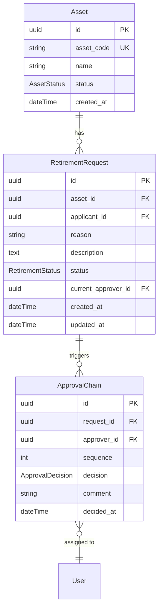

# SWARM-002 资产报废退役流程 - 规格指导文档

**版本**: v1.0  
**Task ID**: SWARM-002  
**Iteration**: 1  
**状态**: 规格评审中  
**最后更新**: 2024

---

## 1. 需求与背景

### 1.1 业务场景

资产管理系统中，资产管理生命周期包含采购入库、使用维护、最终报废或退役处置三个主要阶段。当前系统缺失资产报废退役的标准化流程，存在以下问题：

| 问题类型 | 具体描述 |
|---------|---------|
| 流程缺失 | 资产报废缺乏统一审批机制，导致资产流失风险 |
| 状态不可追溯 | 报废申请状态无法实时跟踪，审批进度不透明 |
| 数据孤岛 | 历史资产数据无法闭环管理，影响资产盘点准确性 |

### 1.2 核心需求

| 需求ID | 描述 | 优先级 |
|-------|------|--------|
| RQ-001 | 用户可提交资产报废申请，关联目标资产及报废原因 | P0 |
| RQ-002 | 报废申请按审批链自动路由至责任人 | P0 |
| RQ-003 | 审批人可批准或驳回报废申请 | P0 |
| RQ-004 | 用户可实时跟踪报废申请的审批进度 | P1 |
| RQ-005 | 审批完成后资产状态自动流转至"已报废" | P0 |

### 1.3 关键实体关系



### 1.4 枚举定义

```java
// AssetStatus
public enum AssetStatus {
    IN_USE,              // 使用中
    PENDING_RETIREMENT,  // 待报废
    RETIRED,             // 已退役
    SCRAPPED             // 已报废
}

// RetirementRequestStatus
public enum RetirementRequestStatus {
    DRAFT,      // 草稿
    PENDING,    // 待审批
    APPROVED,   // 已批准
    REJECTED    // 已驳回
}

// ApprovalDecision
public enum ApprovalDecision {
    PENDING,    // 待决策
    APPROVED,   // 批准
    REJECTED    // 驳回
}
```

---

## 2. 当前 Phase 对应实施目标

### 2.1 整体计划参照

基于 plan.md 的 Phase 拆解：

```
Phase 1 (已完成): 资产状态枚举扩展
     ↓
Phase 2 (本次): 报废申请提交 → 单级审批 → 状态更新 ← [当前]
     ↓
Phase 3: 审批链可视化 + 多级审批
     ↓
Phase 4: 批量报废 + 导出报表
```

### 2.2 本次 Iteration 交付范围

| 交付物 | 说明 | 负责模块 |
|-------|------|---------|
| 后端 API | 报废申请 CRUD、审批操作接口 | backend |
| 数据模型 | RetirementRequest, ApprovalChain 表结构 | backend |
| 状态机 | 资产状态流转逻辑 | backend/state |
| 前端页面 | 报废申请表单 + 审批进度跟踪 | frontend |

### 2.3 Phase 2 详细范围

**后端交付**：
- `backend/src/main/java/com/ams/entity/RetirementRequest.java` - 报废申请实体
- `backend/src/main/java/com/ams/entity/ApprovalChain.java` - 审批链实体
- `backend/src/main/java/com/ams/service/RetirementService.java` - 报废服务
- `backend/src/main/java/com/ams/service/ApprovalService.java` - 审批服务
- `backend/src/main/java/com/ams/controller/RetirementController.java` - 报废控制器
- `backend/src/main/java/com/ams/state/AssetStateMachine.java` - 状态机
- `backend/src/main/java/com/ams/state/StateTransitionException.java` - 状态转换异常

**前端交付**：
- 报废申请表单页面
- 审批进度跟踪页面
- 权限校验逻辑 (`useApprovalPermission.ts`)
- 状态管理 (`approvalStore.ts`)

---

## 3. 边界约束

### 3.1 功能边界

| 约束ID | 描述 | 原因 |
|-------|------|------|
| BC-001 | **单级审批**: 本次 Iteration 仅支持单一审批人，不支持会签或多级审批链 | 降低复杂度，快速验证核心流程 |
| BC-002 | **单资产申请**: 一次报废申请仅关联一个资产，不支持批量报废 | 保证审批粒度，符合最小可行产品原则 |
| BC-003 | **状态限制**: 仅 `IN_USE` 状态的资产可发起报废申请 | 防止重复申请和数据不一致 |
| BC-004 | **操作权限**: 申请人不可审批自己的申请 | 符合内部控制要求 |
| BC-005 | **草稿状态**: 申请提交前可保存草稿，提交后不可修改 | 保证审批过程严肃性 |
| BC-006 | **审批后不可逆**: 批准或驳回后不可撤销 | 简化状态机设计 |

### 3.2 非功能边界

| 约束ID | 描述 |
|-------|------|
| NB-001 | 暂不实现附件上传功能 |
| NB-002 | 暂不实现消息通知（邮件/站内信） |
| NB-003 | 暂不实现报废资产的后续处置跟踪 |
| NB-004 | 暂不实现报废资产的残值评估 |

### 3.3 技术约束

| 约束ID | 描述 |
|-------|------|
| TC-001 | 后端使用 Django REST Framework / Spring Boot |
| TC-002 | 前端使用 React + TypeScript |
| TC-003 | 数据库事务保证审批状态更新的原子性 |
| TC-004 | API 遵循 RESTful 规范 |
| TC-005 | 使用 JWT 进行身份认证 |

### 3.4 异常处理约束

```java
// StateTransitionException.java 关键异常场景
public class StateTransitionException extends RuntimeException {
    
    // 资产状态不允许报废申请
    public static final String INVALID_ASSET_STATUS = "INVALID_ASSET_STATUS";
    
    // 审批权限不足
    public static final String APPROVAL_PERMISSION_DENIED = "APPROVAL_PERMISSION_DENIED";
    
    // 状态转换不允许
    public static final String TRANSITION_NOT_ALLOWED = "TRANSITION_NOT_ALLOWED";
    
    // 申请不存在
    public static final String REQUEST_NOT_FOUND = "REQUEST_NOT_FOUND";
    
    // 资产不存在
    public static final String ASSET_NOT_FOUND = "ASSET_NOT_FOUND";
}
```

---

## 4. 验收测试基准 (ATB)

### 4.1 后端 API 测试

**测试文件**: `tests/api/test_retirement_api.py`  
**框架**: pytest + pytest-django  
**覆盖率目标**: 100% 核心路径覆盖

#### ATB-001: 报废申请创建成功

```python
# Test Case: ATB-001
class TestRetirementCreation:
    """
    验收测试: ATB-001
    描述: 报废申请创建成功
    """
    
    def test_create_retirement_request_success(
        self, api_client, asset_in_use, user, approver
    ):
        """
        Given: 存在 IN_USE 状态的资产
        When:  用户提交有效的报废申请
        Then:  
            - 返回 201 Created
            - RetirementRequest.status == 'PENDING'
            - Asset.status 自动变更为 'PENDING_RETIREMENT'
            - 审批链自动创建单条记录
        """
        payload = {
            "asset_id": str(asset_in_use.id),
            "reason": "DAMAGED",
            "description": "设备老化严重，无法正常运作"
        }
        
        response = api_client.post(
            "/api/v1/retirements/",
            data=payload,
            format="json"
        )
        
        # Assert HTTP Status
        assert response.status_code == 201
        
        # Assert Response Data
        data = response.json()
        assert data["status"] == "PENDING"
        assert data["asset_id"] == str(asset_in_use.id)
        
        # Assert Database State
        asset = Asset.objects.get(id=asset_in_use.id)
        assert asset.status == AssetStatus.PENDING_RETIREMENT
        
        # Assert Approval Chain Created
        approval = ApprovalChain.objects.get(request_id=data["id"])
        assert approval.approver_id == approver.id
        assert approval.decision == ApprovalDecision.PENDING
```

**物理测试期待**:
| 检查点 | 期待值 |
|-------|--------|
| HTTP 响应码 | 201 Created |
| `retirement_requests` 表 | 插入 1 条记录 |
| `assets` 表 | 对应记录 `status` = `PENDING_RETIREMENT` |
| `approval_chains` 表 | 插入 1 条审批记录 |

#### ATB-002: 申请状态校验失败

```python
# Test Case: ATB-002
def test_create_retirement_invalid_asset_status(api_client, asset_not_in_use):
    """
    Given: 资产状态为 PENDING_RETIREMENT (非 IN_USE)
    When:  提交报废申请
    Then:  
        - 返回 400 Bad Request
        - 错误信息包含 "资产状态不允许报废申请"
        - 数据库无新记录插入
    """
    payload = {
        "asset_id": str(asset_not_in_use.id),
        "reason": "DAMAGED",
        "description": "测试"
    }
    
    response = api_client.post(
        "/api/v1/retirements/",
        data=payload,
        format="json"
    )
    
    assert response.status_code == 400
    assert "INVALID_ASSET_STATUS" in response.json()["code"]
    assert RetirementRequest.objects.count() == 0
```

#### ATB-003: 审批通过

```python
# Test Case: ATB-003
def test_approve_retirement_request(api_client, retirement_request, approver_user):
    """
    Given: 存在 PENDING 状态的报废申请
    When:  审批人批准申请
    Then:  
        - 返回 200 OK
        - RetirementRequest.status == 'APPROVED'
        - Asset.status 变更为 'SCRAPPED'
        - ApprovalChain.decision == 'APPROVED'
    """
    response = api_client.post(
        f"/api/v1/retirements/{retirement_request.id}/approve/",
        data={"comment": "同意报废"}
    )
    
    assert response.status_code == 200
    assert response.json()["status"] == "APPROVED"
    
    # Verify Asset Status
    asset = Asset.objects.get(id=retirement_request.asset_id)
    assert asset.status == AssetStatus.SCRAPPED
```

**物理测试期待**:
| 检查点 | 期待值 |
|-------|--------|
| HTTP 响应码 | 200 OK |
| 资产最终状态 | `SCRAPPED` |
| 审批记录 decision | `APPROVED` |

#### ATB-004: 审批驳回

```python
# Test Case: ATB-004
def test_reject_retirement_request(api_client, retirement_request, approver_user):
    """
    Given: 存在 PENDING 状态的报废申请
    When:  审批人驳回申请
    Then:  
        - 返回 200 OK
        - RetirementRequest.status == 'REJECTED'
        - Asset.status 回退为 'IN_USE'
    """
    response = api_client.post(
        f"/api/v1/retirements/{retirement_request.id}/reject/",
        data={"comment": "请提供更详细的损坏说明"}
    )
    
    assert response.status_code == 200
    assert response.json()["status"] == "REJECTED"
    
    # Verify Asset Status Rollback
    asset = Asset.objects.get(id=retirement_request.asset_id)
    assert asset.status == AssetStatus.IN_USE
```

#### ATB-005: 进度查询

```python
# Test Case: ATB-005
def test_get_retirement_progress(api_client, user, retirement_request):
    """
    Given: 存在报废申请
    When:  申请人查询进度
    Then:  
        - 返回 200 OK
        - 响应包含 status, current_approver, approval_history
    """
    response = api_client.get(
        f"/api/v1/retirements/{retirement_request.id}/progress/"
    )
    
    assert response.status_code == 200
    data = response.json()
    
    assert "status" in data
    assert "current_approver" in data
    assert "approval_history" in data
    assert "timeline" in data
```

### 4.2 前端功能测试

**测试文件**: `frontend/tests/e2e/retirement_flow.spec.ts`  
**框架**: Playwright  
**浏览器**: Chromium (headless)

#### ATB-006: 报废申请页面渲染

```typescript
// Test Case: ATB-006
test('retirement application page loads correctly', async ({ page }) => {
  // Given: 用户已登录
  await loginUser(page, { username: 'asset_manager', password: 'test123' });
  
  // When: 导航到报废申请页面
  await page.goto('/assets/retirement/new');
  
  // Then: 页面加载成功，关键表单元素可见
  await expect(page.locator('form')).toBeVisible();
  await expect(page.locator('#asset-selector')).toBeVisible();
  await expect(page.locator('#reason-select')).toBeVisible();
  await expect(page.locator('#description-input')).toBeVisible();
  await expect(page.locator('button[type="submit"]')).toBeVisible();
});
```

**物理测试期待**:
| 检查点 | 期待值 |
|-------|--------|
| HTTP 响应码 | 200 |
| form 元素 | 可见 |
| asset-selector | 可见 |
| reason-select | 可见 |
| submit button | 可见 |

#### ATB-007: 提交申请流程

```typescript
// Test Case: ATB-007
test('submit retirement application successfully', async ({ page }) => {
  // Given: 用户在报废申请页面
  await loginUser(page, { username: 'asset_manager', password: 'test123' });
  await page.goto('/assets/retirement/new');
  
  // When: 填写表单并提交
  await page.selectOption('#asset-selector', { label: 'AST-001 - 办公笔记本' });
  await page.selectOption('#reason-select', 'DAMAGED');
  await page.fill('#description-input', '设备老化严重，屏幕无法显示');
  await page.click('button[type="submit"]');
  
  // Then: 显示成功提示，跳转至进度页面
  await expect(page.locator('.toast-success')).toBeVisible({
    timeout: 5000
  });
  await expect(page).toHaveURL(/\/retirement\/[a-f0-9-]+\/progress/);
});
```

**物理测试期待**:
| 检查点 | 期待值 |
|-------|--------|
| Toast 提示 | 显示成功消息 |
| URL 跳转 | 包含 `/retirement/{id}/progress` |

#### ATB-008: 审批进度可视化

```typescript
// Test Case: ATB-008
test('view approval progress', async ({ page }) => {
  // Given: 存在报废申请
  await loginUser(page, { username: 'asset_manager', password: 'test123' });
  
  // When: 访问进度页面
  await page.goto('/retirement/550e8400-e29b-41d4-a716-446655440001/progress');
  
  // Then: 展示完整审批进度
  await expect(page.locator('.status-badge')).toContainText('审批中');
  await expect(page.locator('.approver-name')).toContainText('张经理');
  await expect(page.locator('.timeline')).toBeVisible();
  await expect(page.locator('.timeline-item')).toHaveCount(1);
});
```

### 4.3 状态机测试

**测试文件**: `tests/state_machine/test_retirement_sm.py`

#### ATB-009: 状态流转验证

```python
# Test Case: ATB-009
def test_asset_status_transitions():
    """
    验证资产状态机流转
    
    IN_USE -> PENDING_RETIREMENT (提交申请)
    PENDING_RETIREMENT -> SCRAPPED (审批通过)
    PENDING_RETIREMENT -> IN_USE (审批驳回)
    """
    # Valid transitions
    assert AssetStateMachine.can_transition(IN_USE, SUBMIT_RETIREMENT)
    assert AssetStateMachine.can_transition(PENDING_RETIREMENT, APPROVE)
    assert AssetStateMachine.can_transition(PENDING_RETIREMENT, REJECT)
    
    # Invalid transitions
    assert not AssetStateMachine.can_transition(IN_USE, APPROVE)
    assert not AssetStateMachine.can_transition(SCRAPPED, any_transition)
```

---

## 5. 开发切入层级序列

### 5.1 层级 1: 数据模型层

**时间**: Day 1  
**负责人**: Backend Developer

```
1.1 数据库迁移
    ├── retirement_requests 表创建
    │   ├── id (UUID, PK)
    │   ├── asset_id (UUID, FK)
    │   ├── applicant_id (UUID, FK)
    │   ├── reason (VARCHAR)
    │   ├── description (TEXT)
    │   ├── status (ENUM)
    │   └── timestamps
    │
    └── approval_chains 表创建
        ├── id (UUID, PK)
        ├── request_id (UUID, FK)
        ├── approver_id (UUID, FK)
        ├── sequence (INT)
        ├── decision (ENUM)
        └── timestamps

1.2 Django/Spring Models
    ├── RetirementRequest
    └── ApprovalChain

1.3 单元测试
    └── tests/unit/test_retirement_models.py
```

### 5.2 层级 2: 服务层

**时间**: Day 1-2  
**负责人**: Backend Developer

```
2.1 RetirementService
    ├── create_retirement_request(asset_id, reason, description)
    │   ├── 校验资产状态
    │   ├── 创建 RetirementRequest
    │   ├── 更新 Asset.status
    │   └── 创建 ApprovalChain
    │
    ├── get_retirement_request(id)
    ├── list_retirement_requests(filters)
    └── get_retirement_progress(id)

2.2 AssetStateMachine
    ├── validate_transition(current_state, action) -> bool
    ├── execute_transition(asset_id, action) -> Asset
    └── get_allowed_transitions(state) -> List[Action]

2.3 ApprovalService
    ├── approve_request(request_id, approver_id, comment)
    ├── reject_request(request_id, approver_id, comment)
    └── get_pending_approvals(approver_id)
```

### 5.3 层级 3: API 层

**时间**: Day 2  
**负责人**: Backend Developer

```
3.1 Serializers
    ├── RetirementRequestSerializer
    │   ├── create
    │   ├── update
    │   └── response (包含嵌套审批链)
    │
    ├── ApprovalChainSerializer
    └── RetirementProgressSerializer

3.2 ViewSets / Controllers
    └── RetirementController
        ├── POST   /retirements/              # 创建申请
        ├── GET    /retirements/              # 列表查询
        ├── GET    /retirements/{id}/         # 详情
        ├── GET    /retirements/{id}/progress/  # 审批进度
        ├── POST   /retirements/{id}/approve/ # 批准
        └── POST   /retirements/{id}/reject/  # 驳回

3.3 路由配置
    └── api/v1/retirements/
```

### 5.4 层级 4: 前端组件层

**时间**: Day 3  
**负责人**: Frontend Developer

```
4.1 页面组件
    ├── RetirementApplicationPage
    │   ├── AssetSelector
    │   ├── ReasonSelect
    │   ├── DescriptionInput
    │   └── SubmitButton
    │
    └── RetirementProgressPage
        ├── StatusBadge
        ├── ApproverInfo
        ├── Timeline
        └── ActionButtons (approve/reject)

4.2 共享组件
    ├── StatusBadge
    ├── ApprovalTimeline
    └── AssetSelector

4.3 状态管理
    └── approvalStore.ts (Redux Toolkit)
        ├── retirementSlice
        ├── fetchRetirementProgress
        └── submitApproval

4.4 权限校验
    └── useApprovalPermission.ts
        ├── canSubmitRetirement
        ├── canApproveRetirement
        └── canViewRetirement
```

### 5.5 层级 5: 集成与验收

**时间**: Day 3-4  
**负责人**: QA + 全团队

```
5.1 端到端测试
    ├── Playwright E2E 测试 (ATB-006 ~ ATB-008)
    └── 用户操作流程覆盖

5.2 API 集成测试
    ├── pytest 完整覆盖 (ATB-001 ~ ATB-005)
    └── 状态机测试 (ATB-009)

5.3 手动验收检查
    ├── 实际资产状态流转验证
    ├── 审批权限校验
    └── 异常场景覆盖
```

---

## 6. API 规范摘要

### 6.1 端点列表

| 方法 | 端点 | 描述 | 认证 |
|------|------|------|------|
| POST | `/api/v1/retirements/` | 创建报废申请 | Required |
| GET | `/api/v1/retirements/` | 列表查询 | Required |
| GET | `/api/v1/retirements/{id}/` | 详情查询 | Required |
| GET | `/api/v1/retirements/{id}/progress/` | 审批进度 | Required |
| POST | `/api/v1/retirements/{id}/approve/` | 批准申请 | Required (审批人) |
| POST | `/api/v1/retirements/{id}/reject/` | 驳回申请 | Required (审批人) |

### 6.2 请求/响应示例

**POST /api/v1/retirements/**

Request:
```json
{
  "asset_id": "550e8400-e29b-41d4-a716-446655440000",
  "reason": "DAMAGED",
  "description": "设备老化严重，屏幕无法显示"
}
```

Response (201):
```json
{
  "id": "660e8400-e29b-41d4-a716-446655440001",
  "asset_id": "550e8400-e29b-41d4-a716-446655440000",
  "status": "PENDING",
  "reason": "DAMAGED",
  "description": "设备老化严重，屏幕无法显示",
  "applicant": {
    "id": "user-001",
    "name": "李工程师"
  },
  "current_approver": {
    "id": "user-002",
    "name": "张经理"
  },
  "created_at": "2024-01-15T10:30:00Z"
}
```

**GET /api/v1/retirements/{id}/progress/**

Response (200):
```json
{
  "id": "660e8400-e29b-41d4-a716-446655440001",
  "status": "PENDING",
  "asset": {
    "id": "550e8400-e29b-41d4-a716-446655440000",
    "code": "AST-001",
    "name": "办公笔记本"
  },
  "current_approver": {
    "id": "user-002",
    "name": "张经理"
  },
  "approval_history": [
    {
      "approver": "张经理",
      "decision": "PENDING",
      "comment": null,
      "decided_at": null
    }
  ],
  "timeline": [
    {
      "status": "PENDING",
      "timestamp": "2024-01-15T10:30:00Z",
      "description": "申请已提交，等待审批"
    }
  ]
}
```

---

## 7. 状态机定义

### 7.1 资产状态转换图

```
                                    ┌─────────────┐
                                    │   SCRAPPED  │
                                    │   (终止)    │
                                    └──────▲──────┘
                                           │ approve
                                           │
┌─────────┐     submit      ┌─────────────────────┐
│ IN_USE  │ ──────────────► │ PENDING_RETIREMENT  │
└─────────┘                 └──────────┬──────────┘
      ▲                               │
      │         reject                │
      └───────────────────────────────┘
```

### 7.2 状态转换规则

| 当前状态 | 操作 | 目标状态 | 触发条件 |
|---------|------|---------|---------|
| IN_USE | submit | PENDING_RETIREMENT | 用户提交报废申请 |
| PENDING_RETIREMENT | approve | SCRAPPED | 审批人批准 |
| PENDING_RETIREMENT | reject | IN_USE | 审批人驳回 |

### 7.3 申请状态转换

```
DRAFT ──► PENDING ──► APPROVED
              │
              └──► REJECTED
```

---

## 8. 附录

### 8.1 相关文件列表

**后端**:
- `backend/src/main/java/com/ams/entity/RetirementRequest.java`
- `backend/src/main/java/com/ams/entity/ApprovalChain.java`
- `backend/src/main/java/com/ams/service/RetirementService.java`
- `backend/src/main/java/com/ams/service/ApprovalService.java`
- `backend/src/main/java/com/ams/controller/RetirementController.java`
- `backend/src/main/java/com/ams/state/AssetStateMachine.java`
- `backend/src/main/java/com/ams/state/StateTransitionException.java`

**前端**:
- `frontend/src/composables/useApprovalPermission.ts`
- `frontend/src/stores/approvalStore.ts`
- `frontend/src/app/pages/OperationLogDashboard/components/TrendChart.tsx`
- `frontend/src/app/pages/AuditDashboard/AuditDashboard.module.css`
- `frontend/src/app/pages/AuditDashboard/components/FilterBar/FilterBar.module.css`

**测试**:
- `tests/api/test_retirement_api.py`
- `tests/state_machine/test_retirement_sm.py`
- `frontend/tests/e2e/retirement_flow.spec.ts`

### 8.2 术语表

| 术语 | 定义 |
|------|------|
| 报废 (Scrap) | 资产因损坏或老化无法使用，进行注销处理 |
| 退役 (Retirement) | 资产退出在役状态，可能转入库存或待处置 |
| 审批链 (Approval Chain) | 报废申请需要经过的审批节点序列 |
| 状态机 (State Machine) | 定义资产状态及其转换规则的模型 |

### 8.3 参考文档

- [资产管理系统需求规格](../requirements/asset-management-spec.md)
- [审批流程设计文档](../design/approval-workflow-design.md)
- [前端组件库文档](../frontend/component-library.md)

---

**文档版本历史**:

| 版本 | 日期 | 作者 | 变更内容 |
|------|------|------|---------|
| 1.0 | 2024 | SWARM Team | 初始版本 |