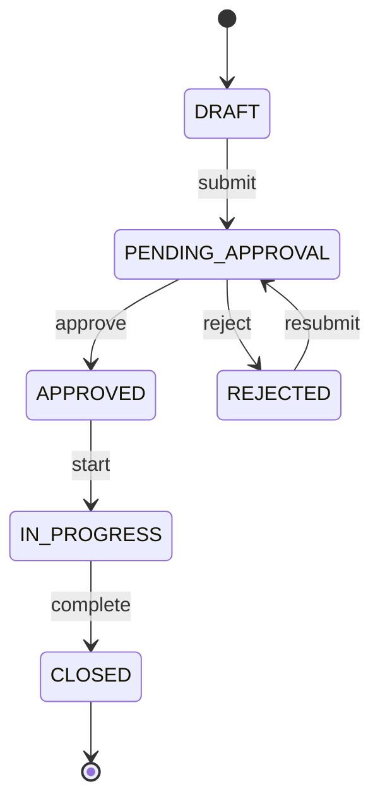
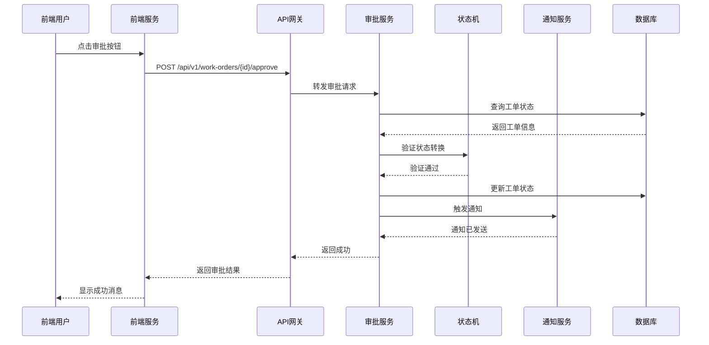

# SWARM-2025-Q2-P0-003 工单审批流程规格指导文档

## 1. 需求与背景

### 1.1 业务需求

**User Task**: 工单审批流程 - 用户现在可以在前端审批页面一键审批/驳回工单，后端状态机自动推进工单生命周期并触发通知。

**核心价值**:
- 实现审批操作线上化，支持前端一键审批/驳回
- 后端状态机自动推进工单状态生命周期
- 状态变更后自动触发通知机制
- 完整审计日志记录

### 1.2 当前痛点

| 痛点 | 现状 | 预期 |
|------|------|------|
| 审批操作效率低 | 依赖线下或手工操作 | 线上化一键审批 |
| 状态与通知不一致 | 状态变更后通知可能延迟或丢失 | 原子操作保证一致性 |
| 审批历史不完整 | 记录分散或缺失 | 完整审计日志追溯 |

### 1.3 预期收益

| 指标 | 当前值 | 目标值 |
|------|--------|--------|
| 审批操作耗时 | 平均 5 分钟 | ≤ 30 秒 |
| 状态与通知一致性 | ~95% | ≥ 99.5% |
| 审计日志完整性 | 部分缺失 | 100% 覆盖 |

---

## 2. 当前 Phase 对应实施目标

### Phase 3: 前端审批界面 + 状态机联动 + 通知触发

本迭代对齐 **Phase 3**，具体目标：

| 目标项 | 描述 | 交付物 |
|--------|------|--------|
| 前端审批页 | 审批人查看待办工单列表，支持批量/单条审批操作 | `frontend/src/pages/WorkOrder/` |
| 后端状态机 | 接收审批指令，按定义规则推进工单状态 | `backend/state_machine/workorder_state_machine.py` |
| 通知服务 | 状态变更后触发邮件/站内信通知 | `src/services/notification_service.py` |
| 审计日志 | 记录审批人、时间、动作、结果 | `src/models/approval_history.py` |

### 2.1 与前后 Phase 关系

```
Phase 2 (已交付)     Phase 3 (当前)       Phase 4 (后续)
┌─────────────┐     ┌─────────────┐     ┌─────────────┐
│  工单数据模型 │ --> │ 审批流程实现 │ --> │ 权限细化/   │
│  基础 CRUD   │     │ 状态机联动   │     │ 审批链配置  │
│  基础 API    │     │ 通知触发     │     │ 加签/转签   │
└─────────────┘     └─────────────┘     └─────────────┘
```

---

## 3. 边界约束

### 3.1 功能边界

| 约束类型 | 具体约束 |
|----------|----------|
| 审批角色 | 仅拥有 `APPROVER` 角色的用户可执行审批操作 |
| 工单状态 | 仅 `PENDING_APPROVAL` 状态可接受审批指令 |
| 操作原子性 | 审批提交后，状态变更与通知触发必须原子完成 |
| 并发控制 | 同一工单同一时间仅允许一个审批操作，防止竞态 |
| 超时处理 | 审批操作超时阈值设定为 10 秒，超时返回 504 |
| 批量限制 | 单次批量审批上限 50 条，超出返回 400 |
| 通知重试 | 通知发送失败时最多重试 3 次，间隔 30s/60s/120s |

### 3.2 非功能约束

| 约束类型 | 具体约束 |
|----------|----------|
| 响应时间 | 审批接口 P99 ≤ 500ms |
| 可用性 | 审批服务 SLA ≥ 99.9% |
| 数据一致性 | 工单状态与审计日志强一致 |
| 日志留存 | 审批日志保留 730 天 |

### 3.3 技术边界

| 层级 | 技术选型 |
|------|----------|
| 前端框架 | React 18 + TypeScript + Ant Design 5 |
| 后端框架 | Python FastAPI / Django |
| 状态机 | Python `transitions` 库或自实现状态机 |
| 通知队列 | Redis Stream / RabbitMQ |
| 数据库 | PostgreSQL 15 |
| 缓存 | Redis (用于幂等控制) |

---

## 4. 验收测试基准 (ATB)

### ATB-1: 单条审批通过

| 属性 | 值 |
|------|-----|
| 测试编号 | ATB-1 |
| 场景 | 审批人提交单条工单"通过" |
| 前置条件 | 工单状态为 `PENDING_APPROVAL`，当前用户为审批人 |
| 测试步骤 | 1. 调用 `POST /api/v1/work-orders/{id}/approve`<br>2. 请求体: `{"action": "approve", "comment": "同意"}` |
| 物理测试期待 | **pytest**: `test_single_approve_success`<br>**Playwright**: 页面显示审批成功 toast，工单状态变更为 `APPROVED` |

```python
# pytest 期待代码片段
def test_single_approve_success(client, auth_headers, pending_work_order):
    response = client.post(
        f"/api/v1/work-orders/{pending_work_order.id}/approve",
        json={"action": "approve", "comment": "同意"},
        headers=auth_headers
    )
    assert response.status_code == 200
    assert response.json()["status"] == "APPROVED"
    # 验证审计日志写入
    audit = get_audit_log(pending_work_order.id)
    assert audit.action == "APPROVE"
    assert audit.operator_id == auth_headers["user_id"]
```

### ATB-2: 单条审批驳回

| 属性 | 值 |
|------|-----|
| 测试编号 | ATB-2 |
| 场景 | 审批人提交单条工单"驳回" |
| 前置条件 | 工单状态为 `PENDING_APPROVAL` |
| 测试步骤 | 1. 调用 `POST /api/v1/work-orders/{id}/approve`<br>2. 请求体: `{"action": "reject", "comment": "材料不全"}` |
| 物理测试期待 | **pytest**: `test_single_reject_success`<br>**Playwright**: 页面显示驳回成功，工单状态变更为 `REJECTED` |

### ATB-3: 批量审批通过

| 属性 | 值 |
|------|-----|
| 测试编号 | ATB-3 |
| 场景 | 审批人批量审批 10 条工单 |
| 前置条件 | 存在 10 条 `PENDING_APPROVAL` 状态工单 |
| 测试步骤 | 1. 调用 `POST /api/v1/work-orders/batch-approve`<br>2. 请求体: `{"ids": [1,2,...10], "action": "approve"}` |
| 物理测试期待 | **pytest**: `test_batch_approve_success`<br>**Playwright**: 批量成功后页面刷新，列表中 10 条工单状态均变更为 `APPROVED` |

```python
# pytest 期待代码片段
def test_batch_approve_success(client, auth_headers, pending_work_orders):
    ids = [wo.id for wo in pending_work_orders[:10]]
    response = client.post(
        "/api/v1/work-orders/batch-approve",
        json={"ids": ids, "action": "approve"},
        headers=auth_headers
    )
    assert response.status_code == 200
    data = response.json()
    assert data["success_count"] == 10
    assert data["failure_count"] == 0
```

### ATB-4: 非法状态变更拒绝

| 属性 | 值 |
|------|-----|
| 测试编号 | ATB-4 |
| 场景 | 对已审批工单再次审批 |
| 前置条件 | 工单状态为 `APPROVED` |
| 测试步骤 | 调用 `POST /api/v1/work-orders/{id}/approve` |
| 物理测试期待 | **pytest**: `test_approve_invalid_state`<br>**HTTP**: 返回 409 Conflict，错误码 `INVALID_STATE_TRANSITION` |

```python
def test_approve_invalid_state(client, auth_headers, approved_work_order):
    response = client.post(
        f"/api/v1/work-orders/{approved_work_order.id}/approve",
        json={"action": "approve"},
        headers=auth_headers
    )
    assert response.status_code == 409
    assert response.json()["code"] == "INVALID_STATE_TRANSITION"
```

### ATB-5: 状态机规则验证

| 属性 | 值 |
|------|-----|
| 测试编号 | ATB-5 |
| 场景 | 验证状态机定义的状态流转 |
| 前置条件 | 状态机配置已加载 |
| 测试步骤 | 对所有定义的状态流转路径执行正向测试，对非法路径执行负向测试 |
| 物理测试期待 | **pytest**: `test_state_machine_transitions` |

```python
# 状态机正向路径
VALID_TRANSITIONS = {
    "PENDING_APPROVAL": ["APPROVED", "REJECTED"],
    "APPROVED": ["IN_PROGRESS", "CLOSED"],
    "REJECTED": ["PENDING_APPROVAL"],  # 可重新提交
}

@pytest.mark.parametrize("from_state,to_state", [
    ("PENDING_APPROVAL", "APPROVED"),
    ("PENDING_APPROVAL", "REJECTED"),
])
def test_valid_transition(from_state, to_state):
    assert to_state in VALID_TRANSITIONS[from_state]
```

### ATB-6: 通知触发验证

| 属性 | 值 |
|------|-----|
| 测试编号 | ATB-6 |
| 场景 | 审批通过后触发通知 |
| 前置条件 | 审批人通过审批，系统有可用的通知服务 |
| 测试步骤 | 执行审批操作，查询通知记录 |
| 物理测试期待 | **pytest**: `test_notification_triggered_on_approve`<br>**Mock**: 验证通知服务 `send_notification` 被调用一次 |

```python
def test_notification_triggered_on_approve(mock_notification_service, client, auth_headers, pending_work_order):
    client.post(
        f"/api/v1/work-orders/{pending_work_order.id}/approve",
        json={"action": "approve"},
        headers=auth_headers
    )
    mock_notification_service.send_notification.assert_called_once()
    call_args = mock_notification_service.send_notification.call_args
    assert "work_order_id" in call_args.kwargs
```

### ATB-7: 并发审批冲突检测

| 属性 | 值 |
|------|-----|
| 测试编号 | ATB-7 |
| 场景 | 两用户同时对同一工单提交审批 |
| 前置条件 | 工单状态为 `PENDING_APPROVAL` |
| 测试步骤 | 并发发送两个审批请求 |
| 物理测试期待 | **pytest**: `test_concurrent_approval_conflict`<br>**结果**: 一个成功(200)，一个失败(409 Conflict) |

### ATB-8: 无权限用户拒绝

| 属性 | 值 |
|------|-----|
| 测试编号 | ATB-8 |
| 场景 | 非审批人角色用户尝试审批 |
| 前置条件 | 当前用户角色为 `REQUESTER` |
| 测试步骤 | 调用审批接口 |
| 物理测试期待 | **pytest**: `test_unauthorized_approval_rejected`<br>**HTTP**: 返回 403 Forbidden |

### ATB-9: 批量超限拒绝

| 属性 | 值 |
|------|-----|
| 测试编号 | ATB-9 |
| 场景 | 批量审批请求超出 50 条限制 |
| 前置条件 | 存在 51 条待审批工单 |
| 测试步骤 | 调用批量审批接口，传入 51 个 ID |
| 物理测试期待 | **pytest**: `test_batch_approve_exceeds_limit`<br>**HTTP**: 返回 400 Bad Request |

### ATB-10: 前端页面交互验收

| 属性 | 值 |
|------|-----|
| 测试编号 | ATB-10 |
| 场景 | 前端审批页面完整交互流程 |
| 测试步骤 | 1. 登录审批人账号<br>2. 进入"待审批工单"列表页<br>3. 点击单条工单操作按钮，选择审批/驳回<br>4. 填写备注并提交<br>5. 观察页面状态更新 |
| 物理测试期待 | **Playwright**: `test_approval_page_workflow`<br>`page.goto("/work-orders/pending")`<br>`page.click('[data-testid="approve-btn"]')`<br>`expect(page.locator('.ant-message')).toContainText('审批成功')` |

---

## 5. 开发切入层级序列

### L1: 数据层 (Day 1-2)

```
src/
├── models/
│   ├── work_order.py          # 工单模型
│   ├── audit_log.py           # 审计日志模型
│   └── notification.py       # 通知记录模型
└── migrations/
    └── add_approval_fields.sql
```

**交付物**:
- 工单表新增字段：`status`, `approved_by`, `approved_at`, `approval_comment`
- 审计日志表设计
- 通知记录表设计

### L2: 状态机层 (Day 2-3)

```
src/
├── state_machine/
│   ├── machine.py             # 状态机定义
│   ├── transitions.py         # 状态流转规则
│   └── handlers.py            # 状态变更钩子
```

**交付物**:
- 状态机类，暴露 `can_transition()`, `transition()`, `get_available_actions()`
- 状态流转配置 (JSON/YAML)
- 状态变更前置/后置处理器

### L3: 服务层 (Day 3-4)

```
src/
├── services/
│   ├── approval_service.py    # 审批业务逻辑
│   └── notification_service.py # 通知发送服务
├── schemas/
│   └── approval.py            # Pydantic 请求/响应模型
```

**交付物**:
- `ApprovalService.approve(work_order_id, user_id, action, comment)`
- `ApprovalService.batch_approve(work_order_ids, user_id, action)`
- 并发控制实现（乐观锁/悲观锁）
- 通知消息构造

### L4: API 层 (Day 4-5)

```
src/
├── api/
│   ├── v1/
│   │   └── work_orders/
│   │       ├── router.py
│   │       └── endpoints.py
```

**交付物**:

| 接口 | 方法 | 路径 |
|------|------|------|
| 审批工单 | POST | `/api/v1/work-orders/{id}/approve` |
| 批量审批 | POST | `/api/v1/work-orders/batch-approve` |
| 获取待审批列表 | GET | `/api/v1/work-orders/pending` |
| 获取审批历史 | GET | `/api/v1/work-orders/{id}/audit-logs` |

### L5: 前端层 (Day 5-7)

```
src/
├── pages/
│   └── work-order/
│       ├── PendingList.tsx
│       └── ApprovalModal.tsx
├── components/
│   └── ApprovalButton.tsx
└── hooks/
    └── useApproval.ts
```

**交付物**:
- 待审批工单列表页（含分页、筛选）
- 审批/驳回弹窗（含备注输入）
- 批量选择与操作
- 操作结果反馈 (Toast)

### L6: 通知集成层 (Day 6-7)

```
src/
├── notifications/
│   ├── providers/
│   │   ├── email_provider.py
│   │   └── inapp_provider.py
│   └── tasks/
│       └── send_notification.py
```

**交付物**:
- 邮件通知发送
- 站内信通知写入
- 消息队列生产者配置
- 失败重试机制

### L7: 测试与集成 (Day 7-8)

```
tests/
├── unit/
│   ├── test_state_machine.py
│   ├── test_approval_service.py
│   └── test_api_endpoints.py
├── integration/
│   └── test_approval_flow.py
└── e2e/
    └── test_approval_page.spec.ts
```

**交付物**:
- 单元测试覆盖所有 ATB 场景
- API 集成测试
- E2E 自动化测试

### L8: 部署与监控 (Day 8)

```
ops/
├── helm/
│   └── work-order-approval/
└── monitoring/
    ├── dashboards/
    └── alerts/
```

**交付物**:
- Helm Chart 部署配置
- 审批延迟监控看板
- 审批失败告警规则

---

## 6. API 规格

### 6.1 审批工单

```
POST /api/v1/work-orders/{id}/approve
```

**请求头**:
```
Authorization: Bearer {token}
Content-Type: application/json
```

**请求体**:
```json
{
  "action": "approve | reject",
  "comment": "string (optional)"
}
```

**响应 (200 OK)**:
```json
{
  "code": 0,
  "message": "success",
  "data": {
    "work_order_id": "string",
    "status": "APPROVED | REJECTED",
    "approved_by": "string",
    "approved_at": "2025-01-01T00:00:00Z"
  }
}
```

**错误响应**:

| 状态码 | 错误码 | 说明 |
|--------|--------|------|
| 400 | INVALID_REQUEST | 请求参数错误 |
| 401 | UNAUTHORIZED | 未授权 |
| 403 | FORBIDDEN | 无审批权限 |
| 404 | NOT_FOUND | 工单不存在 |
| 409 | INVALID_STATE_TRANSITION | 工单状态不允许此操作 |
| 423 | RESOURCE_LOCKED | 工单正被其他操作处理 |

### 6.2 批量审批

```
POST /api/v1/work-orders/batch-approve
```

**请求体**:
```json
{
  "ids": ["string array, max 50"],
  "action": "approve | reject",
  "comment": "string (optional)"
}
```

**响应 (200 OK)**:
```json
{
  "code": 0,
  "message": "success",
  "data": {
    "success_count": 10,
    "failure_count": 0,
    "results": [
      {
        "work_order_id": "string",
        "status": "APPROVED",
        "success": true
      }
    ]
  }
}
```

---

## 7. 数据模型

### 7.1 WorkOrder 工单表

| 字段 | 类型 | 说明 |
|------|------|------|
| id | UUID | 主键 |
| title | VARCHAR(255) | 工单标题 |
| status | ENUM | 工单状态 |
| current_approver_id | UUID | 当前审批人 |
| approved_by | UUID | 审批人 |
| approved_at | TIMESTAMP | 审批时间 |
| approval_comment | TEXT | 审批备注 |
| created_by | UUID | 创建人 |
| created_at | TIMESTAMP | 创建时间 |
| updated_at | TIMESTAMP | 更新时间 |

### 7.2 ApprovalHistory 审批历史表

| 字段 | 类型 | 说明 |
|------|------|------|
| id | UUID | 主键 |
| work_order_id | UUID | 工单ID |
| action | ENUM | 动作 (APPROVE/REJECT) |
| operator_id | UUID | 操作人 |
| comment | TEXT | 审批备注 |
| previous_status | VARCHAR(50) | 变更前状态 |
| new_status | VARCHAR(50) | 变更后状态 |
| created_at | TIMESTAMP | 操作时间 |

### 7.3 NotificationRecord 通知记录表

| 字段 | 类型 | 说明 |
|------|------|------|
| id | UUID | 主键 |
| work_order_id | UUID | 关联工单 |
| recipient_id | UUID | 接收人 |
| notification_type | ENUM | 通知类型 |
| title | VARCHAR(255) | 通知标题 |
| content | TEXT | 通知内容 |
| status | ENUM | 发送状态 |
| retry_count | INT | 重试次数 |
| created_at | TIMESTAMP | 创建时间 |
| sent_at | TIMESTAMP | 发送时间 |

---

## 8. 状态机定义

### 8.1 状态枚举

```python
class WorkOrderStatus(str, Enum):
    DRAFT = "DRAFT"
    PENDING_APPROVAL = "PENDING_APPROVAL"
    APPROVED = "APPROVED"
    REJECTED = "REJECTED"
    IN_PROGRESS = "IN_PROGRESS"
    COMPLETED = "COMPLETED"
    CLOSED = "CLOSED"
    CANCELLED = "CANCELLED"
```

### 8.2 状态流转图

```
                              ┌─────────────┐
                              │    DRAFT    │
                              └──────┬──────┘
                                     │ submit
                                     ▼
                        ┌────────────────────────┐
                        │  PENDING_APPROVAL      │◄──────────────────┐
                        └───────────┬────────────┘                   │
                         ▲          │                                │
                  reject │          │ approve                       │
                         │          ▼                                │
              ┌──────────┴───┐ ┌─────────────┐                      │
              │   REJECTED   │ │  APPROVED   │──────────────────────┤
              └──────────────┘ └──────┬──────┘                      │
                                      │ start                       │
                                      ▼                             │
                              ┌─────────────┐                      │
                              │ IN_PROGRESS │                      │
                              └──────┬──────┘                      │
                                     │ complete                    │
                                     ▼                             │
                              ┌─────────────┐                      │
                              │   CLOSED    │──────────────────────┘
                              └─────────────┘  (reopen)
```

### 8.3 流转规则

| 当前状态 | 允许动作 | 目标状态 | 触发条件 |
|----------|----------|----------|----------|
| DRAFT | submit | PENDING_APPROVAL | 提交工单 |
| PENDING_APPROVAL | approve | APPROVED | 审批通过 |
| PENDING_APPROVAL | reject | REJECTED | 审批驳回 |
| REJECTED | resubmit | PENDING_APPROVAL | 重新提交 |
| APPROVED | start | IN_PROGRESS | 开始执行 |
| IN_PROGRESS | complete | CLOSED | 完成工单 |

---

## 9. 错误码定义

| 错误码 | HTTP状态码 | 错误信息 | 说明 |
|--------|------------|----------|------|
| INVALID_REQUEST | 400 | Invalid request parameters | 请求参数不合法 |
| UNAUTHORIZED | 401 | Unauthorized access | 未授权访问 |
| FORBIDDEN | 403 | Permission denied | 无操作权限 |
| NOT_FOUND | 404 | Resource not found | 资源不存在 |
| INVALID_STATE_TRANSITION | 409 | Invalid state transition | 状态转换不合法 |
| RESOURCE_LOCKED | 423 | Resource is locked | 资源被锁定 |
| INTERNAL_ERROR | 500 | Internal server error | 内部错误 |

---

## 附录

### A. 状态机流转图 (Mermaid)



### B. 审批流程时序图



---

**文档版本**: v3.0  
**迭代**: SWARM-2025-Q2-P0-003 Iteration 3  
**状态**: DRAFT for Review  
**创建日期**: 2025-01-01  
**最后更新**: 2025-01-01