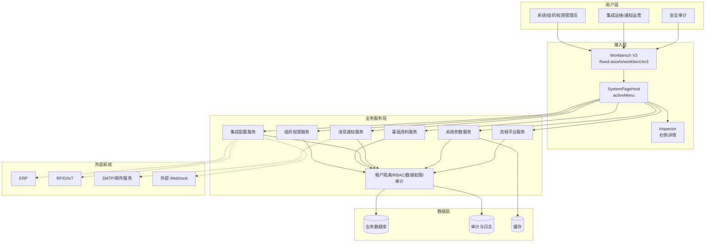
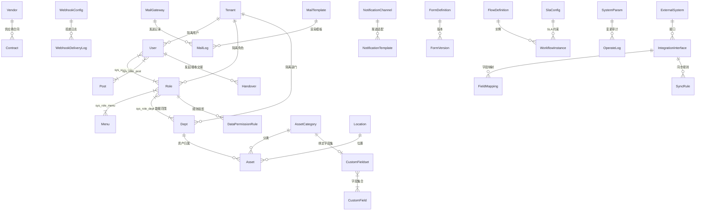
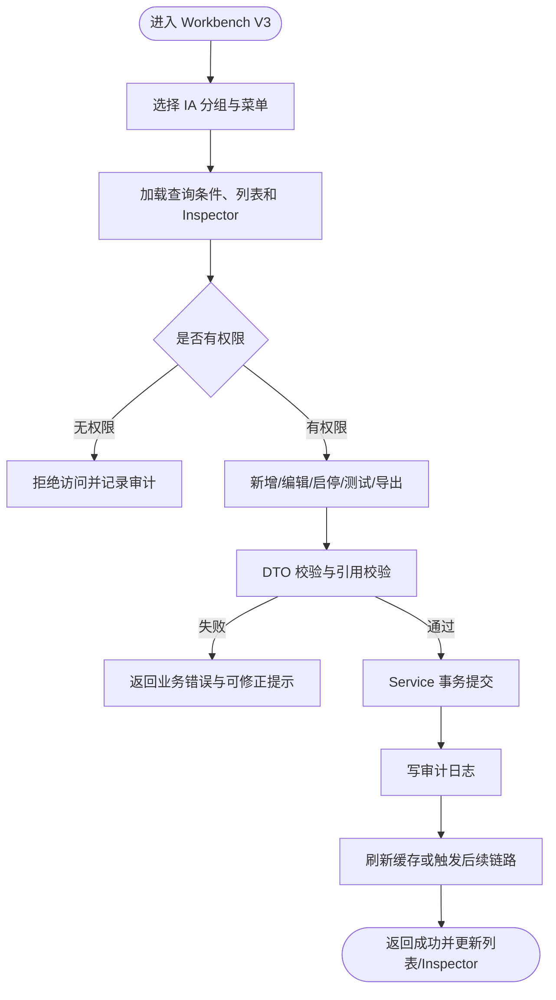
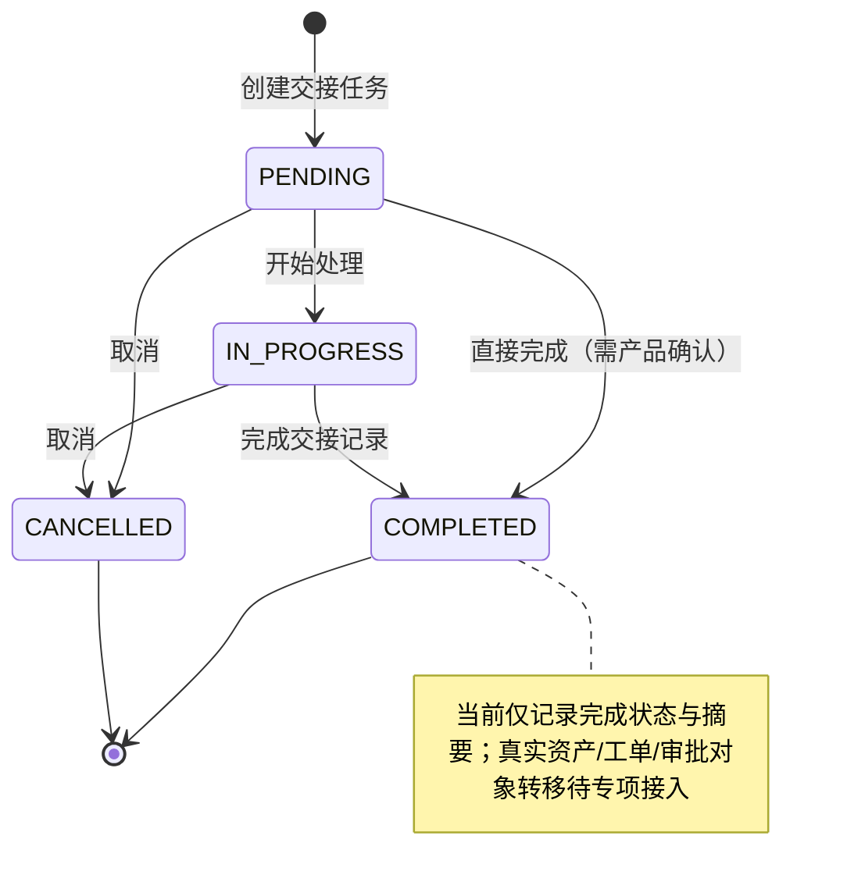
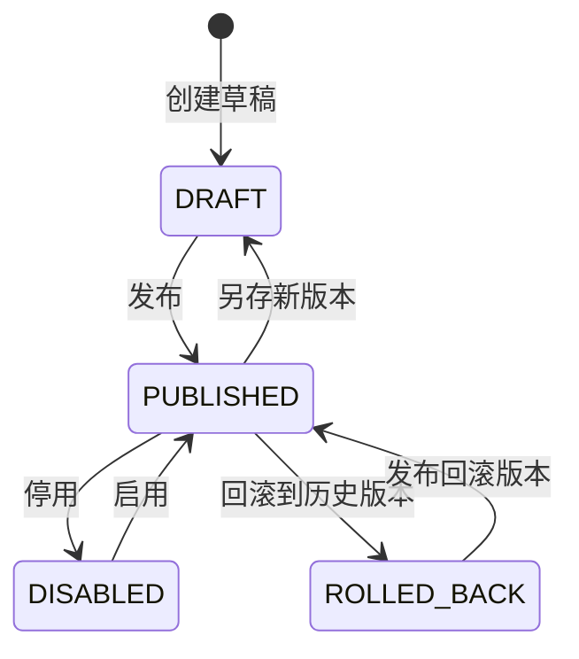
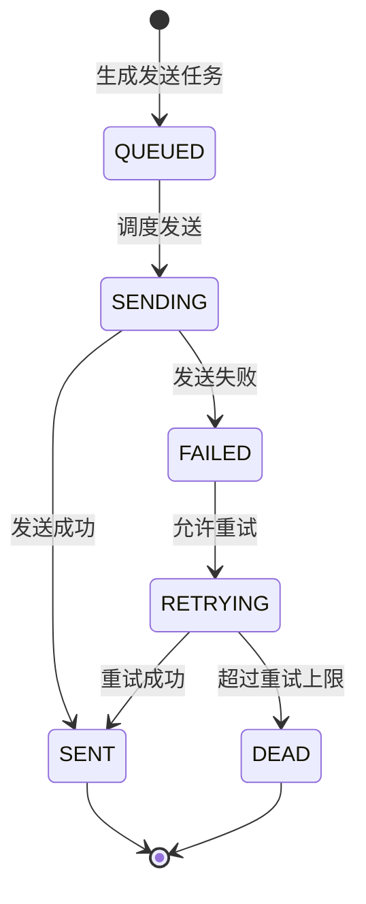

# Future Settings OS v3 扩展完整 PRD

| PRD 审核人 | 待填写 |
| --- | --- |
| 重要性 | 高 |
| 紧迫性 | 高 |
| 需求方 | ForthAMS / Future Settings OS 后台管理方向 |
| PRD 编写人 | GAI2 `gai2-builder`（PRD建设官） |
| PRD 提交日期 | 2026-07-01 |
| 当前版本 | v1.0 |
| 适用路径 | `/fixed-assets/workbenchv3` |
| 默认菜单 | `?menu=system-user-management` |

## PRD 修改记录

| 变更时间 | 变更内容 | 变更提出部门与理由 | 修改人 | 审核人 | 版本号 |
| --- | --- | --- | --- | --- | --- |
| 2026-07-01 | 基于 V3 后端设计方案、IA 主文档、GAI2 审计/讨论/草案/精修/裁决产物生成扩展完整 PRD 初版 | 固化 Future Settings OS v3 后台管理范围、IA、后端契约、验收与风险 | GAI2 PRD建设官 | 待填写 | v1.0 |

---

## 0、文档信息、适用范围与真实性边界

### 0.1 文档定位

本文是 Future Settings OS v3 后台管理方向的扩展完整需求文档，按 `/create-prd` 的企业自研系统 × 业务型管理软件思路组织：先定型产品与范围，再展开背景、用户、目标、IA、导航、核心功能、数据契约、权限安全、分期验收与风险。

本文的直接设计基线为 `docs/specs/future-settings-os-v3-backend-design.md`。本文不是代码实现报告，不声称任何未验证的实现已经完成。

### 0.2 适用范围

1. 适用于 Future Settings OS / System Hub 后台管理中心 v3 的需求、设计、开发拆分、测试验收与后续 PRD 对比评分。
2. 目标 IA 以 `docs/specs/system-hub/INFORMATION-ARCHITECTURE.md` 的 `44 项 / 6 组` 为全量。
3. 当前非流程后台推进范围为 `35 项`，流程平台为 `9 项`受控边界。
4. Workbench V3 入口固定为 `/fixed-assets/workbenchv3`，默认 `?menu=system-user-management`，承载方式为 `SystemPageHost activeMenu`。
5. 旧 `/fixed-assets/workbench` 不动；当前阶段不新增 V3 route 权限规则，不修改 `routePermissions.ts`。

### 0.3 真实性边界

| 类型 | 边界说明 |
| --- | --- |
| 已验证来源 | 本文已读取 GAI2 `workcard.json`、`triage.json`、`audit.json`、`debate.json`、`draft.json`、`refine.json`、`adjudication.json`、V3 后端设计方案、IA 主文档、Workbench V3 样式指南。 |
| 旧 PRD A | `prd.md` 与 `docs/archive/planning/prd.md` 是多租户隔离专项 PRD，范围窄，不等同于完整后台管理 PRD。 |
| 旧 PRD B | `docs/资产管理系统需求.docx` 来自 GAI2 审计阶段只读抽取证据；本文不得伪造逐页引用，也不声称普通 Read 已直接读取完整 docx。 |
| V1 | `.stitch/forthams-uniview-product-suite-prd.md` 是 UNIVIEW 产品套与高层视觉/业务视角参考。 |
| V2 | `.stitch/system-hub-39-getstitch-100score-run.md` 与 System Hub IA 文档是 V2 后台 IA、设计稿与执行记录参考。 |
| 代码状态 | 审计发现的 DataPermissionRule、Handover、MailGateway、FormDefinition 等当前事实只作为需求输入；本文未重新运行后端/前端测试。 |
| 敏感信息 | 本文只讨论脱敏、加密、密钥管理和风险，不记录任何 password、token、secret、API key 原值。 |

---

## 1、项目背景

### 1.1 背景概述

ForthAMS 已从资产管理系统、UNIVIEW 产品套视觉方向、System Hub 39 张设计稿和 Future Settings OS IA 阶段逐步演进。当前最大问题不是缺一个单页 PRD，而是多份历史材料存在不同范围口径：

- 旧 PRD A 聚焦多租户隔离安全红线。
- 旧 PRD B 覆盖资产全生命周期、ERP、RFID、流程、报表、移动/IoT、权限与数据安全等宽需求。
- V1 强调智能制造、资产运维、安全态势和工业 SaaS 视觉。
- V2 引入 System Hub / Future Settings OS 后台 IA 与 39 张设计稿记录。
- IA 主文档进一步明确 `44 项 / 6 组`、`35 非流程`、`9 流程平台`。
- Workbench V3 样式指南固定了独立后台管理壳入口、三栏结构、Inspector 与旧入口保护。

因此，v3 PRD 的核心目标是把这些证据统一成可执行、可验收、可分期的后台管理需求基线。

### 1.2 问题定义

| 问题 | 表现 | 对 v3 的影响 |
| --- | --- | --- |
| 范围口径冲突 | 44 项、35 项、9 项、39 张设计稿、Workbench V3 当前承载范围并存 | 容易把设计稿数量或当前实现范围误认为目标范围 |
| 旧实现矩阵过时 | DataPermissionRule、Handover、MailGateway、FormDefinition 等状态已被审计刷新 | 若继续引用旧矩阵，会误判建设优先级和验收缺口 |
| IA 与后端契约未完全绑定 | 部分菜单有页面但无统一权限元数据、测试或后端契约 | 页面可看但不可测、不可审计、不可安全上线 |
| 跨页链路断点 | 编号、通知偏好、流程通知开关、Webhook 业务事件、缓存刷新等链路未闭合 | 后台管理变成孤立配置页，而不是系统治理能力 |
| 安全真实性风险 | 邮件网关响应脱敏不等于存储加密；交接状态记录不等于真实对象转移 | PRD 若夸大现状，会误导实现与验收 |

---

## 2、产品定型、目标用户与业务场景

### 2.1 产品定型

> 💡 方法论提示：按 `/create-prd` 阶段 0 产品定型，本文将 Future Settings OS v3 定型为【企业自研系统 × 业务型管理软件】。理由：它面向企业内部固定资产、组织权限、流程、集成、通知、系统参数与安全治理，强调多角色协同、状态机、权限与审计，而非公开商业 SaaS 售卖。

### 2.2 产品目标

| 目标 ID | 目标 | 成功判据 |
| --- | --- | --- |
| G-01 | 统一后台 IA | 44 项 / 6 组全部在 coverage matrix 中出现，并标注 35/9/39/V3 标签 |
| G-02 | 固化 V3 后台壳 | `/fixed-assets/workbenchv3`、默认菜单、`SystemPageHost`、Inspector、旧入口保护规则明确 |
| G-03 | 需求细化到功能点 | 每个 IA 功能点具有页面入口、查询/列表/操作、规则、后端契约、权限、对象、链路、验收和缺口 |
| G-04 | 建立后端契约草案 | Controller/API、DTO、实体、审计、幂等、错误处理、租户隔离、导入导出、缓存、Webhook/邮件/通知/表单/流程契约明确 |
| G-05 | 明确安全与权限 | RBAC、数据权限、租户隔离、审计日志、敏感信息脱敏与不记录原值规则明确 |
| G-06 | 支持分期落地 | MVP、P1、P2 的范围、验收证据与风险清晰 |

### 2.3 非目标

1. 本 PRD 不修改业务源码、测试源码、路由、配置、移动端或旧 Workbench。
2. 当前阶段不把 `/fixed-assets/workbenchv3` 加入 V3 权限规则；后续权限专项单独规划。
3. 不把 39 张 Stitch 设计稿当作 44 项 IA 的范围权威。
4. 不把流程平台 9 项在非流程阶段误写成已实现。
5. 不声称本轮已运行项目测试或代码验证。

### 2.4 用户角色

| 角色 | 主要诉求 | 高频场景 | 关键权限 |
| --- | --- | --- | --- |
| 系统超级管理员 | 初始化组织、菜单、角色、租户和系统参数 | 首次上线、全局配置、权限兜底 | 全量系统配置与审计查看 |
| 组织管理员 | 管理用户、部门、岗位、角色成员和交接 | 入职、调岗、离职、部门调整 | 用户/部门/岗位/交接管理 |
| 权限管理员 | 管理菜单权限、角色权限、数据权限规则 | 权限授权、数据范围收紧、影响分析 | 角色、菜单、数据权限 |
| 资产管理员 | 使用基础资料、编号、位置、供应商、字段集支撑资产业务 | 资产分类、字段配置、位置变更 | 基础资料配置 |
| 集成运维 | 配置 ERP、RFID、IoT、Webhook、同步规则 | 对接外部系统、排查同步失败 | 集成配置与测试连接 |
| 流程管理员 | 管理流程定义、表单、审批规则、SLA | 发布流程、配置表单、处理运行异常 | 流程平台配置 |
| 通知运营 | 配置邮件网关、模板、渠道、偏好和日志 | 发送策略、失败重试、通知开关 | 消息与通知配置 |
| 安全审计 | 检查敏感操作、租户隔离、权限变更、审计日志 | 安全巡检、合规审查、问题追踪 | 审计日志与只读查看 |

### 2.5 业务场景

| 场景 | 触发 | 目标结果 |
| --- | --- | --- |
| 新租户/组织初始化 | 新公司、新事业部上线 | 租户、部门、岗位、用户、角色、菜单权限完成初始化，审计可追踪 |
| 角色授权与数据范围收紧 | 角色职责变化或审计发现越权 | 菜单/按钮权限与数据范围同步调整，规则只收紧，影响可预览 |
| 离职交接 | 用户离职或岗位调整 | 形成交接任务、对象摘要和状态记录；真实对象转移作为后续闭环能力 |
| 资产基础资料治理 | 新资产类型、供应商、位置或字段集变化 | 主数据可配置、引用可保护、变更可审计 |
| 集成接入 | ERP/RFID/IoT/第三方系统接入 | 外部系统、接口、字段映射、同步规则、Webhook 与失败重试可配置 |
| 通知治理 | 邮件/站内/钉钉等通知统一管理 | 网关、模板、渠道、偏好、开关、日志与重试链路明确 |
| 系统参数与运维 | 安全策略、文件存储、缓存、导入导出、技术支持 | 参数可配置、缓存可刷新、导出与诊断脱敏、审计可查 |

### 2.6 成功指标

| 指标 | 目标值 | 验证方式 |
| --- | --- | --- |
| IA 覆盖率 | 44/44 菜单均有需求与契约草案 | 文档矩阵逐行检查 |
| 非流程阶段覆盖 | 35/35 非流程菜单均有 MVP/P1/P2 分期定位 | coverage matrix 范围标签 |
| 流程平台边界 | 9/9 流程平台菜单明确“受控边界/专项实现” | coverage matrix 与风险章节 |
| V3 壳契约 | 路径、默认菜单、SystemPageHost、Inspector、旧入口保护均明确 | 导航章节与样式指南对照 |
| 安全红线 | 租户隔离、RBAC、数据权限、审计、敏感信息规则均出现 | 安全章节与验收计划 |
| 真实性 | Handover、DataPermissionRule、MailGateway、Form Center、旧矩阵均标注真实边界 | 风险与开放问题章节 |

---

## 3、背景与证据来源

### 3.1 来源索引

| 来源 | 路径 | 证据角色 | 本 PRD 使用方式 |
| --- | --- | --- | --- |
| GAI2 工作卡 | `.omc/gai2/sessions/20260701-gai2-v3-backend-prd-design/workcard.json` | 指令、写入边界、验收项 | 明确只写文档，不改源码 |
| GAI2 分诊 | `triage.json` | Strategic 分级、阶段与验收 | 采用完整 PRD 与 IA 矩阵路线 |
| GAI2 审计 | `audit.json` | 旧 PRD/V1/V2/IA/代码事实证据 | 作为真实性与风险来源 |
| GAI2 讨论 | `debate.json` | Option A 决策与 IA 规则 | 采用 IA 统一矩阵驱动路线 |
| GAI2 草案 | `draft.json` | 三文档计划、PRD 章节和矩阵模板 | 采用 /create-prd 结构与功能粒度 |
| GAI2 精修 | `refine.json` | RBC-01 至 RBC-10 硬要求 | 完整展开 44 项、真实性红线、敏感信息红线 |
| GAI2 裁决 | `adjudication.json` | use_draft_with_required_refinements | 采用 draft 写入意图并执行 refine 修订要求 |
| V3 设计方案 | `docs/specs/future-settings-os-v3-backend-design.md` | 后端设计基线 | 作为本文核心设计输入 |
| IA 主文档 | `docs/specs/system-hub/INFORMATION-ARCHITECTURE.md` | IA Single Source of Truth | 44 项 / 6 组、35 非流程、9 流程平台 |
| V3 样式指南 | `docs/workbench-v3-style-guide.md` | V3 壳约束 | 路径、默认菜单、SystemPageHost、Inspector、旧入口不动 |

### 3.2 旧 PRD、V1、V2 的关系

| 版本/文档 | 核心价值 | 局限 | v3 继承方式 |
| --- | --- | --- | --- |
| 旧 PRD A：租户隔离专项 | TenantContext、tenant_id 查询隔离、跨租户阻断、审计日志 | 范围窄，不覆盖后台 IA 与系统设置 | 继承为安全与租户隔离红线 |
| 旧 PRD B：资产管理系统宽需求 | 资产核算、ERP、重要设备、RFID、闲置资产、赔偿、流程审批、报表、移动/IoT | 缺 Workbench V3、44 项 IA、API/权限/测试契约 | 继承为资产主业务与集成/流程背景 |
| V1：UNIVIEW 产品套 Stitch PRD | 智能制造总览、数据监控、资产运维、安全态势、企业视觉 | 偏视觉与产品套，不提供后台后端契约 | 作为视觉氛围与高层模块参考 |
| V2：System Hub / 39 张设计稿 | System Hub 页面执行记录、39 张 IMAGE2 设计稿、100score 过程 | 39 不是菜单全量；部分设计稿仍有已知缺口 | 作为页面参考与演进证据 |
| IA 主文档 | 44 项 / 6 组菜单、35 非流程、9 流程平台、五条业务链 | 活文档，后续需随实现更新 | 作为本 PRD 范围事实源 |

---

## 4、信息架构 IA

### 4.1 IA 全量关系

| 口径 | 数量 | 含义 | 在 PRD 中的角色 |
| --- | ---: | --- | --- |
| 44 项 | 44 | IA 主文档菜单注册表全量，分为 6 组 | 本 PRD coverage matrix 必须完整列出 |
| 35 非流程 | 35 | 44 项减去流程平台 9 项 | MVP/P1 的主要实现推进范围 |
| 9 流程平台 | 9 | 流程平台全组菜单 | 当前 PRD 描述需求与契约，实际实现后续专项受控推进 |
| 39 设计稿 | 39 | V2 Stitch / IMAGE2 设计稿执行记录 | 页面视觉与目标态参考，不是范围权威 |
| Workbench V3 当前承载 | 当前登记真组件范围 | 当前 V3 壳已能承载的真实页面集合 | 现状标签，不是 44 项上限 |

### 4.2 六组 IA

1. **流程平台**：9 项，包含流程定义、流程控制台、设计器、运行监控、表单、审批、待办字段与 SLA。
2. **组织权限**：8 项，包含用户、角色、菜单、部门、岗位、数据权限、交接、租户。
3. **基础资料**：6 项，包含资产分类、编号规则、位置、供应商、自定义字段、字段集。
4. **集成配置**：5 项，包含外部系统、接口、字段映射、同步规则、Webhook。
5. **消息与通知**：8 项，包含邮件网关、流程邮件、邮件模板、邮件日志、通知模板、通知渠道、偏好、流程通知开关。
6. **系统参数**：8 项，包含基础参数、安全策略、文件存储、导入导出、缓存、审计日志、文档中心、技术支持。

### 4.3 五条业务链

| 业务链 | 覆盖组 | v3 设计目标 |
| --- | --- | --- |
| 权限链 | 组织权限、系统参数 | 用户、部门、岗位、角色、菜单、数据权限、租户隔离、审计闭环 |
| 主数据链 | 基础资料、组织权限 | 资产分类、字段集、自定义字段、位置、部门、供应商与资产主业务引用保护 |
| 通知链 | 消息与通知、流程平台 | 网关、模板、渠道、偏好、开关、日志与重试进入发送决策 |
| 集成链 | 集成配置、消息与通知 | 外部系统、接口、字段映射、同步规则、Webhook、失败告警闭环 |
| 系统参数链 | 系统参数 | 参数、安全策略、文件存储、导入导出、缓存、审计、文档和技术支持闭环 |

---

## 5、导航与页面架构

### 5.1 固定导航契约

| 项 | 需求 |
| --- | --- |
| 路由入口 | `/fixed-assets/workbenchv3` |
| 默认菜单 | `?menu=system-user-management` |
| 真实页面承载 | `SystemPageHost activeMenu` |
| Inspector | `SystemInspectorSlotProvider` 接收真实系统页提供的右侧面板 |
| 顶栏 | 6 个 IA 分组，显示当前模块与返回旧工作台入口 |
| 左栏 | 当前分组的二级菜单，支持展开/折叠，菜单切换同步 `?menu=` |
| 内容区 | 主列表、矩阵、树、拓扑、配置表单、状态视图，由真实页面或设计稿兜底承载 |
| 旧入口保护 | 不修改 `/fixed-assets/workbench`、旧 `WorkspacePreviewPage` base path 或旧默认跳转 |
| 权限规则 | 当前阶段不加 V3 权限规则；后续权限专项再接入 `routePermissions` |

### 5.2 页面状态

| 状态 | 触发 | 交互要求 |
| --- | --- | --- |
| loading | Chunk 加载或 API pending | 三栏骨架屏，不闪烁旧内容 |
| empty | 列表为空或未选中对象 | 提供空态说明和可执行引导 |
| error | API 或 Chunk 失败 | 错误态、重试、错误追踪 ID，不泄露敏感信息 |
| success | 数据就绪 | 展示主视图、过滤器、列表和 Inspector |
| selected | 用户选中行/节点/卡片 | Inspector 展示详情、影响、审计和可操作项 |

### 5.3 当前阶段 V3 承载范围说明

Workbench V3 样式指南显示当前只承载已登记在 `systemRealPageRegistry` 的真实系统页面，主要包括：组织权限 8 项、基础资料 5 项、流程平台 3 项。本文将其标注为 `Workbench V3 当前承载`，但不把它作为全量 IA 上限。v3 目标仍是 44 项完整需求覆盖。

---

## 6、整体方案概述

### 6.1 总体策略

1. **IA 先行**：所有菜单先进入 44 项 coverage matrix，再判断现状、缺口和分期。
2. **后端契约优先**：每项功能必须有 API/Controller 草案、DTO、实体、权限、审计和验证方式。
3. **真实性优先**：已审计事实、待核查、待实现、流程平台冻结必须区分。
4. **壳与业务解耦**：Workbench V3 只作为独立后台管理壳，不复制业务页面逻辑。
5. **安全默认拒绝**：权限、数据范围、敏感字段、导出、诊断包等全部按 fail-closed 与脱敏设计。

### 6.2 应用架构图

---

## 7、核心数据模型

### 7.1 ER 概览

### 7.2 核心实体说明

| 实体 | 关键字段 | 状态/规则 | 备注 |
| --- | --- | --- | --- |
| Tenant | id、code、name、status | 启用/停用，停用阻断访问 | 继承旧 PRD A 租户隔离红线 |
| User | id、tenantId、deptId、status | 停用后阻断登录 | 不记录敏感凭据原值 |
| Role | id、dataScope、status | 菜单权限、数据范围 | `CUSTOM` 部门配置在角色管理页 |
| DataPermissionRule | id、roleIds、scope、status | 只收紧，不放宽；启停审计 | `CUSTOM` 跳过投影 |
| Handover | id、fromUser、toUser、status、objectSummary | PENDING / IN_PROGRESS / COMPLETED / CANCELLED | 真实对象转移未闭环 |
| MailGateway | id、host、port、authType、priority、status | 主备、测试、脱敏响应 | 存储加密待核查 |
| FormDefinition | id、code、version、status、definitionJson | 草稿、发布、停用、回滚 | 与 IA 命名关系待统一 |
| ExternalSystem | id、code、authType、status | 启停、连通测试 | 敏感配置脱敏显示 |
| SyncRule | id、direction、schedule、status | 启停、运行、重试 | 同步需幂等 |
| SystemParam | id、group、key、value、status | 修改、刷新、回滚 | 变更需审计与影响提示 |

---

## 8、核心业务流程与状态机

### 8.1 配置变更主流程

### 8.2 交接任务状态机

### 8.3 表单定义状态机

### 8.4 邮件/通知发送状态机

---

## 9、核心功能需求总览

### 9.1 功能清单

| 子系统 | 页面/功能 | PC Web | H5/App | 说明 |
| --- | --- | --- | --- | --- |
| 流程平台 | 9 项流程定义、控制、设计、监控、表单、审批、待办、SLA | 是 | 后续按业务需要 | 当前为受控需求与契约草案 |
| 组织权限 | 8 项用户、角色、菜单、部门、岗位、数据权限、交接、租户 | 是 | 后续按业务需要 | MVP 重点闭环 |
| 基础资料 | 6 项分类、编号、位置、供应商、字段、字段集 | 是 | 后续按业务需要 | 支撑资产主数据链 |
| 集成配置 | 5 项外部系统、接口、字段映射、同步、Webhook | 是 | 不优先 | P1/P2 重点从 0 建设 |
| 消息与通知 | 8 项邮件、模板、日志、通知渠道、偏好、开关 | 是 | 不优先 | P1 补齐发送决策链 |
| 系统参数 | 8 项参数、安全、文件、导入导出、缓存、审计、文档、支持 | 是 | 不优先 | MVP/P1/P2 分层建设 |
| 安全合规 | RBAC、数据权限、租户隔离、审计、脱敏 | 是 | 不优先 | 横切所有模块 |

### 9.2 模块需求详解

#### 9.2.1 组织权限

**业务目标**：形成用户、部门、岗位、角色、菜单、数据权限、交接、租户的可配置、可审计、可验证权限链。

**页面入口**：顶栏“组织权限”分组，左栏菜单包含用户管理、角色权限、菜单权限、部门组织、岗位管理、数据权限、交接管理、租户管理。Workbench V3 默认进入用户管理。

**查询条件**

| 功能点 | 查询条件 | 默认值 | 说明 |
| --- | --- | --- | --- |
| 用户管理 | 关键字、部门、岗位、角色、状态、租户 | 全部 | 关键字覆盖姓名、工号、账号等 |
| 角色权限 | 角色名称、状态、数据范围、更新时间 | 全部 | 支持查看成员和菜单授权影响 |
| 菜单权限 | 菜单名称、权限码、菜单类型、状态 | 全部 | 支持树形过滤 |
| 部门组织 | 部门名称、上级部门、负责人、状态 | 全部 | 树形结构查询 |
| 岗位管理 | 岗位名称、状态、成员数量 | 全部 | 与用户岗位关联 |
| 数据权限 | 规则名称、适用角色、状态、范围类型 | 全部 | 显示规则影响分析 |
| 交接管理 | 交接人、接收人、状态、时间范围、对象类型 | 近 30 天 | 对象摘要来自 JSON 结构 |
| 租户管理 | 租户名称、编码、状态、到期/启用时间 | 全部 | 高危操作需审计 |

**列表字段**

| 功能点 | 列表字段 | Inspector 字段 |
| --- | --- | --- |
| 用户管理 | 用户、部门、岗位、角色、状态、最后登录、创建时间 | 角色、权限、交接记录、审计摘要 |
| 角色权限 | 角色、成员数、菜单数、数据范围、状态、更新时间 | 菜单权限、数据范围、成员、影响预览 |
| 菜单权限 | 菜单名、权限码、类型、排序、状态、引用角色数 | 按钮权限、API 权限、授权影响 |
| 部门组织 | 部门树、负责人、成员数、资产引用、状态 | 成员、资产影响、数据范围影响 |
| 岗位管理 | 岗位名、编码、成员数、状态 | 成员列表、用户引用 |
| 数据权限 | 规则名、角色、范围、启停、更新时间 | 投影结果、CUSTOM 边界、审计 |
| 交接管理 | 任务号、交接人、接收人、对象数、状态、更新时间 | 对象摘要、状态流转、风险提示 |
| 租户管理 | 租户名、编码、状态、管理员、创建时间 | 隔离配置、用户数、审计 |

**操作按钮**

| 功能点 | 操作 | 权限建议 | 规则 |
| --- | --- | --- | --- |
| 用户管理 | 新增、编辑、停用、重置凭据、分配角色、查看审计 | `system:user:*` | 重置动作不回显敏感原值 |
| 角色权限 | 新增、编辑、授权菜单、配置数据范围、启停 | `system:role:*` | 数据范围不得被规则放宽 |
| 菜单权限 | 新增菜单、编辑按钮权限、删除、排序 | `system:menu:*` | 删除需检查角色引用 |
| 部门组织 | 新增、编辑、停用、删除、查看影响 | `system:dept:*` | 删除前检查成员和业务引用 |
| 岗位管理 | 新增、编辑、删除、成员查看 | `system:post:*` | 删除前检查用户引用 |
| 数据权限 | 新增规则、编辑、启停、影响分析、删除 | `system:data-permission:*` | 只收紧；`CUSTOM` 跳过投影 |
| 交接管理 | 新建、开始、完成、取消、查看审计 | `system:handover:*` | 真实对象转移未闭环 |
| 租户管理 | 新增、编辑、停用、查看审计 | `system:tenant:*` | 停用需阻断租户访问 |

**后端契约草案**：`UserController`、`RoleController`、`MenuController`、`DeptController`、`PostController`、`DataPermissionRuleController`、`HandoverController`、`TenantController`；统一使用 DTO 校验、权限拦截、租户隔离、审计记录和分页查询。

**当前缺口**：`systemModuleRegistry` 需补齐全部菜单 permissionMeta；DataPermissionRule 的 roleIds 结构化校验和角色存在性校验待补；Handover 对象摘要 schema 与真实业务对象转移未闭环；V3 route 权限当前不加入。

**验收标准**：无权限接口被拒绝；用户/角色/菜单/数据范围变更写审计；数据权限规则启用后只收紧；租户越权被阻断；交接状态流转可追踪但不伪造真实转移。

#### 9.2.2 基础资料

**业务目标**：为资产业务提供分类、编号、位置、供应商、字段和字段集等主数据治理能力。

**页面入口**：顶栏“基础资料”分组，左栏包含资产分类、编号规则、位置管理、供应商管理、自定义字段、字段集管理。

**查询条件、列表字段与操作**

| 功能点 | 查询条件 | 列表字段 | 操作按钮 | 后端契约草案 |
| --- | --- | --- | --- | --- |
| 资产分类 | 分类名称、上级、状态 | 分类树、字段集、资产引用数、状态 | 新增、编辑、删除、绑定字段集 | `AssetCategoryController` |
| 编号规则 | 适用对象、规则名称、状态 | 规则、流水位、预览、最后编号 | 新增、编辑、启停、预览 | `NumberingRuleController`、编号并发服务 |
| 位置管理 | 位置名称、上级、区域、状态 | 位置树、资产数、负责人、状态 | 新增、编辑、删除、查看资产 | `LocationController` |
| 供应商管理 | 名称、类型、状态、联系人 | 供应商、联系人、合同/采购引用 | 新增、编辑、删除、导入导出 | `VendorController` |
| 自定义字段 | 字段名、类型、适用范围、状态 | 字段、类型、校验、引用字段集 | 新增、编辑、删除、停用 | `CustomFieldController` |
| 字段集管理 | 字段集名、分类、状态 | 字段集、字段数、绑定分类、状态 | 新增、编辑、排序、绑定 | `CustomFieldsetController` |

**业务规则**：分类、位置、供应商、字段、字段集删除前必须检查资产或业务引用；编号规则必须接入资产创建并保证并发不重复；字段集变更不得破坏历史资产数据。

**跨页链路**：基础资料与资产主业务、组织部门、供应商合同、表单字段 schema 形成主数据链。

**当前缺口**：编号规则历史上未接入资产生成；供应商与资产主业务引用需在后续实现中补强；自定义字段与 Form Center 字段 schema 的边界需统一。

**验收标准**：有引用对象不可误删；编号预览与生成一致且并发不重复；字段集绑定影响新建资产但不破坏历史数据；导入导出脱敏并审计。

#### 9.2.3 集成配置

**业务目标**：将 ERP、RFID、IoT、第三方服务和 Webhook 形成可配置、可测试、可审计、可重试的集成链。

| 功能点 | 页面入口 | 查询条件 | 列表字段 | 操作按钮 | 规则与契约 |
| --- | --- | --- | --- | --- | --- |
| 外部系统 | 集成配置 / 外部系统 | 名称、类型、状态、健康 | 系统、认证方式、健康状态、最后测试 | 新增、编辑、启停、测试 | `ExternalSystemController`；敏感配置脱敏展示，存储加密待设计 |
| 接口管理 | 集成配置 / 接口管理 | 外部系统、方法、状态 | 接口名、URL 摘要、方法、限流、重试 | 新增、编辑、测试、禁用 | `IntegrationInterfaceController`；测试调用需隔离生产副作用 |
| 字段映射 | 集成配置 / 字段映射 | 源系统、目标对象、版本 | 源字段、目标字段、转换规则、状态 | 新增、编辑、预览、删除 | `FieldMappingController`；表达式安全白名单 |
| 同步规则 | 集成配置 / 同步规则 | 方向、频率、状态 | 规则、方向、计划、最近结果 | 新增、启停、手动运行、重试 | `SyncRuleController`；任务幂等和失败重试 |
| Webhook 配置 | 集成配置 / Webhook | 事件、状态、目标系统 | 订阅、签名、最近投递、失败数 | 新增、编辑、测试、重试 | `WebhookController`；签名校验、投递日志、业务事件接入 |

**当前缺口**：除 Webhook 配置外，多数集成配置为从 0 建设；Webhook 需接入真实业务事件；外部系统敏感配置存储加密与密钥管理需设计。

**验收标准**：连通测试受权限控制并写审计；同步失败可重试且幂等；Webhook 签名错误被拒绝；字段映射预览可解释且不会执行不安全表达式。

#### 9.2.4 消息与通知

**业务目标**：统一邮件网关、流程邮件、模板、日志、通知渠道、偏好与开关，使发送决策可配置、可追踪、可审计。

| 功能点 | 查询条件 | 列表字段 | 操作按钮 | 状态/规则 | 后端契约草案 |
| --- | --- | --- | --- | --- | --- |
| 邮件网关 | 主机摘要、状态、优先级 | 网关、优先级、状态、测试结果 | 新增、编辑、测试、启停、删除 | 响应脱敏已存在；存储加密待核查 | `MailGatewayController`、`MailGatewayService` |
| 流程邮件 | 流程、节点、状态 | 配置、模板、触发节点、状态 | 新增、编辑、启停、测试 | 需接入流程节点发送决策 | `BpmMailConfigService` 或等价 API |
| 邮件模板 | 模板名、场景、状态 | 模板、变量、版本、状态 | 新增、编辑、预览、删除 | 变量白名单、HTML 安全 | `MailTemplateController` |
| 邮件日志 | 状态、时间、接收人、模板 | 日志、状态、失败原因、重试次数 | 查看、重试、导出 | 重试幂等，导出脱敏 | `MailLogController` |
| 通知模板 | 渠道、场景、状态 | 模板、渠道、变量、状态 | 新增、编辑、预览、删除 | 与邮件模板边界清晰 | `NotificationTemplateController` |
| 通知渠道 | 渠道类型、状态 | 渠道、配置状态、健康、最近测试 | 新增、编辑、测试、启停 | 敏感配置脱敏展示 | `NotificationChannelController` |
| 通知偏好 | 用户/角色、渠道、状态 | 用户/角色、渠道偏好、免打扰 | 更新、重置 | 发送前必须读取偏好 | `NotificationPreferenceController` |
| 流程通知开关 | 流程、范围、状态 | 开关、范围、灰度、影响 | 更新、测试、审计 | 关闭后阻断对应通知 | `NotificationBizSwitchController` |

**当前缺口**：MailGateway 未确认 Workbench V3 registry 接入和权限种子；存储加密待核查；通知偏好与流程通知开关需接入真实发送决策；流程邮件调用链需确认。

**验收标准**：响应不回显敏感原值；关闭开关或偏好后不发送；失败日志可重试且不重复发送；模板变量不允许未声明变量注入。

#### 9.2.5 系统参数

**业务目标**：让基础参数、安全策略、文件存储、导入导出、缓存、审计、文档和技术支持形成可配置、可回滚、可审计的系统运维链。

| 功能点 | 查询条件 | 列表字段 | 操作按钮 | 规则与验收 | 后端契约草案 |
| --- | --- | --- | --- | --- | --- |
| 基础参数 | 分组、关键字、状态 | 参数键、值摘要、影响范围、更新时间 | 编辑、刷新、查看历史 | 修改需审计与影响提示 | `SystemConfigController` |
| 安全策略 | 策略类型、状态 | 密码/登录/会话策略、状态 | 编辑、测试、回滚 | 登录链路必须 fail-closed | `SecurityPolicyController` 或参数扩展 |
| 文件存储 | 存储类型、状态 | 存储后端、容量、上传限制 | 编辑、测试、启停 | 访问 URL 权限控制 | `FileStorageController` |
| 导入导出 | 对象、任务状态、时间 | 模板、任务、错误报告、操作者 | 导入、导出、下载错误 | 导出脱敏、任务异步 | `ImportExportController` |
| 缓存管理 | 命名空间、状态 | 缓存名、命中率、最近刷新 | 刷新、清理、查看 | 清理高危确认；不能空刷新 | `CacheManagementController` |
| 审计日志 | 操作人、对象、时间、结果 | 操作、对象、结果、来源、时间 | 查看、导出 | 不可篡改、导出脱敏 | `OperLogController` |
| 文档中心 | 关键词、分类、状态 | 文档、版本、发布状态 | 新增、编辑、发布、删除 | 附件安全、版本审计 | `DocCenterController` |
| 技术支持 | 问题类型、状态 | 支持请求、诊断包、状态 | 创建工单、导出诊断 | 诊断包必须脱敏 | `TechSupportController` |

**当前缺口**：缓存刷新历史上存在空实现风险；安全策略是否拆成独立实体待确认；文件存储策略化与技术支持从 0 建设；诊断包脱敏规则需落地。

**验收标准**：参数更新后生效或明确需刷新；缓存刷新有真实结果；审计日志覆盖新增菜单；导出和诊断包不包含敏感原值。

#### 9.2.6 流程平台

**业务目标**：为流程定义、控制台、设计器、监控、表单、审批、待办字段、SLA 提供可配置、可发布、可回滚、可审计的流程治理能力。当前阶段以需求和契约草案为主，实际实现需后续流程平台专项。

| 功能点 | 页面入口 | 查询/列表 | 操作按钮 | 状态/规则 | 后端契约草案 |
| --- | --- | --- | --- | --- | --- |
| 流程定义 | 流程平台 / 导航控制台 | 流程、版本、状态、引用 | 新增、发布、启停、版本查看 | 发布后冻结历史版本 | `FlowDefinitionController` |
| 流程控制台 | 流程平台 / 流程控制台 | 实例、异常、SLA、待办 | 重试、终止、查看 | 高危操作二次确认 | `WorkflowCommandController` |
| 流程设计器 | 流程平台 / 流程设计器 | 草稿、节点、连线、版本 | 保存、校验、发布、回滚 | 图结构校验 | `FlowDesignerController` |
| 运行监控 | 流程平台 / 运行监控 | 实例、节点、耗时、异常 | 查看、导出 | 数据保留和脱敏 | `WorkflowRuntimeMonitorController` |
| 表单配置 | 流程平台 / 表单配置 | 表单、版本、发布状态 | 新增、保存草稿、发布、停用、回滚 | 与 `system-form-center/system-form-designer` 命名待统一 | `FormDefinitionController` |
| 表单存储 | 流程平台 / 表单存储 | 实例数据、归档、附件 | 导出、归档、删除 | 租户隔离与字段脱敏 | `FormStorageController` |
| 审批规则 | 流程平台 / 审批规则 | 规则、条件、审批人 | 新增、测试、启停 | 表达式安全 | `ApprovalRuleController` |
| 待办字段 | 流程平台 / 待办字段 | 字段、角色可见性、排序 | 更新、重置 | 默认配置可恢复 | `TodoFieldConfigController` |
| SLA 策略 | 流程平台 / SLA 策略 | 策略、提醒、适用流程 | 新增、测试、启停 | 超时记录与提醒 | `SlaConfigController` |

**当前缺口**：流程平台 9 项是受控边界；Form Center/Designer 与 IA 中 `form-config` / `form-storage` 的命名与实现边界待统一；表单实例存储、字段级 schema、HTML source 安全边界需补。

**验收标准**：流程平台菜单在 PRD 中均有需求和契约草案；若进入实现，必须有版本状态机、发布/回滚、权限、审计和高危操作保护。

#### 9.2.7 安全合规

**业务目标**：贯穿所有 IA 菜单，建立 RBAC、数据权限、租户隔离、审计日志、敏感信息脱敏与不记录原值的合规基线。

| 能力 | 功能点 | 后端契约 | 验收标准 |
| --- | --- | --- | --- |
| RBAC | 菜单级、按钮级、接口级权限 | Controller 权限拦截、permissionMeta、权限种子 | 无权限接口拒绝，按钮隐藏与接口拒绝一致 |
| 数据权限 | 角色 dataScope、DataPermissionRule、部门范围 | 只收紧投影，`CUSTOM` 跳过投影 | 规则启用后范围变小或不变 |
| 租户隔离 | TenantContext、租户过滤、租户停用 | 查询过滤、写入租户绑定、越权拒绝 | 跨租户读取被阻断并审计 |
| 审计日志 | 权限、配置、发布、回滚、导出、测试连接、清缓存 | OperateLog / 审计切面 | 高危操作均有操作者、对象、结果、失败原因 |
| 敏感信息 | 邮件、Webhook、外部系统、诊断包、导出 | 响应掩码、存储加密待设计、导出脱敏 | 不回显、不导出、不记录敏感原值 |
| 错误处理 | 业务错误、权限错误、状态机错误、外部系统错误 | 统一错误码和可修正提示 | 错误不暴露内部敏感实现 |

---

## 10、44 项 IA coverage matrix

> 本矩阵为 v3 需求覆盖的验收索引。每行均包含 IA 编号、分组、菜单 ID、名称、范围标签、页面入口、核心对象、后端 API/Controller 草案、权限建议、状态/业务规则、跨页链路、当前实现状态、缺口、验收/验证方式。`草案` 不代表已实现。

| IA编号 | 分组 | 菜单 id / 建议 id | 名称 | 范围标签 | 页面入口 | 核心对象 | 后端 API / Controller 草案 | 权限建议 | 状态/业务规则 | 跨页链路 | 当前实现状态 | 当前缺口 | 验收/验证方式 |
| ---: | --- | --- | --- | --- | --- | --- | --- | --- | --- | --- | --- | --- | --- |
| 1 | 流程平台 | `flow-definition` | 导航控制台 | 44/9/39 | `/fixed-assets/workbenchv3?menu=system-flow-definition` | FlowDefinition、FlowVersion | `FlowDefinitionController` 草案 | `workflow:definition:*` | 发布后冻结历史版本，启停只影响后续实例 | 流程平台链、权限链 | 需求待补；V2 有设计稿参考 | 流程平台受控，未确认完整后端 | API 契约、版本状态机、发布审计、页面 smoke |
| 2 | 流程平台 | `settings-command-center` | 流程控制台 | 44/9/39 | `?menu=system-settings-command-center` | WorkflowInstance、WorkflowTask、WorkflowException | `WorkflowCommandController` 草案 | `workflow:command:view/retry/terminate` | 重试/终止为高危操作，需二次确认和审计 | 流程平台链、通知链 | 需求待补；V2 有设计稿参考 | 不得绕过流程引擎直接改业务状态 | 聚合查询、权限拒绝、重试/终止审计 |
| 3 | 流程平台 | `flow-designer` | 流程设计器 | 44/9/39/Workbench V3 | `?menu=system-flow-designer` | FlowDraft、FlowNode、FlowEdge | `FlowDesignerController` 草案 | `workflow:designer:*` | 保存草稿、校验图结构、发布版本、回滚 | 流程平台链 | V3 当前承载流程设计器页面参考 | 后端达标情况待核查 | 图结构校验、发布/回滚测试、权限与审计 |
| 4 | 流程平台 | `runtime-monitor` | 运行监控 | 44/9/39 | `?menu=system-runtime-monitor` | RuntimeEvent、NodeExecutionLog | `WorkflowRuntimeMonitorController` 草案 | `workflow:runtime:view/export` | 只读监控，导出需脱敏 | 流程平台链、审计链 | 需求待补；V2 有设计稿参考 | 数据保留周期与脱敏策略待定 | 查询性能、导出权限、异常轨迹核验 |
| 5 | 流程平台 | `form-config` / `system-form-center` | 表单配置 | 44/9/39/Workbench V3 | `?menu=system-form-center` 或 `?menu=system-form-config` 待统一 | FormDefinition、FormVersion | 已审计有 `FormDefinitionController`；IA 命名待统一 | `workflow:form:*` | 草稿、发布、停用、启用、回滚 | 流程平台链、权限链 | 已有部分表单定义能力和页面 | `form-config` 与 `system-form-center` 命名/边界待统一 | API、版本状态机、字段 schema、安全过滤测试 |
| 6 | 流程平台 | `form-storage` | 表单存储 | 44/9/39 | `?menu=system-form-storage` | FormInstance、FormFieldValue、Attachment | `FormStorageController` 草案 | `workflow:form-storage:*` | 实例数据需租户隔离、归档与导出脱敏 | 流程平台链、审计链 | 需求待补；V2 有设计稿参考 | 审计只确认表单定义，未确认实例存储闭环 | DB 结构、租户过滤、归档、导出脱敏 |
| 7 | 流程平台 | `approval-rules` | 审批规则 | 44/9/39 | `?menu=system-approval-rules` | ApprovalRule、ApproverResolver | `ApprovalRuleController` 草案 | `workflow:approval-rule:*` | 条件表达式需安全白名单，启停只影响后续实例 | 流程平台链、权限链 | 需求待补；V2 有设计稿参考 | 表达式安全和冲突检测待设计 | 规则模拟、冲突检测、权限与审计 |
| 8 | 流程平台 | `todo-fields` | 待办字段 | 44/9/39 | `?menu=system-todo-fields` | TodoFieldConfig、RoleVisibility | `TodoFieldConfigController` 草案 | `workflow:todo-field:*` | 默认配置可恢复，角色覆盖需可解释 | 流程平台链 | 需求待补；V2 有设计稿参考 | 需兼容待办业务页面字段 | 配置保存、角色覆盖、默认恢复、页面 smoke |
| 9 | 流程平台 | `sla-config` | SLA 策略 | 44/9/39/Workbench V3 | `?menu=system-sla-config` | SlaConfig、ReminderPolicy | `SlaConfigController` 草案或现有等价 API 待核查 | `workflow:sla:*` | 策略启停影响后续任务，超时需记录 | 流程平台链、通知链 | V3 当前承载 SLA 页面 | 需确认后端实现路径与权限元数据 | 策略计算、提醒触发、超时审计 |
| 10 | 组织权限 | `user-management` | 用户管理 | 44/35/39/Workbench V3 | `?menu=system-user-management` | User、UserRole、UserPost | `UserController` | `system:user:*` | 停用阻断登录，重置不回显敏感原值 | 权限链 | V3 默认菜单，现状较成熟 | 需补全部 V3 permissionMeta 统一 | API、角色分配、停用登录、审计、页面合同 |
| 11 | 组织权限 | `role-permissions` | 角色权限 | 44/35/39/Workbench V3 | `?menu=system-role-permissions` | Role、RoleMenu、RoleDept | `RoleController` | `system:role:*` | 菜单权限与数据范围同审计；`CUSTOM` 部门在角色页维护 | 权限链 | V3 已承载，现状较成熟 | 需与 DataPermissionRule 只收紧边界一致 | 菜单授权、数据范围、越权拦截、审计 |
| 12 | 组织权限 | `menu-permissions` | 菜单权限 | 44/35/39/Workbench V3 | `?menu=system-menu-permissions` | Menu、ButtonPermission、ApiPermission | `MenuController` | `system:menu:*` | 删除需检查角色引用；权限码唯一 | 权限链 | V3 已承载，现状较成熟 | 需补 44 项全部 permissionMeta | 菜单树、按钮码、引用检查、权限元数据 |
| 13 | 组织权限 | `dept-org` | 部门组织 | 44/35/39/Workbench V3 | `?menu=system-dept-org` | Dept、User、AssetReference | `DeptController` | `system:dept:*` | 树结构禁止循环，删除前查成员与资产引用 | 权限链、主数据链 | V3 已承载，基础 CRUD | Inspector 需显示数据权限影响 | 树结构、循环引用、删除保护、影响分析 |
| 14 | 组织权限 | `post-management` | 岗位管理 | 44/35/39/Workbench V3 | `?menu=system-post-management` | Post、UserPost | `PostController` | `system:post:*` | 删除前检查用户引用 | 权限链 | V3 已承载，基础 CRUD | 需与用户管理 Inspector 联动 | CRUD、引用检查、审计 |
| 15 | 组织权限 | `data-permissions` | 数据权限 | 44/35/39/Workbench V3 | `?menu=system-data-permissions` | DataPermissionRule、Role.dataScope、Dept | 已审计有 `DataPermissionRuleController` | `system:data-permission:*` | 只收紧，不放宽；`CUSTOM` 跳过投影 | 权限链 | 已有规则 CRUD、启停、投影和页面 | roleIds 结构化、角色存在性、测试、permissionMeta 待补 | 规则 CRUD、只收紧断言、CUSTOM 边界、审计 |
| 16 | 组织权限 | `handover` | 交接管理 | 44/35/39/Workbench V3 | `?menu=system-handover` | Handover、ObjectSummary | 已审计有 `HandoverController` | `system:handover:*` | PENDING/IN_PROGRESS/COMPLETED/CANCELLED；真实对象转移未闭环 | 权限链、主数据链 | 已有任务摘要与状态记录 | 对象 schema、真实转移、状态口径待确认 | 状态机、对象摘要 schema、审计、页面 smoke |
| 17 | 组织权限 | `tenant-management` | 租户管理 | 44/35/39/Workbench V3 | `?menu=system-tenant-management` | Tenant、TenantContext | `TenantController` | `system:tenant:*` | 停用阻断访问，所有查询租户隔离 | 权限链、安全链 | 历史矩阵较成熟 | 需继承旧 PRD A 租户隔离验收 | 租户过滤、停用拦截、跨租户越权测试 |
| 18 | 基础资料 | `asset-category` | 资产分类 | 44/35/39/Workbench V3 | `?menu=system-asset-category` | AssetCategory、CustomFieldset | `AssetCategoryController` | `master:asset-category:*` | 删除需检查资产引用，字段集绑定影响新资产 | 主数据链 | V3 已承载，历史矩阵完整 | 需与字段集和资产创建联动 | 树结构、字段集绑定、删除保护 |
| 19 | 基础资料 | `numbering-rules` | 编号规则 | 44/35/39 | `?menu=system-numbering-rules` | NumberingRule、Sequence | `NumberingRuleController` 草案 | `master:numbering-rule:*` | 生成需并发安全，可预览、可回滚 | 主数据链 | 历史矩阵为仅底层 | 未接入资产生成断点 | 并发生成、预览、资产创建接入、审计 |
| 20 | 基础资料 | `location-management` | 位置管理 | 44/35/39/Workbench V3 | `?menu=system-location-management` | Location、Asset | `LocationController` | `master:location:*` | 删除前检查资产引用 | 主数据链 | V3 已承载，历史矩阵完整 | 需与资产位置变更审计联动 | 树结构、引用检查、Inspector 联动 |
| 21 | 基础资料 | `vendor-management` | 供应商管理 | 44/35/39/Workbench V3 | `?menu=system-vendor-management` | Vendor、Contract、Purchase | `VendorController` | `master:vendor:*` | 删除前检查合同/采购/维保引用 | 主数据链 | V3 已承载，基础 CRUD | 需继承旧宽 PRD 供应商链路 | CRUD、引用检查、导入导出、审计 |
| 22 | 基础资料 | `custom-fields` | 自定义字段 | 44/35/39/Workbench V3 | `?menu=system-custom-fields` | CustomField、ValidationRule | `CustomFieldController` | `master:custom-field:*` | 字段类型、校验、适用范围必须明确 | 主数据链、流程平台链 | V3 已承载，基础 CRUD | 与 Form Center 字段 schema 边界待统一 | 字段校验、引用检查、历史兼容 |
| 23 | 基础资料 | `custom-field-sets` | 字段集管理 | 44/35/39/Workbench V3 | `?menu=system-custom-field-sets` | CustomFieldset、FieldsetField | `CustomFieldsetController` | `master:custom-fieldset:*` | 字段排序、分类绑定；不破坏历史资产 | 主数据链 | V3 已承载，历史矩阵完整 | 需与资产分类双向校验 | 字段集绑定、排序、历史兼容、审计 |
| 24 | 集成配置 | `external-systems` | 外部系统 | 44/35/39 | `?menu=system-external-systems` | ExternalSystem、CredentialRef | `ExternalSystemController` 草案 | `integration:external-system:*` | 敏感配置脱敏展示，存储加密待设计 | 集成链、安全链 | 从 0 建设 | 需实体、API、权限、加密与测试 | 连通测试、脱敏响应、启停、审计 |
| 25 | 集成配置 | `interfaces` | 接口管理 | 44/35/39 | `?menu=system-interfaces` | IntegrationInterface、RequestTemplate | `IntegrationInterfaceController` 草案 | `integration:interface:*` | 测试调用隔离生产副作用，支持限流重试 | 集成链 | 从 0 建设 | 需与外部系统和映射 FK | 接口测试、权限、限流、审计 |
| 26 | 集成配置 | `field-mapping` | 字段映射 | 44/35/39 | `?menu=system-field-mapping` | FieldMapping、TransformRule | `FieldMappingController` 草案 | `integration:field-mapping:*` | 转换表达式需白名单或沙箱 | 集成链、主数据链 | 从 0 建设 | 防表达式注入与错误映射 | 映射预览、异常样例、表达式安全 |
| 27 | 集成配置 | `sync-rules` | 同步规则 | 44/35/39 | `?menu=system-sync-rules` | SyncRule、SyncJob、SyncLog | `SyncRuleController` 草案 | `integration:sync-rule:*` | 同步需幂等，启停只影响后续任务 | 集成链、通知链 | 从 0 建设 | 调度、失败重试、告警待设计 | 任务调度、失败重试、幂等、审计 |
| 28 | 集成配置 | `webhook-config` | Webhook 配置 | 44/35/39 | `?menu=system-webhook-config` | WebhookConfig、WebhookDeliveryLog | `WebhookController` 或等价实现 | `integration:webhook:*` | 签名校验、失败重试、投递幂等 | 集成链、通知链 | 历史矩阵基础 CRUD | `fireEvent` 需接入真实业务事件 | CRUD、签名校验、事件触发、失败重试 |
| 29 | 消息与通知 | `mail-gateway` | 邮件网关 | 44/35/39 | `?menu=system-mail-gateway` | MailGateway、MailSenderProvider | 已审计有 `MailGatewayController` | `mail:gateway:*` | 主备优先级、连通测试、响应脱敏；存储加密待核查 | 通知链、安全链 | 已有后端 API 和前端页面 | V3 registry、权限种子、字段校验、加密待核查 | CRUD、测试端点、响应脱敏、权限、审计 |
| 30 | 消息与通知 | `workflow-mail` | 流程邮件 | 44/35/39 | `?menu=system-workflow-mail` | BpmMailConfig、WorkflowNode | `WorkflowMailController` 草案或既有服务校准 | `mail:workflow:*` | 需进入流程节点发送决策 | 通知链、流程平台链 | 历史矩阵较强但调用链需确认 | 流程邮件服务零业务调用风险 | 节点触发、模板渲染、发送审计 |
| 31 | 消息与通知 | `mail-templates` | 邮件模板 | 44/35/39 | `?menu=system-mail-templates` | MailTemplate、TemplateVariable | `MailTemplateController` | `mail:template:*` | 变量白名单、HTML 安全 | 通知链 | 基础 CRUD | 与 EmailService 模板关系待统一 | 预览、变量校验、渲染安全、审计 |
| 32 | 消息与通知 | `mail-logs` | 邮件日志 | 44/35/39 | `?menu=system-mail-logs` | MailLog、RetryRecord | `MailLogController` | `mail:log:*` | 失败重试幂等，导出脱敏 | 通知链、审计链 | 基础 CRUD | 日志保留周期与脱敏字段待定 | 日志查询、重试、导出脱敏、审计 |
| 33 | 消息与通知 | `notification-templates` | 通知模板 | 44/35/39 | `?menu=system-notification-templates` | NotificationTemplate、Variable | `NotificationTemplateController` | `notification:template:*` | 多渠道渲染，变量白名单 | 通知链 | 基础 CRUD | 与邮件模板边界需清晰 | 模板预览、渠道渲染、审计 |
| 34 | 消息与通知 | `notification-channels` | 通知渠道 | 44/35/39 | `?menu=system-notification-channels` | NotificationChannel、ChannelConfig | `NotificationChannelController` | `notification:channel:*` | 敏感配置脱敏，真实 POST 隔离测试环境 | 通知链、安全链 | 历史矩阵完整 | 测试环境隔离与配置加密待设计 | 连通测试、脱敏、启停、审计 |
| 35 | 消息与通知 | `notification-preferences` | 通知偏好 | 44/35/39 | `?menu=system-notification-preferences` | NotificationPreference、UserPreference | `NotificationPreferenceController` | `notification:preference:*` | 发送前必须读取偏好，默认可恢复 | 通知链 | 历史矩阵完整但零调用断点 | `isEnabled` 需接入发送决策 | 偏好保存、发送决策调用、默认恢复 |
| 36 | 消息与通知 | `workflow-notification-switch` | 流程通知开关 | 44/35/39 | `?menu=system-workflow-notification-switch` | NotificationBizSwitch、GrayScope | `NotificationBizSwitchController` | `notification:workflow-switch:*` | 关闭需阻断对应通知，灰度范围可审计 | 通知链、流程平台链 | 基础 CRUD 或偏弱 | 开关服务需接入通知发送路径 | 开关生效、发送决策、审计 |
| 37 | 系统参数 | `base-params` | 基础参数 | 44/35/39 | `?menu=system-base-params` | SystemConfig、ParamHistory | `SystemConfigController` | `system:param:*` | 修改需影响提示、审计、缓存刷新 | 系统参数链 | 历史矩阵完整 | `refreshCache` 空实现风险需核查 | 参数校验、缓存刷新、审计、回滚 |
| 38 | 系统参数 | `security-policy` | 安全策略 | 44/35/39 | `?menu=system-security-policy` | SecurityPolicy、LoginPolicy | `SecurityPolicyController` 草案或参数扩展 | `system:security-policy:*` | 策略错误需 fail-closed | 系统参数链、安全链 | 基础 CRUD 或配置型 | 是否独立实体待确认 | 策略保存、登录链路生效、审计 |
| 39 | 系统参数 | `file-storage` | 文件存储 | 44/35/39 | `?menu=system-file-storage` | FileStoragePolicy、FileObject | `FileStorageController` 草案 | `system:file-storage:*` | 上传下载权限控制，敏感配置脱敏 | 系统参数链、安全链 | 仅底层能力 | 本地上传策略化待设计 | 上传下载、权限、存储测试、审计 |
| 40 | 系统参数 | `import-export` | 导入导出 | 44/35/39 | `?menu=system-import-export` | ImportTask、ExportTask、ErrorReport | `ImportExportController` | `system:import-export:*` | 异步任务、错误报告、导出脱敏 | 系统参数链、审计链 | 基础 CRUD | 需按业务对象定义范围和限流 | 模板校验、异步任务、导出脱敏、审计 |
| 41 | 系统参数 | `cache-management` | 缓存管理 | 44/35/39 | `?menu=system-cache-management` | CacheNamespace、CacheRefreshTask | `CacheManagementController` 草案 | `system:cache:*` | 清理高危确认，刷新不能空动作 | 系统参数链 | 仅底层能力 | 真实缓存刷新实现待补 | 刷新生效、权限、审计、失败回滚 |
| 42 | 系统参数 | `audit-log` | 审计日志 | 44/35/39 | `?menu=system-audit-log` | OperateLog、AuditEvent | `OperLogController` | `system:audit-log:*` | 高危操作均记录，导出脱敏 | 审计链、系统参数链 | 历史矩阵完整 | 需覆盖所有新增菜单动作 | 查询、导出脱敏、不可篡改性、保留周期 |
| 43 | 系统参数 | `doc-center` | 文档中心 | 44/35/39 | `?menu=system-doc-center` | DocArticle、DocVersion、Attachment | `DocCenterController` 草案 | `system:doc-center:*` | 发布版本、附件安全、删除留痕 | 系统参数链 | 从 0 建设 | 是否内部文档或外部知识库待定 | 版本、权限、附件安全、审计 |
| 44 | 系统参数 | `tech-support` | 技术支持 | 44/35/39 | `?menu=system-tech-support` | SupportTicket、DiagnosticPackage | `TechSupportController` 草案 | `system:tech-support:*` | 诊断包必须脱敏，禁止导出敏感配置原值 | 系统参数链、安全链 | 从 0 建设 | 诊断包字段、支持流转待设计 | 诊断包脱敏、权限、反馈创建、审计 |

---

## 11、数据与后端契约

### 11.1 通用 API 契约

| 契约维度 | 需求 |
| --- | --- |
| URL 设计 | 按分组与资源命名，例如 `/system/users`、`/system/data-permission-rules`、`/integration/webhooks`、`/mail/gateways`；现有路径保留兼容，新增路径需记录迁移关系。 |
| 返回模型 | 延续项目现有 `Result<T>` 和分页风格，错误包含业务错误码、可修正提示和追踪信息。 |
| DTO | Request/Response 分离；敏感字段写入 DTO 与响应 DTO 分离；响应只返回配置状态或掩码。 |
| 查询 | 统一分页、排序、关键字、状态筛选；默认按租户与数据权限过滤。 |
| 写入 | Service 层事务保护；状态、关联表、审计日志同事务或明确最终一致性策略。 |
| 错误处理 | 权限错误、租户错误、校验错误、状态机错误、外部系统错误使用可区分错误码。 |
| 幂等 | 同步、Webhook、导入导出、邮件重试、缓存刷新、高危操作需幂等键或幂等策略。 |
| 审计 | 配置、权限、发布、回滚、导出、测试连接、清缓存、诊断包均落审计。 |
| 租户隔离 | 查询和写入均绑定 TenantContext；缺失租户上下文默认拒绝。 |
| 缓存 | 参数、权限、字典、菜单等缓存刷新需有真实执行结果与失败回滚提示。 |

### 11.2 DTO 与校验要求

| 类型 | 要求 |
| --- | --- |
| 创建/更新 DTO | 校验必填、长度、枚举、引用存在性、状态机合法性、租户上下文一致性。 |
| 查询 DTO | 校验分页大小上限、排序字段白名单、日期范围上限。 |
| 响应 DTO | 对敏感字段只返回 `configured`、`masked`、`lastTestStatus` 等状态，不返回原值。 |
| 批量 DTO | 校验条数上限、部分失败报告、幂等键和审计批次号。 |
| 导入 DTO | 校验模板版本、字段合法性、重复数据处理策略和错误报告。 |

### 11.3 事件与集成契约

| 能力 | 契约 |
| --- | --- |
| Webhook | 事件订阅、签名、重试、投递日志、幂等键、失败告警；真实业务事件接入需明确事件源。 |
| 邮件网关 | 主备优先级、连通测试、发送器动态选择、响应脱敏；存储加密和密钥管理待核查。 |
| 通知 | 模板、渠道、偏好、开关、发送日志进入统一发送决策链。 |
| 表单 | 表单定义、版本、发布、停用、回滚、字段 schema、HTML/source 安全边界；表单实例存储另行契约化。 |
| 流程 | 流程定义、实例、任务、SLA、审批规则、待办字段均需版本状态机与审计。 |
| 导入导出 | 模板版本、异步任务、错误报告、导出脱敏、下载权限与过期策略。 |

---

## 12、权限与安全需求

### 12.1 RBAC

1. 每个 IA 菜单必须有菜单级权限码、按钮级权限码、接口级权限校验和审计动作定义。
2. `systemModuleRegistry` / permissionMeta 应补齐 44 项菜单，不得只覆盖用户和角色。
3. 无权限时前端按钮隐藏与后端接口拒绝必须一致；后端拒绝是最终安全边界。

### 12.2 数据权限

1. 角色 `dataScope` 是基础数据权限入口。
2. DataPermissionRule 只能收紧，不得放宽角色原有范围。
3. `CUSTOM` 数据范围跳过规则投影，部门配置仍由角色管理页负责。
4. 数据权限规则变更必须提供影响分析、审计记录和回滚策略。

### 12.3 租户隔离

1. 所有租户相关查询必须绑定 TenantContext。
2. 缺失租户上下文默认拒绝，不得降级为全量查询。
3. 跨租户访问、导出、诊断包生成和日志查询均需拦截并审计。

### 12.4 审计日志

| 审计类型 | 必须记录 |
| --- | --- |
| 权限变更 | 操作者、角色、菜单、按钮、数据范围、前后值摘要、结果 |
| 配置变更 | 配置对象、字段摘要、前后值摘要、影响范围、结果 |
| 连接测试 | 对象、测试结果、错误摘要、操作者、时间，不记录敏感原值 |
| 导入导出 | 任务、对象、数量、脱敏策略、下载人、结果 |
| 发布回滚 | 表单/流程/策略版本、发布人、回滚目标、结果 |
| 高危运维 | 清缓存、诊断包、终止流程、重试同步、停用租户等 |

### 12.5 敏感信息规则

1. 不在响应、日志、导出、诊断包、审计明细中记录 password、token、secret、API key 原值。
2. 对邮件网关、外部系统、Webhook、通知渠道等连接配置，只展示是否配置、掩码、最近测试状态。
3. 存储加密、解密、密钥轮换与密钥访问审计属于必补安全设计；MailGateway 当前只能标注为待核查。

---

## 13、运营计划、迁移策略与上线验证

### 13.1 分期路线

| 阶段 | 范围 | 交付内容 | 验收证据 |
| --- | --- | --- | --- |
| MVP | V3 壳、组织权限核心、基础资料核心、审计日志、安全红线 | `/fixed-assets/workbenchv3` 导航稳定；用户/角色/菜单/部门/岗位/租户/资产分类/位置/字段集/审计日志契约校准；DataPermissionRule 与 Handover 按真实边界补强 | 文档矩阵、接口契约测试、权限拒绝测试、租户隔离测试、页面 smoke、审计日志记录 |
| P1 | 集成链与通知链关键断点 | 邮件网关接入 V3、权限种子、存储加密核查；Webhook 业务事件；通知偏好/开关进入发送决策；编号规则接入资产创建；缓存刷新真实化 | 连通测试审计、Webhook 签名/重试、通知发送决策测试、编号并发测试、缓存刷新结果 |
| P2 | 从 0 建设与流程平台专项 | 外部系统、接口、字段映射、同步规则、文档中心、技术支持；流程平台 9 项专项实现；Form Center 命名统一 | Controller/Service/Entity/Migration/权限/测试齐备；流程版本状态机、表单 schema、安全过滤、发布回滚验收 |

### 13.2 上线检查

| 检查项 | MVP | P1 | P2 |
| --- | --- | --- | --- |
| IA coverage | 44 项文档覆盖 | 更新真实实现状态 | 与代码和权限元数据一致 |
| 权限 | 核心菜单 fail-closed | 新增集成/通知权限 | 流程平台权限完整 |
| 数据权限 | 只收紧与 CUSTOM 边界可测 | 影响分析完善 | 全链路审计 |
| 租户隔离 | 核心接口可测 | 集成和通知配置可测 | 流程和表单实例可测 |
| 审计 | 核心高危操作记录 | 连接测试/重试/导出记录 | 发布/回滚/诊断包记录 |
| 敏感信息 | 响应不回显原值 | 存储加密核查完成 | 密钥轮换和诊断包脱敏演练 |

### 13.3 未运行项目测试说明

本文是文档写入，不修改业务源码、测试源码或项目配置。本轮验收应以文档读回、关键词、44 项矩阵计数、敏感字符串形式检查为主；项目单元测试和 E2E 应在后续代码实现或路由变更时运行。

---

## 14、风险与开放问题

### 14.1 必须保留的风险

| 风险 | 等级 | 真实状态 | 后续动作 |
| --- | --- | --- | --- |
| Handover 真实业务对象转移未闭环 | 高 | 当前仅可描述为交接任务摘要与状态记录；真实资产/工单/审批对象转移动作未闭环 | 设计事务边界、对象 schema、回滚和审计专项 |
| DataPermissionRule `CUSTOM` 限制 | 高 | 规则只收紧；`CUSTOM` 跳过投影，部门配置仍在角色管理页 | PRD、实现和验收均需明确，避免误认为完全规则化 |
| MailGateway 存储加密待核查 | 高 | 响应脱敏已审计；存储加密、解密、密钥管理未核查 | 安全专项核查并补设计/测试 |
| Form Center/Designer 与 IA 命名/实现边界 | 中 | `system-form-center/system-form-designer` 与 `form-config/form-storage` 关系未统一 | 建立别名/迁移策略，统一 IA、registry、权限码和路由 |
| 旧实现矩阵过时 | 高 | DataPermissionRule、Handover、MailGateway、FormDefinition 等已被审计刷新 | 旧矩阵仅作历史证据，后续以当前代码和新矩阵为准 |
| 当前工作区脏改动 | 中 | 审计记录存在大量既有 dirty/untracked files | 后续实现前严格写入范围检查，避免覆盖他人改动 |

### 14.2 开放问题

1. 用户是否确认 V1/V2 的最终权威路径就是当前审计定位的 Stitch PRD 与 System Hub 39 执行记录。
2. 是否将 `docs/资产管理系统需求.docx` 转换为可审计 Markdown，以支撑后续逐项对比评分。
3. Workbench V3 route 权限何时进入专项，如何保证旧 `/fixed-assets/workbench` 不受影响。
4. 全部 44 项 permissionMeta、按钮权限、接口权限和审计动作如何分批补齐。
5. 流程平台 9 项何时从“受控需求与契约草案”进入实现专项。
6. 集成配置中的外部系统凭据、Webhook 签名、通知渠道凭据如何统一加密和轮换。

---

## 附录 A：验收检查清单

| 检查项 | 目标 | 证据 |
| --- | --- | --- |
| 标题存在 | 文档标题为 Future Settings OS v3 扩展完整 PRD | 本文第 1 行 |
| 路径存在 | 包含 `/fixed-assets/workbenchv3` | 第 0、5、13 章 |
| 承载组件 | 包含 `SystemPageHost` | 第 0、5、6 章 |
| IA 44 项 | 明确 `44 项` 并列出 1-44 矩阵 | 第 4、10 章 |
| 七类核心模块 | 组织权限、基础资料、集成配置、消息与通知、系统参数、流程平台、安全合规均有需求 | 第 9、10、12 章 |
| 矩阵计数 | IA 编号连续 1-44 | 第 10 章 |
| 敏感形式 | 不出现 password、token、secret 后接等号的原值赋值形式 | 敏感信息自检 |
| 测试声明 | 未运行项目测试的原因明确 | 第 13.3 节 |

## 附录 B：自检与待完善清单

| 类型 | 状态 | 说明 |
| --- | --- | --- |
| R1 背景完整性 | 已覆盖 | 旧 PRD A/B、V1、V2、IA、V3 风格、V3 设计方案均纳入 |
| R2 产品定型 | 已覆盖 | 企业自研系统 × 业务型管理软件 |
| R3 IA 完整性 | 已覆盖 | 44 项矩阵完整列出 |
| R4 核心功能粒度 | 已覆盖 | 查询条件、列表字段、操作按钮、规则、契约、权限、验收均有说明 |
| R5 数据模型 | 已覆盖 | ER 概览与实体说明已给出 |
| R6 状态机 | 已覆盖 | 交接、表单、邮件/通知状态机已给出 |
| R7 安全权限 | 已覆盖 | RBAC、数据权限、租户隔离、审计和敏感信息规则已给出 |
| R8 分期验收 | 已覆盖 | MVP、P1、P2 和证据已给出 |
| 待完善 | 待后续 | docx 可审计转换、MailGateway 加密核查、Form Center 命名统一、Handover 真转移闭环、权限元数据补齐 |
