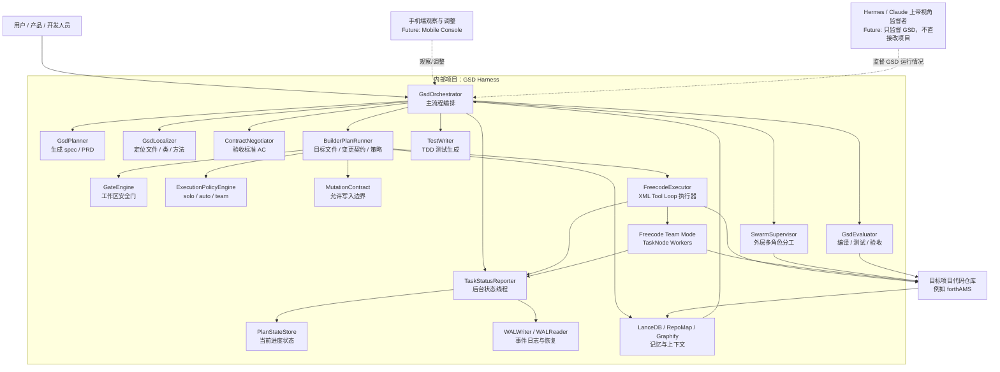

# GSD × Vibe Coding 技术分享稿

面向对象：研发团队、架构评审、AI Coding 实践分享。

主题：如何面向一个真实项目拆解需求、与 AI 协同开发，并用 GSD Harness 把这套思想落成可运行的自动化开发流水线。

---

## 0. 演讲顺序建议

建议总时长：30 到 45 分钟。

| 顺序 | 内容 | 建议时长 | 目标 |
|---|---:|---|
| 1 | 如何拆解一个项目 / 软件 | 5 分钟 | 先建立“AI 需要工程上下文”的共识 |
| 2 | 如何与 AI 沟通 | 5 分钟 | 说明 prompt 不是一句话，而是结构化任务输入 |
| 3 | 播放 AI Coding / Agent 工作流参考视频 | 1 到 2 分钟 | 让听众直观看到行业形态 |
| 4 | 介绍这次 Vibe Coding 实践 | 5 分钟 | 说明我们不是做 demo，而是在解决真实项目自动开发问题 |
| 5 | 解释 Harness 和 GSD | 5 分钟 | 统一术语，避免后面架构图听不懂 |
| 6 | 展示总体架构图 | 8 到 10 分钟 | 从全局说明 GSD、Hermes / Claude、手机端、目标项目之间的关系 |
| 7 | 按架构图介绍模块 | 10 到 15 分钟 | 说明每个模块解决什么问题 |
| 8 | 总结已解决问题和后续计划 | 3 到 5 分钟 | 让听众知道当前边界和未来方向 |

主线可以概括成一句话：

```text
先讲“怎么把项目拆成 AI 能理解的任务”，再讲“我们如何把这个思想做成 GSD Harness”。
```

---

## 1. 开场：面向一个项目，应该如何拆解

当我们面对一个项目或一个软件需求时，不能直接把一句话丢给 AI：

```text
帮我实现资产报废流程。
```

这样做的问题是：

- AI 不知道项目结构。
- AI 不知道业务边界。
- AI 不知道哪些文件能改、哪些不能改。
- AI 不知道什么叫完成。
- AI 可能写出能跑但不符合项目规范的代码。

所以正确方式是先把项目拆开。

### 1.1 一个软件项目可以拆成哪些层

```text
业务目标层
  - 用户要解决什么问题
  - 成功标准是什么

产品需求层
  - 角色是谁
  - 业务流程是什么
  - 边界条件是什么
  - 异常情况是什么

技术架构层
  - 后端是什么语言
  - 前端是什么框架
  - 数据库怎么组织
  - API 怎么暴露
  - 测试框架是什么

代码实现层
  - 哪些 Controller / API 入口要改
  - 哪些 Service / Domain 逻辑要改
  - 哪些 DTO / Entity / Mapper 要改
  - 哪些测试要补

验收层
  - 编译是否通过
  - 单元测试是否通过
  - API 行为是否符合预期
  - 是否没有破坏旧功能
```

### 1.2 和 AI 沟通时，要给 AI 什么

AI 最怕的是“上下文缺失”。

比较好的输入方式是：

```text
1. 当前项目是什么
2. 要实现什么业务目标
3. 涉及哪些用户角色
4. 现有代码结构是什么
5. 哪些文件可能要改
6. 哪些文件禁止改
7. 怎么判断完成
8. 出错后如何验证和回滚
```

也就是说，不是让 AI 自己猜，而是把 AI 放进一个工程流程里。

### 1.3 推荐参考资料 / 视频

这部分可以在演讲开头播放或作为会后资料。

| 主题 | 链接 |
|---|---|
| Anthropic Prompt Engineering | https://docs.anthropic.com/en/docs/build-with-claude/prompt-engineering/overview |
| Claude Code 官方文档 | https://docs.anthropic.com/en/docs/claude-code |
| OpenAI Prompt Engineering | https://platform.openai.com/docs/guides/prompt-engineering |
| OpenAI Function Calling / Tools | https://platform.openai.com/docs/guides/function-calling |
| Cursor 官方文档 | https://docs.cursor.com/ |
| GitHub Copilot 文档 | https://docs.github.com/en/copilot |
| YouTube 搜索：AI coding agents workflow | https://www.youtube.com/results?search_query=AI+coding+agents+workflow |
| YouTube 搜索：Claude Code tutorial | https://www.youtube.com/results?search_query=Claude+Code+tutorial |
| Bilibili 搜索：AI 编程 工作流 | https://search.bilibili.com/all?keyword=AI%20%E7%BC%96%E7%A8%8B%20%E5%B7%A5%E4%BD%9C%E6%B5%81 |

演讲时可以播放 1 到 2 分钟这类视频，目的不是介绍某个工具，而是让大家先理解：

```text
AI Coding 的核心不是“让模型写代码”，而是“设计人与 AI 协作的工程流程”。
```

---

## 2. 这次 Vibe Coding 开发实践解决了什么

这次开发不是单纯做一个“AI 代码生成器”。

我们真正要解决的是：

```text
如何让 AI 面向一个真实项目，稳定、可控、可恢复地完成开发任务。
```

### 2.1 原始痛点

早期直接让模型写代码，会遇到这些问题：

- 模型没读文件就改代码。
- 修改路径漂移，例如把 `backend/src/...` 改成 `src/...`。
- 误改配置文件、锁文件、环境文件。
- 编译失败后全仓库回滚，误伤用户改动。
- 多 Agent 同时修改同一个文件，互相覆盖。
- 长任务跑到一半忘了最初需求。
- 做错了以后不知道错在哪一步。
- 下次遇到相似问题还会重复踩坑。

### 2.2 这次 Vibe Coding 解决的核心问题

| 问题 | 当前解决方式 |
|---|---|
| AI 不知道项目结构 | RepoMap / Graphify / ProjectProfile |
| AI 不知道能改哪些文件 | MutationContract |
| AI 没读文件就改 | Freecode XML tool loop + 强制 pre-read |
| 输出 patch 格式不稳定 | XML 工具协议替代 Opencode Patch 主路径 |
| 编译失败误伤全仓库 | attempt 级 touched files 回滚 |
| 工作区已有用户改动 | GateEngine + ExecutionPolicy 保守执行 |
| 长任务不知道做到哪 | PlanState + WAL + TaskStatusReporter |
| 重复踩坑 | LanceDB 长期记忆 + vaccine |
| 成本和质量平衡 | MINIONS 本地 draft + 云端 verify |
| 并发文件冲突 | FilePartitionScheduler |

### 2.3 可以用来做什么

GSD Harness 适合这类场景：

- 真实项目里的多文件功能开发。
- Java / Spring Boot 后端功能补齐。
- Controller / Service / DTO / Mapper 级别改造。
- TDD 风格需求实现。
- 编译、测试、验收闭环。
- 长任务自动化开发。
- 项目级经验沉淀。
- 后续支持手机端观察和人工干预。

它不适合替代：

- IDE 里的毫秒级代码补全。
- 没有验收标准的开放式头脑风暴。
- 完全无项目上下文的随手问答。

一句话：

```text
Cursor / Copilot 更像开发者身边的副驾驶。
GSD 更像一个带施工日志、验收标准、回滚机制和长期记忆的自动施工队。
```

---

## 3. 什么是 Harness，什么是 GSD

### 3.1 Harness 是什么

Harness 原意是“马具 / 约束装置”。

在软件工程里，Harness 常指一个运行框架，它负责把被测对象或被执行对象包起来，提供：

- 环境。
- 输入。
- 执行控制。
- 观测能力。
- 结果收集。
- 错误处理。

本项目里的 `vib-coding-harness` 可以理解为：

```text
把模型、代码仓库、测试、记忆、状态、执行器、事件流全部串起来的自动编码运行框架。
```

参考：

- Test Harness 概念：https://en.wikipedia.org/wiki/Test_harness

### 3.2 GSD 是什么

GSD 是 Get Shit Done 的缩写。

在这里，GSD 不是一个简单 Agent，而是项目级自动开发流程引擎。

它负责：

- 接需求。
- 生成规格。
- 定位代码。
- 生成变更契约。
- 拆解执行策略。
- 调用执行器写代码。
- 跑测试和验收。
- 记录状态。
- 沉淀长期记忆。

参考：

- GSD workflow / gate / hook / state 思想：https://github.com/gsd-build/get-shit-done

---

## 4. 总体架构图

下面是当前规划中的整体架构。

其中：

- GSD 是当前项目内部主流程引擎。
- Hermes / Claude 是未来计划中的“上帝视角监督者”，目前还没有开发。
- 手机端是未来可观察、可调整任务状态的入口。



### 4.1 未来 Hermes / Claude 上帝视角监督者

这个角色目前是设计预留，还没有开发。

定位：

```text
Hermes / Claude 不直接改项目代码。
它只监督 GSD 是否按正确流程运行。
```

它未来可以做：

- 审查 GSD 当前计划是否合理。
- 检查是否应该继续、暂停或降级。
- 发现状态卡死。
- 观察 WAL / PlanState。
- 给 GSD 提供流程级建议。

为什么不让 Hermes 直接改代码：

- 代码执行权必须集中在 FreecodeExecutor。
- 否则会重新出现多个执行器写盘协议分裂的问题。
- Hermes 的职责是监督，不是施工。

### 4.2 手机端观察与调整

手机端也是未来能力。

它可以通过事件流和状态文件观察：

- 当前任务阶段。
- 哪个 step 正在执行。
- 哪个 worker 失败。
- 当前 evaluator score。
- 是否需要人工暂停或调整。

它不是新的执行器，只是控制台。

---

## 5. 按架构图拆模块

### 5.1 GsdOrchestrator：主流程编排

职责：

- 接收需求。
- 启动 sprint / epoch。
- 调用 Planner / Localizer / Contract / TestWriter。
- 调用 BuilderPlanRunner。
- 调用 FreecodeExecutor。
- 调用 Evaluator。
- 管理 checkpoint、WAL、metrics、长期记忆。

它是流程总线，不应该直接写业务代码。

### 5.2 GsdPlanner：生成规格 / PRD

职责：

- 把用户自然语言需求转成 `spec.md`。
- 明确需求背景、边界、验收基准、开发切入层级。

当前已经具备规格生成能力。

未来可以增强为：

- 结构化 PRD。
- user story。
- task DAG。

### 5.3 GsdLocalizer：代码定位

职责：

- 定位可能受影响的文件。
- 提供类、方法、行级线索。

它解决的问题：

```text
不要让模型自己在项目里瞎找。
```

### 5.4 ContractNegotiator：验收契约

职责：

- 把需求变成验收条件 AC。
- 让 Evaluator 能判断任务是否完成。

### 5.5 BuilderPlanRunner：执行前计划

职责：

- 提取目标文件。
- 归一化路径。
- 生成 MutationContract。
- 调用 GateEngine。
- 调用 ExecutionPolicyEngine。
- 预加载文件内容。
- 保存 builder plan artifact。

输出：

```text
.gsd/plans/<task_id>/iteration-<n>-builder-plan.json
```

### 5.6 GateEngine：安全门

职责：

- 检查工作区是否 dirty。
- 在 worker mode 下跳过主进程 dirty gate。
- 为执行策略提供风险信号。

为什么重要：

- 避免自动化系统覆盖用户已有改动。

### 5.7 ExecutionPolicyEngine：执行策略

职责：

- 决定 `force_solo`、`auto`、`force_team`。

判断依据：

- 文件数量。
- 是否涉及基础共享文件。
- 是否 dirty workspace。
- 是否包含测试文件。
- 是否存在可并行分组。

### 5.8 MutationContract：变更边界

职责：

- 明确允许写哪些文件。
- 阻止高风险文件自动改写。
- 提供路径别名归一。

这是防止模型漂移的重要机制。

### 5.9 FreecodeExecutor：唯一代码执行器

职责：

- XML 工具协议。
- read / replace / write / run_cmd。
- 强制 pre-read。
- 双推理 MINIONS。
- attempt 级回滚。
- team mode worker 执行。

它是当前唯一主路径代码写入者。

### 5.10 Freecode Team Mode：内部任务并发

职责：

- 将复杂任务拆成 `TaskNode`。
- wave 1 写测试。
- wave 2 实现。
- 文件不冲突则并发。
- worker 完成后打标。

### 5.11 SwarmSupervisor：外层多角色分工

职责：

- 根据 `[SWARM]` 指令启用外层角色分工。
- 每个角色用 `SwarmRoleProxy`。
- 每个角色内部仍然用 FreecodeExecutor。

注意：

```text
Swarm 是外层并发。
Freecode Team 是内层并发。
两层不能无限套娃。
```

### 5.12 TaskStatusReporter：后台状态线程

职责：

- 接收 started / done / failed 事件。
- 写 PlanState。
- 写 WAL。

它不调用模型，不消耗 token。

### 5.13 记忆层

组成：

- `ContextOptimizer`：短期上下文压缩。
- `RepositoryMapMemory`：项目 AST 图。
- `GraphifySkill`：外部资料图谱。
- `LanceDBMemory`：长期语义记忆。

### 5.14 Evaluator：质量门

职责：

- 编译。
- 测试。
- AC 验收。
- 失败反馈。

---

## 6. 功能细化

### 6.1 代码修改为什么用 XML 工具协议

旧方案：Opencode Patch。

问题：格式复杂，模型容易输出错。

新方案：XML 工具协议。

示例：

```xml
<read_file path="backend/src/main/java/..." />
<replace file="backend/src/main/java/...">
  <old>真实旧代码</old>
  <new>新代码</new>
</replace>
```

优势：

- 解析更稳定。
- 每次只做一步。
- 失败可以纠正。
- 强制模型先读真实文件。

### 6.2 MINIONS 双推理

流程：

```text
本地模型 draft
  -> 云端模型 verify
  -> 输出最终结果
```

为什么选它：

- 只用云端：贵、慢、容易 429。
- 只用本地：质量和格式不稳。
- 双推理：本地降低成本，云端保证质量。

### 6.3 做错了怎么办

GSD 分层处理错误：

```text
工具失败 -> fuzzy hint 自纠
编译失败 -> attempt 级回滚
测试失败 -> Evaluator 反馈下一轮
连续失败 -> Investigator 写 vaccine 记忆
```

### 6.4 怎么知道做到哪了

靠四套机制：

- Checkpoint：粗粒度恢复点。
- WAL：事件历史。
- PlanState：当前 step / worker 状态。
- TaskStatusReporter：后台线程统一打标。

### 6.5 怎么避免并发冲突

靠 `FilePartitionScheduler`。

原则：

```text
同一批并发 worker 不能写同一个文件。
未知边界任务自动串行。
```

---

## 7. 当前已解决的问题与还没做的事

### 7.1 已解决

- 主路径统一到 FreecodeExecutor。
- VibeExecutor 退为 legacy。
- MutationContract 控制写入边界。
- ExecutionPolicy 控制 solo / team。
- Graphify 调用链修复。
- Java RepoMap 支持。
- LanceDB 项目内长期记忆。
- 后台状态线程。
- WAL step 级事件。
- Freecode Team worker 状态打标。
- repo 级危险回滚移除。

### 7.2 还没做

- Hermes / Claude 上帝监督者还没开发。
- 手机端观察和调整还没开发。
- 结构化 PRD / user story / task DAG 还没完全上移到控制平面。
- Swarm role worker 状态还可以进一步统一接入 reporter。
- Evaluator 对 Java compile failure 还可以更强硬。

---

## 8. 参考资料

### 8.1 内部固化文档

- `freecode_integration_plan.md`
- `gsd_freecode_roadmap.md`
- `risk_mitigation_plan.md`
- `implementation_plan.md`
- `gsd_architecture_for_developers.md`

### 8.2 外部参考链接

| 主题 | 链接 |
|---|---|
| GSD workflow / gate / hook / state 思想 | https://github.com/gsd-build/get-shit-done |
| freecode XML tool loop 思路 | https://github.com/vibecode/freecode |
| opencode / agent 工具协议参考 | https://github.com/sst/opencode |
| Claude Code | https://docs.anthropic.com/en/docs/claude-code |
| Anthropic Prompt Engineering | https://docs.anthropic.com/en/docs/build-with-claude/prompt-engineering/overview |
| OpenAI Prompt Engineering | https://platform.openai.com/docs/guides/prompt-engineering |
| OpenAI Function Calling / Tools | https://platform.openai.com/docs/guides/function-calling |
| Cursor 文档 | https://docs.cursor.com/ |
| GitHub Copilot 文档 | https://docs.github.com/en/copilot |
| HTTP 429 | https://developer.mozilla.org/en-US/docs/Web/HTTP/Status/429 |
| Server-Sent Events | https://developer.mozilla.org/en-US/docs/Web/API/Server-sent_events |
| LanceDB | https://lancedb.github.io/lancedb/ |
| Sentence Transformers | https://www.sbert.net/ |
| Prometheus | https://prometheus.io/docs/introduction/overview/ |
| Circuit Breaker | https://martinfowler.com/bliki/CircuitBreaker.html |

### 8.3 视频 / 演示入口

| 主题 | 链接 |
|---|---|
| YouTube: AI coding agents workflow | https://www.youtube.com/results?search_query=AI+coding+agents+workflow |
| YouTube: Claude Code tutorial | https://www.youtube.com/results?search_query=Claude+Code+tutorial |
| Bilibili: AI 编程 工作流 | https://search.bilibili.com/all?keyword=AI%20%E7%BC%96%E7%A8%8B%20%E5%B7%A5%E4%BD%9C%E6%B5%81 |
