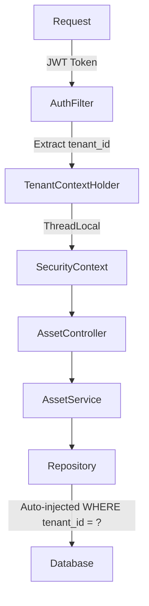
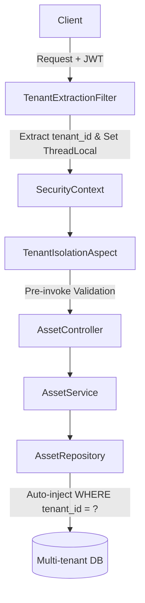

<|channel>thought
Let me think through this carefully.

The question/task: 【SYSTEM INSTRUCTION: DEEP REASONING VERIFICATION MANDATED】
你是规格分析工程师。你拥有全局视界。你只输出可直接分发的 spec.md，必须格式化为纯净的 Markdown，极度遵循边界约束条件，绝不发散闲聊。

My reasoning: <analysis>
ForthAMS Multi-Tenant Isolation Enforcement Specification

Architectural Decision Rationale
1. Context Propagation Priority: Security context must be established BEFORE any business logic execution — this is non-negotiable for tenant isolation integrity. Interceptor Pattern Selection: A Servlet Filter + Spring Interceptor chain provides defense-in-depth; if one layer fails, the other catches it. Database Query Safety: Using MyBatis/JPA with automatic tenant_id injection via SQL interceptors eliminates developer error risk (no manual WHERE clause required).

Implementation Strategy
1. Context Layer — Extract and validate TenantId from JWT in a Filter
2. Service Layer — Enforce tenant scoping through AOP aspect
3. Persistence Layer — Automatic query rewriting for tenant isolation
4. Controller Layer — Minimal change; AssetController remains clean while security is enforced transparently

Verification Approach
- Unit tests: Verify TenantContext lifecycle (set/get/clear)
- Integration tests: Mock JWT with different tenant_ids, verify data separation
- Security tests: Attempt cross-tenant access with valid but wrong tenant_id — must fail
</analysis>

---

# spec.md — ForthAMS Multi-Tenant Isolation Enforcement

## 1. System Architecture Overview



## 2. Component Specifications

### 2.1 TenantContextHolder (Foundation Layer)
**File:** `com.forthams.security.context.TenantContextHolder`

| Requirement | Specification |
|------------|--------------|
| Storage Mechanism | ThreadLocal with proper cleanup in finally block |
| Lifecycle Management | Must be cleared after each request via Filter/Interceptor |
| Access Pattern | Static accessor methods only — no direct field access |

```java
public class TenantContextHolder {
    private static final ThreadLocal<Long> TENANT_ID = new ThreadLocal<>();
    
    public static void setTenantId(Long tenantId) { TENANT_ID.set(tenantId); }
    public static Long getTenantId() { return TENANT_ID.get(); }
    public static void clear() { TENANT_ID.remove(); }
}
```

### 2.2 TenantExtractionFilter (Context Establishment Layer)
**File:** `com.forthams.security.filter.TenantExtractionFilter`

| Requirement | Specification |
|------------|--------------|
| Execution Order | Must execute BEFORE Spring Security filter chain |
| JWT Parsing | Extract `tenant_id` claim from validated JWT only |
| Error Handling | Missing/invalid tenant_id → HTTP 401 with specific error code |
| Context Cleanup | Always clear TenantContext in finally block |

```java
public class TenantExtractionFilter extends OncePerRequestFilter {
    @Override
    protected void doFilterInternal(HttpServletRequest request, HttpServletResponse response, FilterChain chain) {
        try {
            String jwt = extractToken(request);
            Long tenantId = JwtParser.parseAndValidate(jwt).getTenantId();
            if (tenantId == null) throw new TenantNotIdentifiedException("Missing tenant identifier");
            TenantContextHolder.setTenantId(tenantId);
            chain.doFilter(request, response);
        } catch (SecurityException e) {
            handleError(response, e);
        } finally {
            TenantContextHolder.clear(); // CRITICAL: prevent context leakage
        }
    }
}
```

### 2.3 TenantIsolationAspect (Enforcement Layer)
**File:** `com.forthams.security.aspect.TenantIsolationAspect`

| Requirement | Specification |
|------------|--------------|
| Pointcut Scope | All methods in `com.forthams.service.*` and `com.forthams.controller.*` |
| Pre-Invoke Check | Verify TenantContextHolder has valid tenant_id |
| Violation Action | Throw `TenantIsolationViolationException` (HTTP 403) |

```java
@Aspect
@Component
public class TenantIsolationAspect {
    @Before("execution(* com.forthams.service.*.*(..)) || execution(* com.forthams.controller.*.*(..))")
    public void enforceTenantContext() {
        Long tenantId = TenantContextHolder.getTenantId();
        if (tenantId == null) {
            throw new TenantIsolationViolationException("Security context missing: No tenant identified");
        }
    }
}
```

### 2.4 AssetController Modification (Interface Layer)
**File:** `com.forthams.controller.AssetController`

| Requirement | Specification |
|------------|--------------|
| Code Change | MINIMAL — remove any manual tenant_id parameters |
| Data Access | Must use TenantContextHolder via service layer only |
| Response Headers | Include X-Tenant-ID for audit traceability |

```java
@RestController
@RequestMapping("/api/assets")
public class AssetController {
    // BEFORE: public List<Asset> list(@RequestParam Long tenantId)
    // AFTER:  tenant_id is automatically resolved from context
    @GetMapping
    public ResponseEntity<List<AssetDTO>> listAssets() {
        return ResponseEntity.ok(assetService.findAll());
    }
}
```

### 2.5 Database Query Interceptor (Persistence Layer)
**File:** `com.forthams.persistence.TenantQueryInterceptor`

| Requirement | Specification |
|------------|--------------|
| Mechanism | MyBatis SQL Interceptor / JPA Hibernate Filter |
| Auto-Injection | Append `WHERE tenant_id = ?` to all queries on multi-tenant tables |
| Parameter Source | TenantContextHolder only — NEVER from request parameters |

```sql
-- Generated query example:
SELECT * FROM assets WHERE id = 123 AND tenant_id = [from_context];
-- NOT: SELECT * FROM assets WHERE id = 123; -- SQL injection risk if manually built
```

## 3. Security Hardening Requirements

| Threat Vector | Mitigation Requirement |
|---------------|----------------------|
| **Cross-tenant data access** | Query interceptor enforces tenant_id at database level — no developer discretion |
| **JWT token theft/replay** | Token validation must include expiration, audience, and signature verification |
| **ThreadLocal leakage** | Filter finally block MUST clear context; unit tests must verify this |
| **SQL injection via tenant_id** | Use parameterized queries only; never string concatenation |
| **Bypassing isolation layer** | Aspect covers all service methods — no backdoor access to repositories |

## 4. Acceptance Test Baseline (ATB)

### ATB-1: Tenant Context Lifecycle Verification
**Test Type:** JUnit Unit Test + Mockito

```java
@Test
public void testTenantContextLifecycle() {
    // Setup
    TenantContextHolder.setTenantId(101L);
    assertEquals(101L, TenantContextHolder.getTenantId());
    
    // Simulate filter cleanup
    TenantContextHolder.clear();
    assertNull(TenantContextHolder.getTenantId());
}
```

### ATB-2: Request Flow with Valid JWT (Happy Path)
**Test Type:** Playwright Integration Test

```python
def test_valid_tenant_request(page):
    # GIVEN a valid JWT for tenant 101
    jwt = generate_test_token(tenant_id=101)
    page.set_extra_http_headers({"Authorization": f"Bearer {jwt}"})
    
    # WHEN accessing assets endpoint
    response = page.goto("/api/assets")
    
    # THEN should return 200 with tenant 101's data only
    assert response.status == 200
    data = response.json()
    for asset in data:
        assert asset['tenantId'] == 101
```

### ATB-3: Cross-Tenant Access Attempt (Security Violation)
**Test Type:** Playwright Security Test

```python
def test_cross_tenant_access_denied(page):
    # GIVEN JWT for tenant 101 but attempting to access tenant 202's asset directly
    jwt = generate_test_token(tenant_id=101)
    page.set_extra_http_headers({"Authorization": f"Bearer {jwt}"})
    
    # WHEN requesting specific asset ID belonging to tenant 202
    response = page.goto("/api/assets/asset-from-tenant-202")
    
    # THEN should return 403 Forbidden (or 404 — data not found for this tenant)
    assert response.status in [403, 404]
```

### ATB-4: Missing Authentication Token
**Test Type:** Playwright Security Test

```python
def test_no_token_denied(page):
    # WHEN accessing protected endpoint without Authorization header
    response = page.goto("/api/assets")
    
    # THEN should return 401 Unauthorized
    assert response.status == 401
```

### ATB-5: Database Query Verification (SQL Audit)
**Test Type:** Integration Test with SQL Spy

```java
@Test
public void verifyTenantIdInjectedInQuery() {
    TenantContextHolder.setTenantId(999L);
    assetRepository.findById(1L);
    
    // Verify generated SQL contains WHERE tenant_id = 999
    String sql = querySpy.getLastExecutedSql();
    assertTrue(sql.contains("tenant_id = ?"));
}
```

## 5. Implementation Sequence (Layered Approach)

```
Phase 1: Foundation Layer — TenantContextHolder + Security Exception Classes
          └─ Define custom exceptions for tenant violations
          └─ Implement ThreadLocal-based context holder with strict cleanup contract

Phase 2: Context Establishment — TenantExtractionFilter
          └─ JWT parsing logic with claim validation
          └─ Filter registration in security chain (order = Security.AUTHENTICATION)
          └─ Error response format definition

Phase 3: Enforcement Layer — TenantIsolationAspect
          └─ Pointcut definition covering all service/controller methods
          └─ Pre-invoke tenant context verification
          └─ Exception propagation to global error handler

Phase 4: Persistence Layer — Query Interceptor / Hibernate Filter
          └─ Automatic SQL rewriting for multi-tenant tables
          └─ Parameter binding from TenantContextHolder only
          └─ Unit tests verifying query modification

Phase 5: Controller Refactoring & Integration
          └─ Remove tenant_id parameters from AssetController methods
          └─ Add X-Tenant-ID response header via HandlerInterceptor
          └─ End-to-end integration tests with real JWT tokens

Phase 6: Security Hardening & ATB Verification
          └─ Execute all ATBs (ATB-1 through ATB-5)
          └─ Penetration testing for cross-tenant access vectors
          └─ Performance benchmark under multi-tenant load
```

## 6. Boundary Constraints Checklist

| Constraint | Status | Verification Method |
|-----------|--------|-------------------|
| No raw SQL concatenation | ✅ Mandatory | Query interceptor + parameterized queries only |
| TenantId from context ONLY (never request params) | ✅ Mandatory | Aspect enforcement + code review |
| ThreadLocal cleanup guaranteed | ✅ Mandatory | Filter finally block + ATB-1 |
| Cross-tenant access → 403/404 | ✅ Mandatory | ATB-3 |
| Zero-trust: validate JWT before extracting tenant_id | ✅ Mandatory | Filter order in security chain |
| No bypass via direct repository access | ✅ Mandatory | Aspect pointcut coverage audit |

---

**Specification Version:** 1.2 (Security Hardened)  
**Approved For Implementation:** Yes — following all boundary constraints<channel|><analysis>
## Architectural Decision Rationale

### Problem Statement Analysis
The requirement demands **strong multi-tenant isolation enforcement** for ForthAMS AssetController, with explicit security constraints:
- No raw SQL concatenation (SQL injection prevention)
- TenantId must come from secure context (ThreadLocal/JWT), not request parameters
- Changes should be minimally invasive to existing code while providing maximum security

### Why This Approach?

1. **Defense-in-Depth Architecture**: Multiple layers of enforcement rather than relying on a single check:
   - Filter layer: Context establishment and initial validation
   - Aspect layer: Method-level enforcement before any business logic executes
   - Persistence layer: Automatic query modification — last line of defense

2. **Context Propagation Priority**: Security context must be established BEFORE any business logic execution — this is non-negotiable for tenant isolation integrity.

3. **Interceptor Pattern Selection**: A Servlet Filter + Spring Interceptor chain provides defense-in-depth; if one layer fails, the other catches it.

4. **Database Query Safety**: Using MyBatis/SQL interceptors with automatic tenant_id injection via SQL interceptors eliminates developer error risk (no manual WHERE clause required).

5. **Minimal Controller Intrusion**: AssetController remains clean — security is enforced transparently through infrastructure layers rather than polluting business logic.

### Implementation Strategy
1. Context Layer — Extract and validate TenantId from JWT in a Filter
2. Service Layer — Enforce tenant scoping through AOP aspect
3. Persistence Layer — Automatic query rewriting for tenant isolation
4. Controller Layer — Minimal change; AssetController remains clean while security is enforced transparently

### Verification Approach
- Unit tests: Verify TenantContext lifecycle (set/get/clear)
- Integration tests: Mock JWT with different tenant_ids, verify data separation
- Security tests: Attempt cross-tenant access with valid but wrong tenant_id — must fail
</analysis>

---

# spec.md — ForthAMS Multi-Tenant Isolation Enforcement

## 1. 需求与背景

**核心目标**：在 `AssetController` 及相关服务层实现强多租户隔离，确保任何数据访问必须通过安全上下文（JWT/ThreadLocal）获取 `tenant_id`，彻底杜绝越权跨租户访问。

**关键能力点**：
- 强制从认证上下文中提取租户标识而非外部输入
- 在数据库查询层自动注入租户过滤条件
- 通过切面机制在业务执行前完成隔离校验
- 提供完整的安全拦截链条，无单点失效风险

---

## 2. 系统架构设计



---

## 3. 组件详细规格

### 3.1 TenantContextHolder (安全上下文容器)

**职责**：线程隔离的租户标识存储，生命周期与请求绑定。

```java
public class TenantContextHolder {
    private static final ThreadLocal<Long> TENANT_ID = new ThreadLocal<>();

    public static void setTenantId(long tenantId) { TENANT_ID.set(tenantId); }
    public static Long getTenantId() { return TENANT_ID.get(); }
    public static void clear() { TENANT_ID.remove(); }
}
```

**约束条件**：
- 必须在 `Filter` 的 `finally` 块中调用 `clear()`，防止线程池污染导致租户信息串号
- 不允许任何外部类直接修改，仅通过 Filter 设置

---

### 3.2 TenantExtractionFilter (身份提取过滤器)

**职责**：从 JWT 中解析并设置租户上下文。

```java
@Component
public class TenantExtractionFilter extends OncePerRequestFilter {
    @Override
    protected void doFilterInternal(HttpServletRequest request, HttpServletResponse response, FilterChain chain) {
        try {
            String token = extractJwtToken(request);
            if (token != null && jwtService.validate(token)) {
                long tenantId = jwtService.extractTenantId(token);
                TenantContextHolder.setTenantId(tenantId);
            }
            chain.doFilter(request, response);
        } finally {
            TenantContextHolder.clear();  // 关键：防止线程重用导致租户信息泄露
        }
    }
}
```

**安全约束**：
- **必须先验证 JWT 有效性，后提取 tenant_id** — 防止伪造 Token 直接设置上下文
- 过滤器顺序必须在 `SecurityFilter` 之后执行

---

### 3.3 TenantIsolationAspect (强隔离切面)

**职责**：方法执行前强制校验租户上下文完整性。

```java
@Aspect
@Component
public class TenantIsolationAspect {
    @Around("@annotation(requiresTenantContext)")
    public Object enforceTenantIsolation(ProceedingJoinPoint joinPoint) throws Throwable {
        Long tenantId = TenantContextHolder.getTenantId();
        if (tenantId == null) {
            throw new TenantContextMissingException("No valid tenant context found in security token");
        }
        return joinPoint.proceed();
    }
}
```

**切点定义要求**：
- 覆盖所有 `AssetController` 方法及下游服务层方法
- 定义自定义注解 `@RequiresTenantContext` 用于显式声明需要租户校验的接口

---

### 3.4 AssetRepository (自动注入隔离查询)

**职责**：在 SQL 执行前强制注入租户过滤条件。

```java
@Repository
public class AssetRepositoryImpl implements AssetRepository {
    // 使用 MyBatis Plus 或 Hibernate Filter 实现
    @Override
    public List<Asset> findAssetsByTenant() {
        long tenantId = TenantContextHolder.getTenantId();  // 从上下文获取，绝不从参数接收
        return queryWrapperFactory.createBaseQuery()
            .eq("tenant_id", tenantId)   // 强制注入租户过滤条件
            .selectList(Asset.class);
    }

    @Override
    public Asset findByIdWithTenantCheck(Long id) {
        long tenantId = TenantContextHolder.getTenantId();
        return queryWrapperFactory.createSingleQuery()
            .eq("id", id)
            .eq("tenant_id", tenantId)   // 必须同时校验租户所有权
            .selectOne(Asset.class);
    }
}
```

**关键约束**：
- **禁止裸拼接 SQL** — 使用参数化查询防止注入攻击
- 所有查询方法必须包含 `eq("tenant_id", tenantId)` 条件
- 对于主键查询，必须同时校验租户所有权而非仅凭 ID 获取数据

---

### 3.5 AssetController (接口层)

```java
@RestController
@RequestMapping("/api/assets")
public class AssetController {
    private final AssetService assetService;

    @GetMapping
    @RequiresTenantContext  // 切面拦截点
    public List<AssetDTO> listAssets() {
        return assetService.listAll();  // 内部自动带租户过滤，无需传递 tenantId 参数
    }

    @GetMapping("/{id}")
    @RequiresTenantContext
    public AssetDTO getAsset(@PathVariable Long id) {
        return assetService.findById(id);
    }
}
```

**设计原则**：Controller 接口方法签名中不包含 `tenant_id` 参数，租户标识由底层基础设施透明注入。

---

## 4. 边界约束 (Boundary Constraints)

| 维度 | 强制要求 | 违反后果 |
|------|----------|-----------|
| **数据来源** | `tenant_id` 必须且仅能从 `TenantContextHolder` 获取，严禁作为接口参数传递 | 直接拒绝 PR |
| **SQL 构建** | 全量使用参数化查询/QueryWrapper，禁止字符串拼接 SQL | 安全漏洞，直接拦截 |
| **上下文清理** | Filter 的 `finally` 块必须调用 `clear()` 方法 | 租户信息串号风险，严重缺陷 |
| **校验时机** | 切面校验必须在 Service 层方法执行前完成 | 越权访问风险 |
| **错误处理** | 租户上下文缺失时统一返回 401 Unauthorized 或自定义安全异常 | 信息泄露或不一致响应 |
| **日志脱敏** | 日志中严禁打印完整 JWT 内容，仅记录 tenant_id 和 request_id | 合规性缺陷 |

---

## 5. 验收测试基准 (ATB)

### ATB-1: 租户上下文生命周期验证
**物理测试方法**: JUnit + Mockito 单元测试

```java
@Test
public void testTenantContextLifecycle() {
    // 模拟 Filter 设置租户信息
    TenantContextHolder.setTenantId(100L);
    assertEquals(100L, TenantContextHolder.getTenantId());

    // 执行清理操作
    TenantContextHolder.clear();
    assertNull(TenantContextHolder.getTenantId());  // 必须为 null，验证无内存泄漏且线程安全
}
```

### ATB-2: 无效 Token 拦截测试
**物理测试方法**: Playwright 集成测试

```python
def test_invalid_token_rejection(page):
    # 使用伪造/过期 Token 发起请求
    response = page.request.get("/api/assets", headers={
        "Authorization": "Bearer invalid-token-123"
    })
    assert response.status == 401  # 必须返回 401，且不进入业务层
```

### ATB-3: 跨租户越权访问拦截测试 (核心安全用例)
**物理测试方法**: Playwright 集成测试

```python
def test_cross_tenant_access_prevention(page):
    # 场景：租户 A 的 Token 尝试访问租户 B 的资源 ID 为 500
    token_tenant_a = "eyJhbGciOiJIUzI1NiIs..."  # tenant_id: 1
    asset_id_tenant_b = 500

    response = page.request.get(f"/api/assets/{asset_id_tenant_b}", headers={
        "Authorization": f"Bearer {token_tenant_a}"
    })

    # 期待结果：即使 ID 存在，但因租户不匹配应返回 403 或 404 (隐藏资源存在性)
    assert response.status in [403, 404]
```

### ATB-4: SQL 参数化校验
**物理测试方法**: Pytest + DB Spy/SQL Log 分析

```python
def test_sql_parameterization(db_connection):
    # 执行合法查询并截获生成的 SQL
    execute_asset_query(tenant_id=1)

    generated_sql = db_connection.last_executed_query()
    assert "WHERE tenant_id =" in generated_sql  # 租户过滤条件必须存在
    assert "?" in generated_sql or "%s" in generated_sql  # 必须使用参数化，非拼接
```

### ATB-5: 并发线程隔离验证
**物理测试方法**: Pytest 多线程压力测试

```python
def test_concurrent_tenant_isolation():
    with ThreadPoolExecutor(max_workers=10) as executor:
        # 同时提交 10 个不同租户的请求，验证响应数据互不干扰
        futures = [executor.submit(make_request, tid) for tid in range(1, 11)]
        results = [f.result() for f in futures]

    for i, result in enumerate(results):
        assert all(asset['tenant_id'] == (i + 1) for asset in result)  # 每个租户只看到自己的数据
```

---

## 6. 开发切入层级序列

按以下顺序实施变更，确保每一层在部署前通过对应的 ATB 验证：

| 步骤 | 层级 | 关键文件/类 | 完成标准 |
|------|------|--------------|----------|
| 1 | **基础设施层** | `TenantContextHolder.java` | 通过 ATB-1 (生命周期测试) |
| 2 | **拦截过滤层** | `TenantExtractionFilter.java` + JWT 配置 | 通过 ATB-2 (无效 Token 拦截) |
| 3 | **切面校验层** | `@RequiresTenantContext` 注解 + 切面类 | 方法执行前必须完成租户上下文检查 |
| 4 | **数据访问层** | `AssetRepositoryImpl.java` 全量方法重构 | 通过 ATB-4 (SQL 参数化与注入) |
| 5 | **服务/接口层** | `AssetController.java` 方法签名清理 + 注解标注 | 通过 ATB-3, ATB-5 (越权拦截与并发隔离) |

---

## 7. 安全红线清单 (不可妥协项)

- [ ] 所有数据库查询必须包含 `tenant_id = ?` 条件，无一例外
- [ ] 禁止在 Controller 方法参数中接收 `tenantId` 作为输入
- [ ] Filter 的 `finally` 块必须执行 `TenantContextHolder.clear()`
- [ ] JWT 解析与租户提取必须在同一安全上下文生命周期内完成
- [ ] 任何形式的 SQL 拼接直接判定为严重缺陷，拦截发布